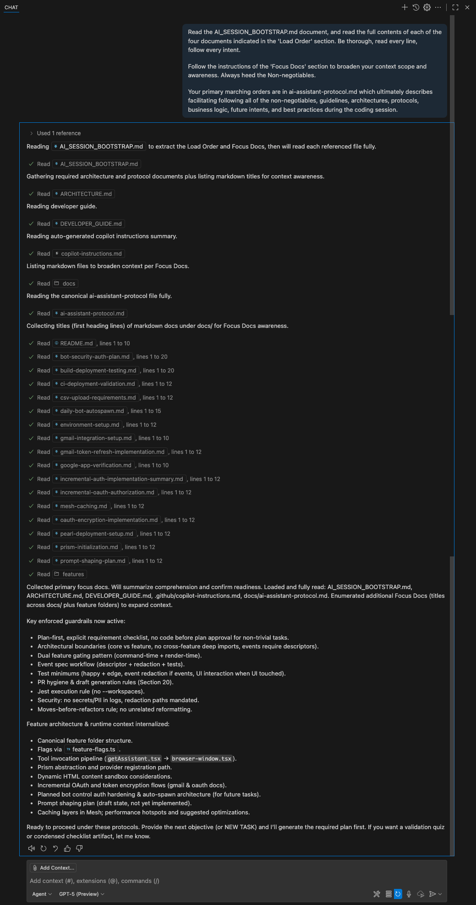
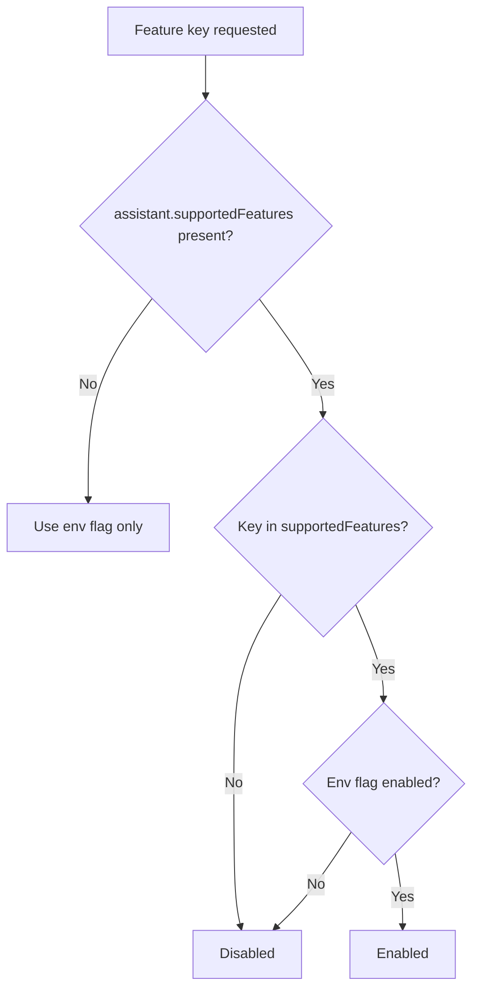

# Developer Guide: Building Features in Nia Prism


This guide will help you build new features for the Nia Prism platform using the **Feature-First Development Pattern**. This is the recommended approach for 95% of development work.

> **🎯 Quick Start**: Most developers should start with [Working with Application Features](#working-with-application-features) and avoid platform definitions entirely.

## 📋 Table of Contents

**🚀 Recommended Path (Start Here):**

- [Using AI Assistants Effectively](#using-ai-assistants-effectively) - **Start here for most development**
- [Working with Application Features](#working-with-application-features) 
- [Writing Effective Tests](#writing-effective-tests) - Test your features
- [Canonical Feature Architecture](#canonical-feature-architecture-current-standard)
- [Services vs Lib](#services-vs-lib)
- [Testing Strategy](#testing-strategy-apply-per-feature)
- [Cross-Feature Contexts & Media](#cross-feature-contexts--media-speech--youtube--avatar)
- [Conventions Adopted](#conventions-adopted)
- [Platform Definitions](#platform-definitions-backend-specialists-only) - **⚠️ Avoid unless you're a backend specialist**
- [Conclusion](#conclusion)
- [Contributing](#contributing-to-nia-universal)


## Using AI Assistants Effectively
*Copy and paste this into your Copilot/AI-assistant chat session:*

```text
Read the .github/instructions/AI_SESSION_BOOTSTRAP.instructions.md document, and read the full contents of each of the
four documents indicated in the 'Load Order' section. Be thorough, read every line,
follow every intent.

Follow the instructions of the 'Focus Docs' section to broaden your context scope and
awareness. Always heed the Non-negotiables.

Your primary marching orders are in docs/ai-assistant-protocol.md which ultimately describes
facilitating following all of the non-negotiables, guidelines, architectures, protocols,
business logic, future intents, and best practices during the coding session.
```

<details>
<summary><strong>Example: AI Assistant Session Bootstrap (click to expand)</strong></summary>

_Reference screenshot of a correctly bootstrapped AI session after pasting the snippet above. It shows: loaded protocol docs, plan-first acknowledgment, and guardrail confirmation._



</details>

Use AI as a structured pair programmer that enforces our development protocols.
If scope shifts: reply `FOCUS: <new narrowed scope>` to reset the assistant.

## Working with Application Features

1. Create a new folder under `apps/interface/src/features/YourFeature`.
2. Add a `definition.ts` if dynamic content is needed.
3. Place external orchestration (timers, queues) in `services/`.
4. Keep client-only computation or api-fetch code in `lib/`.
5. Expose React UI via `components/YourFeatureView.tsx`.
6. Add focused tests in `__tests__/` (see Testing Strategy).
7. Export public surface in `index.ts`.

## Canonical Feature Architecture (Current Standard)

Use this structure for ALL new feature development. This supersedes earlier diagrams and any migration phrasing.

```text
apps/interface/src/features/FeatureName/
├── definition.ts               # Dynamic content definition (IDynamicContent)
├── types/                      # Pure TS types & interfaces
│   └── feature-types.ts
├── actions/                    # Server actions (CRUD, orchestration wrappers)
│   └── feature-actions.ts
├── services/                   # Long‑lived / stateful orchestration (queues, sessions, schedulers)
│   └── index.ts (or specific service files)
├── lib/                        # Stateless pure helpers (parsers, calculators, event utils)
│   ├── navigation-utils.ts
│   └── events.ts
├── components/                 # UI surfaces (React, client components)
│   └── FeatureView.tsx
├── hooks/ (optional)           # Reusable React hooks local to feature
├── store/ (optional)           # Local Zustand/store modules if needed
├── routes/ (optional)          # GET_impl, POST_impl, PUT_impl, DELETE_impl abstraction layer
│   ├── route.ts
│   └── [id]/route.ts
├── __tests__/                  # Focused unit + integration tests
│   ├── feature-parsing.test.ts
│   ├── queue-behavior.test.ts
│   ├── integration-flow.test.ts
│   └── ...
└── index.ts                    # Barrel exports (definition, types, actions, components)
```

## Feature Flags (Runtime Gating)

Feature flags are centralized in a shared package and consumed across apps.

Source module: `@nia/features` (backed by `packages/features`)

Semantics (precedence):

- Per‑assistant list first: a feature is enabled only if it appears in `assistant.supportedFeatures` AND the environment flag resolves to enabled.
- If `supportedFeatures` is absent/null, we fall back to environment flags only.
- Environment defaults are ON unless explicitly disabled with one of: `0`, `false`, `off`, `disabled` (case‑insensitive).

Feature gating flow (visual):



## Integrating a New Feature (90‑Second Version)

Just build it. Keep it lean. Follow this 10‑step punch list:

1. Folder: `apps/interface/src/features/MyFeature/` (use the canonical structure above).
2. UI: Put your React surface in `components/MyFeatureView.tsx` (client component).
3. Server work: Create any server actions in `actions/` (they stay out of the barrel by default).
4. Services (only if needed): Long‑lived loops / sessions → `services/` (no side effects at module top level).
5. API route (if needed): Thin file in `apps/interface/src/app/api/my-feature/route.ts` that re‑exports `GET_impl/POST_impl` from `features/MyFeature/routes/route.ts`.
6. Barrel (`index.ts`): Export ONLY what other features should use (UI, types, action wrappers). Don’t leak raw server helpers.
7. Events: Emit namespaced CustomEvents: `myfeature.action.performed` (copy existing patterns like `youtube.volume.change`).
8. Feature flag (optional): Gate render with `isFeatureEnabled('myFeature', assistant.supportedFeatures)`. (See next section.)
9. Tests: At least one pure unit + one integration (jsdom) touching the primary user action.
10. Ship: No circular imports, no server code in client component trees.

Common gotchas (avoid): server action imports in client files, exporting EVERYTHING in the barrel, starting services at import time, API logic living outside the feature folder.

### Tiny Example

```text
features/TaskQueue/
	actions/taskqueue-actions.ts
	components/TaskQueuePanel.tsx
	routes/route.ts   # exports GET_impl
	index.ts          # export { TaskQueuePanel, startTask }

app/api/task-queue/route.ts → export { GET_impl as GET } from '@/features/TaskQueue/routes/route';
```

Done.

### Shared Flags Module and Usage

Import from the shared package and pass `supportedFeatures` when you have assistant context.

Usage in code:

```ts
import { isFeatureEnabled } from '@nia/features';
if (!isFeatureEnabled('browserAutomation', assistant.supportedFeatures)) return <Disabled />;
```

CLI examples:

```bash
# Disable browser automation locally
echo 'NEXT_PUBLIC_FEATURE_BROWSERAUTOMATION=false' >> .env.local

# Enable only notes & youtube in a preview deploy (others default true anyway)
NEXT_PUBLIC_FEATURE_NOTES=true NEXT_PUBLIC_FEATURE_YOUTUBE=true npm run dev
```

Adding a new flag (centralized):

1. Add a new canonical key to `packages/features/src/feature-flags.ts` (FeatureKeys and registry entry).
2. Map the appropriate env var(s) in that registry (e.g., `NEXT_PUBLIC_FEATURE_<NAME>`).
3. Gate surfaces with `isFeatureEnabled('<key>', assistant.supportedFeatures)`.
4. Add a minimal test asserting disabled behavior when the env var is set to an off token.

Keep flags coarse; remove them once a feature is stable.

### Example: Dual Gating Pattern (BrowserWindow)

BrowserWindow uses two onramps for safer feature control:

1. Command-time (before mutating state) – stops actions & sends feedback.
2. Render-time – prevents the UI from mounting even if state was (incorrectly) set.

```ts
// (Inside message / function-command handler)
} else if (functionName === 'searchYouTubeVideos') {
	if (!isFeatureEnabled('youtube')) {
		vapi.send({
			type: MessageTypeEnum.ADD_MESSAGE,
			message: { role: 'system', content: 'YouTube feature is currently disabled.' }
		});
		return; // Abort before updating component state
	}
	setYoutubeQuery(parameters?.query);
	setShowView('youtube');
	setStatus(true);
}

// Notes open request via generic desktop app name
case 'notes':
	if (isFeatureEnabled('notes')) {
		setShowView('notes');
		setStatus(true);
	} else {
		vapi.send({
			type: MessageTypeEnum.ADD_MESSAGE,
			message: { role: 'system', content: 'Notes feature is currently disabled.' }
		});
	}
	break;
```

Render-time safeguard:

```tsx
{showView === 'notes' && isFeatureEnabled('notes', supportedFeatures) && (
	<NotesView assistantName={assistantName} />
)}

{showView === 'htmlContent' && isFeatureEnabled('htmlContent', supportedFeatures) && htmlContentData && (
	<HtmlContentViewer /* props */ />
)}
```

Use this dual pattern for any feature that:
- Can be triggered by multiple upstream events (LLM tool calls, custom DOM events, user clicks).
- Might have asynchronous side-effects you want to suppress cleanly when disabled.

If you add many similar guards, consider wrapping with a helper:

```ts
guardFeature('notes', () => setShowView('notes'), () =>
	vapi.send({ type: MessageTypeEnum.ADD_MESSAGE, message: { role: 'system', content: 'Notes disabled.' } })
);
```

But keep inline checks if clarity outweighs abstraction.

## Writing Effective Tests

- Unit test pure helpers (one assertion focus).
- Integration test event ordering & side-effects with real timers.
- Avoid mocking internal pure helpers; mock only boundaries (network, time if deterministic).
- Use descriptive test names capturing behavior not implementation.

### Services vs Lib

- Put ALL stateful loops, retries, backoff logic, or external session lifecycles in `services/`.
- Use `lib/` for client-side helpers and utilities. It's intended for code that runs in the browser, so using `window`, `fetch`, or other browser APIs is fine. Keep server-specific logic out of `lib/` to maintain clear client/server separation.

### Testing Strategy (Apply Per Feature)

| Test Type | Directory | Example Focus |
|-----------|-----------|---------------|
| Pure unit | `__tests__/` *utils*.test.ts | navigation parsing, volume calc |
| Queue / logic unit | `__tests__/queue-*`.test.ts | ordering, throttling, retry boundaries |
| Integration (jsdom) | `__tests__/` *integration*.test.ts | event sequencing, component+service handshake |
| E2E (future / Cypress) | cypress/e2e | user flows (HTML gen, browser nav) |

Guidelines:

- Export pure calculators (e.g., `computeTargetVolume`) for deterministic tests.
- For integration tests relying on requestAnimationFrame loops, prefer real timers with bounded waits.
- Mock only the minimal surface (e.g., `fetch`)—avoid deep mocking of pure helpers.

### Cross-Feature Contexts & Media (Speech + YouTube + Avatar)

```text
contexts/speech-context.tsx      # Language + confidence + timing state
features/Media/YouTube/          # YouTubeView + Wrapper + volume events
features/RiveAvatar/             # Avatar component consuming speech context
```

Principles:

- Speech context emits stable state consumed by media & avatar.
- Media components react via pure volume computation -> event dispatch (`youtube.volume.change`).
- Avatar drives animation state from speech confidence & language.

### Conventions Adopted

- Deterministic pure helpers exported for tests.
- Namespaced events instead of callback webs.
- Wrapper components clearly suffixed (e.g., `YouTubeViewWrapper`) to distinguish dynamic import containers vs core implementations.
- Global function exposure (`activeBrowserNavigate`) only after session readiness.

## Platform Definitions (Backend Specialists Only)

Only extend platform definitions when introducing new dynamic content surfaces or schema-driven behaviors. Typical feature work should not modify these. If needed:

- Update `platform-definitions-jsonSchema.ts`.
- Run the registration script in `scripts/register-platform-definitions.ts`.
- Add corresponding `blocks/` definitions for types.

## Conclusion


By following these guidelines, you'll maintain the architectural integrity of the Nia Universal platform while efficiently adding new features.

Remember:

- Platform definitions live in `platform-definitions-jsonSchema.ts`
- Register new definitions with `scripts/register-platform-definitions.ts`
- Create interfaces in `blocks/` for TypeScript support
- Create actions in `actions/` for complex operations
- Use indexers for efficient querying and `content: { like: ... }` for content searching
- Write tests that use real databases to verify behavior
- Keep common code in `packages/prism` and reference it from apps

## Contributing to Nia Universal


### Pull Request Process

1. **Fork the Repository**: Start by forking the repository to your own GitHub account.

1. **Create a Branch**: Create a feature branch using a descriptive name:

```bash
git checkout -b feature/your-feature-name
```

1. **Develop Your Feature**: Implement your changes following the architecture guidelines in this document.

1. **Write Tests**: Add tests for your feature to ensure it works as expected and doesn't break existing functionality.

```bash
npm test
```

1. **Lint Your Code**: Ensure your code meets our style guidelines:

```bash
npm run lint
npm run format
```

1. **Submit a Pull Request**: Push your changes to your fork and submit a pull request to the main repository.

### Code Standards

- **TypeScript**: Use TypeScript for all new code
- **Formatting**: Follow existing code formatting (Prettier is configured)
- **Tests**: All new features must include tests
- **Documentation**: Update relevant documentation for your changes
- **Commits**: Use clear, descriptive commit messages

### Development Environment

Make sure your development environment is properly set up by following the instructions in the [environment-setup.md](./docs/environment-setup.md) document.

### Getting Help

If you need help or have questions about contributing, please reach out to the maintainers or open an issue on GitHub.
