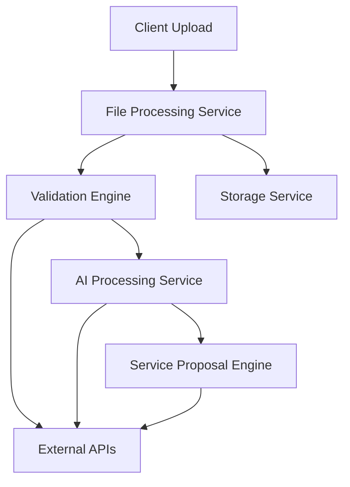

# Smart Manifest – Full Technical Design Document

**Author(s)**: NiaXP Engineering Team & Nia 
**Date Created**: 2024-07-29
**Status**: Draft  
**Version**: 1.3

---

## 1. Executive Summary

This document outlines the complete technical design for Smart Manifest – Powered by ViVi, an AI-powered manifest processing system for drvn. The system will handle multiple file formats, provide real-time validation, integrate with various APIs, and deliver intelligent service proposals.

### Project Timeline
- Total Duration: 5-6 months
- Phase 1 (MVP): 1 month
- Full Implementation: 3-4 months

### Resource Requirements
- Engineering Team: 4-6 full-time engineers
- Design Team: 1-2 UX/UI designers
- QA Team: 1-2 QA engineers
- DevOps: 1 part-time engineer

### Key Objectives
1. Streamline manifest processing workflow
2. Reduce manual data entry and validation
3. Improve data accuracy and consistency
4. Enable real-time service proposal generation
5. Support multiple file formats and data sources
6. Implement AI-powered learning and optimization

### Success Criteria
1. 90% reduction in manual data entry time
2. 99.9% system uptime
3. Successful integration with all required APIs
4. Positive user feedback on UI/UX

---

## 2. System Architecture

### 2.1 High-Level Architecture

### 2.2 Core Components

1. **File Processing Service**
   - File ingestion and validation
   - OCR processing
   - Format conversion
   - Security scanning
   - File type detection
   - Content extraction
   - Metadata processing
   - Error handling

2. **Validation Engine**
   - Data validation rules
   - Column-level scoring
   - Outlier detection
   - Real-time feedback
   - Pattern matching
   - Data normalization
   - Error reporting
   - Validation history

3. **AI Processing & Optimization Service**
   - Client preference learning
   - Template memory
   - VIP identification
   - Intelligent passenger grouping
   - Service optimization and route planning
   - Machine learning models
   - Data analysis
   - Prediction engine

4. **Service Proposal Engine**
   - Pricing calculations
   - Proposal generation and formatting
   - Integration with AI service outputs

5. **Storage Service**
   - Google Cloud integration
   - File management
   - Data persistence
   - Security controls
   - Backup systems
   - Data archival
   - Access control
   - Audit logging

### 2.3 Data Flow

1. **Input Processing**
   - File upload
   - Format detection
   - Content extraction
   - Initial validation

2. **Data Validation**
   - Structure validation
   - Content validation
   - Business rule validation
   - API validation

3. **AI Processing**
   - Data enrichment
   - Pattern analysis
   - Learning application
   - Optimization

4. **Proposal Generation**
   - Service calculation
   - Pricing determination
   - Route optimization
   - Final proposal

5. **Output Delivery**
   - Result formatting
   - User notification
   - Data storage
   - Audit logging

---

## 3. Detailed Component Specifications

### 3.1 File Processing Service

#### Requirements
- Support multiple file formats:
  - Excel (.xlsx, .xls)
    - Multiple sheets, merged cells, formulas, formatting, hidden rows/columns
    - Styled cell detection (e.g., strikethrough, bold text, font color flags)
    - Logic to determine target worksheet
  - PDF (.pdf) - text-based and scanned
  - Document formats: .csv, .tsv, .docx, .html, .ods, .odt, .rtf
  - Image formats: .jpg, .png
- OCR Integration for scanned documents and images.

#### Implementation Details
- Format-specific parsers
  - Advanced Excel parser (supports formulas, merged cells, hidden rows/columns, styled cell flags, and heuristics for target sheet detection)
  - PDF text extraction and document structure analysis
  - Handlers for other document and flat-file formats
- OCR Integration (e.g., Tesseract, Google Cloud Vision) for image-to-text conversion.
- Malware scanning
  - File type validation, content scanning, virus detection, security checks
- File size limits and validation
  - Maximum file size: 50MB, compression for large files, chunked processing, progress tracking

#### Engineering Hours: ~200 hours
- File format handlers (all types): ~120 hours
- OCR Integration: ~40 hours
- Security implementation: ~40 hours

### 3.2 Validation Engine

#### Requirements
- Minimum structure validation
  - e.g., require a minimum of 4 columns, 5 rows, and 20 non-empty cells
  - Column count, row count, data presence (>50% usable data), format compliance
- Data type validation
  - Text patterns, numeric ranges, date formats, custom types
- Pattern matching
  - Regular expressions, custom patterns, format rules, business rules
- Column-level scoring
  - Completeness, accuracy, consistency, quality
- Outlier detection
  - Statistical analysis (for clear deviations), pattern deviation, business rules, historical comparison
  - Geo-spatial anomalies (e.g., pickup/drop-off distances inconsistent with event location)
- Relevance filtering
  - Ignore non-manifest data (e.g., hotel booking numbers, passenger payment information, tour guide notes)

#### Implementation Details
- Configurable validation rules
  - Rule definition, management, versioning, testing
  - Synonym libraries for flexible input mapping
  - Execution order orchestration & mutual-exclusion logic
- Real-time feedback system
  - Error reporting, warning system, suggestion engine, correction guidance
- Error reporting
  - Error categorization, prioritization, tracking, resolution
- Data standardization
  - Format normalization, value standardization, unit conversion, data cleaning (e.g., separate 'last name' and 'first name' into two columns)

#### Engineering Hours: ~200 hours
- Core validation logic: ~160 hours
  - Rule engine, pattern matching, data validation, testing
- Scoring system: ~40 hours
  - Metrics calculation, quality assessment, testing

### 3.3 AI Processing & Optimization Service

#### Requirements
- **Intelligent Grouping & Optimization**
  - Learn and apply client-specific preferences for grouping and service levels.
  - Identify VIP passengers based on patterns, titles, or status.
  - Apply complex grouping logic based on a combination of learned preferences and hard-coded business rules (e.g., do not mix VIPs, enforce vehicle capacity limits, respect max ride time windows).
  - Optimize routes and schedules based on passenger locations, time windows, and real-time data (e.g., traffic).
- **Template Memory**
  - Store, match, and version client-specific templates and formatting rules.
  - Adapt to recurring users via smart prompts and memory of past manifest structures.

#### Implementation Details
- Machine learning models for classification (VIPs), clustering (grouping), and preference learning.
- Optimization algorithms (e.g., using Google OR-Tools) for routing and scheduling.
- Data processing pipelines for feature extraction, model training, and validation.
- Performance optimization for speed, resource usage, and scalability.

> **A Note on Approach and Cost:** This service's high cost stems from using specialized machine learning for precise business logic like passenger grouping. This investment beyond our standard LLM orchestration is crucial for building a proprietary, high-performance optimization engine.

#### Engineering Hours: ~580 hours
- Intelligent Grouping & Optimization: ~420 hours
- Template Memory: ~160 hours

### 3.4 Service Proposal Engine

#### Requirements
- **Pricing Calculations**
  - Apply base pricing, dynamic pricing, and discounts based on DRVN's internal service rules and pricing data.
  - Calculate costs based on optimized outputs from the AI service.
- **Proposal Generation**
  - Generate formatted proposals using dynamic templates.
  - Structure the output for clear review and interaction in the UI.

#### Implementation Details
- Business rule engine for applying pricing algorithms.
- Templating engine for generating proposal content in various formats (e.g., JSON for UI, PDF for download).
- Tight integration with the AI Service to consume optimized grouping and routing data.

#### Engineering Hours: ~160 hours
- Pricing Calculations: ~80 hours
- Proposal Generation: ~80 hours

### 3.5 External API Integrations

#### Google Maps API
- Geocoding, route optimization, travel time calculations, location validation.
#### FlightStats API
- Flight status tracking, delay monitoring, arrival time updates.
#### Phone Validation API (e.g., Twilio Lookup)
- Phone number validation, device type identification, format standardization.
#### DRVN Internal APIs
- Account management, service rules, pricing data, vehicle availability.

#### Engineering Hours: ~240 hours
- Google Maps: ~40 hours
- FlightStats: ~40 hours
- Phone Validation API: ~40 hours
- DRVN APIs: ~120 hours

---

## 4. User Interface

### 4.1 Core Features
- File upload interface
  - Drag and drop, file selection, progress tracking, error handling
- Real-time validation feedback
  - Error display, warning system, suggestion engine, correction guidance
- Interactive correction system
  - In-place editing, batch correction, undo/redo, history tracking
- **Interactive Proposal Configuration**
  - Dynamic preview of generated service proposals.
  - Allow users to review, edit, and approve generated groups and routes.
  - **Toggleable options for grouping, budget constraints, and service levels.**
- Voice and chat interfaces
  - Voice commands
  - Chat interaction
  - Natural language
  - Context awareness

### 4.2 Design Requirements
- Responsive design for mobile, tablet, and desktop.
- Adherence to brand guidelines.
- Performance optimization for fast load and response times.

#### Engineering Hours: ~240 hours
- Core UI: ~80 hours
- Interactive features: ~80 hours
- Voice/chat: ~80 hours

---

## 5. Security & Compliance

### 5.1 Security Measures
- File scanning for malware.
- Data encryption at rest and in transit.
- Role-based access control.
- Comprehensive audit logging.

### 5.2 Compliance Requirements
- Data privacy.
- Adherence to industry security standards and internal policies.

#### Engineering Hours: ~120 hours
- Security implementation: ~40 hours
- Compliance: ~80 hours

---

## 7. Deployment & Operations

### 7.1 Infrastructure
- Cloud hosting with auto-scaling and load balancing.
- Containerization with Docker and Kubernetes.
- CI/CD pipeline for automated build, test, and deployment.
- System and application monitoring with alerting.

### 7.2 Maintenance
- Regular updates, security patches, and performance monitoring.
- Backup and disaster recovery systems.

#### Engineering Hours: ~80 hours
- Infrastructure setup: ~80 hours
  - Cloud setup, monitoring, CI/CD

---

## 8. Project Timeline

### Phase 1: MVP (1 month)
- Basic file processing (Excel, PDF).
- Core validation engine.
- Initial UI for file upload and feedback.
- Google Maps integration for geocoding.

### Phase 2: Core Features (1.5 months)
- Full file format support, including **OCR integration**.
- Advanced validation rules.
- Initial AI processing for template memory and basic pattern recognition.
- Service proposal engine with pricing and proposal generation.

### Phase 3: Advanced Features (1 month)
- Voice/chat interfaces.
- Advanced AI for intelligent grouping and optimization.
- Advanced analytics and reporting.
- Performance optimization.

### Phase 4: Integration & Polish (1 month)
- Full integration with all external and internal APIs.
- UI refinement and UX polish.
- Security hardening and review.
- Final documentation for users and maintenance.

---

## 9. Resource Allocation

### Engineering Team

The total estimated engineering effort is **~1,820 hours**. This work is broken down by discipline as follows:

| Discipline | Estimated Effort (Hours) | Key Responsibilities |
|---|---|---|
| **Backend & AI/ML** | ~1,340 | API development, AI model creation (grouping, VIPs), database logic, validation engine, file processing, service proposal logic. Requires a mix of general backend and specialized AI/ML skills. |
| **Frontend** | ~240 | UI development, interactive components (e.g., correction system, proposal configuration), voice/chat interface integration, responsive design. |
| **DevOps** | ~240 | CI/CD pipeline setup, cloud infrastructure management (GKE), monitoring, security implementation, deployment automation. |
| **Total** | **~1,820** | |

This effort will be delivered by a team of 4-6 engineers with the appropriate blend of the skills listed above.

### Support Team
- 1-2 UX/UI Designers
- 1-2 QA Engineers
- 1 Project Manager

---

## 10. Cost Estimation

### Engineering Costs
- Total Estimated Engineering Hours: ~1,820
- Project Contingency / Risk Buffer (20%): ~364 hours
- **Total Budgeted Hours: ~2,184**
- Average Rate: $100-150/hour
  - Junior: $80-100/hour
  - Mid-level: $100-130/hour
  - Senior: $130-150/hour
- **Total Engineering Cost: $218,000 - $328,000**

### Additional Costs
- API Usage: $12,000-25,000/year
- Cloud Infrastructure: $20,000-30,000/year
- Tools & Services: $15,000-25,000/year
- Maintenance: $50,000-75,000/year

### Phased Pricing Schedule

This schedule breaks down the total estimated engineering cost across the four project phases. The costs include a 20% contingency buffer per phase.

| Phase | Duration (Months) | Estimated Effort (Hours) | Budgeted Hours (incl. 20% contingency) | Estimated Cost Range | Key Deliverables |
|---|---|---|---|---|---|
| **Phase 1: MVP** | 1 | ~280 | ~336 | $33,600 - $50,400 | Basic file processing, core validation, initial UI, geocoding. |
| **Phase 2: Core Features** | 1.5 | ~620 | ~744 | $74,400 - $111,600 | Full file support (incl. OCR), advanced validation, template memory, service proposal engine. |
| **Phase 3: Advanced Features** | 1 | ~440 | ~528 | $52,800 - $79,200 | Voice/chat interfaces, advanced AI grouping & optimization. |
| **Phase 4: Integration & Polish** | 1 | ~480 | ~576 | $57,600 - $86,400 | Full API integration, UI polish, security hardening, deployment setup. |
| **Total** | **4.5** | **~1,820** | **~2,184** | **$218,400 - $327,600** | |

---

## 11. Risk Assessment

### Technical Risks
- **DRVN Internal API Dependencies:** The project timeline is highly dependent on the stability, performance, and documentation of DRVN's internal APIs. Any unforeseen issues could cause significant delays.
- **File Format Complexity:** Supporting a wide variety of file formats, each with unique structures and edge cases, presents a risk of underestimation and may require extended development time.
- **AI Model Efficacy:** The performance of AI-driven features (grouping, preference learning) is dependent on the quality and volume of training data. There is an inherent risk that models may not meet expectations without significant iteration.
- **Third-Party API Integration:** Changes to or limitations of external APIs (Google Maps, FlightStats) could impact functionality and timelines.
- **Performance at Scale:** Ensuring the system remains fast and responsive under heavy load and with large manifest files is a key challenge.
- **Data Accuracy and Validation:** Ensuring the system correctly interprets and validates ambiguous data from diverse sources is a continuous challenge.

### Mitigation Strategies
- Phased implementation
- Regular security audits
- Performance testing
- Fallback systems

---

## 12. Success Metrics

### Performance Metrics
- File processing time
- Validation accuracy
- System uptime
- Response time

### Business Metrics
- User adoption
- Error reduction
- Time savings
- Cost reduction

---

## 13. Appendix

### A. Glossary & Acronyms
- ADR – Architecture Decision Record
- CI/CD – Continuous Integration / Continuous Delivery
- GKE – Google Kubernetes Engine
- OCR - Optical Character Recognition
- OR-Tools – Operations Research Tools (Google)
- PoC – Proof of Concept
- RTM – Requirements Traceability Matrix
- SLA – Service Level Agreement
- TDD – Test-Driven Development
- VIP – Very Important Person

---

## 14. Implementation Roadmap & Development Methodology

### 14.1 Delivery Framework
- **Process**: Scrum with two-week sprints and a quarterly PI Planning cadence.
- **Tracking Tool**: Notion
- **Branching Strategy**: GitFlow
- **Definition of Done (DoD)**:
  1. All acceptance tests pass.
  2. Coverage & quality gates met.
  3. Documentation & API specs updated.
  4. Deployed to `dev` environment.

### 14.2 Sprint-by-Sprint Plan (Month 0-4)
| Sprint | Calendar Week | Primary Themes | Notable Deliverables |
|-------:|--------------:|----------------|----------------------|
| 1 | 1-2 | Project Setup, File Processing PoC | Repo scaffolding, CI/CD, Basic Excel/PDF parsers |
| 2 | 3-4 | MVP Core, UI & Integration | Minimal Validation Engine, UI Upload, Google Maps Geocoding, MVP Demo |
| 3 | 5-6 | Advanced File & Validation | OCR pipeline, CSV/TSV handler, Regex engine, outlier detection |
| 4 | 7-8 | AI & Service Proposal Engine | Template memory, VIP detection, Basic grouping & pricing |
| 5 | 9-10 | Advanced UI & Interfaces | In-place cell correction, Voice/Chat framework |
| 6 | 11-12 | Full API Integrations | FlightStats, DRVN internal services, Circuit breakers |
| 7 | 13-14 | Hardening & Polish | Security audit fixes, Performance tuning |
| 8 | 15-16 | Release Prep & Documentation | Release Candidate, Ops run-books, User manuals, Final Demo |

