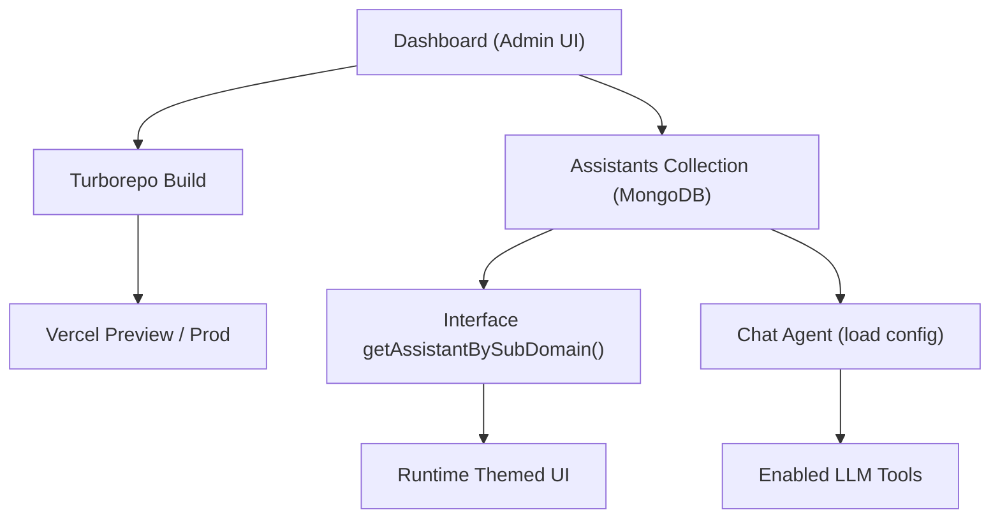

# Agent Configuration & Deployment Flow

```mermaid
graph TD
    DASH["Dashboard (Admin UI)"] --> CFG["Assistants Collection (MongoDB)"]
    DASH --> BUILD["Turborepo Build"]
    BUILD --> DEPLOY[Vercel Preview / Prod]
    CFG --> INT["Interface getAssistantBySubDomain()"]
    CFG --> AGENT["Chat Agent (load config)"]
    INT --> RUNTIME["Runtime Themed UI"]
    AGENT --> TOOLS["Enabled LLM Tools"]
```

> This diagram captures how an operator's changes in the dashboard propagate to both the UI theme and the chat-agent's capabilities. 