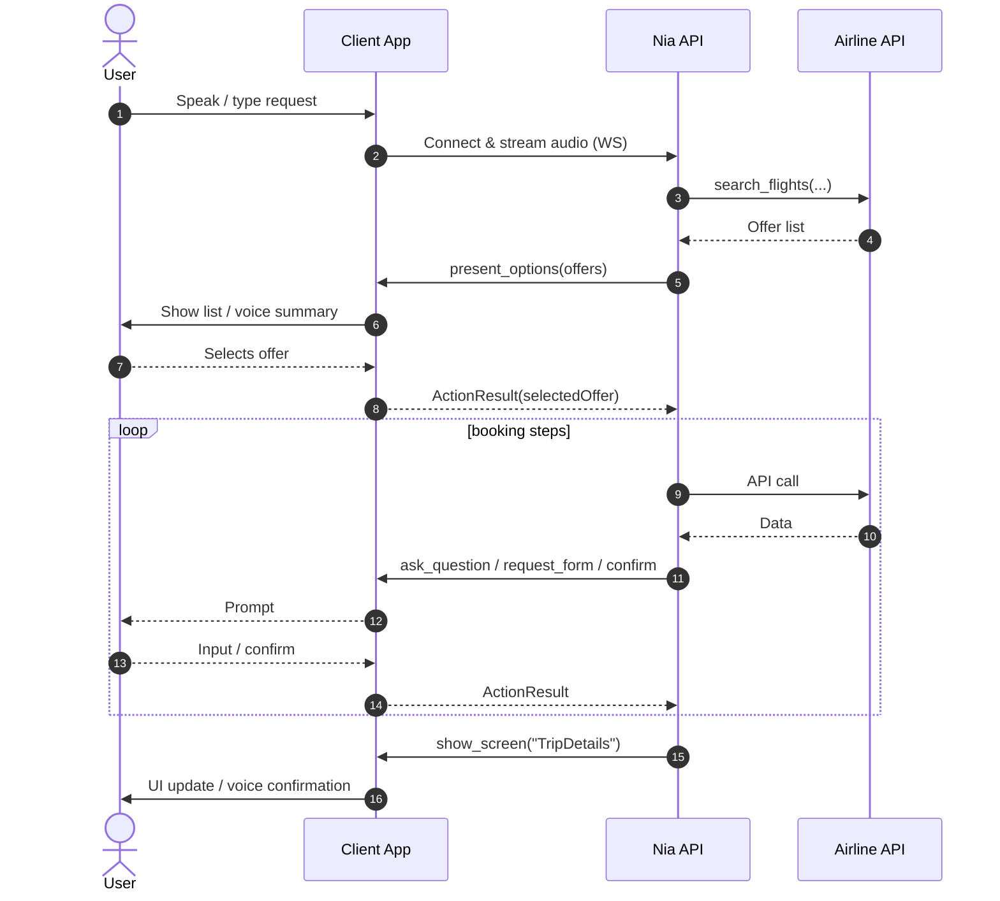

# Nia ↔ Native App (Thin-Client) Integration — High-Level Architecture

## Components

| Component | Responsibility |
|-----------|----------------|
| **User** | Speaks or types requests. |
| **Client App (iOS/Android/Xamarin)** | Streams audio/text to Nia; renders UI prompts; returns the user’s answers as *ActionResults*. |
| **Nia API** | ASR/TTS, dialog reasoning, policy checks, **and** all airline-API calls (search, cart, price, order). |
| **Airline API** | Standard REST/GraphQL endpoints exposed by the carrier or GDS. |

## End-to-End Flow

## What the **Client Team** Has to Build

1. **Thin Nia Client** 
   *One WebSocket* to Nia (already provided as a NuGet/Swift Package).  
   - `startSession(token)`  
   - `onIntent(intentEnvelope) ⇒ ActionResult`

2. **UI Helpers**  
   | Intent | Suggested control |
   |--------|------------------|
   | `present_options` | `DisplayActionSheet` |
   | `ask_question` | `DisplayPromptAsync` |
   | `request_form` / `confirm` | Modal page or `DisplayAlert` |

3. **Deep-Link Handler**  
   If Nia emits `show_screen("TripDetails")`, handle `myapp://trip/details?orderRef=…`.
