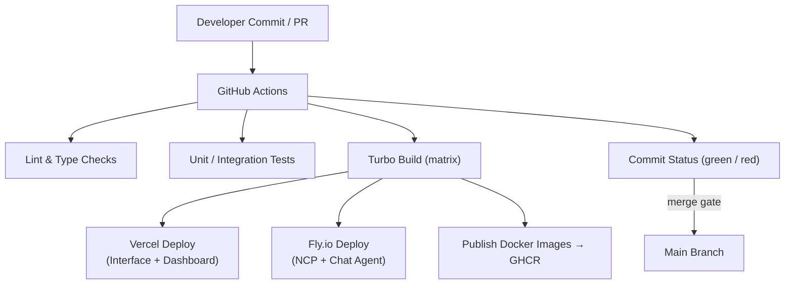

# CI/CD Pipeline Overview

```mermaid
graph TD
    DEV["Developer Commit / PR"] --> GH["GitHub Actions"]
    GH --> LINT["Lint & Type Checks"]
    GH --> TEST["Unit / Integration Tests"]
    GH --> BUILD["Turbo Build (matrix)"]
    BUILD --> VERCEL["Vercel Deploy\n(Interface + Dashboard)"]
    BUILD --> FLY["Fly.io Deploy\n(NCP + Chat Agent)"]
    BUILD --> GHCR["Publish Docker Images → GHCR"]
    GH --> STATUS["Commit Status (green / red)"]
    STATUS -->|merge gate| MAIN["Main Branch"]
```

> All merges to `main` require green checks; successful builds auto-deploy to both Vercel and Fly.io. 