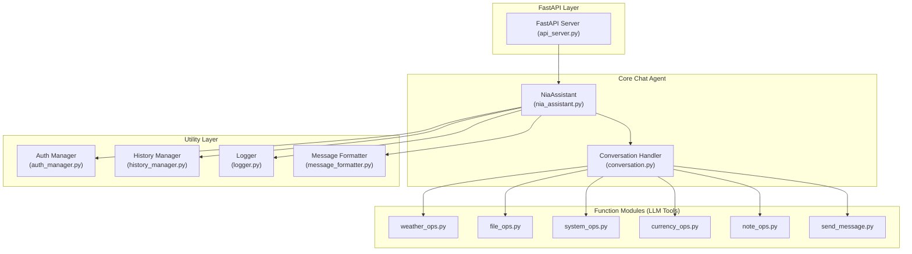

# Core Chat Agent – Component Diagram

> This diagram is autogenerated by the AI assistant and mirrors the file names inside `packages/core/nia-chat-agent/`. Feel free to update it when new tools or utilities are added. 