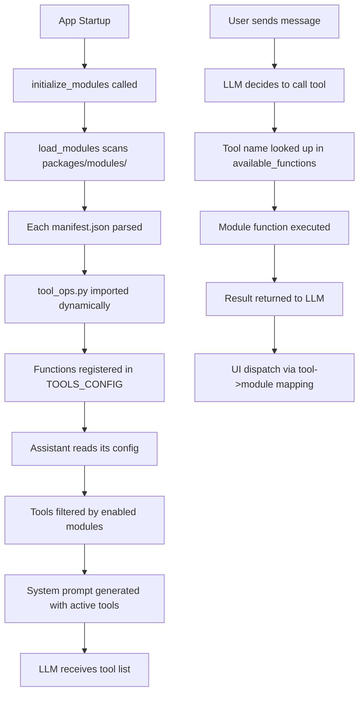

# Toward a Fully-Modular Nia Agent System

*Complete Implementation Guide for LLM-Driven Development*  
*Version 1.0 – January 2025*

---

## Introduction: The Vision of True Modularity

### The Problem with Monolithic AI Agents

Current AI agent systems suffer from a fundamental scalability problem: adding new functionality requires modifying core code, updating multiple configuration files, and risking breaking existing features. When a user asks "Can you play YouTube videos?" or "Show me the weather," developers must:

1. **Hardcode new functions** into the main agent class
2. **Manually register tools** in configuration files  
3. **Update UI components** to handle new data types
4. **Modify system prompts** to include new capabilities
5. **Test everything** to ensure nothing breaks

This approach doesn't scale. It's especially problematic when we want LLMs themselves to extend agent capabilities based on user requests.

### The Modular Solution

This document outlines a **plug-and-play architecture** where new capabilities are self-contained modules that can be dropped into the codebase without touching core systems. Here's how it works:

**For Users:**
- "I want to play music" → Agent instantly gains music playback capability
- "Show me stock prices" → Agent automatically adds financial data tools
- "Let me book appointments" → Agent seamlessly integrates calendar functionality

**For Developers & LLMs:**
- Create a single folder with 3-4 files
- Drop it into `packages/modules/`
- System automatically discovers and integrates it
- Zero core code changes required

### How Modularity Integrates with the Nia Codebase

The Nia agent system currently has these main components:

```
Nia Architecture (Current)
├── Chat Agent (Python) - Processes user messages, calls functions
├── Interface (Next.js) - Renders chat UI and function results  
├── Dashboard (React) - Manages agent configurations
└── Functions (Hardcoded) - Weather, notes, file operations, etc.
```

The modular system transforms this into:

```
Nia Architecture (Modular)
├── Chat Agent (Python) - Dynamically discovers and loads modules
├── Interface (Next.js) - Automatically renders module UI components
├── Dashboard (React) - Enables/disables modules per agent
├── Module Loader - Scans packages/modules/ and registers capabilities
└── Modules (Pluggable)
    ├── youtube_player/
    ├── weather_widget/
    ├── calendar_sync/
    └── [any_new_module]/
```

### The Three-Layer Module System

Each module operates on three integrated layers:

1. **Discovery Layer** - Automatic detection and registration
2. **Execution Layer** - LLM function calling and Python execution  
3. **Presentation Layer** - Dynamic UI component rendering

When a user says "Play some music," here's the complete flow:

```
User Request → LLM Decision → Module Execution → UI Rendering
     ↓              ↓              ↓               ↓
"Play music" → play_spotify() → Python function → <SpotifyPlayer/>
```

### Key Benefits for LLM Development

This modular architecture is specifically designed for LLM-driven development:

- **Self-Describing**: Modules include their own documentation and schemas
- **Atomic**: Each module is completely independent
- **Discoverable**: System automatically finds and integrates new modules
- **Validatable**: Built-in validation ensures modules work correctly
- **Extensible**: LLMs can create new modules autonomously

### Document Structure

This guide is organized into four main parts:

**Part I: Understanding Modularity (Sections 1-4)**
- Core concepts and architecture
- How modules integrate with existing code
- Module structure and contracts

**Part II: System Design (Sections 5-8)**  
- Discovery and loading mechanisms
- Agent configuration system
- UI integration pipeline

**Part III: Implementation Guide (Sections 9-16)**
- Step-by-step implementation roadmap
- Code examples and integration points
- Testing and validation

**Part IV: Advanced Topics (Sections 17-20)**
- Advanced patterns and LLM autonomy
- Error handling and debugging
- Performance and security considerations

---

# Part I: Understanding Modularity

## 1. Core Principles of Modular Design

A modular system succeeds when it follows these fundamental principles:

### 1.1 Separation of Concerns
Each module handles exactly one capability:
- **YouTube Player** - Only handles video playback
- **Weather Widget** - Only displays weather data  
- **Calendar Sync** - Only manages appointments

### 1.2 Contract-Based Integration
Modules communicate through well-defined interfaces:
- **Python Contract** - Standard `run()` function and Pydantic schemas
- **UI Contract** - React components that accept standardized props
- **Manifest Contract** - JSON metadata describing module capabilities

### 1.3 Zero-Touch Discovery
The system automatically finds and integrates new modules:
- Drop a folder into `packages/modules/`
- System scans for `manifest.json` files
- Module functions become available to the LLM immediately

### 1.4 Configuration-Driven Activation
Agents can enable/disable modules without code changes:
- Dashboard toggles module availability per agent
- Runtime filtering based on agent configuration
- Hot-reload capabilities for development

## 2. File System Architecture

```
packages/
  modules/
    youtube_player/
      manifest.json            # human + machine readable
      tool_ops.py              # LLM callable
      ui/
        YoutubeView.tsx        # Next.js component
    flight_tracker/
      ...
    avatar_renderer/
      ...
```
Legacy tools inside `packages/core/nia-chat-agent/functions/` can be migrated here gradually—the loader will look in both places.

## 3. Module Manifest Structure

```jsonc
{
  "name": "youtube_player",
  "displayName": "YouTube Player",
  "description": "Play or queue YouTube videos inside the guest interface",
  "tool": "play_youtube_video",          // callable tool name
  "schema": "YoutubeVideoSchema",        // exported Pydantic model
  "ui": "YoutubeView",                  // React component to mount
  "permissions": ["embed_video"],         // future RBAC hooks
  "defaultEnabled": false                 // dashboard can flip this
}
```

## 4. Module Integration Contracts

### 4.1 Python Contract
Every module must implement this interface:

```python
from pydantic import BaseModel, Field
from typing import Any, Dict

class ModuleSchema(BaseModel):
    """Define the parameters the LLM can pass"""
    # Define your parameters here
    pass

async def run(**kwargs) -> Dict[str, Any]:
    """
    Main function that the LLM calls.
    Must return JSON-serializable data for the UI.
    """
    # Your implementation here
    return {"key": "value"}
```

### 4.2 React Contract
Every UI component must accept the data returned by the Python function:

```tsx
interface Props {
    // Props must match the keys returned by run() function
    [key: string]: any;
}

export default function ModuleComponent(props: Props) {
    // Render the module UI
    return <div>Module content</div>;
}
```

---

# Part II: System Design

## 5. Module Discovery and Loading Mechanism

The core of the modular system is automatic discovery. Here's how the system finds and integrates new modules:

### 5.1 The Three-Layer Discovery Architecture
```
┌─────────────────────────────────────────┐
│           DISCOVERY LAYER               │  ← Finds and loads modules
│  modules_loader.py + moduleRegistry.ts  │
├─────────────────────────────────────────┤
│           CONTRACT LAYER                │  ← Defines how modules talk
│     manifest.json + tool schemas        │
├─────────────────────────────────────────┤
│         IMPLEMENTATION LAYER            │  ← Actual module code
│    tool_ops.py + React components       │
└─────────────────────────────────────────┘
```

### 5.2 Python Side Discovery Process
```python
# modules_loader.py - Step by step breakdown
import importlib, json, pathlib
from config.tools_config import TOOLS

def load_modules(path="packages/modules"):
    print(f"🔍 Scanning {path} for modules...")
    
    for mod_dir in pathlib.Path(path).iterdir():
        if not mod_dir.is_dir():
            continue
            
        manifest_path = mod_dir / "manifest.json"
        if not manifest_path.exists():
            print(f"⚠️  Skipping {mod_dir.name} - no manifest.json")
            continue
            
        # Step 1: Parse the manifest
        try:
            manifest = json.loads(manifest_path.read_text())
            print(f"📋 Found module: {manifest['name']}")
        except json.JSONDecodeError as e:
            print(f"❌ Invalid JSON in {manifest_path}: {e}")
            continue
            
        # Step 2: Import the Python module
        module_path = f"packages.modules.{mod_dir.name}.tool_ops"
        try:
            tool_module = importlib.import_module(module_path)
            print(f"✅ Imported {module_path}")
        except ImportError as e:
            print(f"❌ Failed to import {module_path}: {e}")
            continue
            
        # Step 3: Extract the function and schema
        run_func = getattr(tool_module, 'run', None)
        schema_class = getattr(tool_module, manifest['schema'], None)
        
        if not run_func:
            print(f"❌ Module {mod_dir.name} missing run() function")
            continue
        if not schema_class:
            print(f"❌ Module {mod_dir.name} missing {manifest['schema']} class")
            continue
            
        # Step 4: Register in global TOOLS dict
        TOOLS[manifest['tool']] = {
            "fn": run_func,
            "schema": schema_class,
            "module_name": manifest['name']  # For UI dispatch
        }
        print(f"🎯 Registered tool: {manifest['tool']}")
```

### 5.3 TypeScript Side Discovery Process
```typescript
// gen-module-registry.mjs - Build-time discovery
import { promises as fs } from 'fs';
import { glob } from 'glob';
import path from 'path';

async function generateModuleRegistry() {
    console.log('🔍 Scanning for module manifests...');
    
    // Step 1: Find all manifest files
    const manifestPaths = await glob('packages/modules/**/manifest.json');
    console.log(`📋 Found ${manifestPaths.length} manifests`);
    
    const registryEntries = [];
    
    for (const manifestPath of manifestPaths) {
        // Step 2: Parse each manifest
        const manifestContent = await fs.readFile(manifestPath, 'utf8');
        const manifest = JSON.parse(manifestContent);
        
        // Step 3: Calculate paths
        const moduleDir = path.dirname(manifestPath);
        const uiComponentPath = `${moduleDir}/ui/${manifest.ui}`;
        
        // Step 4: Verify UI component exists
        try {
            await fs.access(`${uiComponentPath}.tsx`);
            console.log(`✅ UI component found: ${uiComponentPath}.tsx`);
        } catch {
            console.warn(`⚠️  UI component missing: ${uiComponentPath}.tsx`);
            continue;
        }
        
        // Step 5: Generate dynamic import
        registryEntries.push(
            `  "${manifest.name}": () => import("../../${uiComponentPath}")`
        );
    }
    
    // Step 6: Write the registry file
    const registryCode = `
// Auto-generated by gen-module-registry.mjs
// DO NOT EDIT MANUALLY

export const moduleRegistry = {
${registryEntries.join(',\n')}
} as const;

export type ModuleName = keyof typeof moduleRegistry;
`;
    
    await fs.writeFile(
        'apps/interface/src/lib/generated/moduleRegistry.ts',
        registryCode
    );
    
    console.log('✅ Module registry generated');
}
```

## 6. Agent Configuration System

The agent configuration system determines which modules are available to each assistant instance. Here's how it works:

### 6.1 Assistant Configuration Schema
```json
{
  "assistantName": "hotel-concierge",
  "model": {
    "provider": "openai",
    "model": "gpt-4o-mini",
    "systemPrompt": "You are a helpful hotel concierge..."
  },
  "modules": [
    "youtube_player",
    "weather_widget", 
    "room_service",
    "concierge_services"
  ],
  "permissions": ["external_api", "user_data"]
}
```

### 6.2 Runtime Module Filtering
```python
# In assistant.get_all_tools()
def get_all_tools(self):
    """Return only tools enabled for this assistant's modules"""
    enabled_modules = self.get_enabled_modules()
    filtered_tools = []
    
    for tool in all_discovered_tools:
        if tool.get('_module_meta', {}).get('module_name') in enabled_modules:
            filtered_tools.append(tool)
    
    return filtered_tools
```

### 6.3 Dynamic System Prompt Generation
```python
def generate_system_prompt(self, enabled_tools):
    """Generate system prompt with only enabled module tools"""
    tool_descriptions = []
    for tool in enabled_tools:
        tool_descriptions.append({
            "name": tool["name"],
            "description": tool["description"],
            "parameters": tool["parameters"]
        })
    
    return f"""
    You are a hotel concierge AI. You have access to these tools:
    {json.dumps(tool_descriptions, indent=2)}
    Use these tools to help guests with their requests.
    """
```

## 7. UI Integration Pipeline

The UI integration system automatically renders appropriate components when modules return data.

### 7.1 Tool Result to UI Component Flow
```typescript
// 1. LLM calls tool → Python executes → Result sent to UI
const toolResult = {
    type: "tool_result",
    tool_name: "play_youtube_video",
    data: { videoUrl: "https://youtube.com/watch?v=...", autoplay: true },
    module_name: "youtube_player"
};

// 2. UI processes the result
const handleToolResult = async (result) => {
    const { tool_name, data, module_name } = result;
    
    // 3. Dynamic component loading
    const componentLoader = moduleRegistry[module_name];
    const { default: Component } = await componentLoader();
    
    // 4. Component rendered with data
    setActiveModule(<Component {...data} />);
};
```

### 7.2 Module Registry Generation
```javascript
// scripts/gen-module-registry.mjs
// Auto-generates registry mapping module names to dynamic imports
export const moduleRegistry = {
    "youtube_player": () => import("../../packages/modules/youtube_player/ui/YoutubeView"),
    "weather_widget": () => import("../../packages/modules/weather_widget/ui/WeatherWidget"),
    // ... automatically generated for all modules
} as const;
```

## 8. Module Lifecycle: From Creation to Execution

### 8.1 Development Phase
```bash
# Developer creates new module
mkdir packages/modules/weather_widget
cd packages/modules/weather_widget

# 1. Create manifest
cat > manifest.json << EOF
{
  "name": "weather_widget",
  "displayName": "Weather Widget",
  "description": "Display current weather conditions",
  "tool": "get_weather_display",
  "schema": "WeatherDisplaySchema",
  "ui": "WeatherWidget",
  "permissions": ["external_api"],
  "defaultEnabled": true
}
EOF

# 2. Create Python tool
mkdir -p ui
cat > tool_ops.py << EOF
from pydantic import BaseModel
import httpx, os

class WeatherDisplaySchema(BaseModel):
    location: str
    units: str = "metric"

async def run(location: str, units: str = "metric"):
    # Implementation here
    return {"temperature": 22, "condition": "sunny", "location": location}
EOF

# 3. Create React component
cat > ui/WeatherWidget.tsx << EOF
interface Props {
    temperature: number;
    condition: string;
    location: string;
}

export default function WeatherWidget({ temperature, condition, location }: Props) {
    return (
        <div className="weather-widget">
            <h3>{location}</h3>
            <div className="temp">{temperature}°</div>
            <div className="condition">{condition}</div>
        </div>
    );
}
EOF
```

### 8.2 Build Phase
```bash
# Turbo runs the module registry generator
yarn turbo run gen:modules

# This creates apps/interface/src/lib/generated/moduleRegistry.ts:
export const moduleRegistry = {
  "weather_widget": () => import("../../packages/modules/weather_widget/ui/WeatherWidget")
} as const;
```

### 8.3 Runtime Phase - Python Side
```python
# When chat agent starts up
def initialize_assistant():
    # 1. Load all modules
    load_modules()  # Populates TOOLS dict
    
    # 2. Read assistant config
    assistant_config = get_assistant_config("demo-hotel")
    enabled_modules = assistant_config.get("modules", [])
    
    # 3. Filter tools to only enabled ones
    active_tools = {
        name: tool for name, tool in TOOLS.items()
        if tool.get("module_name") in enabled_modules
    }
    
    # 4. Generate system prompt with only active tools
    tool_descriptions = []
    for name, tool in active_tools.items():
        schema = tool["schema"].model_json_schema()
        tool_descriptions.append({
            "name": name,
            "description": schema.get("description", ""),
            "parameters": schema
        })
    
    system_prompt = f"""
    You are a hotel concierge AI. You have access to these tools:
    {json.dumps(tool_descriptions, indent=2)}
    """
    
    return NiaAssistant(system_prompt, active_tools)
```

### 8.4 Runtime Phase - React Side
```tsx
// BrowserWindow.tsx - When tool result arrives
function BrowserWindow() {
    const [moduleContent, setModuleContent] = useState(null);
    
    // Listen for tool call results from chat agent
    useEffect(() => {
        chatStream.on('tool_result', async (result) => {
            // result = { tool_name: "get_weather_display", data: { temperature: 22, ... } }
            
            // 1. Find which module handles this tool
            const moduleName = findModuleByTool(result.tool_name);
            if (!moduleName) return;
            
            // 2. Dynamically import the UI component
            const moduleImport = moduleRegistry[moduleName];
            if (!moduleImport) {
                console.warn(`No UI component for module: ${moduleName}`);
                return;
            }
            
            // 3. Load and render the component
            const { default: Component } = await moduleImport();
            setModuleContent(<Component {...result.data} />);
        });
    }, []);
    
    return (
        <div className="browser-window">
            {/* Regular chat interface */}
            <ChatMessages />
            
            {/* Dynamic module content */}
            {moduleContent && (
                <div className="module-display">
                    {moduleContent}
                </div>
            )}
        </div>
    );
}

// Helper function to map tool names to module names
function findModuleByTool(toolName: string): string | null {
    // This could be generated at build time or fetched from API
    const toolToModuleMap = {
        "get_weather_display": "weather_widget",
        "play_youtube_video": "youtube_player",
        // ...
    };
    return toolToModuleMap[toolName] || null;
}
```

---

# Part III: Implementation Guide

## 9. Complete Implementation Roadmap

This section provides the precise step-by-step order for implementing the modular system, designed specifically for LLM-guided development.

### Phase 1: Foundation Setup (Essential Infrastructure)

**Step 1: Create Module Directory Structure**
```bash
mkdir -p packages/modules/_shared/{api_client,ui_components}
touch packages/modules/_shared/__init__.py
```

**Step 2: Create the Module Loader**
Create `packages/core/nia-chat-agent/modules_loader.py`:

```python
import importlib
import json
import pathlib
from typing import Dict, Any
import logging

logger = logging.getLogger(__name__)

def load_modules(path="packages/modules") -> Dict[str, Any]:
    """
    Scans for modules and registers them in the global TOOLS dict.
    Returns a mapping of module_name -> tool_name for UI dispatch.
    """
    module_to_tool_map = {}
    
    try:
        modules_path = pathlib.Path(path)
        if not modules_path.exists():
            logger.warning(f"Modules path {path} does not exist, skipping module loading")
            return module_to_tool_map
            
        logger.info(f"🔍 Scanning {path} for modules...")
        
        for mod_dir in modules_path.iterdir():
            if not mod_dir.is_dir() or mod_dir.name.startswith('_'):
                continue
                
            manifest_path = mod_dir / "manifest.json"
            if not manifest_path.exists():
                logger.debug(f"⚠️  Skipping {mod_dir.name} - no manifest.json")
                continue
                
            try:
                manifest = json.loads(manifest_path.read_text())
                module_name = manifest['name']
                tool_name = manifest['tool']
                
                # Import the module
                module_path = f"packages.modules.{mod_dir.name}.tool_ops"
                tool_module = importlib.import_module(module_path)
                
                # Get function and schema
                run_func = getattr(tool_module, 'run')
                schema_class = getattr(tool_module, manifest['schema'])
                
                # Register in TOOLS (integrate with existing config)
                from config.tools_config import TOOLS_CONFIG
                if 'modules' not in TOOLS_CONFIG:
                    TOOLS_CONFIG['modules'] = []
                    
                TOOLS_CONFIG['modules'].append({
                    "name": tool_name,
                    "description": manifest.get('description', ''),
                    "parameters": schema_class.model_json_schema(),
                    "_module_meta": {
                        "module_name": module_name,
                        "run_func": run_func,
                        "ui_component": manifest.get('ui')
                    }
                })
                
                module_to_tool_map[module_name] = tool_name
                logger.info(f"✅ Registered module: {module_name} -> {tool_name}")
                
            except Exception as e:
                logger.error(f"❌ Failed to load module {mod_dir.name}: {e}")
                continue
                
    except Exception as e:
        logger.error(f"❌ Module loading failed: {e}")
        
    return module_to_tool_map

# Global registry for UI dispatch
MODULE_TO_TOOL_MAP = {}

def initialize_modules():
    """Call this during application startup"""
    global MODULE_TO_TOOL_MAP
    MODULE_TO_TOOL_MAP = load_modules()
    return MODULE_TO_TOOL_MAP
```

**Step 3: Update Main Entry Point**
Modify `packages/core/nia-chat-agent/main.py`:

```python
# Add at the top after imports:
from modules_loader import initialize_modules

# Add right before creating the assistant:
print("🔧 Initializing modular system...")
initialize_modules()
print("✅ Modules loaded successfully")

# Then continue with existing code
```

**Step 4: Update Assistant Class**
Modify `packages/core/nia-chat-agent/core/assistant.py`:

```python
def __init__(self, assistant_model):
    # ... existing code ...
    
    # NEW: Add module functions to available_functions
    from modules_loader import MODULE_TO_TOOL_MAP
    from config.tools_config import TOOLS_CONFIG
    
    # Add module functions to available functions
    if 'modules' in TOOLS_CONFIG:
        for tool_config in TOOLS_CONFIG['modules']:
            if '_module_meta' in tool_config:
                meta = tool_config['_module_meta']
                self._available_functions[tool_config['name']] = meta['run_func']
```

### Phase 2: UI Integration

**Step 5: Create Module Registry Generator**
Create `scripts/gen-module-registry.mjs`:

```javascript
import { promises as fs } from 'fs';
import { glob } from 'glob';
import path from 'path';

async function generateModuleRegistry() {
    console.log('🔍 Generating module registry...');
    
    const manifestPaths = await glob('packages/modules/**/manifest.json');
    const registryEntries = [];
    const toolToModuleMap = {};
    
    for (const manifestPath of manifestPaths) {
        try {
            const manifestContent = await fs.readFile(manifestPath, 'utf8');
            const manifest = JSON.parse(manifestContent);
            
            const moduleDir = path.dirname(manifestPath);
            const uiComponentPath = `../../${moduleDir}/ui/${manifest.ui}`;
            
            // Verify UI component exists
            await fs.access(`${moduleDir}/ui/${manifest.ui}.tsx`);
            
            registryEntries.push(
                `  "${manifest.name}": () => import("${uiComponentPath}")`
            );
            
            toolToModuleMap[manifest.tool] = manifest.name;
            
            console.log(`✅ Registered: ${manifest.name} -> ${manifest.tool}`);
        } catch (error) {
            console.warn(`⚠️  Skipped ${manifestPath}: ${error.message}`);
        }
    }
    
    const registryCode = `// Auto-generated module registry - DO NOT EDIT
export const moduleRegistry = {
${registryEntries.join(',\n')}
} as const;

export const toolToModuleMap = ${JSON.stringify(toolToModuleMap, null, 2)} as const;

export type ModuleName = keyof typeof moduleRegistry;
`;
    
    await fs.writeFile(
        'apps/interface/src/lib/generated/moduleRegistry.ts',
        registryCode
    );
    
    console.log('✅ Module registry generated');
}

generateModuleRegistry().catch(console.error);
```

**Step 6: Update Package Scripts**
Add to `package.json`:

```json
{
  "scripts": {
    "gen:modules": "node scripts/gen-module-registry.mjs",
    "prebuild": "yarn gen:modules",
    "dev": "yarn gen:modules && next dev"
  }
}
```

### Phase 3: Create Example Module

**Step 7: Create YouTube Player Module**
```bash
mkdir -p packages/modules/youtube_player/ui
```

Create the files as detailed in the next section.

## 10. Example Module: YouTube Player

This section walks through creating a complete working module from scratch.

### 10.1 Module Structure

```
packages/modules/youtube_player/
├── manifest.json           # Module metadata
├── tool_ops.py            # Python function for LLM
└── ui/
    └── YoutubeView.tsx    # React component
```

### 10.2 Manifest File
Create `packages/modules/youtube_player/manifest.json`:

```json
{
  "name": "youtube_player",
  "displayName": "YouTube Player",
  "description": "Play or queue YouTube videos inside the guest interface",
  "tool": "play_youtube_video",
  "schema": "YoutubeVideoSchema",
  "ui": "YoutubeView",
  "permissions": ["embed_video"],
  "defaultEnabled": true
}
```

### 10.3 Python Tool Implementation
Create `packages/modules/youtube_player/tool_ops.py`:

```python
from pydantic import BaseModel, Field
from typing import Optional
import httpx, os

class YoutubeVideoSchema(BaseModel):
    """Parameters the LLM can pass when requesting a video."""
    query: str = Field(..., description="Search term or YouTube URL")
    autoplay: bool = Field(default=True)

YOUTUBE_API_KEY = os.getenv("YOUTUBE_API_KEY")

async def run(query: str, autoplay: bool = True):
    # If a full URL was provided just pass it through
    if "youtube.com" in query or "youtu.be" in query:
        return {"videoUrl": query, "autoplay": autoplay}

    async with httpx.AsyncClient() as client:
        res = await client.get(
            "https://www.googleapis.com/youtube/v3/search",
            params={
                "key": YOUTUBE_API_KEY,
                "type": "video",
                "part": "snippet",
                "maxResults": 1,
                "q": query,
            },
        )
        res.raise_for_status()
        vid_id = res.json()["items"][0]["id"]["videoId"]
    return {"videoUrl": f"https://www.youtube.com/watch?v={vid_id}", "autoplay": autoplay}
```

### 10.4 React UI Component
Create `packages/modules/youtube_player/ui/YoutubeView.tsx`:

```tsx
import React from 'react';

interface Props { 
    videoUrl: string; 
    autoplay?: boolean 
}

export default function YoutubeView({ videoUrl, autoplay = true }: Props) {
    const id = new URL(videoUrl).searchParams.get('v');
    const src = `https://www.youtube.com/embed/${id}?autoplay=${autoplay ? 1 : 0}`;
    
    return (
        <div className="w-full h-full flex justify-center items-center">
            <iframe
                className="w-full h-full aspect-video rounded-lg border"
                src={src}
                allow="accelerometer; autoplay; clipboard-write; encrypted-media; gyroscope; picture-in-picture"
                allowFullScreen
            />
        </div>
    );
}
```

### 10.5 Testing the Module
```bash
# Generate the module registry
yarn gen:modules

# Start development servers
yarn dev         # Next.js interface
yarn start:nia   # Chat agent

# Test by asking: "Play Rick Astley Never Gonna Give You Up"
```

## 11. Testing and Validation

### 11.1 Module Validation Script
Create `scripts/validate_modules.py`:

```python
import json, pathlib, importlib
from typing import List

def validate_all_modules() -> List[str]:
    """Returns list of validation errors"""
    errors = []
    
    for mod_dir in pathlib.Path("packages/modules").iterdir():
        if not mod_dir.is_dir() or mod_dir.name.startswith('_'):
            continue
            
        errors.extend(validate_module(mod_dir))
    
    return errors

def validate_module(mod_dir: pathlib.Path) -> List[str]:
    errors = []
    mod_name = mod_dir.name
    
    # Check manifest exists
    manifest_path = mod_dir / "manifest.json"
    if not manifest_path.exists():
        errors.append(f"{mod_name}: Missing manifest.json")
        return errors
    
    # Parse manifest
    try:
        manifest = json.loads(manifest_path.read_text())
    except json.JSONDecodeError as e:
        errors.append(f"{mod_name}: Invalid JSON in manifest: {e}")
        return errors
    
    # Check required fields
    required_fields = ["name", "tool", "schema", "ui"]
    for field in required_fields:
        if field not in manifest:
            errors.append(f"{mod_name}: Missing required field '{field}' in manifest")
    
    # Check Python module
    try:
        tool_module = importlib.import_module(f"packages.modules.{mod_name}.tool_ops")
    except ImportError as e:
        errors.append(f"{mod_name}: Cannot import tool_ops.py: {e}")
        return errors
    
    # Check run function exists
    if not hasattr(tool_module, 'run'):
        errors.append(f"{mod_name}: Missing run() function in tool_ops.py")
    
    # Check schema class exists
    schema_name = manifest.get("schema")
    if schema_name and not hasattr(tool_module, schema_name):
        errors.append(f"{mod_name}: Missing {schema_name} class in tool_ops.py")
    
    # Check UI component exists
    ui_path = mod_dir / "ui" / f"{manifest.get('ui', '')}.tsx"
    if not ui_path.exists():
        errors.append(f"{mod_name}: Missing UI component at {ui_path}")
    
    return errors

if __name__ == "__main__":
    errors = validate_all_modules()
    if errors:
        print("❌ Module validation failed:")
        for error in errors:
            print(f"  • {error}")
        exit(1)
    else:
        print("✅ All modules valid")
```

### 11.2 Automated Testing
Add to your CI pipeline:

```yaml
- name: Validate Modules
  run: python scripts/validate_modules.py

- name: Test Module Registry Generation
  run: yarn gen:modules
```

---

# Part IV: Advanced Topics

## 12. Advanced Module Patterns

### 12.1 Multi-Tool Modules
Some modules need multiple LLM tools:

```jsonc
// manifest.json
{
  "name": "database_manager",
  "tools": [
    {
      "name": "query_database",
      "schema": "QuerySchema",
      "description": "Execute SELECT queries"
    },
    {
      "name": "update_database", 
      "schema": "UpdateSchema",
      "description": "Execute INSERT/UPDATE/DELETE"
    }
  ],
  "ui": "DatabaseView"
}
```

```python
# tool_ops.py
class QuerySchema(BaseModel):
    sql: str
    limit: int = 100

class UpdateSchema(BaseModel):
    sql: str
    confirm: bool = False

# Export multiple functions
def query_database(sql: str, limit: int = 100):
    # Implementation
    return {"columns": [...], "rows": [...]}

def update_database(sql: str, confirm: bool = False):
    if not confirm:
        return {"error": "Please confirm destructive operations"}
    # Implementation
    return {"affected_rows": 5}
```

### 12.2 Stateful Modules
For modules that need to maintain state across calls:

```python
# tool_ops.py
class GameState:
    def __init__(self):
        self.score = 0
        self.level = 1
        self.inventory = []

# Global state (in production, use Redis or database)
_game_states = {}

def start_game(player_id: str):
    _game_states[player_id] = GameState()
    return {"message": "Game started!", "score": 0, "level": 1}

def make_move(player_id: str, action: str):
    state = _game_states.get(player_id)
    if not state:
        return {"error": "No active game. Use start_game first."}
    
    # Process action, update state
    state.score += 10
    return {"score": state.score, "level": state.level}
```

### 12.3 Module Dependencies
Modules can depend on shared utilities:

```
packages/modules/
  _shared/
    api_client.py      # Shared HTTP client
    ui_components/     # Shared React components
      LoadingSpinner.tsx
      ErrorBoundary.tsx
  weather_widget/
    tool_ops.py        # imports from _shared
  flight_tracker/
    tool_ops.py        # imports from _shared
```

```python
# weather_widget/tool_ops.py
from packages.modules._shared.api_client import make_request

async def run(location: str):
    data = await make_request(f"https://api.weather.com/v1/current?q={location}")
    return {"temperature": data["temp"], "condition": data["weather"]}
```

## 13. Error Handling and Debugging

### 13.1 Common Module Errors and Solutions

**Error: "Module not found during import"**
```python
# Problem: Python can't find the module
ImportError: No module named 'packages.modules.my_module.tool_ops'

# Solution: Check file structure
packages/modules/my_module/
  ├── __init__.py          # ← MISSING! Add empty file
  ├── manifest.json
  └── tool_ops.py
```

**Error: "Schema class not found"**
```python
# Problem: Manifest references wrong class name
AttributeError: module 'tool_ops' has no attribute 'MyWrongSchema'

# Solution: Match manifest to actual class
# manifest.json
{
  "schema": "MyCorrectSchema"  # Must match class name exactly
}

# tool_ops.py
class MyCorrectSchema(BaseModel):  # ← Must match manifest
    param: str
```

**Error: "UI component fails to load"**
```tsx
// Problem: Dynamic import fails
ChunkLoadError: Loading chunk failed

// Solution: Check file paths and exports
// File: packages/modules/my_module/ui/MyComponent.tsx
export default function MyComponent(props) {  // ← Must be default export
    return <div>...</div>;
}
```

### 13.2 Debugging Tools

**Python Side Debugging:**
```python
# Add to modules_loader.py for verbose output
import logging
logging.basicConfig(level=logging.DEBUG)

def load_modules(path="packages/modules"):
    logger = logging.getLogger(__name__)
    logger.info(f"Starting module discovery in {path}")
    
    for mod_dir in pathlib.Path(path).iterdir():
        logger.debug(f"Checking directory: {mod_dir}")
        # ... rest of function with debug logs
```

**React Side Debugging:**
```tsx
// Add to BrowserWindow.tsx
const DEBUG_MODULES = process.env.NODE_ENV === 'development';

if (DEBUG_MODULES) {
    console.log('Available modules:', Object.keys(moduleRegistry));
    console.log('Tool result received:', result);
}
```

## 14. Integration Points with Core Codebase

### 14.1 Chat Agent Integration Points
```python
# packages/core/nia-chat-agent/core/nia_assistant.py

class NiaAssistant:
    def __init__(self):
        # INTEGRATION POINT 1: Module loading
        from modules_loader import load_modules
        load_modules()  # Populates global TOOLS dict
        
        # INTEGRATION POINT 2: Tool filtering
        self.active_tools = self._filter_tools_by_config()
        
    def _filter_tools_by_config(self):
        """Only enable tools for modules in assistant config"""
        config = self.get_config()
        enabled_modules = set(config.get("modules", []))
        
        return {
            name: tool for name, tool in TOOLS.items()
            if tool.get("module_name") in enabled_modules
        }
    
    async def process_message(self, message: str):
        # INTEGRATION POINT 3: Tool execution
        if self.should_call_tool(message):
            tool_name = self.extract_tool_name(message)
            tool_args = self.extract_tool_args(message)
            
            if tool_name in self.active_tools:
                tool_func = self.active_tools[tool_name]["fn"]
                result = await tool_func(**tool_args)
                
                # INTEGRATION POINT 4: Result formatting
                return {
                    "type": "tool_result",
                    "tool_name": tool_name,
                    "data": result,
                    "module_name": self.active_tools[tool_name]["module_name"]
                }
```

### 14.2 Interface Integration Points
```tsx
// apps/interface/src/components/browser-window.tsx

export default function BrowserWindow({ assistantName }: { assistantName: string }) {
    // INTEGRATION POINT 1: Module registry import
    const { moduleRegistry } = useModuleRegistry();
    
    // INTEGRATION POINT 2: Tool result handling
    const handleToolResult = useCallback(async (result: ToolResult) => {
        const { tool_name, data, module_name } = result;
        
        // INTEGRATION POINT 3: Dynamic component loading
        if (module_name && moduleRegistry[module_name]) {
            const componentLoader = moduleRegistry[module_name];
            const { default: Component } = await componentLoader();
            
            // INTEGRATION POINT 4: Component rendering
            setActiveModule(
                <ErrorBoundary fallback={<ModuleError />}>
                    <Component {...data} />
                </ErrorBoundary>
            );
        }
    }, [moduleRegistry]);
    
    // INTEGRATION POINT 5: Chat stream subscription
    useEffect(() => {
        const unsubscribe = chatStream.subscribe('tool_result', handleToolResult);
        return unsubscribe;
    }, [handleToolResult]);
    
    return (
        <div className="browser-window">
            <ChatInterface />
            {/* INTEGRATION POINT 6: Module display area */}
            <div className="module-container">
                {activeModule}
            </div>
        </div>
    );
}
```

### 14.3 Dashboard Integration Points
```tsx
// apps/dashboard/src/components/assistant-config.tsx

export default function AssistantConfig({ assistantId }: { assistantId: string }) {
    // INTEGRATION POINT 1: Available modules discovery
    const { data: availableModules } = useSWR('/api/modules', fetchModules);
    const { data: assistant, mutate } = useSWR(`/api/assistants/${assistantId}`, fetchAssistant);
    
    const handleModuleToggle = async (moduleName: string, enabled: boolean) => {
        const updatedModules = enabled 
            ? [...(assistant.modules || []), moduleName]
            : (assistant.modules || []).filter(m => m !== moduleName);
            
        // INTEGRATION POINT 2: Config persistence
        await updateAssistant(assistantId, { modules: updatedModules });
        mutate(); // Refresh UI
    };
    
    return (
        <div className="assistant-config">
            <h2>Available Modules</h2>
            {/* INTEGRATION POINT 3: Module list rendering */}
            {availableModules?.map(module => (
                <ModuleToggle
                    key={module.name}
                    module={module}
                    enabled={assistant.modules?.includes(module.name)}
                    onToggle={handleModuleToggle}
                />
            ))}
        </div>
    );
}
```

## 15. LLM Autonomy: Self-Modifying Code Framework

This section addresses how LLMs can autonomously create and integrate new modules, enabling true self-evolution of the agent system.

### 15.1 LLM Module Creation Workflow

For an LLM to create a new module autonomously, it needs to:

1. **Analyze user request** and determine what capability is needed
2. **Design the module interface** (parameters and return values)  
3. **Generate Python implementation** with proper schema validation
4. **Create React UI component** to display the results
5. **Write manifest file** to integrate with the system
6. **Trigger module registration** and validation

### 15.2 LLM-Friendly Module Creation Template

```python
# Template function that LLMs can call to create modules
async def create_module(
    module_name: str,
    display_name: str, 
    description: str,
    tool_name: str,
    schema_definition: dict,
    python_implementation: str,
    react_component: str
):
    """
    Creates a new module with all necessary files.
    LLMs can call this to add new functionality autonomously.
    """
    import os, json
    
    # 1. Create directory structure
    module_dir = f"packages/modules/{module_name}"
    os.makedirs(f"{module_dir}/ui", exist_ok=True)
    
    # 2. Create manifest
    manifest = {
        "name": module_name,
        "displayName": display_name,
        "description": description,
        "tool": tool_name,
        "schema": f"{module_name.title()}Schema",
        "ui": f"{module_name.title()}View",
        "defaultEnabled": True
    }
    
    with open(f"{module_dir}/manifest.json", "w") as f:
        json.dump(manifest, f, indent=2)
    
    # 3. Create Python tool
    with open(f"{module_dir}/tool_ops.py", "w") as f:
        f.write(python_implementation)
    
    # 4. Create React component  
    with open(f"{module_dir}/ui/{manifest['ui']}.tsx", "w") as f:
        f.write(react_component)
    
    # 5. Trigger re-registration
    from modules_loader import initialize_modules
    initialize_modules()
    
    return {"success": True, "module_name": module_name}
```

### 15.3 Self-Validation and Error Recovery

```python
# LLMs can call this to validate their creations
async def validate_and_fix_module(module_name: str):
    """
    Validates a module and attempts to fix common issues.
    Returns validation results and any fixes applied.
    """
    from scripts.validate_modules import validate_module
    import pathlib
    
    module_dir = pathlib.Path(f"packages/modules/{module_name}")
    errors = validate_module(module_dir)
    
    fixes_applied = []
    
    # Auto-fix common issues
    if "Missing __init__.py" in str(errors):
        (module_dir / "__init__.py").touch()
        fixes_applied.append("Created __init__.py")
    
    # Re-validate after fixes
    errors_after_fix = validate_module(module_dir)
    
    return {
        "original_errors": errors,
        "fixes_applied": fixes_applied, 
        "remaining_errors": errors_after_fix,
        "is_valid": len(errors_after_fix) == 0
    }
```

### 15.4 Example: LLM Creating a Weather Module

```python
# LLM generates this call to create a weather module
await create_module(
    module_name="weather_display",
    display_name="Weather Display", 
    description="Show current weather conditions with visual icons",
    tool_name="get_weather_widget",
    schema_definition={"location": "string", "units": "string"},
    python_implementation="""
from pydantic import BaseModel
import httpx, os

class WeatherDisplaySchema(BaseModel):
    location: str
    units: str = "metric"

async def run(location: str, units: str = "metric"):
    api_key = os.getenv("WEATHER_API_KEY")
    async with httpx.AsyncClient() as client:
        response = await client.get(
            f"https://api.openweathermap.org/data/2.5/weather",
            params={"q": location, "units": units, "appid": api_key}
        )
        data = response.json()
        return {
            "temperature": data["main"]["temp"],
            "condition": data["weather"][0]["description"],
            "icon": data["weather"][0]["icon"],
            "location": location
        }
""",
    react_component="""
interface Props {
    temperature: number;
    condition: string;
    icon: string;
    location: string;
}

export default function WeatherDisplayView({ temperature, condition, icon, location }: Props) {
    return (
        <div className="weather-widget p-4 bg-blue-50 rounded-lg">
            <h3 className="text-lg font-bold">{location}</h3>
            <div className="flex items-center gap-2">
                
                <span className="text-2xl">{Math.round(temperature)}°</span>
            </div>
            <p className="text-gray-600">{condition}</p>
        </div>
    );
}
"""
)
```

---

## 16. Migration Strategy for Existing Functions

### 16.1 Gradual Migration Approach

The modular system is designed to coexist with existing hardcoded functions:

```python
# Current: packages/core/nia-chat-agent/functions/weather_ops.py
def get_weather(location: str):
    # Existing implementation
    pass

# New: packages/modules/weather_widget/tool_ops.py  
def run(location: str):
    # Modular implementation
    pass
```

### 16.2 Migration Steps

1. **Identify function to migrate** (e.g., `weather_ops.py`)
2. **Create new module structure** (`packages/modules/weather_widget/`)
3. **Copy and adapt function** with proper schema
4. **Create UI component** for the function output
5. **Update agent configuration** to use new module
6. **Test both versions** in parallel
7. **Remove old function** once validated

### 16.3 Backward Compatibility

```python
# modules_loader.py supports legacy function detection
def load_modules(path="packages/modules"):
    # ... load new modules ...
    
    # Also scan legacy functions directory
    legacy_path = "packages/core/nia-chat-agent/functions"
    for func_file in pathlib.Path(legacy_path).glob("*.py"):
        # Auto-wrap legacy functions as modules
        wrap_legacy_function(func_file)
```

---

## 17. Performance and Security Considerations

### 17.1 Module Loading Performance

```python
# Lazy loading to improve startup time
def initialize_modules():
    """Load module manifests but defer Python imports"""
    for manifest_path in find_manifests():
        manifest = json.loads(manifest_path.read_text())
        # Register metadata only, import on first use
        register_lazy_module(manifest)

def get_module_function(tool_name: str):
    """Import module function only when first called"""
    if tool_name not in _loaded_functions:
        module_info = _lazy_modules[tool_name]
        module = importlib.import_module(module_info['path'])
        _loaded_functions[tool_name] = getattr(module, 'run')
    return _loaded_functions[tool_name]
```

### 17.2 Security Sandboxing

```python
# Module execution sandbox
class ModuleExecutor:
    def __init__(self, allowed_imports: List[str]):
        self.allowed_imports = allowed_imports
    
    async def execute_module(self, module_func, **kwargs):
        """Execute module function with security restrictions"""
        # Validate parameters against schema
        schema = get_module_schema(module_func)
        validated_params = schema(**kwargs)
        
        # Execute with timeout and resource limits
        try:
            result = await asyncio.wait_for(
                module_func(**validated_params.dict()),
                timeout=30  # 30 second timeout
            )
            return result
        except asyncio.TimeoutError:
            raise ModuleError("Module execution timed out")
```

### 17.3 Permission System

```jsonc
// manifest.json with permissions
{
  "name": "external_api_module",
  "permissions": [
    "network.http",      // Can make HTTP requests
    "filesystem.read",   // Can read files
    "user_data.access"   // Can access user information
  ]
}
```

---

## 18. Summary and Next Steps

This comprehensive guide provides everything needed to implement a fully modular Nia agent system that enables:

✅ **Zero-touch module deployment** - Drop folders into `packages/modules/`  
✅ **Automatic discovery and integration** - System finds and loads modules automatically  
✅ **LLM-driven development** - AI agents can create new modules autonomously  
✅ **Configuration-based activation** - Enable/disable modules per agent instance  
✅ **Type-safe contracts** - Pydantic schemas ensure proper integration  
✅ **Dynamic UI rendering** - React components automatically render module output  
✅ **Comprehensive validation** - Built-in testing and error recovery  
✅ **Performance optimization** - Lazy loading and security sandboxing  

### Next Steps for Implementation

1. **Phase 1**: Implement core module loader and discovery system
2. **Phase 2**: Create TypeScript registry generator and UI integration  
3. **Phase 3**: Build first example module (YouTube Player)
4. **Phase 4**: Add validation and testing framework
5. **Phase 5**: Implement LLM autonomy features
6. **Phase 6**: Migrate existing functions to modular format

### Success Metrics

- **Development Velocity**: Time to add new features reduced from hours to minutes
- **Code Quality**: Fewer bugs due to isolated, testable modules  
- **LLM Autonomy**: AI agents successfully creating and deploying new modules
- **User Experience**: Seamless feature activation without system restarts

The modular architecture transforms the Nia agent from a static system into a living, evolving platform that grows with user needs through LLM-driven development.

---

## 20. Legacy Content (To Be Reorganized)

### 20.1 Common Module Errors and Solutions

**Error: "Module not found during import"**
```python
# Problem: Python can't find the module
ImportError: No module named 'packages.modules.my_module.tool_ops'

# Solution: Check file structure
packages/modules/my_module/
  ├── __init__.py          # ← MISSING! Add empty file
  ├── manifest.json
  └── tool_ops.py
```

**Error: "Schema class not found"**
```python
# Problem: Manifest references wrong class name
AttributeError: module 'tool_ops' has no attribute 'MyWrongSchema'

# Solution: Match manifest to actual class
# manifest.json
{
  "schema": "MyCorrectSchema"  # Must match class name exactly
}

# tool_ops.py
class MyCorrectSchema(BaseModel):  # ← Must match manifest
    param: str
```

**Error: "UI component fails to load"**
```tsx
// Problem: Dynamic import fails
ChunkLoadError: Loading chunk failed

// Solution: Check file paths and exports
// File: packages/modules/my_module/ui/MyComponent.tsx
export default function MyComponent(props) {  // ← Must be default export
    return <div>...</div>;
}
```

### 20.2 Debugging Tools

**Python Side Debugging:**
```python
# Add to modules_loader.py for verbose output
import logging
logging.basicConfig(level=logging.DEBUG)

def load_modules(path="packages/modules"):
    logger = logging.getLogger(__name__)
    logger.info(f"Starting module discovery in {path}")
    
    for mod_dir in pathlib.Path(path).iterdir():
        logger.debug(f"Checking directory: {mod_dir}")
        # ... rest of function with debug logs
```

**React Side Debugging:**
```tsx
// Add to BrowserWindow.tsx
const DEBUG_MODULES = process.env.NODE_ENV === 'development';

if (DEBUG_MODULES) {
    console.log('Available modules:', Object.keys(moduleRegistry));
    console.log('Tool result received:', result);
}
```

### 20.3 Module Validation Script
```python
# scripts/validate_modules.py
import json, pathlib, importlib
from typing import List, Dict

def validate_all_modules() -> List[str]:
    """Returns list of validation errors"""
    errors = []
    
    for mod_dir in pathlib.Path("packages/modules").iterdir():
        if not mod_dir.is_dir():
            continue
            
        errors.extend(validate_module(mod_dir))
    
    return errors

def validate_module(mod_dir: pathlib.Path) -> List[str]:
    errors = []
    mod_name = mod_dir.name
    
    # Check manifest exists
    manifest_path = mod_dir / "manifest.json"
    if not manifest_path.exists():
        errors.append(f"{mod_name}: Missing manifest.json")
        return errors
    
    # Parse manifest
    try:
        manifest = json.loads(manifest_path.read_text())
    except json.JSONDecodeError as e:
        errors.append(f"{mod_name}: Invalid JSON in manifest: {e}")
        return errors
    
    # Check required fields
    required_fields = ["name", "tool", "schema", "ui"]
    for field in required_fields:
        if field not in manifest:
            errors.append(f"{mod_name}: Missing required field '{field}' in manifest")
    
    # Check Python module
    try:
        tool_module = importlib.import_module(f"packages.modules.{mod_name}.tool_ops")
    except ImportError as e:
        errors.append(f"{mod_name}: Cannot import tool_ops.py: {e}")
        return errors
    
    # Check run function exists
    if not hasattr(tool_module, 'run'):
        errors.append(f"{mod_name}: Missing run() function in tool_ops.py")
    
    # Check schema class exists
    schema_name = manifest.get("schema")
    if schema_name and not hasattr(tool_module, schema_name):
        errors.append(f"{mod_name}: Missing {schema_name} class in tool_ops.py")
    
    # Check UI component exists
    ui_path = mod_dir / "ui" / f"{manifest.get('ui', '')}.tsx"
    if not ui_path.exists():
        errors.append(f"{mod_name}: Missing UI component at {ui_path}")
    
    return errors

if __name__ == "__main__":
    errors = validate_all_modules()
    if errors:
        print("❌ Module validation failed:")
        for error in errors:
            print(f"  • {error}")
        exit(1)
    else:
        print("✅ All modules valid")
```

---

## 21. Complete Implementation Roadmap: Exact Order of Changes

This section provides the precise step-by-step order for implementing the modular system, designed specifically for LLM-guided development.

### Phase 1: Foundation Setup (Essential Infrastructure)

**Step 1.1: Create Module Directory Structure**
```bash
mkdir -p packages/modules/_shared/{api_client,ui_components}
touch packages/modules/_shared/__init__.py
```

**Step 1.2: Create the Module Loader**
```python
# packages/core/nia-chat-agent/modules_loader.py
import importlib
import json
import pathlib
from typing import Dict, Any
import logging

logger = logging.getLogger(__name__)

def load_modules(path="packages/modules") -> Dict[str, Any]:
    """
    Scans for modules and registers them in the global TOOLS dict.
    Returns a mapping of module_name -> tool_name for UI dispatch.
    """
    module_to_tool_map = {}
    
    try:
        modules_path = pathlib.Path(path)
        if not modules_path.exists():
            logger.warning(f"Modules path {path} does not exist, skipping module loading")
            return module_to_tool_map
            
        logger.info(f"🔍 Scanning {path} for modules...")
        
        for mod_dir in modules_path.iterdir():
            if not mod_dir.is_dir() or mod_dir.name.startswith('_'):
                continue
                
            manifest_path = mod_dir / "manifest.json"
            if not manifest_path.exists():
                logger.debug(f"⚠️  Skipping {mod_dir.name} - no manifest.json")
                continue
                
            try:
                manifest = json.loads(manifest_path.read_text())
                module_name = manifest['name']
                tool_name = manifest['tool']
                
                # Import the module
                module_path = f"packages.modules.{mod_dir.name}.tool_ops"
                tool_module = importlib.import_module(module_path)
                
                # Get function and schema
                run_func = getattr(tool_module, 'run')
                schema_class = getattr(tool_module, manifest['schema'])
                
                # Register in TOOLS (we'll modify config/tools_config.py to import this)
                from config.tools_config import TOOLS_CONFIG
                if 'modules' not in TOOLS_CONFIG:
                    TOOLS_CONFIG['modules'] = []
                    
                TOOLS_CONFIG['modules'].append({
                    "name": tool_name,
                    "description": manifest.get('description', ''),
                    "parameters": schema_class.model_json_schema(),
                    "_module_meta": {
                        "module_name": module_name,
                        "run_func": run_func,
                        "ui_component": manifest.get('ui')
                    }
                })
                
                module_to_tool_map[module_name] = tool_name
                logger.info(f"✅ Registered module: {module_name} -> {tool_name}")
                
            except Exception as e:
                logger.error(f"❌ Failed to load module {mod_dir.name}: {e}")
                continue
                
    except Exception as e:
        logger.error(f"❌ Module loading failed: {e}")
        
    return module_to_tool_map

# Global registry for UI dispatch
MODULE_TO_TOOL_MAP = {}

def initialize_modules():
    """Call this during application startup"""
    global MODULE_TO_TOOL_MAP
    MODULE_TO_TOOL_MAP = load_modules()
    return MODULE_TO_TOOL_MAP
```

**Step 1.3: Modify the Assistant Class to Support Dynamic Tools**
```python
# In packages/core/nia-chat-agent/core/assistant.py - ADD to the __init__ method:

def __init__(self, assistant_model):
    # ... existing code ...
    
    # NEW: Load modules and add their functions to available_functions
    from modules_loader import MODULE_TO_TOOL_MAP
    from config.tools_config import TOOLS_CONFIG
    
    # Add module functions to available functions
    if 'modules' in TOOLS_CONFIG:
        for tool_config in TOOLS_CONFIG['modules']:
            if '_module_meta' in tool_config:
                meta = tool_config['_module_meta']
                self._available_functions[tool_config['name']] = meta['run_func']
```

**Step 1.4: Update Main Entry Point**
```python
# In packages/core/nia-chat-agent/main.py - ADD at the top after imports:
from modules_loader import initialize_modules

# ADD right before creating the assistant:
print("🔧 Initializing modular system...")
initialize_modules()
print("✅ Modules loaded successfully")

# Then continue with existing code
assistant = NiaAssistant()
```

### Phase 2: Tool Filtering & Agent Configuration

**Step 2.1: Extend Assistant Model Schema**
```python
# Add to assistant configuration in database/JSON:
{
  "assistantName": "demo-hotel",
  "model": { /* existing model config */ },
  "modules": [
    "youtube_player",
    "weather_widget"
  ],
  "systemPrompt": "...",
  // ... rest of config
}
```

**Step 2.2: Implement Tool Filtering in Assistant**
```python
# In packages/core/nia-chat-agent/core/assistant.py - MODIFY get_all_tools method:

def get_all_tools(self):
    """Return only tools enabled for this assistant's modules"""
    all_tools = []
    
    # Get enabled modules from assistant config
    enabled_modules = self.get_enabled_modules()  # We'll implement this
    
    # Add core tools (existing functionality)
    for tool_list in TOOLS_CONFIG.values():
        if isinstance(tool_list, list):
            for fn in tool_list:
                # Skip module tools if not in enabled list
                if '_module_meta' in fn:
                    module_name = fn['_module_meta']['module_name']
                    if module_name not in enabled_modules:
                        continue
                        
                all_tools.append({
                    "type": "function",
                    "function": {
                        "name": fn["name"],
                        "description": fn["description"],
                        "parameters": fn["parameters"]
                    }
                })
    return all_tools

def get_enabled_modules(self):
    """Extract enabled modules from assistant configuration"""
    # This will vary based on how you store config
    # For now, we'll use environment variable or default list
    import os
    enabled = os.getenv('ENABLED_MODULES', 'youtube_player,weather_widget')
    return set(enabled.split(','))
```

### Phase 3: UI Integration

**Step 3.1: Create TypeScript Module Registry Generator**
```javascript
// scripts/gen-module-registry.mjs
import { promises as fs } from 'fs';
import { glob } from 'glob';
import path from 'path';

async function generateModuleRegistry() {
    console.log('🔍 Generating module registry...');
    
    const manifestPaths = await glob('packages/modules/**/manifest.json');
    const registryEntries = [];
    const toolToModuleMap = {};
    
    for (const manifestPath of manifestPaths) {
        try {
            const manifestContent = await fs.readFile(manifestPath, 'utf8');
            const manifest = JSON.parse(manifestContent);
            
            const moduleDir = path.dirname(manifestPath);
            const uiComponentPath = `../../${moduleDir}/ui/${manifest.ui}`;
            
            // Verify UI component exists
            await fs.access(`${moduleDir}/ui/${manifest.ui}.tsx`);
            
            registryEntries.push(
                `  "${manifest.name}": () => import("${uiComponentPath}")`
            );
            
            toolToModuleMap[manifest.tool] = manifest.name;
            
            console.log(`✅ Registered: ${manifest.name} -> ${manifest.tool}`);
        } catch (error) {
            console.warn(`⚠️  Skipped ${manifestPath}: ${error.message}`);
        }
    }
    
    const registryCode = `// Auto-generated module registry - DO NOT EDIT
export const moduleRegistry = {
${registryEntries.join(',\n')}
} as const;

export const toolToModuleMap = ${JSON.stringify(toolToModuleMap, null, 2)} as const;

export type ModuleName = keyof typeof moduleRegistry;
`;
    
    await fs.writeFile(
        'apps/interface/src/lib/generated/moduleRegistry.ts',
        registryCode
    );
    
    console.log('✅ Module registry generated');
}

generateModuleRegistry().catch(console.error);
```

**Step 3.2: Update Package.json Scripts**
```json
{
  "scripts": {
    "gen:modules": "node scripts/gen-module-registry.mjs",
    "prebuild": "yarn gen:modules",
    "dev": "yarn gen:modules && next dev"
  }
}
```

### Phase 4: Example Module Creation

**Step 4.1: Create First Example Module**
```bash
mkdir -p packages/modules/youtube_player/ui
```

Create the files exactly as shown in Section 4 of the document.

**Step 4.2: Test the Module**
```bash
yarn gen:modules  # Generate registry
yarn dev         # Start dev server
yarn start:nia   # Start chat agent
```

### Phase 5: Validation and Testing

**Step 5.1: Create Validation Script**
```python
# scripts/validate_modules.py
# Copy the validation script from Section 20.3 exactly
```

**Step 5.2: Add to CI/CD**
```yaml
# Add to your CI pipeline
- name: Validate Modules
  run: python scripts/validate_modules.py
```

---

## 22. Agent Discovery Deep Dive: How Modules Become Available

This section explains the exact mechanism by which the Nia agent discovers, filters, and executes modular functions.

### 22.1 The Discovery Chain



### 22.2 Configuration Loading Mechanism

The agent knows which modules are active through this exact process:

1. **Assistant Configuration** (stored in database/JSON):
```json
{
  "assistantName": "hotel-concierge",
  "modules": ["youtube_player", "weather_widget", "room_service"],
  "model": { /* LLM config */ }
}
```

2. **Runtime Filtering**:
```python
# In assistant.get_all_tools()
enabled_modules = self.get_enabled_modules()  # Returns: {"youtube_player", "weather_widget", "room_service"}

# Only include tools whose module_name is in enabled_modules
filtered_tools = []
for tool in all_discovered_tools:
    if tool['_module_meta']['module_name'] in enabled_modules:
        filtered_tools.append(tool)
```

3. **LLM Prompt Generation**:
```python
# The LLM only sees tools for enabled modules
system_prompt = f"""
You have access to these tools:
{json.dumps([
  {"name": "play_youtube_video", "description": "...", "parameters": {...}},
  {"name": "get_weather", "description": "...", "parameters": {...}},
  {"name": "order_room_service", "description": "...", "parameters": {...}}
], indent=2)}
"""
```

### 22.3 Tool Call to UI Rendering Pipeline

Here's the exact flow from tool call to screen display:

```typescript
// 1. LLM calls tool
const toolCall = {
  name: "play_youtube_video",
  arguments: { query: "Rick Astley Never Gonna Give You Up", autoplay: true }
};

// 2. Python executes the tool
const result = await youtube_player_run(toolCall.arguments);
// Returns: { videoUrl: "https://youtube.com/watch?v=dQw4w9WgXcQ", autoplay: true }

// 3. Result sent to UI with metadata
const messageToUI = {
  type: "tool_result",
  tool_name: "play_youtube_video",
  data: result,
  module_name: "youtube_player"  // From MODULE_TO_TOOL_MAP
};

// 4. UI processes the result
const handleToolResult = async (message) => {
  const { tool_name, data, module_name } = message;
  
  // 5. Dynamic component loading
  const componentLoader = moduleRegistry[module_name];  // youtube_player
  const { default: Component } = await componentLoader();  // Loads YoutubeView.tsx
  
  // 6. Component rendered with data
  setActiveModule(<Component {...data} />);  // <YoutubeView videoUrl="..." autoplay={true} />
};
```

---

## 23. LLM Autonomy: Enabling Self-Modifying Code

This section addresses how LLMs can autonomously create and integrate new modules.

### 23.1 LLM Module Creation Workflow

For an LLM to create a new module, it needs to:

1. **Create the directory structure**
2. **Write the manifest.json**
3. **Write the tool_ops.py**
4. **Write the UI component**
5. **Trigger module registration**

### 23.2 LLM-Friendly Module Creation Template

```python
# Template function that LLMs can call to create modules
async def create_module(
    module_name: str,
    display_name: str, 
    description: str,
    tool_name: str,
    schema_definition: dict,
    python_implementation: str,
    react_component: str
):
    """
    Creates a new module with all necessary files.
    LLMs can call this to add new functionality.
    """
    import os, json
    
    # 1. Create directory
    module_dir = f"packages/modules/{module_name}"
    os.makedirs(f"{module_dir}/ui", exist_ok=True)
    
    # 2. Create manifest
    manifest = {
        "name": module_name,
        "displayName": display_name,
        "description": description,
        "tool": tool_name,
        "schema": f"{module_name.title()}Schema",
        "ui": f"{module_name.title()}View",
        "defaultEnabled": True
    }
    
    with open(f"{module_dir}/manifest.json", "w") as f:
        json.dump(manifest, f, indent=2)
    
    # 3. Create Python tool
    with open(f"{module_dir}/tool_ops.py", "w") as f:
        f.write(python_implementation)
    
    # 4. Create React component  
    with open(f"{module_dir}/ui/{manifest['ui']}.tsx", "w") as f:
        f.write(react_component)
    
    # 5. Trigger re-registration
    from modules_loader import initialize_modules
    initialize_modules()
    
    return {"success": True, "module_name": module_name}
```

### 23.3 Self-Validation and Error Recovery

```python
# LLMs can call this to validate their creations
async def validate_and_fix_module(module_name: str):
    """
    Validates a module and attempts to fix common issues.
    Returns validation results and any fixes applied.
    """
    from scripts.validate_modules import validate_module
    import pathlib
    
    module_dir = pathlib.Path(f"packages/modules/{module_name}")
    errors = validate_module(module_dir)
    
    fixes_applied = []
    
    # Auto-fix common issues
    if "Missing __init__.py" in str(errors):
        (module_dir / "__init__.py").touch()
        fixes_applied.append("Created __init__.py")
    
    # Re-validate after fixes
    errors_after_fix = validate_module(module_dir)
    
    return {
        "original_errors": errors,
        "fixes_applied": fixes_applied, 
        "remaining_errors": errors_after_fix,
        "is_valid": len(errors_after_fix) == 0
    }
```

---

This comprehensive expansion now provides novice developers and LLMs with:
- **Exact implementation roadmap** with precise order of changes
- **Deep understanding** of what makes code modular
- **Step-by-step lifecycle** from creation to execution  
- **Detailed integration points** with existing codebase
- **Agent discovery mechanism** explained in detail
- **UI rendering pipeline** with exact code flow
- **LLM autonomy framework** for self-modifying code
- **Advanced patterns** for complex modules
- **Comprehensive error handling** and debugging guides
- **Validation tools** to ensure modules work correctly

---

EXAMPLE MODULES: 

## 1. File-System Layout (Proposed)
```
packages/
  modules/
    youtube_player/
      manifest.json            # human + machine readable
      tool_ops.py              # LLM callable
      ui/
        YoutubeView.tsx        # Next.js component
    flight_tracker/
      ...
    avatar_renderer/
      ...
```
Legacy tools inside `packages/core/nia-chat-agent/functions/` can be migrated here gradually—the loader (see below) will look in both places.

---

## 2. Module Manifest — `manifest.json`
```jsonc
{
  "name": "youtube_player",
  "displayName": "YouTube Player",
  "description": "Play or queue YouTube videos inside the guest interface",
  "tool": "play_youtube_video",          // callable tool name
  "schema": "YoutubeVideoSchema",        // exported Pydantic model
  "ui": "YoutubeView",                  // React component to mount
  "permissions": ["embed_video"],         // future RBAC hooks
  "defaultEnabled": false                 // dashboard can flip this
}
```

---

## 3. Core Loader Changes
1. **Python Side** (`packages/core/nia-chat-agent`)
   ```python
   # modules_loader.py
   import importlib, json, pathlib
   from config.tools_config import TOOLS

   def load_modules(path="packages/modules"):
       for mod_dir in pathlib.Path(path).iterdir():
           if (mod_dir / "manifest.json").exists():
               manifest = json.loads((mod_dir/"manifest.json").read_text())
               tool_mod = importlib.import_module(f"packages.modules.{mod_dir.name}.tool_ops")
               TOOLS[manifest["tool"]] = {
                   "fn": tool_mod.run,
                   "schema": getattr(tool_mod, manifest["schema"]),
               }
   ```
   Call `load_modules()` during `NiaAssistant` startup **after** reading assistant config.  The assistant then filters the `TOOLS` dict to only those whose `name` appears in the assistant's *enabled tools* list.

2. **TypeScript Side** (`apps/interface/src/lib/moduleRegistry.ts`)
   ```ts
   // Autogenerated at build-time by reading packages/modules/**/manifest.json
   export const registry = {
     youtube_player: () => import('modules/youtube_player/ui/YoutubeView'),
     flight_tracker: () => import('modules/flight_tracker/ui/FlightView'),
     // ...
   } satisfies Record<string, () => Promise<{ default: React.FC<any> }>>;
   ```
   The React tree (e.g., `BrowserWindow`) receives the tool call metadata, looks up the `registry` by module key and lazy-loads the component.

---

## 4. Walk-Through: **YouTube Player Module**

### 4.1 `tool_ops.py`
```python
# packages/modules/youtube_player/tool_ops.py
from pydantic import BaseModel, Field
from typing import Optional
import httpx, os

class YoutubeVideoSchema(BaseModel):
    """Parameters the LLM can pass when requesting a video."""
    query: str = Field(..., description="Search term or YouTube URL")
    autoplay: bool = Field(default=True)

YOUTUBE_API_KEY = os.getenv("YOUTUBE_API_KEY")

async def run(query: str, autoplay: bool = True):
    # If a full URL was provided just pass it through
    if "youtube.com" in query or "youtu.be" in query:
        return {"videoUrl": query, "autoplay": autoplay}

    async with httpx.AsyncClient() as client:
        res = await client.get(
            "https://www.googleapis.com/youtube/v3/search",
            params={
                "key": YOUTUBE_API_KEY,
                "type": "video",
                "part": "snippet",
                "maxResults": 1,
                "q": query,
            },
        )
        res.raise_for_status()
        vid_id = res.json()["items"][0]["id"]["videoId"]
    return {"videoUrl": f"https://www.youtube.com/watch?v={vid_id}", "autoplay": autoplay}
```

### 4.2 `YoutubeView.tsx`
```tsx
import React from 'react';

interface Props { videoUrl: string; autoplay?: boolean }

export default function YoutubeView({ videoUrl, autoplay = true }: Props) {
  const id = new URL(videoUrl).searchParams.get('v');
  const src = `https://www.youtube.com/embed/${id}?autoplay=${autoplay ? 1 : 0}`;
  return (
    <div className="w-full h-full flex justify-center items-center">
      <iframe
        className="w-full h-full aspect-video rounded-lg border"
        src={src}
        allow="accelerometer; autoplay; clipboard-write; encrypted-media; gyroscope; picture-in-picture"
        allowFullScreen
      />
    </div>
  );
}
```

### 4.3 Manifest (see §2)
```jsonc
{
  "name": "youtube_player",
  "displayName": "YouTube Player",
  "tool": "play_youtube_video",
  "schema": "YoutubeVideoSchema",
  "ui": "YoutubeView",
  "defaultEnabled": true
}
```

### 4.4 Prompt Wiring
During assistant boot the system prompt automatically lists **only** the tools enabled for that agent. With the manifest above the LLM sees:
```jsonc
{
  "name": "play_youtube_video",
  "description": "Play or queue YouTube videos inside the guest interface",
  "parameters": YoutubeVideoSchema.json_schema()
}
```
That lets the LLM decide when to call it.

### 4.5 UI Dispatch
When the chat agent returns a function-call with `{ name: "play_youtube_video", arguments: {…} }`, the Interface client:
1. Parses the message stream.
2. Detects a tool call result that contains `videoUrl`.
3. Looks up `registry.youtube_player()` and mounts `<YoutubeView>` in the main window.

---

## 5. How the Agent Knows Active Modules
Assistant configuration (Mongo) gains a `modules` array:
```jsonc
{
  "assistantName": "demo",
  "modules": [
    "youtube_player",
    "flight_tracker"
  ]
}
```
At runtime:
1. Loader registers **all** tools (but marks them inactive).
2. Assistant reads its config, sets `self.active_tools = set(config.modules)`.
3. Before crafting the system prompt it filters `TOOLS` → active only.
4. Interface uses the **same list** to decide which lazy components to register.

---

## 6. Patterns for Other Modules
| Module | Tool Name | Returns | UI Component |
|--------|-----------|---------|--------------|
| **Live Avatar** | `render_avatar` | `{ avatarUrl: string, lipSync: boolean }` | `<AvatarOverlay>` floating `position: fixed` |
| **Flight Tracker** | `track_flight` | `{ flightId, status, eta, mapUrl }` | `<FlightStatusCard>` + optional map embed |
| **News Fetcher** | `search_news` | `{ headline, url, summary }[]` | `<NewsTicker>` scrolling list |
| **MySQL Visualizer** | `mysql_query` | `{ columns: string[], rows: any[][] }` | `<DataGrid>` with edit callbacks, plus follow-up tool `mysql_update` |

All follow the *same recipe*:
1. **Tool** returns *data*, not HTML.  
2. **UI** renders data.  
3. **Manifest** ties them together.

---

## 7. Deployment & Hot-Reload
Modules live in `packages/modules/` which is part of the Yarn workspace. Adding a folder then running:
```bash
yarn dev        # Next.js reloads UI
yarn start:nia  # FastAPI hot-reloads via watchgod
```
…is enough to test locally. For production, the CI pipeline already builds all workspaces—new modules are automatically included.

---

## 8. LLM-Friendly Coding Tips
1. **Self-describing schemas** – use `model_json_schema()` to let the LLM see parameter shapes.  
2. **Descriptive names** – tool names should start with a verb (`play_`, `track_`, `get_`).  
3. **Small surface area** – if a UI needs many actions, split them into multiple tools (`mysql_query`, `mysql_update`).  
4. **Stateless first** – pass everything the UI needs in the tool result; avoid server sessions when possible.

---

## 9. Next Steps
1. Build `modules_loader.py` and TypeScript `moduleRegistry` generator.  
2. Migrate existing tools (weather, notes, etc.) into module format for consistency.  
3. Add dashboard screen to toggle modules per-assistant.  
4. Implement permission checks (`permissions` key) for future RBAC.

With this plan in place, an LLM—or any dev—can mint a brand-new capability by writing three files and one JSON manifest. The core system discovers it automatically, offers the tool to the LLM, and hooks up a matching UI without touching monolithic code. 

---

## 10. Deep Integration Guide (step-by-step)
This chapter walks a **new contributor** through every file that must change (or be added) to support the new modular system.  Copy/paste the snippets exactly or run them via the LLM code-writer.

### 10.1 Update `packages/core/nia-chat-agent/main.py`
```diff
-from nia_assistant import NiaAssistant
+# NEW: dynamic module loader
+from modules_loader import load_modules
+
+load_modules()                # ① registers every manifest
 assistant = NiaAssistant()
```
Nothing else changes—`NiaAssistant` already reads `config.tools_config.TOOLS`.

### 10.2 Create `packages/core/nia-chat-agent/modules_loader.py`
See §3. Copy the code verbatim; add to `__all__` if you have one.

### 10.3 Update `config/tools_config.py`
Remove hard-coded imports for tools you migrate. The loader will inject them at runtime.

### 10.4 Code-Gen the **TypeScript Registry**
Add a Turbo task:
```jsonc
// turbo.json
{
  "pipeline": {
    "gen:modules": {
      "outputs": ["apps/interface/src/lib/generated/moduleRegistry.ts"],
      "dependsOn": ["^gen:modules"],
      "cache": false
    }
  }
}
```
Script (`scripts/gen-module-registry.mjs`):
```js
import { promises as fs } from 'fs';
import glob from 'fast-glob';

const manifests = await glob('packages/modules/**/manifest.json');
const entries = await Promise.all(
  manifests.map(async path => {
    const json = JSON.parse(await fs.readFile(path, 'utf8'));
    const key = json.name;
    const comp = json.ui;
    const dir = path.split('/manifest.json')[0];
    return `  ${key}: () => import('packages/${dir}/ui/${comp}.tsx')`;
  })
);
await fs.writeFile(
  'apps/interface/src/lib/generated/moduleRegistry.ts',
  `export const registry = {\n${entries.join(',\n')}\n} as const;\n`
);
```
Run via Turbo pre-build hook or locally `node scripts/gen-module-registry.mjs`.

### 10.5 Patch `BrowserWindow.tsx`
```diff
-import { registry } from '../lib/moduleRegistry';
+import { registry } from '../lib/generated/moduleRegistry';
```
Then when a tool response arrives:
```ts
const ModuleView = registry[moduleName]?.(); // dynamic import
```

### 10.6 Update **Dashboard**
1. Add a `ModulesPane.tsx` that fetches the list of manifests (exposed by a tiny Next.js API route reading the file system).  
2. Persist `assistant.modules` array when the user toggles switches.  
3. Validation: ensure at least one core tool (`weather` etc.) stays enabled.

---

## 11. Testing Strategy
1. **Unit tests** for each module's `tool_ops.py` using pytest + httpx mock.  
2. **Contract test**: iterate over every manifest and assert the schema referenced in JSON actually exists in `tool_ops.py`.  
3. **UI snapshot**: Vitest + Testing Library renders each React component with mock props (`videoUrl: 'https://…'`).  
4. **E2E**: Playwright script issues a chat message like "Play Rick Astley on YouTube" and asserts an `<iframe>` appears.

---

## 12. Security & Sandboxing
• **Permissions** key in manifest becomes a future feature-flag.  The assistant will exclude tools whose permissions are not allowed by venue policy.  
• UI modules are **lazy imported**—they run in the browser sandbox.  Avoid inline scripts to keep the CSP tight.  
• Python side uses [pydantic-settings](https://docs.pydantic.dev/latest/concepts/pydantic_settings/) to enforce env-var presence.

---

## 13. Error Handling & Telemetry
1. `tool_ops.py` functions should raise `ModuleError` (custom) which the conversation handler converts to a graceful assistant apology.  
2. Each module should emit structured logs via `logger.bind(module=name).info(...)`.  
3. Front-end catches component errors in an ErrorBoundary and falls back to a `<ModuleErrorFallback>`.

---

## 14. Frequently Asked Questions
**Q:** *Do I need to recompile Turbo every time I add a module?*  
**A:** Only the `gen:modules` step runs, which is fast (<200 ms). Your Next.js dev server auto-reloads.

**Q:** *Can two modules offer the same tool name?*  
**A:** No. The loader will raise `DuplicateToolError` at startup.

**Q:** *Where do shared utilities live?*  
**A:** `packages/modules/_shared/`—importable by any module but excluded from manifest scanning.

---

This expanded guide now maps every change point in the existing codebase, from CLI scripts to React wiring, so novices **and** autonomous LLM agents can confidently ship modular features without fear of breaking core functionality. 
