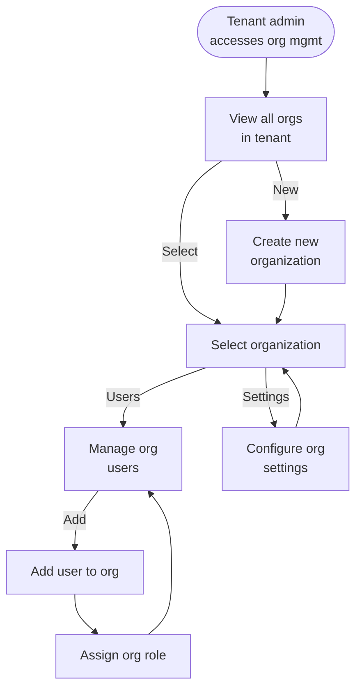
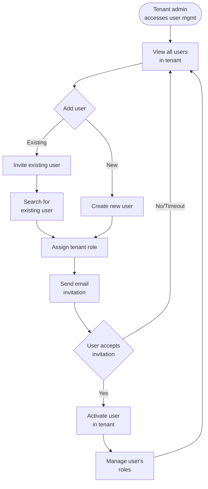
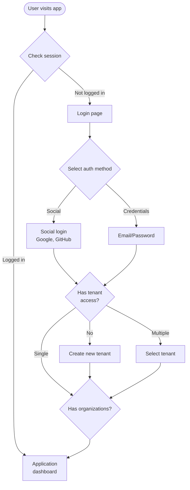

# Authentication & User Management for React/Next.js Applications

When building a modern web application that requires authentication and user management, there are several established solutions that can save you significant development time and improve security. Here's an overview of popular options for React/Next.js applications, followed by a recommendation for your startup context.

## Popular Authentication Solutions

1. **NextAuth.js (Now Auth.js)**
    - **Overview:** Purpose-built for Next.js applications
    - **Features:** OAuth providers, email/password, magic links, JWT sessions
    - **Pros:** Easy integration with Next.js, active community, database-agnostic
    - **Pricing:** Free and open source
    - **Complexity:** Low

2. **Firebase Authentication**
    - **Overview:** Part of Google's Firebase platform
    - **Features:** Email/password, social logins, phone auth, anonymous auth
    - **Pros:** Quick setup, extensive documentation, integrates with Firebase services
    - **Pricing:** Free tier with pay-as-you-grow model
    - **Complexity:** Low

3. **Auth0**
    - **Overview:** Comprehensive identity platform
    - **Features:** Social logins, MFA, SSO, user management, custom domains
    - **Pros:** Enterprise-grade security, extensive customization
    - **Cons:** Can become expensive at scale
    - **Complexity:** Medium

4. **Supabase Auth**
    - **Overview:** Part of the Supabase platform (open-source Firebase alternative)
    - **Features:** Email/password, social logins, row-level security
    - **Pros:** Integrates seamlessly with Supabase database
    - **Pricing:** Free tier with reasonable paid plans
    - **Complexity:** Low

5. **Clerk**
    - **Overview:** User management and authentication platform
    - **Features:** Beautiful pre-built UI components, multi-session support
    - **Pros:** Great developer experience, excellent UX
    - **Pricing:** Free tier with usage-based pricing
    - **Complexity:** Low

6. **Amazon Cognito**
    - **Overview:** AWS's identity service
    - **Features:** User directories, federated identities, access control
    - **Pros:** AWS integration, scalable, compliant
    - **Cons:** Steeper learning curve
    - **Complexity:** High

7. **Custom Solution**
    - **Using:** Passport.js, JWT, bcrypt, etc.
    - **Pros:** Complete control, no vendor lock-in
    - **Cons:** Time-consuming, security concerns
    - **Complexity:** Very high

## Recommendation: NextAuth.js (Auth.js)

For a startup with low overhead requirements, I recommend NextAuth.js (recently renamed to Auth.js) for the following reasons:

- **Perfectly suited for Next.js:** Native integration with your existing stack
- **Zero subscription costs:** Free and open-source
- **Low implementation overhead:** Simple API with excellent documentation
- **Flexible provider system:** Start with basic email/password and add OAuth providers as needed
- **Scalable:** Can handle everything from MVPs to large applications
- **Database adapters:** Works with many databases including Postgres, MySQL, MongoDB

## Organization Management

## User Management

## Auth Workflow

