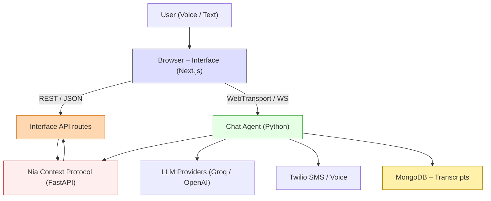

# Nia-Universal – High-Level System Architecture

```mermaid
graph TD
    U["User (Voice / Text)"] --> B["Browser – Interface (Next.js)"]
    B -->|REST / JSON| API["Interface API routes"]
    API --> NCP["Nia Context Protocol (FastAPI)"]
    B -->|WebTransport / WS| AGENT["Chat Agent (Python)"]
    AGENT --> NCP
    AGENT --> LLM["LLM Providers (Groq / OpenAI)"]
    AGENT --> TW["Twilio SMS / Voice"]
    AGENT --> DB["MongoDB – Transcripts"]
    NCP --> API
    style B fill:#DDF,stroke:#333,stroke-width:1px
    style NCP fill:#FEE,stroke:#C33
    style AGENT fill:#E5FFE5,stroke:#393
    style API fill:#FFD8B1,stroke:#C60
    style DB fill:#FFF0AA,stroke:#AA8800
```

> This shows the runtime call pattern from a guest's browser through to the backend micro-services and third-party providers. 