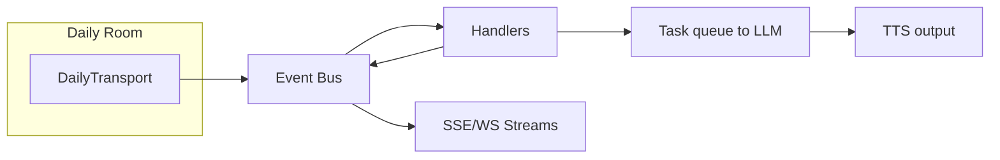
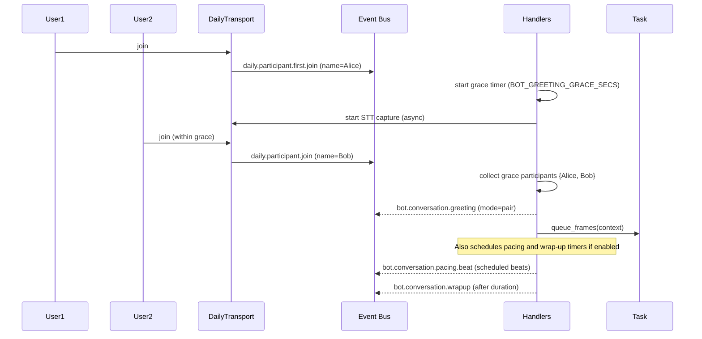

# Pipecat Daily Bot

Real-time AI voice assistant for Daily.co calls, built on the Pipecat pipeline.

## Architecture (high level)

- **Gateway**: `bot_gateway.py` (FastAPI) accepts `/join` requests and pushes them to a Redis queue.
- **Operator**: `bot_operator.py` watches the Redis queue and spawns Kubernetes Jobs for each session.
- **Runner**: `runner_main.py` runs inside the K8s Job, executing the bot logic.
- **Transport**: DailyTransport connects to a Daily.co room for audio in/out.
- **STT/LLM/TTS**: Deepgram STT → OpenAI LLM → configurable TTS provider (ElevenLabs by default, Kokoro/Chorus via `BOT_TTS_PROVIDER`).
- **Event Bus**: Lightweight in-process pub/sub with versioned envelopes used for observability and business logic triggers.
- **Handlers**: Business logic in `bot/handlers.py` subscribes to bus events (greetings, roster deltas, pacing, wrap-up).
- **Config**: Centralized BOT_* defaults with env overrides in `bot/config.py` (runtime getters).

### LLM Options

The bot supports multiple LLM providers via the `BOT_MODEL_SELECTION` environment variable:

| Model | Provider | Speed | Intelligence | Cost/hr | Best For |
|-------|----------|-------|--------------|---------|----------|
| `gpt-4o-mini` | OpenAI | ⚡ Fast (~2-3s) | ⭐⭐⭐ Good | ~$0.40 | Default, cheap, fast |
| `minimax-m2.5` | MiniMax | ⚡ Fast (~2-3s) | ⭐⭐⭐⭐⭐ Excellent | ~$1.00 | **Recommended** - Best quality/speed/cost |
| `llama-4-scout` | Groq | ⚡⚡ Very Fast | ⭐⭐⭐ Good | ~$0.20 | Fastest responses |
| `llama-3.3-70b` | Groq | ⚡ Fast | ⭐⭐⭐⭐ Very Good | ~$0.30 | Good balance |
| `hermes-4-70b` | OpenRouter | ⚡ Fast | ⭐⭐⭐⭐ Very Good | ~$0.50 | Uncensored, creative |

**New: MiniMax M2.5 Integration** - See [MINIMAX_INTEGRATION.md](./MINIMAX_INTEGRATION.md) for setup guide.
- 80.2% SWE-Bench (near-Opus intelligence)
- 100 TPS inference (2x faster than Claude)
- Tool-calling optimized (fewer errors than GPT-4o-mini)
- 8x faster than OpenClaw bridge (~5s vs ~40s)

### Module map

```text
apps/pipecat-daily-bot/
├─ bot/
│  ├─ bot.py                # Session lifecycle, transport hooks, empty-room logic
│  ├─ bot_gateway.py        # API Gateway (FastAPI) - Enqueues requests to Redis
│  ├─ bot_operator.py       # K8s Operator - Watches Redis, spawns Runner Jobs
│  ├─ runner_main.py        # Runner mode entrypoint (executed by K8s Job)
│  ├─ handlers.py           # Business logic handlers (greeting grace, pacing, wrap-up, roster)
│  ├─ config.py             # BOT_* runtime config getters (env overrides)
│  ├─ eventbus/
│  │  ├─ bus.py             # publish/subscribe, streaming fan-out, emit_* helpers
│  │  ├─ events.py          # canonical topic constants + schema version
│  │  └─ __init__.py        # facade re-exports (plus shim: event_handlers.py)
│  ├─ personalities.py      # Persona text for initial system prompt
│  └─ tests/                # Pytest suite
└─ ui/                      # React UI
```

## Eventing system

The bot emits structured events with a versioned envelope. Business logic and external clients can subscribe to react to lifecycle changes.

### Topics (selected)

- daily.call.state
- daily.participant.first.join
- daily.participant.join / daily.participant.leave
- daily.participants.change (snapshot)
- daily.bot.heartbeat
- bot.roster.delta / bot.roster.snapshot (derived)
- bot.conversation.greeting (semantic)
- bot.conversation.pacing.beat (scheduled)
- bot.conversation.wrapup (timer)

### Flow overview



### Greeting grace, pacing, and wrap‑up



## Configuration

Configuration is centralized in `bot/config.py` with runtime getters. Set environment variables to override defaults.

| Variable | Default | Description |
|---|---:|---|
| BOT_GREETING_GRACE_SECS | 5.0 | Window to group early joins for a group/pair/single greeting |
| BOT_PACING_INTERVAL_SECS | 0.0 | Pacing tick period in seconds (0 disables) |
| BOT_PACING_MAX_TICKS | 0 | Max pacing ticks (0 = unlimited) |
| BOT_BEAT_REPEAT_INTERVAL_SECS | 60.0 | Interval between beat repetitions (seconds) |
| BOT_WRAPUP_AFTER_SECS | 0.0 | Soft wrap-up after N seconds from first greeting (0 disables) |
| BOT_WRAPUP_SYSTEM_MESSAGE | friendly wrap-up prompt | System message inserted at wrap-up |
| BOT_EMPTY_INITIAL_SECS | 15.0 | Cancel session if nobody joins within this window |
| BOT_EMPTY_POST_LEAVE_SECS | 5.0 | Delay before shutdown after last participant leaves |
| BOT_EMPTY_RECONCILE_INTERVAL_SECS | 10.0 | Participant reconcile probe interval |
| BOT_PARTICIPANT_POLL_ENABLED | true | Enable participant polling reconciliation |
| BOT_HEARTBEAT_INTERVAL_SECS | 10.0 | Heartbeat write interval (seconds) |
| BOT_HEARTBEAT_DIR | /tmp/pipecat-bot-heartbeats | Directory for heartbeat files |

Other required API keys: OPENAI_API_KEY, DEEPGRAM_API_KEY, and whichever TTS provider credentials you enable:

- **ElevenLabs** (default): `ELEVENLABS_API_KEY` and optional `ELEVENLABS_VOICE_ID`
- **Kokoro/Chorus**: set `BOT_TTS_PROVIDER=kokoro` and provide `KOKORO_TTS_API_KEY`, `KOKORO_TTS_BASE_URL`, and `KOKORO_TTS_VOICE_ID`

See the section below for the full list of Kokoro overrides.

### TTS Providers & Environment Variables

| Provider | Env setup | Notes |
|----------|-----------|-------|
| ElevenLabs (default) | No change required. Optionally override voice with `ELEVENLABS_VOICE_ID`. | `BOT_TTS_PROVIDER` defaults to `elevenlabs` if unset. |
| Kokoro/Chorus | Set `BOT_TTS_PROVIDER=kokoro` and provide: `KOKORO_TTS_API_KEY`, `KOKORO_TTS_BASE_URL`, `KOKORO_TTS_VOICE_ID`. Optional tunables: `KOKORO_TTS_SAMPLE_RATE`, `KOKORO_TTS_AUTO_MODE`, `KOKORO_TTS_TRY_TRIGGER_GENERATION`, `KOKORO_TTS_ENABLE_SSML_PARSING`, `KOKORO_TTS_INACTIVITY_TIMEOUT`, `KOKORO_TTS_CHUNK_SCHEDULE`. | Dashboard voice configuration now passes the Kokoro voice automatically when selected. |

## Conversation Beats

Conversation beats allow you to schedule specific messages to be sent at predetermined times during a conversation. This is useful for:

- **Structured conversations**: Guide the conversation through specific topics at set intervals
- **Time-based prompts**: Remind participants of time limits or agenda items
- **Progressive disclosure**: Reveal information gradually over time
- **Meeting facilitation**: Keep discussions on track with periodic check-ins

### Configuration

Beats are configured in the personality record through the dashboard:

```json
{
  "beats": [
    {
      "message": "Let's move on to the next topic",
      "start_time": 300
    },
    {
      "message": "We have 5 minutes remaining",
      "start_time": 600
    }
  ]
}
```

### Beat Event Flow

1. **Scheduling**: When the first greeting is emitted, all beats from the personality are scheduled
2. **Initial Trigger**: Each beat triggers after `start_time` seconds from the call start
3. **Repeating**: The beat message is reintroduced every `BOT_BEAT_REPEAT_INTERVAL_SECS` (default: 60 seconds)
4. **Transition**: A beat stops repeating when the next beat's start time is reached
5. **Message Injection**: Each beat emission adds the message to the conversation as a system message

### Beat Event Payload

```json
{
  "room": "room-url",
  "message": "Let's move on to the next topic",
  "start_time": 300,
  "elapsed": 300.5,
  "repeat_count": 0
}
```

**Payload Fields:**
- `room`: The room URL where the beat was triggered
- `message`: The beat message content
- `start_time`: The original start time for this beat (seconds from call start)
- `elapsed`: Time elapsed since call start when this beat was emitted
- `repeat_count`: Number of times this beat has been repeated (0 = first emission)

### Best Practices

- **Timing**: Use reasonable intervals (e.g., 60-300 seconds) to avoid overwhelming participants
- **Messages**: Keep beat messages concise and actionable
- **Ordering**: Beats are processed in the order they appear in the array
- **Validation**: Invalid beats (empty messages, negative times) are automatically filtered out
- **Repeat Interval**: Adjust `BOT_BEAT_REPEAT_INTERVAL_SECS` based on conversation length and participant engagement
- **Transition Planning**: Ensure sufficient time between beats to allow for natural conversation flow

## Running and testing

Bot + UI (legacy server mode):

```bash
npm run start:all
```

Run tests (pytest via npm):

```bash
cd apps/pipecat-daily-bot
npm test
```

Direct pytest (optional):

```bash
cd apps/pipecat-daily-bot/bot
poetry install
poetry run pytest -q
```

## Build

UI build (example):

```bash
npm run build:ui
```

Docker images:

```bash
# Gateway mode
docker build -f apps/pipecat-daily-bot/Dockerfile -t pipecat-bot:gateway --build-arg MODE=gateway .
docker run -e OPENAI_API_KEY=... -e DEEPGRAM_API_KEY=... -p 4444:4444 pipecat-bot:gateway

# Runner mode (experimental)
docker build -f apps/pipecat-daily-bot/Dockerfile -t pipecat-bot:runner --build-arg MODE=runner .
docker run -e OPENAI_API_KEY=... -e DEEPGRAM_API_KEY=... -p 7860:7860 pipecat-bot:runner
```

## Deployment

- Server mode exposes a control API (join/leave) typically used by an external orchestrator.
- Runner mode manages per-session tasks with a lightweight API.
- Provide OPENAI/DEEPGRAM/ELEVENLABS keys and DAILY credentials via env or a secret manager.
- Health endpoints (runner/server) allow basic readiness checks.

## Observability

- Event bus logs envelopes when `BOT_EVENT_BUS=log` (default). SSE/WS streaming is available via the bus streaming generator for UI dashboards.
- Derived roster and semantic greeting events are published for external consumers.

## Notes

- Handlers live in `bot/handlers.py`. A shim at `bot/eventbus/event_handlers.py` preserves legacy imports.
- Config uses runtime getters so tests can override values via env during execution.
