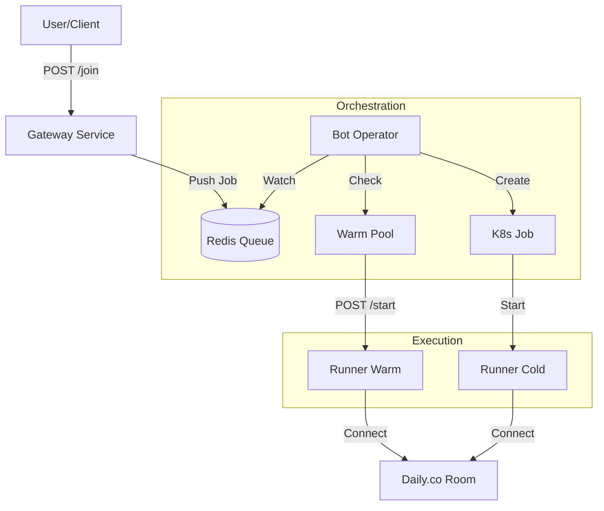
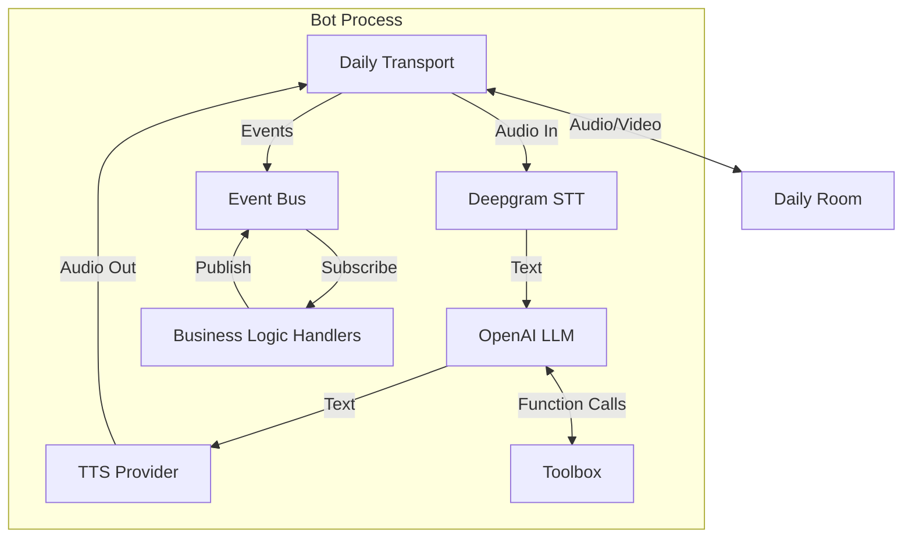
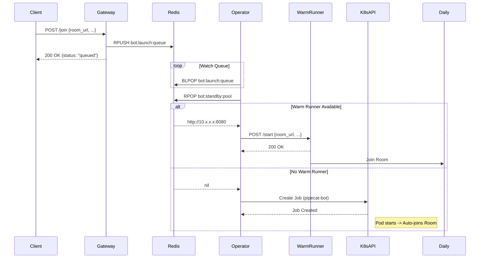
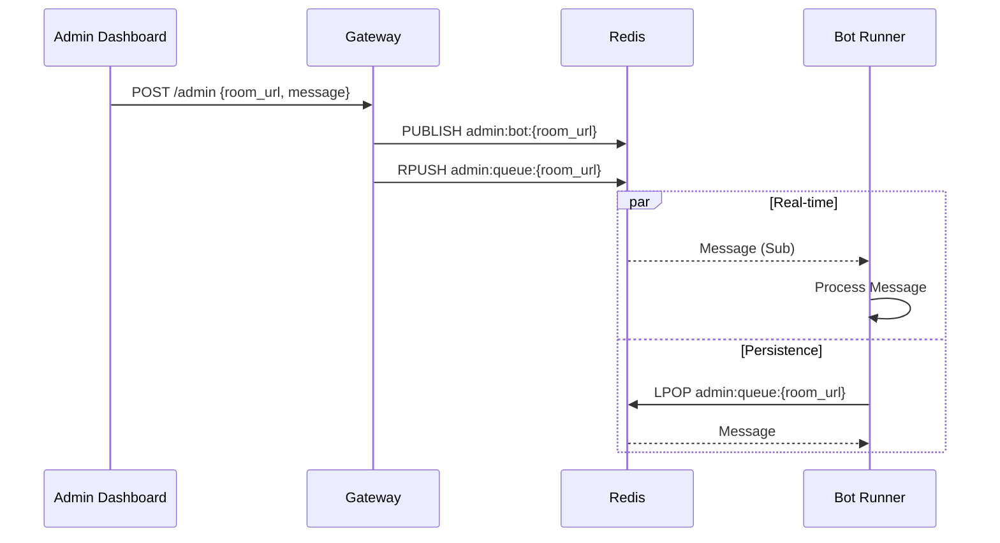

# Architecture Diagrams

## 1. System Architecture (Kubernetes)

The Pipecat Bot system is designed as a distributed, scalable architecture running on Kubernetes. It separates the API gateway, orchestration logic, and bot execution into distinct components.



### Components

1. **Gateway Service (`gateway.py`)**
   * **Role**: Entry point for all bot requests.
   * **Port**: 4444
   * **Responsibility**: Validates `/join` requests and pushes them to the Redis `bot:launch:queue`. It does *not* start bots directly.
   * **Scaling**: Stateless, can be horizontally scaled.

2. **Redis Queue**
   * **Role**: Decouples the API from the heavy lifting of bot provisioning.
   * **Key**: `bot:launch:queue`

3. **Bot Operator (`bot_operator.py`)**
   * **Role**: Orchestrator.
   * **Responsibility**:
     * Watches the Redis queue.
     * **Warm Path**: Checks the `bot:standby:pool` (Redis) for available warm runners. If found, dispatches the job via HTTP `POST /start` to the runner.
     * **Cold Path**: If no warm runner is available, uses the Kubernetes API to spawn a new `Job` running the bot image.

4. **Warm Pool (`07-warm-pool.yaml`)**
   * **Role**: Low-latency standby runners.
   * **Configuration**: Deployment of runners with `RUNNER_AUTO_START=0`.
   * **Behavior**: On startup, they register their IP/URL to the `bot:standby:pool` in Redis and wait for a `/start` request.

5. **Runner (`runner_main.py`)**
   * **Role**: The actual bot execution unit.
   * **Modes**:
     * **Standby**: Registers to pool, waits for HTTP command.
     * **Auto-start**: Starts the bot pipeline immediately (used by Cold Start Jobs).
   * **Pipeline**: Initializes Daily transport, STT, LLM, TTS, and connects to the room.

---

## 2. Bot Internal Architecture

Inside the `Runner` process, the bot is organized into a modular pipeline.



### Key Modules

*   **`bot.py`**: Core logic, pipeline assembly.
*   **`eventbus/`**: In-process pub/sub system for decoupling components.
*   **`handlers.py`**: Business logic (greetings, pacing, roster management) that reacts to events.
*   **`tools/` & `actions/`**: Functional capabilities exposed to the LLM (Notes, HTML generation, etc.).

---

## 3. Request Flow (Detailed)




---

## Tool Execution Flow

```
1. User speaks: "Create a note called Meeting"
   │
   ▼
2. Speech → Text (Deepgram)
   │
   ▼
3. Text → LLM (OpenAI)
   │
   ▼
4. LLM sees tool schemas from toolbox
   │
   ├─> bot_create_note(title="Meeting", content="", ...)
   │
   ▼
5. Pipecat routes to handler
   │
   └─> tools/notes_tools.py::bot_create_note()
       │
       ├─> Extract parameters
       ├─> Get room context (tenant_id, user_id)
       │
       ▼
       └─> Call actions/notes_actions.py::create_note()
           │
           ├─> Validate inputs
           ├─> Format data
           │
           ▼
           └─> Call mesh_client.execute_mutation()
               │
               ├─> Build GraphQL mutation
               ├─> Send to Mesh API
               │
               ▼
               └─> Mesh creates note in DB
                   │
                   ▼
                   Return note data
   │
   ▼
6. Handler emits event
   │
   └─> forwarder.emit_tool_event(events.NOTE_CREATED, {...})
       │
       ▼
7. Interface receives event
   │
   └─> niaEventRouter routes to handler
       │
       ▼
8. UI updates (note appears in notes view)
   │
   ▼
9. Bot responds: "I've created your meeting note"
```

---

## 4. Admin Workflow

The system supports sending administrative commands (e.g., "update prompts", "reload context") to running bots via the Gateway.



### Message Flow

1. **Dashboard** sends a `POST /admin` request to the Gateway with the target `room_url` and the message payload.
2. **Gateway** publishes the message to a Redis channel (`admin:bot:{room_url}`) for real-time delivery.
3. **Gateway** also pushes the message to a Redis list (`admin:queue:{room_url}`) for reliability (in case the bot is temporarily disconnected).
4. **Bot Runner** (subscribing to the Redis channel) receives the message and processes it via `handlers.py`.

---

## Event System Architecture

```
┌─────────────────────────────────────────────────────────────────────┐
│                        BOT SIDE (Python)                            │
└─────────────────────────────────────────────────────────────────────┘

Tool Handler
   │
   ├─> Perform action (create note, open app, etc.)
   │
   ▼
await forwarder.emit_tool_event(
    events.NOTE_CREATED,  ← Defined in bot/events.py
    {
        "note_id": "note-123",
        "title": "Meeting",
        "content": "..."
    }
)
   │
   ▼
AppMessageForwarder
   │
   └─> Format event:
       {
           "type": "note.created",
           "data": {...}
       }
   │
   ▼
Send via Daily transport
   │
   │
   ▼
   WebSocket


┌─────────────────────────────────────────────────────────────────────┐
│                    FRONTEND SIDE (TypeScript)                       │
└─────────────────────────────────────────────────────────────────────┘

   WebSocket
   │
   ▼
Daily SDK receives message
   │
   ▼
SpeechContext listener
   │
   └─> Detect event type: "note.created"
       │
       ▼
       Call niaEventRouter.routeNiaEvent(event, context)
           │
           ├─> Switch on event.type
           │
           └─> case 'note.created':
               │
               └─> handleNoteCreated(event.data, context)
                   │
                   ├─> Update notes state
                   ├─> Refresh notes view
                   └─> Show notification
```

---

## Testing Architecture

```
┌─────────────────────────────────────────────────────────────────────┐
│                          TEST LAYERS                                │
└─────────────────────────────────────────────────────────────────────┘

Unit Tests
   │
   ├─> Actions layer (pure Python functions)
   │   │
   │   ├─> Mock mesh_client
   │   ├─> Test business logic
   │   └─> Fast execution
   │
   └─> Individual tool functions
       │
       ├─> Mock dependencies
       └─> Test input/output


Integration Tests
   │
   ├─> Tool + Action + Mesh interaction
   │   │
   │   ├─> Mock mesh API responses
   │   ├─> Verify full flow
   │   └─> Test error handling
   │
   └─> Toolbox schema/handler collection
       │
       ├─> Import all modules
       ├─> Verify schema counts
       └─> Verify handler signatures


End-to-End Tests
   │
   └─> Complete user workflows
       │
       ├─> Real mesh server (test mode)
       ├─> Real event routing
       └─> Integration across stack


┌─────────────────────────────────────────────────────────────────────┐
│                      SHARED TEST FIXTURES                           │
│                      (tests/conftest.py)                            │
└─────────────────────────────────────────────────────────────────────┘

@pytest.fixture
def mock_mesh_client():
    """Mock GraphQL client with preset responses"""
    client = MagicMock()
    client.execute_query = AsyncMock()
    client.execute_mutation = AsyncMock()
    return client

@pytest.fixture
def mock_forwarder():
    """Mock event forwarder"""
    forwarder = MagicMock()
    forwarder.emit_tool_event = AsyncMock()
    return {"instance": forwarder}

@pytest.fixture
def mock_result_callback():
    """Mock Pipecat result callback"""
    return AsyncMock()
```

---

## Deployment Architecture

```
┌─────────────────────────────────────────────────────────────────────┐
│                        PRODUCTION STACK                             │
└─────────────────────────────────────────────────────────────────────┘

┌─────────────────┐
│   Load Balancer │
└────────┬────────┘
         │
         ├─────────────────────┬─────────────────────┐
         ▼                     ▼                     ▼
┌──────────────────┐  ┌──────────────────┐  ┌──────────────────┐
│  Next.js Server  │  │  Next.js Server  │  │  Next.js Server  │
│                  │  │                  │  │                  │
│  - Dashboard     │  │  - Dashboard     │  │  - Dashboard     │
│  - Interface     │  │  - Interface     │  │  - Interface     │
└────────┬─────────┘  └────────┬─────────┘  └────────┬─────────┘
         │                     │                     │
         └─────────────────────┴─────────────────────┘
                              │
                              ▼
                    ┌──────────────────┐
                    │   Mesh API       │
                    │   (GraphQL)      │
                    └────────┬─────────┘
                             │
                             ▼
                    ┌──────────────────┐
                    │   PostgreSQL     │
                    │   Database       │
                    │                  │
                    │  - Notes         │
                    │  - HTML Applets  │
                    │  - User Profiles │
                    │  - Functional    │
                    │    Prompts       │
                    └──────────────────┘


         ┌─────────────────────────────────────┐
         │    Pipecat Bot Instances            │
         │    (1 per active call)              │
         └─────────────────────────────────────┘

┌──────────────────┐  ┌──────────────────┐  ┌──────────────────┐
│  Bot Instance 1  │  │  Bot Instance 2  │  │  Bot Instance 3  │
│                  │  │                  │  │                  │
│  room: room-a    │  │  room: room-b    │  │  room: room-c    │
│  tenant: ten-1   │  │  tenant: ten-2   │  │  tenant: ten-1   │
│                  │  │                  │  │                  │
│  - Loads own     │  │  - Loads own     │  │  - Loads own     │
│    prompts       │  │    prompts       │  │    prompts       │
│  - Manages state │  │  - Manages state │  │  - Manages state │
└────────┬─────────┘  └────────┬─────────┘  └────────┬─────────┘
         │                     │                     │
         └─────────────────────┴─────────────────────┘
                               │
                               ▼
                     ┌──────────────────┐
                     │   Mesh API       │
                     │   (GraphQL)      │
                     └──────────────────┘
```

---

## Migration Path

```
┌─────────────────────────────────────────────────────────────────────┐
│                    CURRENT STATE (staging)                          │
└─────────────────────────────────────────────────────────────────────┘

bot/
├── bot.py (monolithic, ~800 lines)
│   ├── Tool definitions inline
│   ├── Handler implementations
│   └── Business logic mixed
│
├── notes_tools.py (566 lines)
│   └── Note tools only
│
└── mesh_client.py (large)
    └── All API communication


┌─────────────────────────────────────────────────────────────────────┐
│               NEW STATE (staging-functional-tools)                  │
└─────────────────────────────────────────────────────────────────────┘

bot/
├── bot.py (~550 lines, simplified)
│   ├── Pipeline setup only
│   ├── Event coordination
│   └── State management
│
├── toolbox.py (343 lines, NEW)
│   └── Tool orchestration
│
├── tools/ (NEW)
│   ├── notes_tools.py (1,557 lines)
│   ├── view_tools.py (392 lines)
│   ├── html_tools.py (455 lines)
│   ├── youtube_tools.py (336 lines)
│   ├── profile_tools.py (278 lines)
│   ├── window_tools.py (225 lines)
│   └── misc_tools.py (261 lines)
│
├── actions/ (NEW)
│   ├── notes_actions.py (449 lines)
│   ├── html_actions.py (333 lines)
│   ├── profile_actions.py (197 lines)
│   ├── personality_actions.py (110 lines)
│   ├── functional_prompt_actions.py (128 lines)
│   └── search_actions.py (64 lines)
│
└── mesh_client.py (smaller)
    └── GraphQL only


┌─────────────────────────────────────────────────────────────────────┐
│                       MIGRATION STEPS                               │
└─────────────────────────────────────────────────────────────────────┘

1. ✅ Create new structure (tools/, actions/)
2. ✅ Move code from bot.py to modules
3. ✅ Implement toolbox orchestration
4. ✅ Write comprehensive tests
5. ✅ Fix circular imports
6. ✅ Standardize logging
7. ⏳ Performance testing
8. ⏳ Staging deployment
9. ⏳ Production rollout
```

---

**Last Updated:** October 23, 2025  
**Branch:** `staging-functional-tools`  
**Status:** Ready for Review
