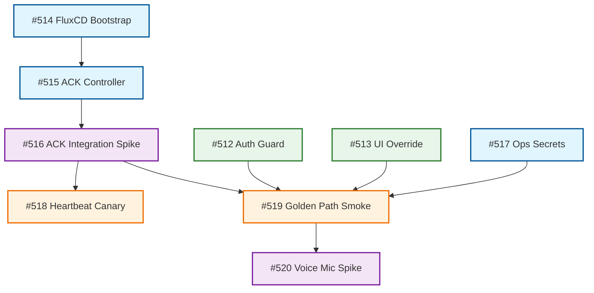

# CloudWatch Synthetics & UX Reliability Architecture
> **Status:** Active Plan  
> **Date:** December 19, 2025  
> **Objective:** Establish "User-Flow First" monitoring for Nia Universal using AWS CloudWatch Synthetics managed via FluxCD (GitOps).

---

## 1. Executive Summary

We are shifting from simple endpoint health checks to **Synthetic User Monitoring**. We will deploy headless browsers (Puppeteer) that log in, navigate, and interact with the application just like real users. 

Because the production application relies heavily on **Voice Commands** and **Google OAuth** (which are hostile to automation), we must implement specific "Backdoor" strategies to make testing reliable without compromising security.

### Execution Tracking
Work is tracked in the following GitHub Issues:
*   **Phase 1 (Codebase):** [#512](https://github.com/NiaExperience/nia-universal/issues/512), [#513](https://github.com/NiaExperience/nia-universal/issues/513)
*   **Phase 2 (Infra):** [#514](https://github.com/NiaExperience/nia-universal/issues/514), [#515](https://github.com/NiaExperience/nia-universal/issues/515), [#516](https://github.com/NiaExperience/nia-universal/issues/516)
*   **Phase 3 (Synthetics):** [#517](https://github.com/NiaExperience/nia-universal/issues/517), [#518](https://github.com/NiaExperience/nia-universal/issues/518), [#519](https://github.com/NiaExperience/nia-universal/issues/519)
*   **Phase 4 (Advanced Voice):** [#520](https://github.com/NiaExperience/nia-universal/issues/520)

---

## 2. Dependency Graph (DAG)



---

## 3. The Core Challenges & Solutions

### A. Authentication Lockout
**The Problem:** Production (`pearlos.org`) allows *only* Google OAuth. Password login is visually hidden for the `pearlos` assistant. CloudWatch Synthetics cannot reliably automate 2FA/Google Login flows.  
**The Solution:** "UI Override + API Allowlist"
1.  **API Guard (Security) - #512:** Modify `authOptions.ts` to check an env var `ALLOWED_PASSWORD_LOGIN_EMAILS`. If set, password login is strictly denied for everyone *except* the specific synthetic user email.
2.  **UI Override (Access) - #513:** Modify `LoginForm.tsx` to accept a URL parameter `?show_password=1`. This forces the password form to render even if the assistant configuration normally hides it.
3.  **Trigger:** Canaries visit `https://pearlos.org/login?show_password=1`, enabling them to enter credentials. Real users finding this URL will still be blocked by the API Guard.

### B. The "Voice Gap"
**The Problem:** The app is voice-first. Puppeteer cannot "speak" to the microphone easily. Testing only the visual UI misses the critical `STT -> LLM -> Tool` pipeline.  
**The Solution:** Hybrid Testing Strategy.
1.  **Fast (Smoke) - #519:** Simulate internal events (`window.dispatchEvent`) to prove the UI responds to commands (e.g., "Open Notes").
2.  **Deep (E2E) - #520:** Inject a "Virtual Microphone" shim that feeds pre-recorded `.wav` files into the browser's audio stream, proving the bot can *hear* and *act*.

---

## 4. Exhaustive Action Catalog (Synthetics Capability)

The following actions discovered in `browser-window.tsx` and the Pipecat bot toolset will be targetable by canaries:

### A. Window & Desktop Management
*   **Layout:** `minimize`, `maximize`, `restore`, `snapLeft`, `snapRight`, `reset`.
*   **Modes:** `home`, `work`, `quiet`, `create` (triggers background/theme transitions).

### B. Application Lifecycles
*   **Launch/Close:** `gmail`, `googleDrive`, `calculator`, `notes`, `terminal`, `youtube`, `creation-engine`.
*   **Browsers:** `miniBrowser` (simple proxy), `enhancedBrowser` (full URL support).

### C. Feature-Specific Deep Flows
*   **Notes (Full CRUD):** `createNote`, `deleteNote`, `saveNote`, `downloadNote`, `writeContent`, `addContent`, `updateNoteTitle`, `openNote`, `switchOrganisationMode` (Personal vs Work).
*   **YouTube:** `search`, `play`, `pause`, `next`.
*   **Creation Engine:** `htmlGenerationRequested`, `htmlModificationRequested`, `htmlRollbackRequested`, `appletShareOpen`.

---

## 5. Technical Implementation Details

### FluxCD Bootstrap (#514)
We manage the `infra/` folder using Flux.
```bash
flux bootstrap github \
  --owner=NiaExperience \
  --repository=nia-universal \
  --branch=main \
  --path=infra/clusters/production \
  --personal
```

### Virtual Microphone Shim (#520)
To test voice without hardware, we overwrite the browser's media API at runtime within the Canary script:

```javascript
// Puppeteer Runtime Injection
await page.evaluate(() => {
  window.virtualMic = {
    audioContext: new AudioContext(),
    destination: null,
    playAudio: async (base64Wav) => {
      const buffer = await window.virtualMic.audioContext.decodeAudioData(
        Uint8Array.from(atob(base64Wav), c => c.charCodeAt(0)).buffer
      );
      const source = window.virtualMic.audioContext.createBufferSource();
      source.buffer = buffer;
      source.connect(window.virtualMic.destination);
      source.start();
    },
    getUserMedia: async () => {
      window.virtualMic.destination = window.virtualMic.audioContext.createMediaStreamDestination();
      return window.virtualMic.destination.stream;
    }
  };
  navigator.mediaDevices.getUserMedia = window.virtualMic.getUserMedia;
});
```

---

## 6. Implementation Checklist & Status

### Phase 1: Foundations
- [ ] **#512 Code (API):** Implement `ALLOWED_PASSWORD_LOGIN_EMAILS` check in `authOptions.ts`.
- [ ] **#513 Code (UI):** Update `LoginForm.tsx` to show password form if `?show_password=1` is present.

### Phase 2: Infrastructure
- [ ] **#514 GitOps:** Initialize **FluxCD** on the cluster.
- [ ] **#515 AWS Controller:** Install **ACK CloudWatch Controller** via Flux.
- [ ] **#516 Spike:** Prototype a "Hello World" ACK Canary to verify mechanism.

### Phase 3: Smoke Testing
- [ ] **#517 Ops:** Create `canary-user@pearlos.org` and encrypt secrets.
- [ ] **#518 Heartbeat:** Implement `api-heartbeat.yaml`.
- [ ] **#519 Smoke:** Implement `ui-golden-path.yaml` (Login -> Event Dispatch -> Note).

### Phase 4: Advanced Voice
- [ ] **#520 Voice Spike:** Prototype `prototype-voice.js` with Virtual Mic injection.

---

## 7. Risks & Mitigations

1.  **Dashboard Access:** Does `ALLOWED_PASSWORD_LOGIN_EMAILS` negatively impact Dashboard admins? *Mitigation: Add them to the list.*
2.  **WAF/Bot Protection:** Will AWS IP addresses be blocked? *Mitigation: Allow-list AWS Synthetics Service Quotas/IPs.*
3.  **Cost:** Voice E2E tests consume real credits (Deepgram/Anthropic). *Mitigation: Lower frequency (hourly vs minutely).*
