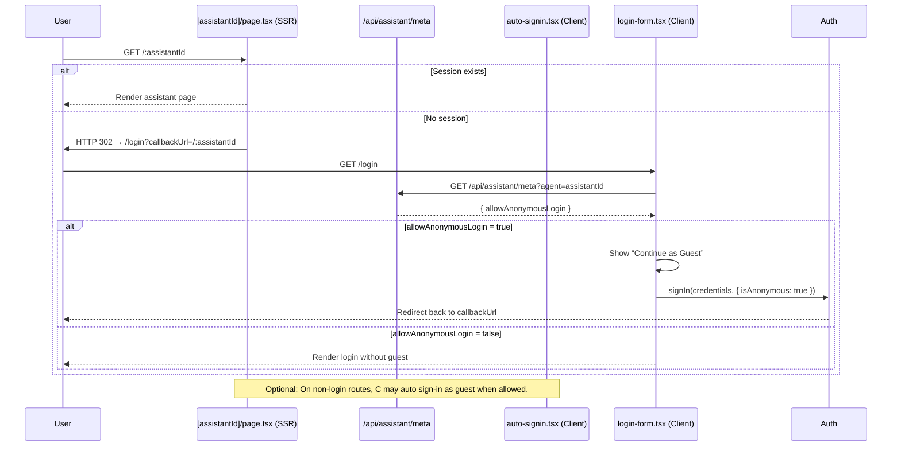

# Assistant-level Anonymous Login Control — Focus Doc

Date: 2025-09-15

Owner: Platform Interface + Dashboard

Status: Implemented

Note: This document was previously an implementation plan. The behavior is now implemented in Dashboard (authoring), Features package (shared gating), and Interface (SSR/UI). This document reflects the current behavior and configuration.

## Summary

Add a boolean flag on the Assistant record, authored in the Dashboard Assistant panel’s “Advanced” tab, to control anonymous login behavior in the Interface. When a user visits an assistant route (e.g., /[assistantId] or /assistantName), we read this flag and either allow a guest session path (if enabled) or force the login page (if disabled or missing). If a valid session exists, proceed as normal. When disabled/missing, the login screen must not display “Continue as Guest.”

Additionally, add an Access / Features section to the Dashboard’s Advanced tab to configure feature availability per Assistant via a checkbox grid driven by the shared feature registry. Persist the selected features to the Assistant as `supportedFeatures: FeatureKey[]`. At runtime, feature gating consults `supportedFeatures` first; if present, only listed features are considered enabled (subject to environment flags); if absent, we fall back to environment-driven feature flags.

Defaults and compatibility: The database/schema default is false; existing assistants remain “no anonymous login” unless explicitly enabled. See the “Notes” section for the current Interface meta endpoint default behavior.

## Requirements

- Add Assistant boolean field: allowAnonymousLogin (default false).
- Add Assistant string array: supportedFeatures (FeatureKey[], optional). Semantics:
  - If absent/empty: fall back to environment-based feature flags.
  - If present: a feature is enabled only if it appears in `supportedFeatures` AND the environment-based flag evaluates to enabled; if not present in the list, it is treated as disabled.
- Dashboard Advanced tab: toggle to author this field; persisted to assistant record.
- Dashboard Advanced tab: new Access / Features section (above Privacy Configuration) containing:
  - The allowAnonymousLogin toggle.
  - A 3-column checkbox grid of all features from the shared registry, sorted alphabetically by canonical key. Selecting saves to `supportedFeatures`.
- Refactor feature flags to a new shared package `packages/features` so both Interface and Dashboard consume the same keys/registry.
- Interface routing:
  - If session exists: proceed to assistant.
  - If no session: redirect to login. The login form decides whether to show a “Continue as Guest” button based on the assistant’s `allowAnonymousLogin` setting.
- Maintain backwards compatibility (missing => false in schema/storage).
- Tests: targeted unit/integration (console-only) to cover flows and UI.

## Contracts (tiny)

- Input: Request to assistant route with path param ([assistantId] | assistantName), current session (may be absent).
- Output: One of: existing session continues; guest path is offered and optionally used; or redirect/render login without guest option.
- Error modes: Assistant not found (existing behavior), auth provider failures (existing logic), missing flag treated as false at schema level.
- Success criteria: Behavior matches flag; no guest option when disabled; existing sessions unaffected.

## Governance alignment

- Plans-first, tests, and quality gates per docs/ai-assistant-protocol.md and .github/instructions/copilot.instructions.md.
- No secrets/PII in logs; do not emit sensitive fields; sanitize logs.
- Keep boundaries: Prism as data contract; Dashboard authoring; Interface experience shell; no cross-layer leaks.

## Architecture and data model changes

- Prism — source of truth
  - Assistant block includes:
    - Interface: `allowAnonymousLogin?: boolean` on `IAssistant`.
    - Schema: `allowAnonymousLogin: z.boolean().default(false)` in `AssistantSchema`.
    - Interface: `supportedFeatures?: FeatureKey[]` on `IAssistant`.
    - Schema: `supportedFeatures: z.array(z.enum(FeatureKeys)).optional()`.
  - Platform definitions (jsonSchema):
    - `packages/prism/src/core/platform-definitions/Assistant.definition.ts` adds `allowAnonymousLogin` to `jsonSchema.properties` with `type: 'boolean'`, `default: false` and description.
    - Adds `supportedFeatures` as an array of strings (enum FeatureKey values), optional.
  - Assistant create/update/clone persist these fields.

- Shared Features package
  - `packages/features` exports:
    - `FeatureKey` union and canonical list.
    - `isFeatureEnabled(key, supportedFeatures?)` which applies Assistant-level precedence over environment flags.
  - Consumers: Interface and Dashboard import from `@nia/features`.

## Interface (runtime behavior)

- Server component gate (SSR): `apps/interface/src/app/[assistantId]/page.tsx`
  - Always tries to resolve the current session. If no session is found, it redirects to `/login?callbackUrl=/:assistantId`.
  - If a session exists and the user is anonymous, but the assistant’s `allowAnonymousLogin` is false, it redirects to `/login?...&noguest=1` to force full auth for that assistant.

- Public metadata endpoint for UI decisions: `apps/interface/src/app/api/assistant/meta/route.ts`
  - Input: `agent` query param (assistant subDomain).
  - Output: `{ name, subDomain, allowAnonymousLogin, supportedFeatures }` — used client-side to decide whether to show guest login.

- Client-side helpers
  - `apps/interface/src/components/login-form.tsx`
    - Parses `callbackUrl` to infer assistant; fetches `/api/assistant/meta` to determine `allowAnonymousLogin` and conditionally renders the “Continue as Guest” button.
    - Respects `noguest=1` query param to forcibly hide the guest option (e.g., when SSR rejected anonymous for that assistant).
    - On click of “Continue as Guest,” calls `signIn('credentials', { isAnonymous: true })` and navigates back to `callbackUrl`.
  - `apps/interface/src/components/auto-signin.tsx`
    - Optional enhancement: when not on `/login` and no session is present, fetches `/api/assistant/meta` and automatically initiates a guest sign-in if allowed. It does nothing on the `/login` route.

- Feature gating
  - Use `isFeatureEnabled(key, assistant.supportedFeatures)` throughout Interface components to apply assistant-level gating before environment flags.

## Tangential UX tweak: Resend Invite visibility

- Only show the "Resend Invite" button on the Interface login screen when the page is being visited via an invite flow (i.e., an invitation token is present in the URL query, e.g., `?token=...` or `?inviteToken=...`).
- Implementation: In `apps/interface/src/components/login-form.tsx`, read `useSearchParams()` and conditionally render the button.
- Tests:
  - Login form without token: no "Resend Invite" button.
  - Login form with token: button renders and calls `/api/users/resend-invite` when clicked.
- Accessibility: The button remains keyboard-focusable only when rendered.

## Security & privacy

- Do not log PII or assistant identifiers in plaintext; redact or remove in debug logs.
- No new events in this change; if later emitting auth-related events, add descriptors with piiLevel and redaction.

## Tests (minimum)

- Prism (unit):
  - Assistant schema includes `allowAnonymousLogin` default false; create/update/clone preserve field.
  - Assistant schema supports `supportedFeatures` constrained to FeatureKey enum; create/update/clone round-trip values; missing/undefined is allowed.
- Dashboard (component/integration):
  - Advanced tab toggle roundtrips value (save → reload shows correct state).
  - Access / Features section renders 3-column grid, sorted; selections persist to `supportedFeatures`.
- Interface (unit/integration):
  - Visiting `/:assistantId` without a session redirects to `/login`.
  - Login page shows “Continue as Guest” only when `/api/assistant/meta` for that assistant returns `allowAnonymousLogin: true` and no `noguest=1` flag is present.
  - `/:assistantId` with an anonymous session AND assistant disallowing anonymous redirects to `/login?...&noguest=1`.
  - Login form without token: no "Resend Invite" button; with token: button renders and calls resend endpoint.
  - Feature gating precedence:
    - When `supportedFeatures` is present and excludes a key: feature is disabled even if env enables it.
    - When `supportedFeatures` includes a key but env disables it: feature is disabled.
    - When `supportedFeatures` is absent: reflects env flag state.
- Features package (unit):
  - Environment evaluation respects DISABLE_PATTERN and defaults; registry exposes canonical keys.

Note: Keep tests targeted; use console-only Jest; do not append `--workspaces`.

## Impacted files/components

Prism

- packages/prism/src/core/blocks/assistant.block.ts — `allowAnonymousLogin` and `supportedFeatures` on interface/schema.
- packages/prism/src/core/platform-definitions/Assistant.definition.ts — jsonSchema: `allowAnonymousLogin` (boolean, default false), `supportedFeatures` (string[] enum).
- packages/prism/src/core/actions/assistant-actions.ts — persist on create/update/clone.

Dashboard

- apps/dashboard/src/components/assistant-advanced-tab.tsx — toggle UI; bind to form.
- apps/dashboard/src/app/api/assistant/update/route.ts — include field.

Interface

- apps/interface/src/app/[assistantId]/page.tsx — SSR session check; anonymous disallow redirect with `noguest=1`.
- apps/interface/src/app/api/assistant/meta/route.ts — public metadata exposing `allowAnonymousLogin` and `supportedFeatures`.
- apps/interface/src/components/auto-signin.tsx — optional automatic anonymous sign-in when allowed.
- apps/interface/src/components/login-form.tsx — conditional guest UI; invite resend visibility.

Shared package

- packages/features — shared feature registry and gating helpers (`@nia/features`).

## Sequence: anonymous visit with per-assistant gating

## Notes

- Schema default vs meta endpoint default: While the schema default for `allowAnonymousLogin` is false, the Interface meta endpoint (`/api/assistant/meta`) currently returns `allowAnonymousLogin: true` when the property is absent. SSR enforcement treats absence as false (`assistantRecord?.allowAnonymousLogin === true`). The discrepancy is benign in practice but should be aligned in a follow-up for consistency (prefer default=false end-to-end).

## Rollout

- Default-off ensures no behavioral change until toggled per assistant.
- Documentation: Update admin docs/help text to clarify behavior.

## Assumptions

- Assistant can be resolved for a given route via existing `getAssistant.ts` logic.
- Existing anonymous sign-in flow is already wired via NextAuth; this change only gates when it’s invoked.
- `supportedFeatures` absence means environment-only feature gating; presence means intersection of environment flag and inclusion in the list.

## Risks & mitigations

- Middleware complexity/latency (if introduced): avoid by performing decision in SSR/page.
- Tests assuming anonymous is available: update fixtures to explicitly enable `allowAnonymousLogin` when needed.

## Acceptance criteria

- Visiting assistant with no session redirects to login.
- Login page offers guest only when assistant allows it; is hidden when disallowed or `noguest=1` is present.
- Anonymous sessions are rejected server-side when visiting assistants that disallow them.
- Feature gating precedence works as specified.

## Next steps

- Align meta endpoint default to false to match schema.
- Expand tests around anonymous → authenticated transition and tenant membership checks.
