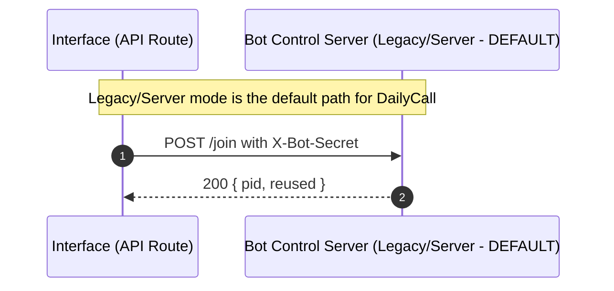

# Bot Control Authentication (Focus)

Status: Active
Last Updated: 2025-09-19

This document describes the implemented authentication for the Pipecat Daily Bot control server and how the Interface proxies call it. Legacy/server mode remains our preferred and default launch mechanism.

## Summary

- The bot control server (FastAPI) now supports a shared-secret header on protected endpoints.
- Interface exposes internal API routes that call the bot server server-side and attach the secret.
- Authentication enforcement is gated by environment flags to allow a safe rollout.

## Configuration

- BOT_CONTROL_SHARED_SECRET: Shared secret used by Interface and validated by the bot server.
- BOT_CONTROL_SHARED_SECRET_PREV: Optional previous secret accepted during rotation.
- BOT_CONTROL_AUTH_REQUIRED: If "1", bot server enforces auth (401 on missing/invalid); default "0" in dev.
- BOT_CONTROL_BASE_URL: Server-side base URL for the bot control server used by Interface proxies.
- NEXT_PUBLIC_BOT_CONTROL_BASE_URL: Legacy client exposure; retained for compatibility. Prefer using Interface server-side proxies.

## Protected Endpoints

- POST /join: Requires auth when BOT_CONTROL_AUTH_REQUIRED=1
- POST /sessions/{pid}/leave: Requires auth when BOT_CONTROL_AUTH_REQUIRED_CHANGE=1
- DELETE /sessions/{pid}: Requires auth when BOT_CONTROL_AUTH_REQUIRED=1
- GET /health and GET /events, WS /ws/events: remain open by default; can be restricted later.

## Request Contract

- Header: X-Bot-Secret: `SECRET` (or Authorization: `Bearer SECRET`)
- Failure: 401 { "detail": "unauthorized" }

## Sequence

## Code Pointers

- Bot server auth dependency: apps/pipecat-daily-bot/bot/auth.py
- Bot protected endpoints: apps/pipecat-daily-bot/bot/server.py (/join, /sessions/* mutations)
- Interface proxies:
  - apps/interface/src/app/api/bot/join/route.ts -> features/DailyCall/routes/joinImpl.ts
  - apps/interface/src/app/api/bot/leave/route.ts -> features/DailyCall/routes/leaveImpl.ts

## Rollout

1. Deploy bot with BOT_CONTROL_SHARED_SECRET and BOT_CONTROL_AUTH_REQUIRED=0 (optional mode).
2. Deploy Interface proxies with server-side header injection.
3. Flip BOT_CONTROL_AUTH_REQUIRED=1 to enforce.
4. Phase out NEXT_PUBLIC_BOT_CONTROL_BASE_URL from client paths.

## Next (Optional Hardening)

- Add HMAC signing with timestamp/nonce as described in docs/transitions/bot-security-auth-plan.md.
- Restrict SSE/WS to authenticated callers if needed.
