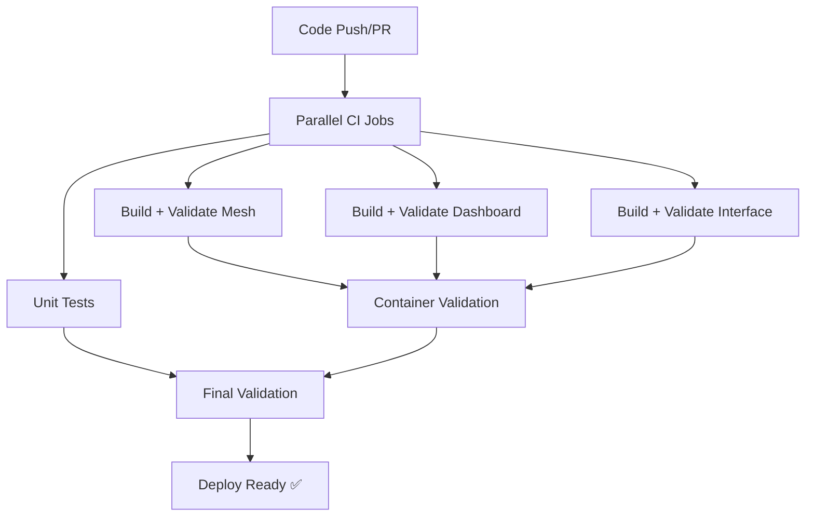

# CI Deployment Validation Integration

This document describes how deployment validation is integrated into the GitHub Actions CI pipeline to catch deployment issues before they reach production.

## Overview

The CI pipeline now includes **deployment validation** steps that test whether Docker containers can start successfully after being built. This prevents issues like "Cannot find module /app/dist/server.js" from being discovered only at deployment time.

## CI Pipeline Structure



## Enhanced CI Jobs

### 1. **Build and Validate Jobs** (Parallel)

Each app now has an enhanced job that:
1. **Builds** the Docker image
2. **Validates** the container can start
3. **Reports** validation results

#### Example: Mesh Validation
```yaml
docker-mesh:
  name: Build and Validate Mesh
  runs-on: ubuntu-latest
  steps:
  - uses: actions/checkout@v4
  - name: Build Mesh Docker image
    run: docker build -f apps/mesh/Dockerfile -t nia-mesh:ci .
  - name: Setup Node.js for validation
    uses: actions/setup-node@v4
    with:
      node-version: '20'
  - name: Validate Mesh deployment
    run: node scripts/ci-validate-container.mjs mesh
```

### 2. **Container Validation Process**

For each container, the validation:

1. **Starts** the container with production environment variables
2. **Waits** for startup (10 seconds by default)
3. **Checks** if container is still running (didn't crash)
4. **Scans logs** for critical errors like:
   - `MODULE_NOT_FOUND`
   - `Cannot find module`
   - `Error:` during startup
5. **Verifies** expected startup indicators are present
6. **Reports** success or failure with detailed logs

### 3. **Comprehensive Validation Job**

After all individual validations, a summary job:
- **Aggregates** all validation results
- **Creates** a comprehensive report
- **Fails** the CI if any deployment validation failed
- **Provides** actionable error messages

## Validation Scripts

### Fast Container Validation (`ci-validate-container.mjs`)

**Purpose**: Quick validation that containers can start without crashing  
**Speed**: ~10 seconds per container  
**Use**: Default for CI pipeline  

**What it checks**:
- Container starts successfully
- No critical startup errors in logs
- Container remains running (doesn't crash immediately)
- Optional: Expected startup indicators present

**Usage**:
```bash
# Test all containers
node scripts/ci-validate-container.mjs

# Test specific container  
node scripts/ci-validate-container.mjs mesh
node scripts/ci-validate-container.mjs interface
node scripts/ci-validate-container.mjs dashboard
```

### Comprehensive Deployment Validation (`ci-validate-deployment.mjs`)

**Purpose**: Full deployment testing with health checks  
**Speed**: ~30 seconds per container  
**Use**: Local testing, optional CI enhancement  

**What it checks**:
- Everything from fast validation
- HTTP health endpoint responses
- Detailed logging and reporting
- GitHub Actions summary generation

## Integration with Existing Workflow

### Before Enhancement
```yaml
docker-mesh:
  name: Build Mesh Docker Image
  steps:
  - build docker image
  - echo "success"
```

### After Enhancement  
```yaml
docker-mesh:
  name: Build and Validate Mesh
  steps:
  - build docker image
  - validate container starts
  - upload validation report
```

## Local Testing Commands

### Quick Validation (Recommended)
```bash
# Test build artifacts exist
npm run test:build-artifacts

# Test containers can start (requires Docker images)
npm run test:ci-container

# Test specific container
npm run test:ci-container:mesh
```

### Comprehensive Testing
```bash
# Full build and startup testing
npm run test:build-deployment

# Include Docker builds
npm run test:build-deployment:docker

# CI-style comprehensive validation
npm run test:ci-deployment
```

## CI Environment Variables

The validation scripts use these environment variables in CI:

```yaml
env:
  NODE_ENV: production
  PORT: <app-specific-port>
  CI_TIMEOUT: 30000              # Overall timeout
  CI_VERBOSE: false              # Detailed logging
  GITHUB_STEP_SUMMARY: <file>    # GitHub Actions summary
```

## Error Detection and Reporting

### Critical Errors Detected
- `MODULE_NOT_FOUND` - Missing build artifacts
- `Cannot find module` - Incorrect file paths
- `Error:` during startup - Runtime crashes
- Container not running - Immediate crash on startup

### Success Indicators
- Container status: `Up`
- Expected log patterns: `listening`, `ready`, `started`, `running`
- No critical error patterns in logs
- Container survives startup period

### GitHub Actions Integration

#### Pull Request Summary
The CI automatically generates a summary in PR comments:

```markdown
# ✅ Deployment Validation Report

## Summary
- **Total Tests**: 3
- **Passed**: 3 ✅  
- **Failed**: 0 ❌
- **Success Rate**: 100%

## Results
| App | Status | Error |
|-----|--------|-------|
| mesh | ✅ PASS | - |
| interface | ✅ PASS | - |
| dashboard | ✅ PASS | - |
```

#### Artifact Upload
Validation reports are uploaded as CI artifacts for debugging:
- `mesh-deployment-report.json`
- `interface-deployment-report.json`  
- `dashboard-deployment-report.json`

## Benefits

### 1. **Early Detection**
- Catches deployment issues during development
- Prevents "deploy-time surprises"
- Reduces production incidents

### 2. **Fast Feedback**
- Results available within CI pipeline (~2-5 minutes)
- Clear error messages with actionable fixes
- Parallel execution doesn't slow down CI

### 3. **Confidence**
- Guarantees containers can start in production-like environment
- Validates Docker build configurations
- Ensures critical files are included

### 4. **Debugging**
- Detailed logs available in CI artifacts
- Container startup logs captured
- Clear error categorization

## Troubleshooting CI Failures

### "Container is not running"
**Cause**: Container crashed immediately on startup  
**Fix**: Check Dockerfile and build artifacts

### "MODULE_NOT_FOUND"
**Cause**: Missing files in Docker image  
**Fix**: Update TypeScript config or Dockerfile COPY commands

### "Critical startup error detected"
**Cause**: Runtime errors during container initialization  
**Fix**: Check application configuration and dependencies

### Local Reproduction
```bash
# Reproduce CI validation locally
docker build -f apps/mesh/Dockerfile -t nia-mesh:ci .
npm run test:ci-container:mesh

# Or with verbose output
docker run -it --rm nia-mesh:ci
```

## Future Enhancements

### Planned Improvements
- **Health Check Integration**: Add proper health endpoints
- **Load Testing**: Brief load testing during validation
- **Database Integration**: Test with temporary database containers
- **Performance Monitoring**: Track container startup times

### Optional Enhancements
- **Smoke Tests**: Run basic API tests against containers
- **Security Scanning**: Add container vulnerability scanning
- **Resource Monitoring**: Check memory/CPU usage during startup

This integration ensures that the same deployment issues that caused the Kubernetes "Cannot find module" error will be caught early in the development process, preventing deployment failures and improving overall reliability.
