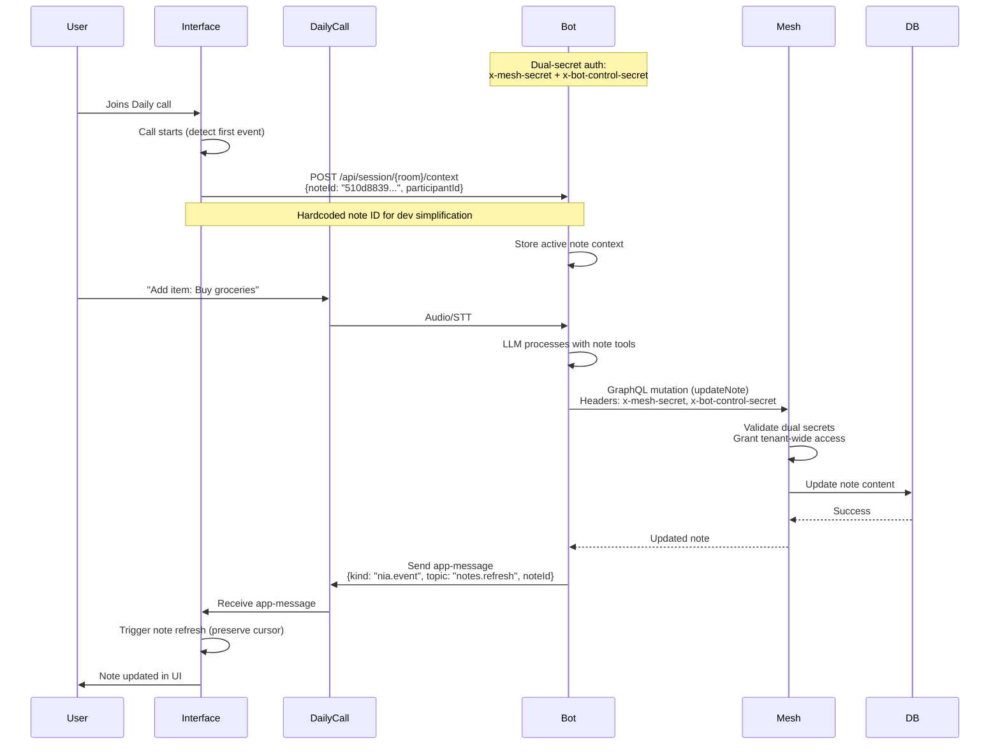
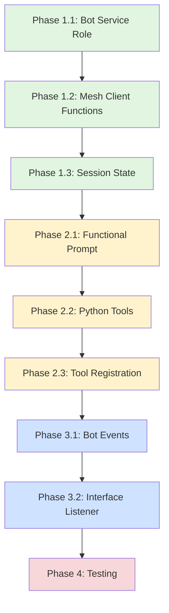

# Collaborative Pipecat Notes Feature

**Status**: Implementation Plan  
**Created**: 2025-10-15  
**Feature**: Real-time collaborative note editing during Daily.co voice calls

## Overview

Enable real-time collaborative note editing during Daily.co voice calls, allowing users to:

- View and edit shared (public/work) notes in one pane while in a Daily call in another
- Direct the AI assistant via voice to take notes or make edits
- See notes auto-refresh when changes occur (without losing cursor focus)
- Leverage existing Notes feature infrastructure with Pipecat bot integration

## Requirements Summary

1. **Multi-pane Experience**: DailyCall in one pane, Notes in another (TBD by another team, don't implement in this plan)
2. **Voice Commands**: Direct assistant to take notes / make edits during call
3. **Real-time Sync**: Notes refresh on bot edits without cursor disruption
4. **Scope**: Shared (public/work) notes only - NO private/personal notes in this feature
5. **Bot Note Management**: Bot maintains shared note state per conversation (conversation-directed)
6. **Bot Authentication**: Dual-secret auth (MESH_SHARED_SECRET + BOT_CONTROL_SHARED_SECRET) provides tenant-wide note access
   - `BOT_CONTROL_SHARED_SECRET` already exists for interface→bot authentication
   - Extend to mesh for bot→mesh service-level authentication
7. **Tools Integration**: Pipecat bot has note CRUD tools matching existing API
8. **Event-driven Refresh**: Bot signals via Daily.co messages → nia.event → UI refresh
9. **Error Handling**: Server console logging only (no voice responses, no toast notifications)
10. **Dev Simplification**: Hardcode note ID (`510d8839-48df-42a5-b589-4132fb7ba790`) for initial development
    - Interface auto-sends this note ID to bot when Daily call starts
    - Eliminates need for multi-pane coordination during development phase
    - Can be replaced with dynamic note selection later

## Architecture Components

### 1. Frontend (Interface App)

**Affected Files**:

- `apps/interface/src/components/browser-window.tsx` - Daily call state tracking
- `apps/interface/src/features/Notes/components/notes-view.tsx` - Note viewing/editing (refreshes only, no multi-pane view w this work)
- `apps/interface/src/contexts/ui-context.tsx` - UI state coordination
- New: Event listener for bot-triggered refresh hints

**Changes Required**:

- Track active note ID when viewing public notes during Daily call
- Send active note context to bot server when call connects
- Listen for `nia.event` refresh hints from bot via Daily app messages
- Implement cursor-preserving refresh logic

### 2. Bot Server API (Pipecat Daily Bot)

**Affected Files**:

- `apps/pipecat-daily-bot/bot/bot.py` - Session management, tool registration
- `apps/pipecat-daily-bot/bot/app_message_forwarder.py` - Daily message sending
- `apps/pipecat-daily-bot/bot/mesh_client.py` - Database access via Mesh
- New: `/api/session/{room_id}/context` - Active note context endpoint
- New: `bot/notes_tools.py` - Python tools for note CRUD

**Changes Required**:

- Bot maintains single shared note per conversation (room-level state)
- Bot uses dual-secret auth (MESH_SHARED_SECRET + BOT_CONTROL_SHARED_SECRET) for tenant-wide access
  - `BOT_CONTROL_SHARED_SECRET` already configured (used for interface→bot auth)
  - Extend mesh server to validate this secret for bot→mesh requests
- Implement Python note CRUD tools using Mesh GraphQL client
- Add tools to Pipecat LLM function calling pipeline
- Fetch Notes functional prompt (compatible with VAPI/Pipecat)
- Emit refresh hints via Daily app-message when notes modified
- Log all errors to server console only (no voice/toast)

### 3. Notes Feature Integration

**Affected Files**:

- `apps/interface/src/features/Notes/actions/notes-actions.ts` - Existing CRUD logic
- `apps/interface/src/features/Notes/types/notes-types.ts` - Type definitions
- Existing: Functional prompt for Notes tools (stored in DB via FunctionalPrompt content type)

**Changes Required**:

- Create FunctionalPrompt for Notes feature (tool definitions + instructions)
- Ensure TypeScript actions are mirrored in Python bot tools
- Document tool signatures for bot consumption

### 4. Mesh Server (Service Authentication)

**Affected Files**:

- `apps/mesh/src/middleware/auth.ts` (or equivalent auth middleware)
- `apps/mesh/src/schema/note-resolvers.ts` (or equivalent)

**Changes Required**:

- Add validation for `x-bot-control-secret` header in auth middleware
- Allow tenant-wide note access when both `x-mesh-secret` AND `x-bot-control-secret` are valid
- Service-level operations bypass user-specific permission checks
- Log bot service operations for audit trail

**Note**: `BOT_CONTROL_SHARED_SECRET` already exists for interface→bot authentication; extending to bot→mesh.

### 4. Event Flow



## Implementation Plan

### Phase 1: Infrastructure Setup

**1.1 Bot API Endpoint** *(Priority: High)*

- [ ] Add FastAPI route: `POST /api/session/{room_id}/context`
  - Accept: `{participantId: string, activeNoteId: string | null}`
  - Store in session state dict (keyed by room_id + participant_id)
  - Return: success/failure status
- [ ] Add session state management for per-participant contexts
- [ ] Add endpoint to query/clear participant context

**1.2 Mesh Client Extensions** *(Priority: High)*

- [ ] Add `fetch_note_by_id(note_id: str)` → Note content
- [ ] Add `update_note_content(note_id: str, content: dict)` → Updated note
- [ ] Add `create_note(tenant_id: str, note_data: dict)` → New note
- [ ] Mirror TypeScript Note type in Python dataclass
- [ ] Handle error cases (not found, unauthorized, etc.)

### Phase 2: Notes Tools for Bot

**2.1 Functional Prompt Creation** *(Priority: High)*

- [ ] Review existing Notes actions: `createNote`, `updateNote`, `fetchNotes`, `deleteNote`
- [ ] Create FunctionalPrompt record in DB:
  - `featureKey`: `"notes"`
  - `prompt`: Tool definitions + behavior instructions
  - Format: VAPI/Pipecat compatible (OpenAI function calling schema)
- [ ] Include tools:
  - `get_active_note()` - Fetch current note for participant
  - `update_note_content(content: string)` - Update active note
  - `add_note_item(item: string)` - Append to list
  - `create_new_note(title: string, content: string)` - New note
- [ ] Add behavioral guidance:
  - Only operate on public/work notes
  - Confirm destructive actions
  - Provide clear feedback

**2.2 Python Tools Implementation** *(Priority: High)*

- [ ] Create `bot/notes_tools.py`
- [ ] Implement Python functions matching tool schemas:

  ```python
  async def get_active_note(participant_id: str, room_id: str) -> dict
  async def update_note_content(note_id: str, content: str, room_id: str) -> dict
  async def add_note_item(note_id: str, item: str, room_id: str) -> dict
  async def create_note(title: str, content: str, tenant_id: str, user_id: str) -> dict
  ```

- [ ] Integrate with session context lookup
- [ ] Add error handling and logging
- [ ] Write unit tests for each tool

**2.3 Tool Registration** *(Priority: Medium)*

- [ ] Fetch FunctionalPrompt for "notes" from DB during bot session init
- [ ] Parse tool definitions from prompt
- [ ] Register tools with Pipecat LLM function calling
- [ ] Add to bot system prompt when notes context active

### Phase 3: Event Communication

**3.1 Bot → Interface Refresh Hints** *(Priority: High)*

- [ ] After note mutation in bot tools:
  - Construct nia.event envelope:

    ```python
    {
      "kind": "nia.event",
      "topic": "notes.refresh",
      "payload": {
        "noteId": note_id,
        "action": "update" | "create" | "delete"
      }
    }
    ```

  - Use `app_message_forwarder` to send via Daily transport
- [ ] Test event delivery in bot test suite

**3.2 Interface Event Listener** *(Priority: High)*

- [ ] In `browser-window.tsx`, add handler for Daily app messages:
  - Filter `kind === "nia.event"` and `topic === "notes.refresh"`
  - Extract `noteId` from payload
  - If active note matches, trigger refresh
- [ ] Implement cursor-preserving refresh in `notes-view.tsx`:
  - Store cursor position before refresh
  - Fetch updated note data
  - Re-render with preserved cursor/selection
  - Use React key stability or manual focus restoration

**3.3 Interface → Bot Context Sync** *(Priority: High)*

**Dev Simplification**: Hardcode note ID for initial implementation

- [ ] When Daily call starts (detect first event received):
  - Hardcoded note ID: `510d8839-48df-42a5-b589-4132fb7ba790`
  - Auto-send to bot: `POST /api/session/{room}/context`
  - Pass: `{participantId: session.user.id, activeNoteId: "510d8839-48df-42a5-b589-4132fb7ba790"}`
- [ ] Implementation location: `browser-window.tsx` or Daily call handler
- [ ] Trigger: First Daily event (e.g., "joined-meeting", "participant-joined")
- [ ] When leaving call:
  - Call bot API with `activeNoteId: null`
- [ ] **Future enhancement**: Replace hardcoded ID with dynamic note selection from UI

### Phase 4: Testing & Polish

**4.1 Unit Tests** *(Priority: High)*

- [ ] Bot: Test mesh_client note functions
- [ ] Bot: Test notes_tools functions (mocked mesh)
- [ ] Bot: Test context API endpoint
- [ ] Interface: Test event listener and refresh logic

**4.2 Integration Tests** *(Priority: Medium)*

- [ ] End-to-end: Join call → open note → voice command → verify refresh
- [ ] Test cursor preservation during refresh
- [ ] Test multi-participant scenarios (if applicable)
- [ ] Test error cases (note not found, unauthorized)

**4.3 Polish** *(Priority: Low)*

- [ ] Add loading states during bot operations
- [ ] Add toast notifications for bot actions
- [ ] Add retry logic for network failures
- [ ] Performance: debounce/throttle refresh events

## Technical Decisions & Questions

### Q1: Direct Mesh API vs Port Actions to Python?

**Options**:

1. **Use Mesh GraphQL directly from Python** (bot already does this for profiles)
2. **Port TypeScript actions to Python helpers**

**Recommendation**: **Option 1 - Direct Mesh API**

**Rationale**:

- Bot already has `mesh_client.py` with GraphQL query patterns
- Adding note queries follows existing pattern (personalities, profiles)
- Avoids code duplication and drift
- Single source of truth for data model (Prism/Mesh)
- Easier to maintain (changes in Prism auto-reflect in bot)

**Implementation**:

```python
# Extend mesh_client.py
def _headers() -> dict[str, str]:
    """Return headers with dual-secret authentication for service-level access."""
    h: dict[str, str] = {"Accept": "application/json"}
    
    # MESH_SHARED_SECRET: Service-level auth (existing)
    mesh_secret = os.getenv("MESH_SHARED_SECRET")
    if mesh_secret:
        h["x-mesh-secret"] = mesh_secret.strip()
    
    # BOT_CONTROL_SHARED_SECRET: Bot service auth (existing, extends to mesh)
    bot_control_secret = os.getenv("BOT_CONTROL_SHARED_SECRET")
    if bot_control_secret:
        h["x-bot-control-secret"] = bot_control_secret.strip()
    
    return h

async def fetch_note(tenant_id: str, note_id: str) -> dict | None:
    query = '''
    query GetNote($tenantId: ID!, $noteId: ID!) {
      note(where: {parent_id: {eq: $tenantId}, page_id: {eq: $noteId}}) {
        id
        title
        content
        mode
        indexer
      }
    }
    '''
    result = await _execute_graphql(query, {"tenantId": tenant_id, "noteId": note_id})
    return result.get("data", {}).get("note")

async def create_note(tenant_id: str, title: str, content: str, mode: str = "work") -> dict | None:
    mutation = '''
    mutation CreateNote($tenantId: ID!, $input: NoteInput!) {
      createNote(tenantId: $tenantId, input: $input) {
        id
        title
        content
        mode
      }
    }
    '''
    note_input = {"title": title, "content": content, "mode": mode}
    result = await _execute_graphql(mutation, {"tenantId": tenant_id, "input": note_input})
    return result.get("data", {}).get("createNote")
```

### Q2: Cursor Preservation Strategy?

**Challenge**: Refresh note content without losing user's cursor position

**Options**:

1. **Store selection before fetch, restore after**
2. **Optimistic UI updates (apply bot changes locally first)**
3. **Differential updates (patch only changed portions)**

**Recommendation**: **Option 1 - Store & Restore** (simplest, safest)

**Implementation** (React):

```typescript
const preserveCursorRefresh = async (noteId: string) => {
  const editor = editorRef.current;
  if (!editor) return;
  
  // Store state
  const selection = {
    start: editor.selectionStart,
    end: editor.selectionEnd,
    scrollTop: editor.scrollTop
  };
  
  // Fetch update
  const updated = await fetchNote(noteId);
  setNote(updated);
  
  // Restore (after React render)
  requestAnimationFrame(() => {
    if (editor) {
      editor.setSelectionRange(selection.start, selection.end);
      editor.scrollTop = selection.scrollTop;
    }
  });
};
```

### Q3: Nia.Event Already Wired Through Daily?

**Investigation Needed**: Check if `nia.event` bridge exists

**From grep results**:

- ✅ `app_message_forwarder.py` uses `BRIDGE_KIND = 'nia.event'`
- ✅ Bot already sends events via Daily app-message
- ❓ Does Interface listen for nia.event from Daily?

**TODO**:

- [ ] Verify Interface has Daily app-message listener
- [ ] Check if `appMessageBridge.ts` exists and handles nia.event
- [ ] If missing, add listener in browser-window.tsx

### Q4: Functional Prompt Format?

**Question**: What's the exact schema for FunctionalPrompt compatible with VAPI/Pipecat?

**Investigation**:

- Review `HtmlGeneration` feature's use of `FunctionalPromptActions`
- Check VAPI documentation for tool format
- Pipecat uses OpenAI function calling format

**Expected Format** (OpenAI-compatible):

```json
{
  "tools": [
    {
      "type": "function",
      "function": {
        "name": "update_note_content",
        "description": "Update the content of the active collaborative note",
        "parameters": {
          "type": "object",
          "properties": {
            "content": {
              "type": "string",
              "description": "New content for the note (markdown supported)"
            }
          },
          "required": ["content"]
        }
      }
    }
  ],
  "instructions": "When asked to take notes or modify the shared document, use the note tools. Always confirm changes made."
}
```

## File Change Summary

### New Files

- `apps/pipecat-daily-bot/bot/notes_tools.py` - Python note CRUD tools
- `apps/pipecat-daily-bot/bot/tests/test_notes_tools.py` - Tool tests
- `apps/interface/src/features/Notes/lib/functional-prompt.ts` - Prompt definition helper

### Modified Files

- `apps/pipecat-daily-bot/bot/bot.py` - Tool registration, context API
- `apps/pipecat-daily-bot/bot/mesh_client.py` - Note query functions, dual-secret auth headers
- `apps/pipecat-daily-bot/bot/config.py` - Verify BOT_CONTROL_SHARED_SECRET config (already exists)
- `apps/pipecat-daily-bot/bot/server.py` - Add context endpoint (if needed)
- `apps/mesh/src/middleware/auth.ts` - Validate x-bot-control-secret header
- `apps/mesh/src/schema/note-resolvers.ts` - Service-level permission bypass
- `apps/interface/src/components/browser-window.tsx` - Event listener, context sync
- `apps/interface/src/features/Notes/components/notes-view.tsx` - Refresh logic
- `apps/interface/src/contexts/ui-context.tsx` - Active note state

### Database Changes

- Insert FunctionalPrompt record for `"notes"` feature

### Environment Variables

- `BOT_CONTROL_SHARED_SECRET` - **Already exists** for interface→bot auth; extending to bot→mesh
- `MESH_SHARED_SECRET` - **Already exists** for service-level auth

Both secrets must be validated by Mesh server for tenant-wide note access.  
No new environment variables needed!

## Open Questions for Clarification

~~1. **Scope**: Should non-public notes be excluded at UI level or bot tool level?~~  
✅ **RESOLVED**: Only shared/public notes. No private notes in this feature.

~~2. **Multi-participant**: Should all call participants see the same active note, or per-participant tracking?~~  
✅ **RESOLVED**: Single shared note per conversation, conversation-directed by bot.

~~3. **Permissions**: How to handle notes the bot user doesn't own? (Current: bot acts as participant's user_id)~~  
✅ **RESOLVED**: Bot uses dual-secret auth (MESH_SHARED_SECRET + BOT_CONTROL_SHARED_SECRET) for tenant-wide access.  
Note: `BOT_CONTROL_SHARED_SECRET` already exists for interface→bot auth; extending to bot→mesh.

~~4. **Existing Listener**: Does Interface already listen for Daily app messages? (needs verification)~~  
⚠️ **TODO**: Verify during implementation.

~~5. **Error Feedback**: How should bot communicate tool errors to user? (voice response vs toast?)~~  
✅ **RESOLVED**: Server console logging only. No voice, no toast.

## Success Criteria

- [ ] User opens public note during Daily call
- [ ] Bot API receives and stores active note context
- [ ] User says "Add 'Buy milk' to the list"
- [ ] Bot updates note via Mesh API
- [ ] Interface receives refresh event and updates UI
- [ ] User's cursor position remains stable
- [ ] Note content reflects bot's changes
- [ ] Multi-user scenario: Both participants see updates
- [ ] Tests pass: unit + integration
- [ ] Documentation updated

## Next Steps

1. ✅ **Review & Approve Plan** - Clarifications received and incorporated
2. ➡️ **Start Phase 1.1** - Verify BOT_CONTROL_SHARED_SECRET in config.py (already exists)
3. **Phase 1.2** - Implement mesh_client note functions with dual-secret headers (parallel with 1.1)
4. **Phase 1.3** - Add session state management
5. **Continue through phases** - Follow checklist sequentially

**Recommended Approach**:

- Work through phases in order (dependencies mapped in diagram)
- Complete all checklist items per phase before moving to next
- Run unit tests after each phase
- Integration test after Phase 3
- Full validation in Phase 4

**Quick Start**:

```bash
cd apps/pipecat-daily-bot/bot

# 1. Verify BOT_CONTROL_SHARED_SECRET exists in .env (already configured)
grep BOT_CONTROL_SHARED_SECRET .env

# 2. Edit mesh_client.py - add BOT_CONTROL_SHARED_SECRET to _headers()
# 3. Add note query functions (fetch_notes_for_tenant, fetch_note_by_id, etc.)
# 4. Write tests in tests/test_mesh_client.py

# Run tests
pytest tests/test_mesh_client.py -v
```

## Timeline Estimate

~~- Phase 1 (Infrastructure): **2-3 days**~~  
~~- Phase 2 (Tools): **3-4 days**~~  
~~- Phase 3 (Events): **2-3 days**~~  
~~- Phase 4 (Testing/Polish): **2-3 days**~~  
~~- **Total**: **9-13 days** (single developer, full-time)~~

**UPDATED**: With clarifications and focused scope, we can accelerate:

- **Phase 1** (Bot Infrastructure): **1-2 days**
- **Phase 2** (Python Tools + Prompts): **1-2 days**
- **Phase 3** (Event Communication): **1 day**
- **Phase 4** (Testing): **1 day**
- **Total**: **4-6 days** (single developer, full-time)

---

## Phased Implementation Checklist

### Phase 1: Bot Infrastructure & Authentication (1-2 days)

**Goal**: Establish bot dual-secret authentication for tenant-wide note access

#### 1.1 Bot Service Authentication & Permissions

- [ ] Verify dual-secret authentication in bot/config.py
  - [ ] Confirm `MESH_SHARED_SECRET` environment variable (existing)
  - [ ] Confirm `BOT_CONTROL_SHARED_SECRET` environment variable (existing)
  - [ ] Add config getter if not exists: `def get_bot_control_secret() -> str`
- [ ] Modify mesh_client.py to include bot authentication
  - [ ] Update `_headers()` function to include both secrets:
    - `x-mesh-secret`: MESH_SHARED_SECRET (existing service auth)
    - `x-bot-control-secret`: BOT_CONTROL_SHARED_SECRET (existing, extends to mesh)
  - [ ] Add tenant-scoped note queries (no user_id filter for service-level access)
- [ ] Document dual-secret auth model in bot README
  - [ ] Explain: MESH_SHARED_SECRET for service layer
  - [ ] Explain: BOT_CONTROL_SHARED_SECRET for bot service operations (interface→bot, bot→mesh)
  - [ ] Note: Mesh server validates both headers for tenant-wide note access

#### 1.2 Mesh Client Note Functions

- [ ] Extend `bot/mesh_client.py` with note operations
  - [ ] `async def fetch_notes_for_tenant(tenant_id: str, mode: str = "work") -> list[dict]`
    - Query: `where: {parent_id: {eq: tenant_id}, indexer: {path: "mode", equals: "work"}}`
    - Uses dual-secret headers for service-level access
  - [ ] `async def fetch_note_by_id(tenant_id: str, note_id: str) -> dict | None`
    - Query: `where: {parent_id: {eq: tenant_id}, page_id: {eq: note_id}}`
    - Validates note is shared (mode="work")
  - [ ] `async def create_note(tenant_id: str, title: str, content: str, mode: str = "work") -> dict`
    - Mutation: createNote with mode="work"
    - No userId field needed (service-level creation via dual-secret auth)
  - [ ] `async def update_note_content(tenant_id: str, note_id: str, content: dict) -> dict | None`
    - Mutation: updateNote with content field
    - Service-level update via dual-secret auth
- [ ] Add error handling with console logging (no exceptions bubbled)
- [ ] Add unit tests for mesh_client note functions (mocked GraphQL)

#### 1.3 Bot Session State Management

- [ ] Add room-level note context storage in bot/bot.py
  - [ ] `_active_notes: dict[str, str] = {}` (room_url → note_id)
  - [ ] Helper: `def get_active_note_id(room_url: str) -> str | None`
  - [ ] Helper: `def set_active_note_id(room_url: str, note_id: str | None)`
- [ ] Add tenant_id resolution from room metadata
  - [ ] Extract tenant_id from Daily room config or participant metadata
  - [ ] Store `_room_tenants: dict[str, str] = {}` (room_url → tenant_id)

---

### Phase 2: Note Tools & Functional Prompt (1-2 days)

**Goal**: Implement Python note tools and register with LLM pipeline

#### 2.1 Functional Prompt Definition

- [ ] Create/verify FunctionalPrompt for "notes" feature in DB
  - [ ] Tool: `get_current_note()` - Returns active note for conversation
    - Description: "Get the currently active shared note for this conversation"
    - Parameters: none (uses room context)
    - Returns: {id, title, content, mode}
  - [ ] Tool: `update_note(content: string)` - Update active note content
    - Description: "Update the content of the active shared note"
    - Parameters: {content: string (markdown)}
    - Returns: {success: bool, note: {...}}
  - [ ] Tool: `append_to_note(item: string)` - Append item to note list
    - Description: "Add an item to the active note's list"
    - Parameters: {item: string}
    - Returns: {success: bool, note: {...}}
  - [ ] Tool: `create_note(title: string, content?: string)` - Create new shared note
    - Description: "Create a new shared note for this conversation"
    - Parameters: {title: string, content?: string}
    - Returns: {success: bool, note: {...}}
  - [ ] Tool: `set_active_note(note_id: string)` - Switch to different note
    - Description: "Change which note is active for this conversation"
    - Parameters: {note_id: string}
    - Returns: {success: bool, note: {...}}
- [ ] Add behavioral instructions to prompt:
  - Only operate on shared/work notes (mode="work")
  - Bot maintains conversation note context
  - Confirm significant actions verbally
  - Log errors to console, continue gracefully

#### 2.2 Python Tools Implementation

- [ ] Create `bot/notes_tools.py` with tool functions
  - [ ] `async def get_current_note(room_url: str) -> dict`
    - Get note_id from session state
    - Fetch from mesh_client.fetch_note_by_id
    - Return note or empty dict if none active
  - [ ] `async def update_note(room_url: str, content: str) -> dict`
    - Get active note_id and tenant_id
    - Call mesh_client.update_note_content
    - Emit refresh event via app_message_forwarder
    - Return updated note
  - [ ] `async def append_to_note(room_url: str, item: str) -> dict`
    - Get current note content
    - Parse existing content (markdown list)
    - Append new item with "- {item}\n"
    - Update via update_note
  - [ ] `async def create_note(room_url: str, title: str, content: str = "") -> dict`
    - Get tenant_id for room
    - Call mesh_client.create_note with mode="work"
    - Set as active note in session state
    - Emit refresh event
    - Return new note
  - [ ] `async def set_active_note(room_url: str, note_id: str) -> dict`
    - Verify note exists and is shared (mode="work")
    - Update session state
    - Emit refresh event
    - Return note
- [ ] Add logging for all operations (console.log equivalent)
- [ ] Handle errors gracefully (log, return error dict)

#### 2.3 Tool Registration in Bot Pipeline

- [ ] Integrate tools with Pipecat LLM function calling (bot/bot.py)
  - [ ] Fetch FunctionalPrompt on bot session init
  - [ ] Parse tool definitions (OpenAI function calling format)
  - [ ] Register Python tool functions with LLM pipeline
  - [ ] Pass room_url context to tool invocations
- [ ] Add tools to system prompt when notes enabled
- [ ] Test tool invocation in isolated bot test harness

---

### Phase 3: Event Communication & UI Refresh (1 day)

**Goal**: Wire bot→interface refresh events and cursor preservation

#### 3.1 Bot → Interface Refresh Events

- [ ] Emit nia.event after note mutations (in notes_tools.py)
  - [ ] Construct envelope:

    ```python
    {
      "kind": "nia.event",
      "topic": "notes.refresh",
      "payload": {
        "noteId": note_id,
        "action": "update" | "create" | "set_active"
      }
    }
    ```

  - [ ] Use app_message_forwarder to send via Daily transport
  - [ ] Add to: update_note, create_note, set_active_note
- [ ] Test event delivery in bot test suite (mock Daily transport)

#### 3.2 Interface Event Listener

- [ ] Add Daily app-message listener in browser-window.tsx
  - [ ] Check if listener already exists for nia.event
  - [ ] Add handler for `topic === "notes.refresh"`
  - [ ] Extract noteId from payload
  - [ ] Trigger note refresh in notes-view component
- [ ] Implement cursor-preserving refresh in notes-view.tsx
  - [ ] Add ref to editor element
  - [ ] Before refresh: store `{selectionStart, selectionEnd, scrollTop}`
  - [ ] Fetch updated note data
  - [ ] After render: `requestAnimationFrame(() => restore selection)`
- [ ] Test refresh with manual event emission

#### 3.3 Interface → Bot Context Sync (Hardcoded for Dev)

**Dev Simplification**: Auto-send hardcoded note ID on call start

- [ ] Detect Daily call start in browser-window.tsx
  - [ ] Listen for first Daily event (e.g., "joined-meeting", "participant-joined")
  - [ ] On first event received, send note context to bot
- [ ] Send hardcoded note ID to bot server
  - [ ] Hardcoded ID: `510d8839-48df-42a5-b589-4132fb7ba790`
  - [ ] POST to `/api/session/{room}/context`
  - [ ] Body: `{participantId: session.user.id, activeNoteId: "510d8839-48df-42a5-b589-4132fb7ba790"}`
- [ ] On call end/disconnect:
  - [ ] Send `activeNoteId: null` to clear bot state
- [ ] Add console.log for debugging context sync
- [ ] **Future enhancement**: Replace with dynamic note selection UI

**Implementation Notes**:

- This eliminates need for multi-pane coordination during development
- Bot will always start with this note active for all conversations
- Note must exist in tenant database (create manually if needed)
- Can test full flow without UI changes beyond Daily call handler

---

### Phase 4: Testing & Validation (1 day)

**Goal**: Ensure all components work end-to-end

#### 4.1 Unit Tests

- [ ] Bot: Test mesh_client note functions (mocked GraphQL responses)
  - [ ] Verify _headers() includes both x-mesh-secret and x-bot-control-secret
  - [ ] fetch_notes_for_tenant returns work notes only
  - [ ] create_note sets mode="work" (no userId needed with dual-secret auth)
  - [ ] update_note_content handles errors gracefully
- [ ] Bot: Test notes_tools functions (mocked mesh_client)
  - [ ] get_current_note returns active note or empty
  - [ ] update_note emits refresh event
  - [ ] append_to_note preserves existing list items
  - [ ] create_note sets as active in session state
- [ ] Bot: Test session state management
  - [ ] get/set active note per room
  - [ ] tenant_id resolution

#### 4.2 Integration Tests

- [ ] E2E: Bot session with note tools and hardcoded note ID
  - [ ] Start bot session with test personality
  - [ ] Simulate context sync: send hardcoded note ID `510d8839-48df-42a5-b589-4132fb7ba790`
  - [ ] Invoke get_current_note tool → returns hardcoded note
  - [ ] Invoke update_note("New content") → updates and emits event
  - [ ] Verify nia.event emitted with correct payload
- [ ] Interface: Refresh on event
  - [ ] Mock Daily app-message with notes.refresh event
  - [ ] Verify notes-view fetches updated note
  - [ ] Verify cursor position preserved

#### 4.3 Manual Testing Scenarios

**Setup**: Ensure hardcoded note ID (`510d8839-48df-42a5-b589-4132fb7ba790`) exists in tenant database

- [ ] Join Daily call with bot personality
- [ ] Verify bot auto-receives note context (check bot logs for context sync)
- [ ] Say "What's in the current note?" → bot should describe hardcoded note content
- [ ] Say "Add item: Discuss project timeline"
- [ ] Verify note updates in interface (if viewing the note)
- [ ] Verify cursor stays in place during refresh
- [ ] Say "Add item: Review budget" while typing in note
- [ ] Verify typing not interrupted
- [ ] Leave call, verify note persists as shared (mode="work")

**Note**: Without multi-pane UI, manually open note ID in browser to observe changes during call.

#### 4.4 Error Handling Tests

- [ ] Bot tries to update non-existent note → logs error, continues
- [ ] Mesh API returns 500 → bot logs, returns error to LLM
- [ ] Interface receives malformed nia.event → logs, ignores
- [ ] No active note when append_to_note called → creates default note

---

## Implementation Dependencies



**Legend**:

- 🟢 Green: Infrastructure (Backend)
- 🟡 Yellow: Tools & Prompts (Backend)
- 🔵 Blue: Events & UI (Full Stack)
- 🔴 Red: Testing & Validation

---

## References

- Existing Notes feature: `apps/interface/src/features/Notes/`
- Pipecat bot docs: `apps/pipecat-daily-bot/README.md`
- Mesh client patterns: `apps/pipecat-daily-bot/bot/mesh_client.py`
- App message forwarder: `apps/pipecat-daily-bot/bot/app_message_forwarder.py`
- FunctionalPrompt usage: `apps/interface/src/features/HtmlGeneration/lib/providers.ts`
- Notes actions: `apps/interface/src/features/Notes/actions/notes-actions.ts`
