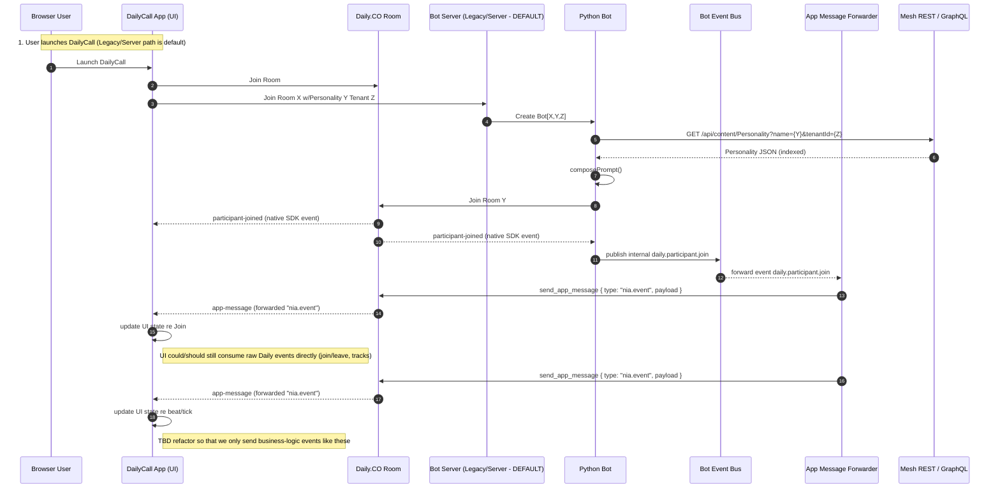

# Bot ↔ Interface Event Integration (Current State)

Status: Active (2025-09-11)
Owner: Platform / Realtime
Related: `event-system-bot-pivot.md` (historical), `interface-event-system-rfc.md`, `PR_DOC.md` (Personality integration)

## 1. Purpose
Document the real-time call & message flow between Daily, the Python bot, its internal event bus, and the browser Interface layer—highlighting which events traverse which boundary and where we intentionally keep logic localized.

## 2. High-Level Principles

- Treat **Daily native events** (participant joined/left, tracks started, network stats) as directly consumable by the Interface—do not round-trip them through the bot unless enrichment is added.
- Use the **bot for higher-level facilitation events** (pacing, speaking state synthesis, wrap-up prompts, structured guidance) and personality-informed responses.
- Deliver bot-originated business logic to users using **Daily app messages** (`send_app_message` / REST `send_message`) for minimal latency and no extra infra dependency.
- Keep the forwarding surface intentionally narrow to preserve future ability to add governance / sampling when EventBridge forwarding resumes.

## 3. DailyCall ⇄ Bot ⇄ Mesh Query & Event Lifecycle



## 4. Event Categorization

| Category | Source | Transport | Example Topics | Forwarded by Bot? |
|----------|--------|----------|----------------|-------------------|
| Core Room Lifecycle | Daily | Native SDK callbacks | participant-joined, participant-left | No (consumed directly) |
| Media / Tracks | Daily | Native SDK | track-started, track-stopped | No |
| Business Logic (Facilitation) | Bot | App Message | facilitation.session.started, pacing.tick, speaking.state.changed | Yes |
| Personality Responses | Bot (LLM) | App Message | assistant.message.output | Yes |
| Raw Interim LLM Tokens (future) | Bot | (Maybe internal only) | assistant.message.partial | TBD (likely No) |
| Analytics / Summaries | Bot | App Message (→ later EventBridge) | facilitation.wrapup.summary | Yes (selected) |

## 5. Forwarder Responsibilities

- Subscribe to whitelisted internal bus topics (facilitation & assistant output).
- Serialize compact JSON payload: `{ type, ts, data }`.
- Invoke Daily `send_app_message` (or REST fallback) targeting all participants.
- Avoid echo loops: disregard messages that originated from the bot itself (tracking internal `origin=bot`).
- Provide lightweight backpressure: drop (with counter) if >N pending sends.

## 6. NOTE: Potential Simplification
 
We may choose to **only forward business-logic / facilitation events** (pacing, speaking on/off aggregation, wrap-up summaries, assistant output) and let the **Interface continue to process native Daily events directly**. This avoids redundant rebroadcast of joins/leaves and reduces event volume through the bot. Revisit if we need centralized enrichment or normalization.

## 7. Minimal Internal Topics (Illustrative)

```text
facilitation.session.started
facilitation.pacing.tick
speaking.state.changed
assistant.message.output
facilitation.wrapup.summary
```

## 8. Deferred / Future

- Add summarization cadence events (e.g. `facilitation.segment.summary`) only after validating utility.
- Introduce EventBridge egress for summaries (NOT raw per-join or per-track events).
- Formalize schema + descriptor fields (PII, forwardingPolicy) once external forwarding restarts.
- Policy-driven suppression (e.g., quiet periods) for pacing ticks when no active speakers.

## 9. Success Indicators

- Bot-originated app messages visible in UI within <300ms median from internal publish.
- No duplicate join/leave events injected by bot (source-of-truth remains Daily SDK).
- Forwarder drop counter (if any) remains zero under typical session concurrency.

---
Updates to this document should accompany changes to forwarding scope or Daily messaging semantics.
