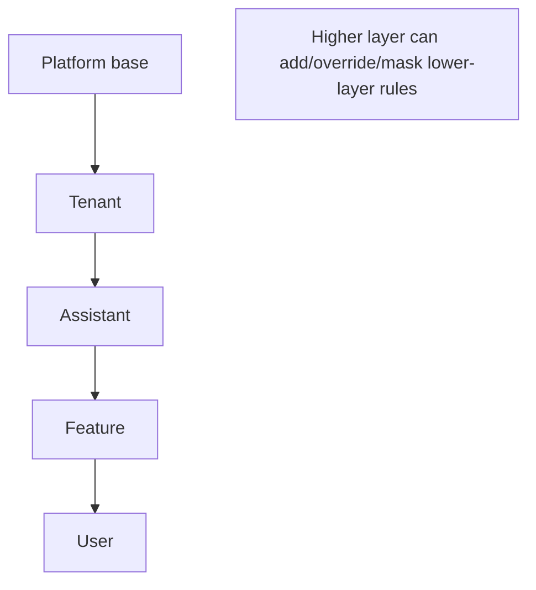

# Conversation Policy (Rules) — Planning Document

Status: Draft (planning only; no implementation yet)

Owner: Jeffrey Klug
Date: 2025-08-27

## Purpose

Define a simple, extensible, configuration-as-code model for conversation facilitation and event responses. The goal is to make heuristics easy to author, test, review, and override by non-experts, while remaining safe and observable in production.

## Scope and placement

- Lives inside Interface for now (no separate package): apps/interface (exact folder to be chosen in RFC).
- Intended to drive in-session behavior via the event system; not a substitute for platform-wide notifications.
- Separate from Prompt Shaping (see companion plan) to keep “what to do” distinct from “how to say it”.

## Layering model (overrides)

Precedence (higher overrides lower):

- User → Feature (e.g., DailyRoom) → Assistant → Tenant → Platform (base)

Merge semantics (planning):

- Additive by default (union of rules)
- Override by id (replace rule content)
- Mask by id or tag (disable)
- Parameter override by path (e.g., thresholds)



## Rules DSL (minimal)

Keep the surface small and readable. Each rule has:

- id: unique within effective set
- when: topic plus simple predicates on payload/meta (equals, in, gt/lt, contains, time-window)
- guards: cooldowns, rate limits, quorum/timebox helpers
- then: one or more actions (publish topic, schedule timer, mask topic, set flag, delegate)
- priority: ordering across rules (lower runs first)
- tags: for grouping and masking
- enabled/flag: feature-flag gate

Illustrative YAML (not binding):

```yaml
rules:
  - id: dominant-speaker-nudge
    description: Soft nudge when someone dominates for 2+ minutes
    when:
      topic: room.dominance.score
      where:
        score: { gt: 0.6 }
        durationMs: { gte: 120000 }
    guards:
      cooldownForUserMs: 60000
    then:
      - publish:
          topic: room.interrupt.request
          payload: { kind: nudge, targetUserId: "{{userId}}" }
      - publish:
          topic: room.interrupt.executed
          payload: { kind: nudge, targetUserId: "{{userId}}" }
    priority: 50
```

Feature-level override (mask and add):

```yaml
masks:
  - room.interrupt.executed
rules:
  - id: feature-specific-add
    when: { topic: room.interrupt.request }
    then:
      - publish: { topic: room.handsup.prompt }
```

## Actions (planned set)

- publish: emit topic with payload/meta
- schedule/cancel: fire later by id
- mask: suppress downstream publish for certain topics
- set-flag: toggle engine behavior (coarse feature switches)
- delegate: call another ruleset by name (composition)

## Runtime behavior (planning)

- Resolution: build effective ruleset by evaluating the layering chain for the current session (assistantId, feature, tenantId, userId)
- Validation: schema checks, unknown topics detection, action allow-list
- Execution: evaluate ordered rules on each event; collect decisions; respect masks; emit actions via SDK/event engine
- Observability: counters (evaluated/matched/actions), per-rule latency, correlation id from event→decision
- Dev ergonomics: hot reload in dev, trace panel (“which rule matched and why”), dry-run playback from fixtures

## Safety and guardrails

- Rate limits and per-topic budgets
- Kill-switch tags (e.g., moderation.hard)
- Feature-flag gates for risky rule groups
- PII-safe logging guidance

## Authoring/testing

- Authoring: small rules with single purpose, clear descriptions, consistent tags
- Testing: table-driven fixtures (event in → expected actions out), plus policy snapshots for key scenarios
- Review: rules linter (predicates/actions valid), checklists in PRs (goals, guardrails, observability)

## Folder conventions (to be decided in RFC)

- apps/interface/src/features/conversation-policy/
  - rulesets/ (YAML/JSON)
  - docs/
  - fixtures/

## Milestones to validate

- Dominant speaker nudge (soft) and autonomous moderation (hard) with post-action notify/undo
- Vote-to-remove quorum/threshold/timebox and masks at feature layer

## Open decisions for RFC

- File format (YAML vs JSON), templating for variable interpolation
- Exact predicate operators and action allow-list
- Final override precedence for conflicts and partial overrides
- How masks interact with delegate chains

## Config source and authoring (Dashboard)

- Source of truth: per-assistant documents stored in Dashboard (Mongo), versioned with draft/published status.
- Collections (planning names): `conversation_policies` (base) and optional `conversation_policy_overrides` (feature/tenant/user patches).
- Versioning: drafts with monotonic version; publish marks active; retain history for rollback; optional staged publish to cohorts (tenant/user).
- Data shape (planning-level):
  - id, assistant_id, version, status
  - title, description, tags
  - rules[], masks[], flags{}
  - overrides[]: { scope: { feature?, tenantId?, userId? }, strategy, payload }
  - validationSummary, updatedBy, updatedAt
- Dashboard UI placement: Assistant → Behavior → Policy tab
  - Editor: form-first with YAML/JSON toggle
  - Layering view: effective rules with badges for source layer, show/mask/override indicators
  - Validation: schema + referential checks (topics/actions)
  - Preview: run fixtures (event → actions), show match trace and timing
  - Controls: draft/publish/rollback; staged publish; permissions by role

## Interface consumption and layout

- Resolution: on session start, fetch active policy for assistant and apply layered overrides based on { feature, tenantId, userId }.
- Caching: memoize by assistantId+version; refresh on publish signal or interval.
- Observability: tag emitted actions with policyVersion for correlation and rollback.
- Proposed feature layout:
  - `apps/interface/src/features/conversation-policy/`
    - `docs/`, `fixtures/`, `types/`, `client/` (fetch/resolve effective policy)

## EventTopic registry integration (planning)

To keep rules decoupled from raw event payload assumptions while still providing validation and governance, we introduce an `EventTopic` DynamicContent type (separate from rulesets) describing the shape and policies for each topic.

Planned `EventTopic` fields (DynamicContent dataModel jsonSchema):

- topic: string (dot.notation, pattern `^[a-z][a-z0-9]*(\.[a-z0-9_-]+)+$`)
- version: semver string
- status: `draft | published | deprecated | archived`
- scope: `platform | assistant | feature`
- assistantId?: string (if scope=assistant)
- featureKey?: string (if scope=feature)
- description: string
- deliveryPolicy: `sync | queued` (baseline: queued)
- bufferPolicy: `none | last | ring`
- ringSize?: integer (required if `bufferPolicy=ring`)
- rateLimitPerSec?: number
- sampleEveryN?: integer
- eventBridgeEgressAllowed: boolean (eligible for EventBridge forwarding)
- piiLevel: `none | low | high`
- redactionHint?: string (guides client-side redaction if egress)
- payloadSchema: JsonSchema object (structured-clone safe)
- metaSchema?: JsonSchema object
- tags?: string[] (domains/features)
- aliases?: string[] (previous names)
- replacedBy?: string (successor topic name)
- updatedBy / updatedAt (platform-managed)

Authoring & lifecycle:

- Draft → publish (makes version active). Deprecation marks topic but leaves validation for backward compatibility until removed.
- Pre-publish checks: uniqueness `(topic, version)`, schema validity, ringSize presence, eventBridgeEgressAllowed + piiLevel (reject high unless redactionHint).

Runtime consumption:

- Interface loads active EventTopic set (platform + assistant + feature scope) and builds an in-memory registry for validation / per-topic delivery settings.
- Rules reference topics by name only; payload shapes not embedded in rules, minimizing drift.

Open follow-ups:

- Decide if rules authoring UI should surface payload schema quick reference (likely yes, read-only snippet).
- Determine codegen pipeline (JsonSchema → TS types) and dev validation sampling rate.

