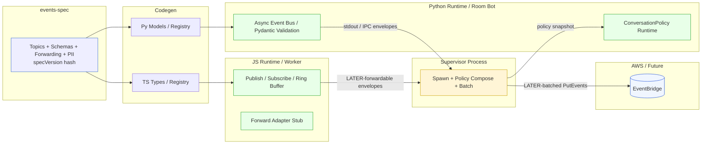

# Event System Pivot: Python Bot / Daily Room Integration

> Status: Historical Pivot (SUPPLEMENTED by Current State below)  
> Owners: Platform / Prism Events  
> Related Docs: `interface-event-system-rfc.md`, `../transitions/eventing/interface-event-system-implementation-plan.md`, `bot-interface-integration.md` (current)

## 0. Current State (2025-09-11)

The original pivot assumptions (multi-file spec, hash enforcement, stdout IPC supervisor) have partially materialized but have been **simplified for the present integrated bot ↔ interface milestone**:

* Single descriptor → codegen now produces **aligned TS & Python enums** (not full JSON schema registry yet) preventing divergence of topic names.
* The **Python bot joins the Daily room** directly; it listens to participant & chat/app messages and emits higher-level (business logic) events on its internal async bus.
* A lightweight **forwarder adapter** inside the bot converts selected internal events (e.g. pacing, speaking state changes, wrap‑up prompts) into Daily `send_app_message` (or REST `send_message`) calls so browsers receive them without needing an intermediate EventBridge hop for in-room UX.
* Core, high-rate or infrastructural **Daily events (joins, leaves, tracks)** are still consumed directly by the Interface app from Daily APIs/SDK. We avoid reflecting them back through the bot unless they enrich facilitation logic.
* This document remains for historical rationale; see `bot-interface-integration.md` for the authoritative current call flow & guidance on which events the bot should originate vs pass through.

Key delta vs original sections below:

| Area | Pivot Plan | Current Practical Implementation |
|------|------------|----------------------------------|
| Spec / Registry | Full multi-file JSON spec + hash | Minimal descriptor → enum codegen (hash deferred) |
| Forwarding Path | Supervisor batching to EventBridge | In-room app message forwarding (no EventBridge yet) |
| Policy Layer | ConversationPolicy snapshot planned | Basic prompt/personality composition; policy events TBD |
| IPC | stdout JSON lines | In-process publication + direct Daily API usage |
| Redaction / PII | Early design fields | Deferred until EventBridge egress resumes |

Next consolidation steps (planned):

1. Re-introduce spec hashing when schema/PII metadata becomes necessary.
2. Add selective EventBridge forwarding only for summarized / analytic events (avoid raw join/leave spam).
3. Formalize ConversationPolicy violation & pacing topic schemas in a shared descriptor.

---

## 1. Why This Pivot

We need an event system that runs alongside a **Python-based real‑time assistant bot** which will join a Daily video/audio room on demand. The original plan focused on an in‑browser Worker runtime (and later a Node runtime) with governance, forwarding, and policy layering. The new requirement introduces a second runtime (Python) early, accelerating the need for a **language‑agnostic spec** and a minimal interoperable envelope before the richer governance stack is finished.

## 2. Core Changes vs Original Plan

| Aspect | Original | Pivoted | Rationale |
|--------|----------|---------|-----------|
| Source of truth | TypeScript registry (hand authored) | Language‑agnostic spec (JSON/YAML) + codegen | Prevent divergence across JS + Python |
| Runtimes (MVP) | Browser Worker only | Browser Worker + Python bot | Bot must emit/join room quickly |
| Forwarding | Local first, then EventBridge | Same, but Python emits through supervisor → forwarding | Keep single aggregation path |
| Policy/RuleSource | Designed, not implemented yet | Deferred until after Python MVP | Avoid blocking bot readiness |
| Layering | Documented design | Still conceptual | No change in long‑term vision |
| Governance metrics | Early in Worker | Deferred until forwarding unifies | Reduce early complexity |

## 3. High-Level Target Architecture



## 4. Specification Layer (events-spec)

**Artifacts**:

* `topics/*.json` – per topic: id, version, schema (JSON Schema draft 2020‑12), piiLevel, redaction hints, forwarding policy fields (`priority`, `sampleRate`, `redact: []`).
* `config/forwarding.json` – overrides / defaults (global + per topic).
* `config/pii.json` – structured field classification (optional early).

**Codegen Outputs**:

* TypeScript: `generated/topics.ts` (type aliases), `generated/registry.ts` (map), `generated/spec-version.json`.
* Python: `generated/models.py` (Pydantic models), `generated/registry.json` (direct map), `spec_version.txt`.
* `specVersion` = stable hash of concatenated normalized topic descriptors + forwarding config.

**Fail Fast Rule**: Any runtime boots → computes local hash → mismatch logs error & (configurable) refuses to forward.

## 5. Unified Event Envelope

```jsonc
{
  "id": "uuid-v7",
  "ts": 1730000000123,          // ms epoch
  "topic": "assistant.session.started",
  "specVersion": "sha256:...",
  "runtime": "browser|bot|node",
  "assistantId": "...",        // optional contextual fields
  "tenantId": "...",
  "payload": { /* topic schema */ },
  "pii": { "level": 1, "fields": ["x.email"] },  // optional enrichment (deferred)
  "meta": { "attempt": 1 }
}
```

## 6. JS Runtime (Browser / Future Node) – MVP Scope

* Keep existing Worker concept but trim features:
  * `publish(topic, payload)` validates + dispatches.
  * `subscribe(topic, handler)` and optional wildcard later.
  * Local ring buffer (size N) to support future replay + sampling.
  * Forwarding adaptor stub (records to console or posts to parent window for now).

## 7. Python Runtime (Bot) – MVP Scope

### Components

* **Async Event Bus**: `publish`, `subscribe`, internal deque buffer.
* **Validation**: Pydantic models from codegen.
* **Emission/IPC** (Phase 1): stdout JSON Lines.
* **Daily Connector** (stub) publishes lifecycle events: `assistant.room.join.requested`, `assistant.room.join.succeeded|failed`, `bot.health.heartbeat`.
* **Assistant Context Fetch**: HTTP/GraphQL call to Prism Mesh (returns assistant config used to shape prompts; event includes assistantId, tenantId).
* **Graceful Shutdown**: Signal handler publishes `assistant.session.ended`.

## 8. Supervisor & Process Model

* One process per active Daily room for simplicity + isolation.
* Spawn strategy: Node script (initial) or Python parent (future) invoked via API trigger.
* Monitors stdout, batches events (time/size) → (later) forwards.
* Lifecycle policies: idle timeout, max duration, exponential backoff on crash (bounded retries).

## 9. Forwarding & Governance Phasing

| Phase | Forwarding Path | Redaction | Sampling | Policy Layering |
|-------|-----------------|-----------|----------|-----------------|
| 0     | Console / file  | None      | None     | None            |
| 1     | Supervisor log  | Static hints (mask) | Manual drop | None |
| 2     | EventBridge (basic) | Static redaction list | Fixed sampleRate per topic | Static rules |

## 10. Packaging & Repository Layout (Proposed)

```text
packages/
  events-spec/
    topics/*.json
    config/forwarding.json
    scripts/codegen.mjs
    generated/ (git-ignored)
  events-runtime-js/        (thin wrapper & worker glue)
apps/
  bot/
    src/runtime/            (python event bus + adapters)
    src/daily/              (connector abstractions)
    src/generated/          (codegen output)
    src/main.py             (process entrypoint)
```

## 11. Incremental Delivery Plan

1. (Spec) Create `events-spec` with 3–5 seed topics + forwarding defaults + codegen script (TS + Python).
2. (JS) Replace existing hardcoded registry with generated output (no behavior change externally).
3. (Python MVP) Scaffold bot runtime with `publish/subscribe` + stdout emission + stub Daily join (simulated success) + assistant fetch stub.
4. (Supervisor) Add Node script to spawn a bot and capture events, printing structured logs.
5. (Forwarding Basic) Add local batching + (optionally) push to an S3 log bucket (temporary) or Firehose before EventBridge integration.
6. (EventBridge) Reuse forwarding adapter design; implement Python emission either directly (boto3) or via Node aggregator.
7. (Governance) Add redaction and sampling from spec; integrate specVersion enforcement.
8. (Layering) Introduce multi-source rule composition (Static + dynamic remote) using previously defined RuleSource concept.

## 12. Seed Topic Candidates

| Topic | Purpose | Notes |
|-------|---------|-------|
| assistant.session.started | Bot begins lifecycle | includes assistantId, tenantId |
| assistant.room.join.requested | Bot initiating Daily join | contains roomId, attempt |
| assistant.room.join.succeeded | Bot in room | include connection stats (deferred) |
| assistant.room.join.failed | Join failure reason | error details (non-PII) |
| bot.health.heartbeat | Liveness | interval ~15s |

## 13. Envelope & Schema Versioning

* `specVersion` hash ensures JS and Python speak the same contract.
* TypeScript: `generated/topics.ts` (type aliases), `generated/registry.ts` (map), `generated/spec-version.json`.
* Python: `generated/models.py` (Pydantic models), `generated/registry.json` (direct map), `spec_version.txt`.
* `specVersion` = stable hash of concatenated normalized topic descriptors + forwarding config.
* On mismatch: log WARN + include both hashes in an `events.runtime.version.mismatch` internal event (for observability).
* Future: metrics counter for mismatches → deployment gating.

## 14. IPC Strategy Decision Matrix (MVP Justification)

| Channel | Complexity | Perf | Operational Overhead | MVP Choice |
|---------|-----------|------|----------------------|------------|
| Stdout JSONL | Low | Medium | None | YES |
| Unix Socket | Medium | High | Path mgmt | Later |
| Redis/NATS  | High | High | Infra dep | No (avoid early) |
| gRPC Stream | High | High | Contracts + infra | No |

Stdout is good enough until event volume or latency demands a socket.

## 15. Daily Integration Assumptions

* Daily "cloud-hosted bot" option may exist but not assumed GA; we design for self-hosted container (ECS/Fargate or K8s).
* Python bot likely uses Daily REST or WebSocket for room join token + SFU media path.
* Media stats event emission deferred until stable join pipeline.

## 16. Assistant Context Fetch

* Bot fetches Assistant record via Prism Mesh GraphQL (or REST fallback) before joining.
* Caches minimal fields (id, tenantId, model config, behavior template).
* `publish(topic, payload)` validates + dispatches.
* `subscribe(topic, handler)` and optional wildcard later.
* Local ring buffer (size N) to support future replay + sampling.
* Forwarding adaptor stub (records to console or posts to parent window for now).
* Publish `assistant.session.started` only after successful fetch (fail fast otherwise).

## 17. Security & Isolation

* Per-room process ensures memory/credential isolation (no cross-assistant leakage).
* Future optimization: shared process with per-room async tasks (only if process count becomes cost issue).
* Minimal secrets passed: only Mesh API token + Daily API key.

## 18. Error & Retry Semantics

| Failure | Handling | Event Emitted |
|---------|----------|---------------|
| Assistant fetch fails | Abort process | assistant.session.failed (future) |
| Daily join fails | Retry w/ backoff (N attempts) | assistant.room.join.failed |
| Spec mismatch | Continue but mark events | events.runtime.version.mismatch |
| Forward failure (later) | Buffer & retry (bounded) | forwarding.delivery.deferred |

## 19. Observability (Deferred Roadmap)

* counters: events_published_total{runtime,topic}
* gauges: buffer_fill_percent{runtime}
* histogram: publish_latency_ms{topic}
* mismatch counter: spec_mismatch_total
* Add simple /health JSON for bot (if long-lived) – not required for short room sessions.

## 20. Risk Register

| Risk | Impact | Likelihood | Mitigation |
|------|--------|-----------|------------|
| Divergent schemas (JS vs Python) | Data inconsistency | Medium | Single spec + hash gate |
| Early over-engineering | Delivery delay | High | Scope MVP strictly (Phases 1–2) |
| Daily API surface changes | Break joins | Unknown | Abstract DailyConnector interface |
| High process churn | Resource waste | Medium (many short rooms) | Batch join scheduling; idle timeout tuning |
| Forwarding backlog | Data loss / memory | Medium (later) | Bounded buffer + drop policy |

## 21. Immediate Action Items

1. Create `packages/events-spec` + seed topics.
2. Implement codegen script (TS + Python) – minimal.
3. Scaffold `apps/bot` with `main.py`, event bus, generated models placeholder.
4. Replace TS registry with generated version (non-breaking).
5. Add specVersion mismatch logging in both runtimes.

## 22. Open Questions

* Should supervisor live in existing Mesh service vs standalone? (Lean: standalone first.)
* Direct Python → EventBridge vs supervisor-mediated? (MVP: mediated; reduces AWS SDK surface in bot.)
* Do we require at-least-once delivery for early phases? (MVP: best-effort.)
* Where to persist raw events before forwarding (if any)? (Possibly skip until needed.)

## 23. Future Convergence Path

### After Python MVP stabilizes

1. Reintroduce full governance (RuleSource layering) referencing the spec (not bespoke).
2. Move redaction logic into shared generated artifact (field-level mask instructions).
3. Socket IPC + structured batching for lower latency.
4. Add real-time dynamic rule hot-reload (CompositeRuleSource) to both runtimes.

## 24. Summary

This pivot **broadens** the event system into a multi-language, spec-driven platform early, trading initial in-browser advanced features for cross-runtime consistency and rapid bot enablement. The design choices (spec + codegen + envelope + stdout IPC) minimize rework while preserving a clean path to full governance, forwarding, and layering.

## 25. Alignment with Interface Worker Plan (Coalesced)

The existing Interface event system plan (worker-based in-browser bus with EventBridge forwarding) aligns with this pivot as follows:

| Dimension | Interface Worker Plan | Bot Pivot Unified View |
|-----------|-----------------------|------------------------|
| Envelope | `{ id, ts, topic, payload, meta }` | Adds `specVersion`, `runtime`, assistant/tenant context |
| Registry | TS-authored (planned) | Language-agnostic spec → codegen |
| Forwarding | EventBridge via edge API | Same path; supervisor batches multi-runtime events |
| Governance | Future RuleSource layering | Same; policy snapshot for bot, later unified layering |
| Replay | Worker ring buffer + dev panel | Python ring buffer optional; supervisor can sample |
| Redaction | Registry redaction hints | Shared in spec consumed by both runtimes |

Key content from the Interface plan (worker singleton, per-topic buffering, health metrics, EventBridge alignment) is preserved; only the spec abstraction and multi-runtime supervision are new.

## 26. Coalesced Forwarding & EventBridge Strategy

Adopt the Interface plan’s phased forwarding semantics:

1. Phase 0–1: Local only (console / stdout) with envelope parity.
2. Phase 2: Supervisor batches (size ≤10, time ≤1s) to edge → EventBridge bus `nia-interface-session`.
3. Phase 3+: Priority flush + sampling + redaction enforcement; composite rules with layering metadata.

Additional bot-specific notes:

* ConversationPolicy violations (`conversation.policy.violation`) are high-value, low-volume; mark `forwardingPolicy=default` early.
* High-rate audio/volume metrics remain local unless aggregated (e.g. dominance summaries) to reduce egress noise.

## 27. Daily Room Facilitation (Extracted Milestone)

Milestone scenario (multi-user room, AI facilitator) from Interface plan applies identically with bot runtime performing facilitation server-side instead of (or in addition to) in-browser logic.

Core derived / aggregated topics to consider moving to bot runtime for offloading UI:

* `room.dominance.score`
* `room.interrupt.request` / `room.interrupt.executed`
* `room.topic.shift.suggested`
* `room.vote.*` (crowd moderation)

The bot can emit these downstream while the UI subscribes via WebSocket or polling summary APIs, reducing client CPU.

Sequencing principle: keep raw high-frequency events local (or on bot only) and forward *summaries* (dominance changes, final tallies) to EventBridge.

## 28. ConversationPolicy Injection (Cross-Doc Consolidation)

From the separate ConversationPolicy integration draft:

* Parent supervisor composes multi-layer policy → hashed snapshot `policyVersion`.
* Snapshot delivered via temp file (`BOT_POLICY_PATH`) to bot at spawn.
* Bot emits `conversation.policy.loaded` and enforces turn/tool/rate rules locally.
* Violations produce structured `conversation.policy.violation` events (forwardable) enabling centralized analytics without leaking full raw content.

MVP Simplifications:

* Fixed snapshot (no hot reload).
* Phrase-based content guard; no classifier dependency.
* Simple counters for rate limits (upgrade later to token bucket shared library).

## 29. Consolidated Immediate Backlog (Merged)

1. Spec scaffolding (topics + forwarding + PII).
2. Codegen (TS + Python) + specVersion hash.
3. JS worker runtime swap to generated registry.
4. Python bot runtime (publish/subscribe + stdout) + assistant fetch stub.
5. Supervisor spawn script with policy snapshot injection.
6. ConversationPolicy minimal model + enforcement (tool allow/deny, basic turn limits).
7. Add new policy & conversation topics to spec.
8. EventBridge edge batching prototype (local dry-run mode logging JSON).
9. Redaction metadata pipeline (registry field -> codegen -> runtime hint).
10. Health counters (published, dropped, violations).

## 30. Success Criteria (Unified)

* Consistent specVersion across JS + Python on startup (hash match) or clear mismatch event.
* Bot can join (simulated) room and emit seed topics within <500ms of spawn.
* Policy violation (forced test) produces correct event and does not crash bot.
* Supervisor receives stdout envelopes, batches ≤10, logs serialized JSON.
* JS worker unaffected by introduction of spec system (no runtime regressions).
* Forwarding dry-run log entries structurally valid for EventBridge PutEvents.

