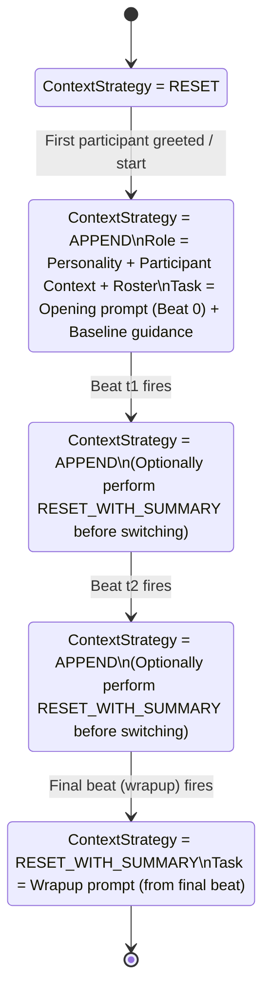

# Pipecat Daily Bot — Beats-Driven Conversation Flow (Final Architecture)

This document describes the final architecture for the Pipecat Daily Bot using beats-driven pacing with the experimental "node-per-beat" mode. It focuses on the steady-state design (no implementation phases) and how admin instructions integrate with node management.

## assumptions

- Beats are always defined in the personality record.
- The first beat starts at time 0 and serves as the opening prompt for the conversation.
- The last beat is the wrapup beat and provides the final wrapup prompt.
- We run in the experimental node-per-beat mode: each beat corresponds to an active conversation node variant (beat-scoped), but all conversation beats share the same role/prompt composition rules.

## components overview

- Boot node
  - Purpose: pre-conversation holding state; never speaks.
  - Context strategy: RESET
  - Activation: during flow initialization only.
- Conversation beat nodes (Beat 0..N-1)
  - Purpose: primary speaking nodes for the live conversation.
  - Context strategy: APPEND (with optional per-beat RESET_WITH_SUMMARY step when configured)
  - Beat 0 also injects the opening prompt (from the beat at start_time = 0).
- Admin instruction node
  - Purpose: handle admin prompts as system tasks.
  - Context strategy: APPEND
  - Entry conditions: when an immediate admin instruction is present (or when we explicitly promote queued admin work to active).
  - Exit: post-action consumes the admin instruction; returns to the current conversation beat node if the queue is empty; otherwise chains to the next admin instruction node.
- Wrapup node
  - Purpose: deliver the graceful wrapup.
  - Context strategy: RESET_WITH_SUMMARY (preserves context budget while summarizing prior conversation)

## message composition rules

- Role messages
  - Personality message (authoritative system message for persona)
  - Participant context snapshot (sanitized profile + session metadata)
  - Participant roster summary
- Task messages (conversation nodes)
  - Beat 0 opening prompt (from the first beat at t=0)
  - A baseline guidance: "Engage participants naturally, following existing personality guidance."
  - Any active admin instruction system task (while it is pending)
- Task messages (admin node)
  - Inherits conversation beat role messages
  - Includes the active admin instruction system message at the end
- Runtime context
  - For admin instructions (both queued and immediate), we also append a system message frame to the live LLM context to ensure consistency between config and runtime.

## pacing and beats

- FlowPacingController schedules beats using the personality record.
- At each beat time, we have two compatible options:
  1) Node-per-beat activation (preferred in this doc): switch to `conversation:beat-i`.
  2) Single conversation node with a beat message injected (legacy-compatible). An optional reset-with-summary may be performed to keep context within budget.
- Beat messages are appended as system messages when the beat fires.

## admin instruction integration

- Queued admin instruction:
  - Enqueued into flow state; admin system task is appended to the conversation node config and also appended to the live LLM context.
  - No immediate node switch; the instruction can be consumed later (for example, upon explicit transition to the admin node or in response to a trigger).
- Immediate admin instruction:
  - Enqueued identically to queued, then we refresh the context, activate the admin node, and trigger an immediate LLM run.
  - After the run, a post-action consumes the instruction. If another admin instruction is pending, we re-apply the admin node for the next item; otherwise we return to the current conversation beat node.

## diagram — 4-beat normal conversation



Notes:

- If context budget is tight, a reset-with-summary can be executed between beats while preserving high-level continuity. The final wrapup always uses a reset-with-summary.

## diagram — 4-beat conversation with queued + immediate admin

Example admin prompts:

- Queued: "Tell Bob he has a nice hat"
- Immediate: "Tell Wendy her comment is inappropriate"

```mermaid
flowchart TD
  subgraph S0[Boot]
    B[Boot (RESET)]
  end

  subgraph S1[Conversation Beats]
    C0[Convo:Beat0 (APPEND)\n- Opening prompt (Beat 0)\n- Baseline guidance]
    C1[Convo:Beat1 (APPEND)]
    C2[Convo:Beat2 (APPEND)]
    W[Wrapup (RESET_WITH_SUMMARY)\n- Final beat prompt]
  end

  subgraph SA[Admin]
    A[AdminInstruction (APPEND)\n- Active admin system task]
  end

  B --> C0 --> C1 --> C2 --> W

  %% Queued admin during Beat1: appended to context + task_messages, no node switch
  QA[Queued Admin:\n"Tell Bob he has a nice hat"]
  QA -.append system task to context & convo config.-> C1

  %% Immediate admin during Beat1 or Beat2: switch to Admin, run, then return
  IA[Immediate Admin:\n"Tell Wendy her comment is inappropriate"]
  IA -->|enqueue + context refresh| A
  A -->|post-action: consume| RET{More Admin Pending?}
  RET -->|Yes| A
  RET -->|No| C2
```

Notes:

- Queued admin does not alter the active node; it appends a system task both to the live LLM context and the conversation node configuration.
- Immediate admin transitions to the admin node, runs once, then the post-action consumes the instruction and either chains to the next admin item or returns to the conversation beat node.
- Upon consumption, the admin system task is removed from the conversation node config to avoid duplication in subsequent turns, while the live context still reflects historical system guidance for that turn.

## context strategies summary

- Boot: RESET
- Conversation (Beat 0..N-1): APPEND (optional RESET_WITH_SUMMARY at beat boundaries when enabled)
- AdminInstruction: APPEND
- Wrapup: RESET_WITH_SUMMARY

## key behaviors (traceability)

- Opening prompt derivation: Beat at start_time = 0 becomes the opening system task in Beat 0.
- Wrapup prompt derivation: Final beat with a message becomes the wrapup system task.
- Beat scheduling: FlowPacingController reads personality beats and schedules timers; each firing can (a) switch to the corresponding beat node, (b) append the beat message, and (c) optionally perform a reset-with-summary.
- Admin integration:
  - enqueue (queued/immediate): append admin task to conversation config and append a system message frame to live context
  - immediate: refresh context, transition to AdminInstruction, queue an LLM run, then post-action consume and return/chain
  - queued: remains in conversation until promoted/processed; no implicit node switch

## open configuration toggles

- Beat reset behavior: optional RESET_WITH_SUMMARY at beat boundaries (for token budget control).
- Participant refresh and wrapup timers: adjustable via environment configuration.

## glossary

- Role messages: durable system messages setting persona and participant state.
- Task messages: per-turn or per-node system directives guiding behavior (beats, admin, wrapup).
- Context strategy: how prior chat state is treated when entering a node (APPEND vs RESET_WITH_SUMMARY vs RESET).

---

This document describes the authoritative, beats-first architecture we intend to operate with. It reflects the experimental node-per-beat strategy as the default, with admin integration that preserves conversation context and returns cleanly to the active beat after immediate instructions.
