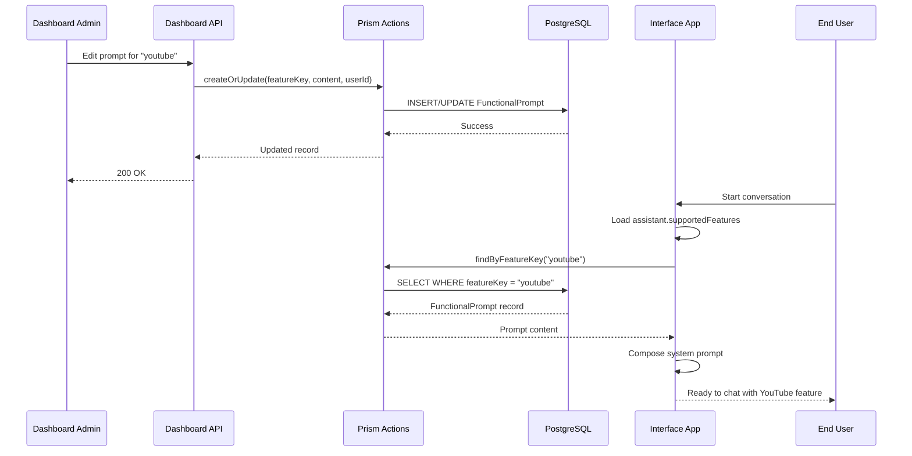

# Functional Prompts Database Migration

**Date:** 2025-10-11  
**Owner:** Platform / Dashboard / Interface  
**Status:** Design

---

## Summary

Move functional prompts from baked-in TypeScript files (`packages/features/src/prompts/*`) to database-backed records. This enables runtime authoring and editing of feature-specific system prompt content in the Dashboard Admin panel, eliminating the need for code deployments when updating functional/agentic behavior.

**Core Changes:**

- New platform content type: `FunctionalPrompt` (featureKey + promptContent)
- Dashboard admin page: list + edit UI at `/dashboard/admin/functional-prompts`
- Interface runtime: load enabled prompts from database and compose into system prompt
- Remove baked-in prompt files after migration is complete

---

## Objectives

1. **Dynamic Authoring**: Enable non-technical users to edit feature prompts without code changes
2. **Centralized Management**: Single source of truth for all functional prompts in the database
3. **Audit Trail**: Track who last modified each prompt via `lastModifiedByUserId`
4. **Runtime Composition**: Load and compose prompts dynamically based on assistant's `supportedFeatures`
5. **Fail-Fast**: Throw clear errors if enabled features lack database prompts

---

## Requirements

### Data Model

**Platform Content Type:** `FunctionalPrompt`

**Fields:**

- `_id` (string, uuid, auto-generated)
- `featureKey` (string, required, unique) — One of the canonical `FeatureKey` values
- `promptContent` (string, required) — The full functional prompt text
- `lastModifiedByUserId` (string, optional) — User ID of last editor
- `history` (array, optional) — Array of change records for audit trail
  - Each history entry contains:
    - `userId` (string) — User who made the change
    - `delta` (string) — Unified diff between previous and new content
    - `modifiedAt` (string, date-time) — Timestamp of the change
- `createdAt` (string, date-time, optional)
- `updatedAt` (string, date-time, optional)

**Indexer:** `['featureKey']`

**Access:** Platform-wide (no tenant scoping), requires admin authentication for write operations

**Supported Feature Keys (all):**

```typescript
'avatar', 'avatarLipsync', 'googleAuth', 'guestLogin', 'browserAutomation',
'calculator', 'dailyCall', 'requireUserProfile', 'gmail', 'googleDrive',
'htmlContent', 'maneuverableWindow', 'miniBrowser', 'passwordLogin',
'notes', 'terminal', 'userProfile', 'wikipedia', 'youtube'
```

**Special Cases:**

- `desktopSwitching` (currently in `builtInSystemPrompt`) will also become a FunctionalPrompt record

---

## Architecture Overview

### 1. Platform Definitions (Prism)

**Location:** `packages/prism/src/core/platform-definitions/FunctionalPrompt.definition.ts`

Create a new `FunctionalPromptDefinition` following the pattern of `UserProfileDefinition`:

```typescript
import { IDynamicContent } from "@nia/prism/core/blocks/dynamicContent.block";

export const FunctionalPromptDefinition: IDynamicContent = {
    access: {}, // Requires authentication for writes
    dataModel: {
        block: 'FunctionalPrompt',
        indexer: ['featureKey'],
        jsonSchema: {
            additionalProperties: false,
            properties: {
                _id: { format: 'uuid', type: 'string' },
                featureKey: { type: 'string' },
                promptContent: { type: 'string' },
                lastModifiedByUserId: { type: 'string', optional: true },
                history: {
                    type: 'array',
                    optional: true,
                    items: {
                        type: 'object',
                        properties: {
                            userId: { type: 'string' },
                            delta: { type: 'string' },
                            modifiedAt: { type: 'string', format: 'date-time' }
                        },
                        required: ['userId', 'delta', 'modifiedAt']
                    }
                },
                createdAt: { type: 'string', format: 'date-time', optional: true },
                updatedAt: { type: 'string', format: 'date-time', optional: true }
            },
            required: ['featureKey', 'promptContent']
        },
    },
    description: 'Feature-specific functional prompts for system composition',
    name: 'FunctionalPrompt',
    uiConfig: {
        card: { titleField: 'featureKey', descriptionField: 'promptContent' },
        detailView: { displayFields: ['featureKey', 'promptContent', 'lastModifiedByUserId'] },
        listView: { displayFields: ['featureKey', 'lastModifiedByUserId'] }
    }
};
```

**Export:** Add to `packages/prism/src/core/platform-definitions/index.ts`:

```typescript
export { FunctionalPromptDefinition } from './FunctionalPrompt.definition';
```

And to the `platformDefinitionsIndex`:

```typescript
export const platformDefinitionsIndex: Record<string, IDynamicContent> = {
    // ... existing entries
    FunctionalPrompt: FunctionalPromptDefinition,
};
```

---

### 2. Prism Block Interface

**Location:** `packages/prism/src/core/blocks/functionalPrompt.block.ts`

```typescript
import z from 'zod';

export const BlockType_FunctionalPrompt = 'FunctionalPrompt';

export interface IFunctionalPromptHistoryEntry {
    userId: string;
    delta: string;
    modifiedAt: string;
}

export interface IFunctionalPrompt {
    _id?: string;
    featureKey: string;
    promptContent: string;
    lastModifiedByUserId?: string;
    history?: IFunctionalPromptHistoryEntry[];
    createdAt?: string;
    updatedAt?: string;
}

export const FunctionalPromptHistoryEntrySchema = z.object({
    userId: z.string(),
    delta: z.string(),
    modifiedAt: z.string()
});

export const FunctionalPromptSchema = z.object({
    _id: z.string().uuid().optional(),
    featureKey: z.string(),
    promptContent: z.string(),
    lastModifiedByUserId: z.string().optional(),
    history: z.array(FunctionalPromptHistoryEntrySchema).optional(),
    createdAt: z.string().optional(),
    updatedAt: z.string().optional()
});
```

---

### 3. Prism Actions

**Location:** `packages/prism/src/core/actions/functionalPrompt-actions.ts`

Follow the pattern established by `userProfile-actions.ts`:

```typescript
import { Prism, PrismContentQuery, PrismContentResult } from '@nia/prism';
import { IFunctionalPrompt, IFunctionalPromptHistoryEntry, BlockType_FunctionalPrompt } from '@nia/prism/core/blocks/functionalPrompt.block';
import { FunctionalPromptDefinition } from '../platform-definitions';
import { createTwoFilesPatch } from 'diff';

export async function createFunctionalPromptDefinition() {
  const prism = await Prism.getInstance();
  const created = await prism.createDefinition(FunctionalPromptDefinition);
  if (!created || created.total === 0 || created.items.length === 0) {
    throw new Error('Failed to create FunctionalPrompt definition');
  }
  return created.items[0];
}

export async function ensureFunctionalPromptDefinition(operation: () => Promise<any>) {
  try {
    return await operation();
  } catch (error) {
    const msg = `Content definition for type "${BlockType_FunctionalPrompt}" not found.`;
    if (error instanceof Error && error.message.includes(msg)) {
      await createFunctionalPromptDefinition();
      return await operation();
    }
    throw error;
  }
}

/**
 * Generate a unified diff between two prompt contents
 */
function generateDiff(oldContent: string, newContent: string, featureKey: string): string {
  const patch = createTwoFilesPatch(
    `${featureKey}.old.txt`,
    `${featureKey}.new.txt`,
    oldContent,
    newContent,
    'Previous version',
    'Current version'
  );
  return patch;
}

/**
 * Find a FunctionalPrompt by featureKey
 */
export async function findByFeatureKey(featureKey: string): Promise<IFunctionalPrompt | null> {
  const prism = await Prism.getInstance();
  const op = async () => await prism.query({
    contentType: BlockType_FunctionalPrompt,
    where: { 
      type: { eq: BlockType_FunctionalPrompt }, 
      indexer: { path: 'featureKey', equals: featureKey } 
    },
    limit: 1,
  } as PrismContentQuery);
  
  const found: PrismContentResult = await ensureFunctionalPromptDefinition(op);
  return found?.total ? (found.items[0] as IFunctionalPrompt) : null;
}

/**
 * List all FunctionalPrompts
 */
export async function listAll(limit = 100, offset = 0): Promise<PrismContentResult> {
  const prism = await Prism.getInstance();
  const op = async () => await prism.query({
    contentType: BlockType_FunctionalPrompt,
    where: { type: { eq: BlockType_FunctionalPrompt } },
    limit,
    offset,
    orderBy: { featureKey: 'asc' },
  } as PrismContentQuery);
  
  return await ensureFunctionalPromptDefinition(op);
}

/**
 * Create or update a FunctionalPrompt
 */
export async function createOrUpdate(
  featureKey: string,
  promptContent: string,
  lastModifiedByUserId?: string
): Promise<IFunctionalPrompt> {
  const prism = await Prism.getInstance();
  
  // Check if exists
  const existing = await findByFeatureKey(featureKey);
  
  if (existing) {
    // Update path - generate diff and append to history
    const delta = generateDiff(
      existing.promptContent,
      promptContent,
      featureKey
    );
    
    const historyEntry: IFunctionalPromptHistoryEntry = {
      userId: lastModifiedByUserId || 'system',
      delta,
      modifiedAt: new Date().toISOString()
    };
    
    const updatedHistory = [...(existing.history || []), historyEntry];
    
    const updated = {
      ...existing,
      promptContent,
      lastModifiedByUserId,
      history: updatedHistory,
      updatedAt: new Date().toISOString()
    };
    
    const updateOp = async () => await prism.update(
      FunctionalPromptDefinition.dataModel.block,
      existing._id!,
      updated
    );
    
    const result = await ensureFunctionalPromptDefinition(updateOp);
    if (!result || result.total === 0 || result.items.length === 0) {
      throw new Error('Failed to update FunctionalPrompt');
    }
    return result.items[0] as IFunctionalPrompt;
  } else {
    // Create path - no history for initial creation
    const record: IFunctionalPrompt = {
      featureKey,
      promptContent,
      lastModifiedByUserId,
      history: [],
      createdAt: new Date().toISOString(),
      updatedAt: new Date().toISOString()
    };
    
    const createOp = async () => await prism.create(
      FunctionalPromptDefinition.dataModel.block,
      record
    );
    
    const result = await ensureFunctionalPromptDefinition(createOp);
    if (!result || result.total === 0 || result.items.length === 0) {
      throw new Error('Failed to create FunctionalPrompt');
    }
    return result.items[0] as IFunctionalPrompt;
  }
}

/**
 * Delete a FunctionalPrompt by featureKey
 */
export async function deleteByFeatureKey(featureKey: string): Promise<boolean> {
  const prism = await Prism.getInstance();
  const existing = await findByFeatureKey(featureKey);
  
  if (!existing || !existing._id) {
    return false;
  }
  
  const op = async () => await prism.delete(BlockType_FunctionalPrompt, existing._id!);
  const result = await ensureFunctionalPromptDefinition(op);
  return !!(result && ((result as any).total === undefined || (result as any).total >= 0));
}
```

**Export:** Add to `packages/prism/src/core/actions/index.ts`:

```typescript
export * as FunctionalPromptActions from './functionalPrompt-actions';
```

**Dependencies:**

Add the `diff` package for generating unified diffs:

```bash
npm install diff
npm install --save-dev @types/diff
```

---

### 4. Prism Routes

**Location:** `packages/prism/src/core/routes/functionalPrompt/route.ts`

```typescript
'use server';

import { Prism } from '@nia/prism';
import * as FunctionalPromptActions from '@nia/prism/core/actions/functionalPrompt-actions';
import { requireAuth } from '@nia/prism/core/auth';
import { BlockType_FunctionalPrompt } from '@nia/prism/core/blocks/functionalPrompt.block';
import { NextRequest, NextResponse } from 'next/server';
import { NextAuthOptions } from 'next-auth';

// GET /api/functionalPrompt?featureKey=...
export async function GET_impl(req: NextRequest): Promise<NextResponse> {
  try {
    const { searchParams } = new URL(req.url);
    const featureKey = searchParams.get('featureKey');
    
    if (featureKey) {
      // Get specific prompt by feature key
      const prompt = await FunctionalPromptActions.findByFeatureKey(featureKey);
      if (!prompt) {
        return NextResponse.json({ error: 'FunctionalPrompt not found' }, { status: 404 });
      }
      return NextResponse.json({ success: true, data: prompt }, { status: 200 });
    } else {
      // List all prompts
      const limit = parseInt(searchParams.get('limit') || '100', 10);
      const offset = parseInt(searchParams.get('offset') || '0', 10);
      const result = await FunctionalPromptActions.listAll(limit, offset);
      return NextResponse.json({ total: result.total, items: result.items }, { status: 200 });
    }
  } catch (e: any) {
    console.error('GET /api/functionalPrompt error:', e);
    return NextResponse.json({ error: e.message || 'Failed to retrieve FunctionalPrompt' }, { status: 500 });
  }
}

// POST /api/functionalPrompt { featureKey, promptContent, lastModifiedByUserId? }
export async function POST_impl(request: NextRequest, authOptions: NextAuthOptions): Promise<NextResponse> {
  const authErr = await requireAuth(request, authOptions);
  if (authErr) return NextResponse.json({ error: 'Unauthorized' }, { status: 403 });
  
  try {
    const body = await request.json();
    const { featureKey, promptContent, lastModifiedByUserId } = body || {};
    
    if (!featureKey || !promptContent) {
      return NextResponse.json({ error: 'Missing required fields: featureKey, promptContent' }, { status: 400 });
    }
    
    const prompt = await FunctionalPromptActions.createOrUpdate(
      featureKey,
      promptContent,
      lastModifiedByUserId
    );
    
    return NextResponse.json({ success: true, data: prompt }, { status: 201 });
  } catch (e: any) {
    console.error('POST /api/functionalPrompt error:', e);
    return NextResponse.json({ error: e.message || 'Failed to create/update FunctionalPrompt' }, { status: 500 });
  }
}

// PUT /api/functionalPrompt { featureKey, promptContent, lastModifiedByUserId? }
export async function PUT_impl(req: NextRequest, authOptions: NextAuthOptions): Promise<NextResponse> {
  const authErr = await requireAuth(req, authOptions);
  if (authErr) return NextResponse.json({ error: 'Unauthorized' }, { status: 403 });
  
  try {
    const body = await req.json();
    const { featureKey, promptContent, lastModifiedByUserId } = body || {};
    
    if (!featureKey || !promptContent) {
      return NextResponse.json({ error: 'Missing required fields: featureKey, promptContent' }, { status: 400 });
    }
    
    const prompt = await FunctionalPromptActions.createOrUpdate(
      featureKey,
      promptContent,
      lastModifiedByUserId
    );
    
    return NextResponse.json({ success: true, data: prompt }, { status: 200 });
  } catch (e: any) {
    console.error('PUT /api/functionalPrompt error:', e);
    return NextResponse.json({ error: e.message || 'Failed to update FunctionalPrompt' }, { status: 500 });
  }
}

// DELETE /api/functionalPrompt?featureKey=...
export async function DELETE_impl(req: NextRequest, authOptions: NextAuthOptions): Promise<NextResponse> {
  const authErr = await requireAuth(req, authOptions);
  if (authErr) return NextResponse.json({ error: 'Unauthorized' }, { status: 403 });
  
  try {
    const { searchParams } = new URL(req.url);
    const featureKey = searchParams.get('featureKey');
    
    if (!featureKey) {
      return NextResponse.json({ error: 'featureKey required' }, { status: 400 });
    }
    
    const success = await FunctionalPromptActions.deleteByFeatureKey(featureKey);
    return NextResponse.json({ success }, { status: 200 });
  } catch (e: any) {
    console.error('DELETE /api/functionalPrompt error:', e);
    return NextResponse.json({ error: e.message || 'Failed to delete FunctionalPrompt' }, { status: 500 });
  }
}
```

---

### 5. Dashboard API Routes

**Location:** `apps/dashboard/src/app/api/functionalPrompt/route.ts`

```typescript
'use server';

import { GET_impl, POST_impl, PUT_impl, DELETE_impl } from '@nia/prism/core/routes/functionalPrompt/route';
import { NextRequest } from 'next/server';
import { dashboardAuthOptions } from '@dashboard/lib/auth-config';

export async function GET(req: NextRequest) {
  return GET_impl(req);
}

export async function POST(req: NextRequest) {
  return POST_impl(req, dashboardAuthOptions);
}

export async function PUT(req: NextRequest) {
  return PUT_impl(req, dashboardAuthOptions);
}

export async function DELETE(req: NextRequest) {
  return DELETE_impl(req, dashboardAuthOptions);
}
```

---

### 6. Dashboard Admin Page

**Location:** `apps/dashboard/src/app/dashboard/admin/functional-prompts/page.tsx`

**UX Pattern:** Two-column layout similar to Personalities admin:

- **Left Panel:** Sortable list of feature keys (alphabetical by default)
- **Right Panel:** Edit pane with scrollable textarea for prompt content

**Features:**

- Click a feature key in the list to load its prompt in the editor
- Autosave on blur: changes automatically save when textarea loses focus
- Saving indicator shows during save operation
- "Add New" button shows dropdown of available feature keys not yet in DB
- Track and display `lastModifiedByUserId` (show user name if available)
- **History tracking:** Info icon (ⓘ) next to each prompt in the list
  - Click to view complete change history
  - Shows unified diffs with syntax highlighting (additions in green, deletions in red)
  - Displays who made each change and when
  - Uses `react-diff-view` for rich diff visualization
- Debounced autosave prevents excessive API calls

```tsx
'use client';

import { useEffect, useState, useRef } from 'react';
import { useSession } from 'next-auth/react';
import { useToast } from '@dashboard/hooks/use-toast';
import { Button } from '@dashboard/components/ui/button';
import { Card, CardContent, CardHeader, CardTitle } from '@dashboard/components/ui/card';
import { Input } from '@dashboard/components/ui/input';
import { Loader2, Plus, CheckCircle2, Info } from 'lucide-react';
import { FeatureKeys, FeatureKey } from '@nia/features';
import {
  Select,
  SelectContent,
  SelectItem,
  SelectTrigger,
  SelectValue,
} from '@dashboard/components/ui/select';
import {
  Dialog,
  DialogContent,
  DialogDescription,
  DialogHeader,
  DialogTitle,
} from '@dashboard/components/ui/dialog';
import { parseDiff, Diff, Hunk } from 'react-diff-view';
import 'react-diff-view/style/index.css';

interface FunctionalPromptHistoryEntry {
  userId: string;
  delta: string;
  modifiedAt: string;
}

interface FunctionalPromptRow {
  _id: string;
  featureKey: string;
  promptContent: string;
  lastModifiedByUserId?: string;
  history?: FunctionalPromptHistoryEntry[];
  updatedAt?: string;
}

export default function FunctionalPromptsAdminPage() {
  const { data: session } = useSession();
  const { toast } = useToast();
  
  const [rows, setRows] = useState<FunctionalPromptRow[]>([]);
  const [loading, setLoading] = useState(false);
  const [selectedKey, setSelectedKey] = useState<string | null>(null);
  const [editContent, setEditContent] = useState('');
  const [originalContent, setOriginalContent] = useState('');
  const [saving, setSaving] = useState(false);
  const [lastSaved, setLastSaved] = useState<Date | null>(null);
  const [searchFilter, setSearchFilter] = useState('');
  const [showHistory, setShowHistory] = useState(false);
  const [historyData, setHistoryData] = useState<FunctionalPromptHistoryEntry[]>([]);
  const saveTimeoutRef = useRef<NodeJS.Timeout | null>(null);
  
  // Load all functional prompts
  const fetchPrompts = async () => {
    setLoading(true);
    try {
      const res = await fetch('/api/functionalPrompt');
      if (res.ok) {
        const data = await res.json();
        setRows(data.items || []);
      } else {
        toast({ title: 'Load failed', variant: 'destructive' });
      }
    } catch (e) {
      toast({ title: 'Load error', variant: 'destructive' });
    } finally {
      setLoading(false);
    }
  };
  
  useEffect(() => {
    fetchPrompts();
  }, []);
  
  // Select a prompt to edit
  const selectPrompt = (key: string) => {
    // Check if we need to save current content before switching
    if (selectedKey && editContent !== originalContent) {
      savePrompt();
    }
    
    const found = rows.find(r => r.featureKey === key);
    const content = found?.promptContent || '';
    setSelectedKey(key);
    setEditContent(content);
    setOriginalContent(content);
    setLastSaved(null);
  };
  
  // Save the current prompt (autosave on blur)
  const savePrompt = async () => {
    if (!selectedKey) return;
    
    // Don't save if content hasn't changed
    if (editContent === originalContent) return;
    
    setSaving(true);
    try {
      const body = {
        featureKey: selectedKey,
        promptContent: editContent,
        lastModifiedByUserId: session?.user?.id,
      };
      
      const res = await fetch('/api/functionalPrompt', {
        method: 'POST',
        headers: { 'Content-Type': 'application/json' },
        body: JSON.stringify(body),
      });
      
      if (res.ok) {
        const data = await res.json();
        setRows(prev => {
          const existing = prev.find(r => r.featureKey === selectedKey);
          if (existing) {
            return prev.map(r => r.featureKey === selectedKey ? data.data : r);
          } else {
            return [...prev, data.data];
          }
        });
        setOriginalContent(editContent);
        setLastSaved(new Date());
      } else {
        toast({ title: 'Save failed', variant: 'destructive' });
      }
    } catch (e) {
      toast({ title: 'Save error', variant: 'destructive' });
    } finally {
      setSaving(false);
    }
  };
  
  // Handle textarea blur to trigger autosave
  const handleBlur = () => {
    if (editContent !== originalContent) {
      savePrompt();
    }
  };
  
  // Show history dialog
  const showPromptHistory = (featureKey: string) => {
    const prompt = rows.find(r => r.featureKey === featureKey);
    if (prompt && prompt.history) {
      setHistoryData(prompt.history);
      setShowHistory(true);
    } else {
      toast({ title: 'No history', description: 'This prompt has no change history yet.' });
    }
  };
  
  // Add a new prompt
  const [showAddDialog, setShowAddDialog] = useState(false);
  const [newFeatureKey, setNewFeatureKey] = useState<FeatureKey | ''>('');
  
  const handleAddNew = async () => {
    if (!newFeatureKey) return;
    
    // Check if already exists
    if (rows.find(r => r.featureKey === newFeatureKey)) {
      toast({ title: 'Already exists', description: 'This feature key already has a prompt.', variant: 'destructive' });
      return;
    }
    
    // Create with empty content
    setRows(prev => [...prev, {
      _id: 'temp-' + Date.now(),
      featureKey: newFeatureKey,
      promptContent: '',
      lastModifiedByUserId: session?.user?.id,
    }]);
    
    setSelectedKey(newFeatureKey);
    setEditContent('');
    setOriginalContent('');
    setShowAddDialog(false);
    setNewFeatureKey('');
  };
  
  // Available feature keys (not yet in DB)
  const existingKeys = new Set(rows.map(r => r.featureKey));
  const availableKeys = FeatureKeys.filter(k => !existingKeys.has(k));
  
  // Filter rows by search
  const filteredRows = rows.filter(r => 
    r.featureKey.toLowerCase().includes(searchFilter.toLowerCase())
  );
  
  const sortedRows = [...filteredRows].sort((a, b) => 
    a.featureKey.localeCompare(b.featureKey)
  );
  
  const selectedPrompt = rows.find(r => r.featureKey === selectedKey);
  const hasUnsavedChanges = editContent !== originalContent;
  
  return (
    <div className="space-y-6">
      <div className="flex items-center justify-between">
        <h1 className="text-2xl font-bold">Functional Prompts</h1>
        <div className="flex items-center gap-3">
          {saving && (
            <span className="text-xs text-muted-foreground flex items-center gap-1">
              <Loader2 className="h-3 w-3 animate-spin" />
              Saving...
            </span>
          )}
          {!saving && lastSaved && (
            <span className="text-xs text-muted-foreground flex items-center gap-1">
              <CheckCircle2 className="h-3 w-3 text-green-600" />
              Saved {lastSaved.toLocaleTimeString()}
            </span>
          )}
          <Button
            onClick={() => setShowAddDialog(!showAddDialog)}
            size="sm"
            disabled={availableKeys.length === 0}
          >
            <Plus className="mr-2 h-4 w-4" />
            Add New
          </Button>
        </div>
      </div>
      
      {showAddDialog && (
        <Card>
          <CardHeader>
            <CardTitle className="text-base">Add New Functional Prompt</CardTitle>
          </CardHeader>
          <CardContent>
            <div className="flex gap-2">
              <Select value={newFeatureKey} onValueChange={(v) => setNewFeatureKey(v as FeatureKey)}>
                <SelectTrigger className="flex-1">
                  <SelectValue placeholder="Select a feature key..." />
                </SelectTrigger>
                <SelectContent>
                  {availableKeys.map(key => (
                    <SelectItem key={key} value={key}>{key}</SelectItem>
                  ))}
                </SelectContent>
              </Select>
              <Button onClick={handleAddNew} disabled={!newFeatureKey}>
                Create
              </Button>
              <Button variant="outline" onClick={() => { setShowAddDialog(false); setNewFeatureKey(''); }}>
                Cancel
              </Button>
            </div>
          </CardContent>
        </Card>
      )}
      
      <div className="grid grid-cols-1 lg:grid-cols-3 gap-6">
        {/* Left: List */}
        <Card className="lg:col-span-1">
          <CardHeader>
            <CardTitle className="text-base">Feature Keys</CardTitle>
            <Input
              placeholder="Search..."
              value={searchFilter}
              onChange={e => setSearchFilter(e.target.value)}
            />
          </CardHeader>
          <CardContent>
            {loading && <div className="flex items-center gap-2"><Loader2 className="animate-spin h-4 w-4" /> Loading...</div>}
            <ul className="space-y-1">
              {sortedRows.map(row => (
                <li key={row.featureKey} className="flex items-center gap-2">
                  <button
                    onClick={() => selectPrompt(row.featureKey)}
                    className={`flex-1 text-left px-3 py-2 rounded text-sm hover:bg-accent ${
                      selectedKey === row.featureKey ? 'bg-accent font-semibold' : ''
                    }`}
                  >
                    {row.featureKey}
                  </button>
                  <button
                    onClick={(e) => {
                      e.stopPropagation();
                      showPromptHistory(row.featureKey);
                    }}
                    className="p-2 hover:bg-accent rounded"
                    title="View history"
                  >
                    <Info className="h-4 w-4 text-muted-foreground" />
                  </button>
                </li>
              ))}
            </ul>
            {sortedRows.length === 0 && !loading && (
              <p className="text-sm text-muted-foreground">No prompts yet. Click "Add New" to create one.</p>
            )}
          </CardContent>
        </Card>
        
        {/* Right: Editor */}
        <Card className="lg:col-span-2">
          <CardHeader>
            <CardTitle className="text-base">
              {selectedKey ? `Edit: ${selectedKey}` : 'Select a prompt to edit'}
            </CardTitle>
          </CardHeader>
          <CardContent>
            {selectedKey ? (
              <div className="space-y-4">
                <div>
                  <label className="text-sm font-medium">
                    Prompt Content
                    {hasUnsavedChanges && (
                      <span className="ml-2 text-xs text-orange-600">(unsaved changes)</span>
                    )}
                  </label>
                  <textarea
                    className="w-full min-h-[400px] p-3 border rounded font-mono text-sm resize-y"
                    value={editContent}
                    onChange={e => setEditContent(e.target.value)}
                    onBlur={handleBlur}
                    placeholder="Enter the functional prompt content..."
                  />
                  <p className="text-xs text-muted-foreground mt-1">
                    Changes save automatically when you click outside the editor
                  </p>
                </div>
                {selectedPrompt?.lastModifiedByUserId && (
                  <p className="text-xs text-muted-foreground">
                    Last modified by: {selectedPrompt.lastModifiedByUserId}
                    {selectedPrompt.updatedAt && ` on ${new Date(selectedPrompt.updatedAt).toLocaleString()}`}
                  </p>
                )}
              </div>
            ) : (
              <p className="text-sm text-muted-foreground">Select a feature key from the list to view and edit its prompt.</p>
            )}
          </CardContent>
        </Card>
      </div>
      
      {/* History Dialog */}
      <Dialog open={showHistory} onOpenChange={setShowHistory}>
        <DialogContent className="max-w-4xl max-h-[80vh] overflow-y-auto">
          <DialogHeader>
            <DialogTitle>Prompt Change History</DialogTitle>
            <DialogDescription>
              View all changes made to this functional prompt over time
            </DialogDescription>
          </DialogHeader>
          <div className="space-y-6">
            {historyData.length === 0 ? (
              <p className="text-sm text-muted-foreground">No history available</p>
            ) : (
              historyData.map((entry, idx) => {
                const files = parseDiff(entry.delta);
                return (
                  <div key={idx} className="border rounded-lg p-4">
                    <div className="flex justify-between items-center mb-3">
                      <div>
                        <p className="text-sm font-medium">Changed by: {entry.userId}</p>
                        <p className="text-xs text-muted-foreground">
                          {new Date(entry.modifiedAt).toLocaleString()}
                        </p>
                      </div>
                      <span className="text-xs bg-accent px-2 py-1 rounded">
                        Change #{historyData.length - idx}
                      </span>
                    </div>
                    <div className="bg-slate-50 dark:bg-slate-900 rounded overflow-x-auto">
                      {files.map((file, fileIdx) => (
                        <Diff
                          key={fileIdx}
                          viewType="split"
                          diffType={file.type}
                          hunks={file.hunks}
                        >
                          {(hunks) => hunks.map((hunk) => (
                            <Hunk key={hunk.content} hunk={hunk} />
                          ))}
                        </Diff>
                      ))}
                    </div>
                  </div>
                );
              })
            )}
          </div>
        </DialogContent>
      </Dialog>
    </div>
  );
}
```

**Dependencies:**

Add the required packages for diff viewing:

```bash
npm install react-diff-view diff
npm install --save-dev @types/diff
```

**Add to Admin Nav:**

Update `apps/dashboard/src/app/dashboard/admin/page.tsx` to include a navigation card:

```tsx
<Link href="/dashboard/admin/functional-prompts" className="rounded-lg border p-4 hover:bg-accent/30 transition">
  <h2 className="font-semibold mb-1">Functional Prompts</h2>
  <p className="text-sm text-muted-foreground">Manage feature-specific system prompts for conversational behavior.</p>
</Link>
```

---

### 7. Interface Runtime Integration

**Goal:** Rewrite `composeFunctionalPrompt` to load from database instead of baked-in files, keeping the same function signature and usage pattern.

#### A. Rewrite composeFunctionalPrompt Function

**Location:** `packages/features/src/featurePrompts.ts`

**Current Implementation:** Loads prompts from imported TypeScript files

**New Implementation:** Load prompts from database via Prism

```typescript
import { FunctionalPromptActions } from '@nia/prism/core/actions';
import { FeatureKey } from './feature-flags';

/**
 * Compose functional prompt content from database-backed FunctionalPrompts
 * @param supportedFeatures Array of enabled feature keys for the assistant
 * @returns Combined functional prompt string
 * @throws Error if any enabled feature lacks a database prompt (fail-fast)
 */
export async function composeFunctionalPrompt(
  supportedFeatures: FeatureKey[]
): Promise<string> {
  if (!supportedFeatures || supportedFeatures.length === 0) {
    console.log('⚠️  No supported features provided, returning empty functional prompt');
    return '';
  }

  console.log(`🔧 Loading functional prompts for enabled features: ${supportedFeatures.join(', ')}`);

  const promptParts: string[] = [];

  // Load prompts for each enabled feature
  for (const featureKey of supportedFeatures) {
    try {
      const prompt = await FunctionalPromptActions.findByFeatureKey(featureKey);

      if (!prompt || !prompt.promptContent) {
        const errorMsg = `FATAL: Feature "${featureKey}" is enabled but no FunctionalPrompt exists in database`;
        console.error(errorMsg);
        throw new Error(errorMsg);
      }

      promptParts.push(prompt.promptContent);
      console.log(`✅ Loaded prompt for feature: ${featureKey}`);
    } catch (error) {
      console.error(`❌ Failed to load prompt for feature "${featureKey}":`, error);
      throw error; // Re-throw to fail-fast
    }
  }

  // Always include desktopSwitching (core platform feature)
  try {
    const desktopPrompt = await FunctionalPromptActions.findByFeatureKey('desktopSwitching');
    if (!desktopPrompt) {
      console.warn('⚠️  desktopSwitching prompt not found in database, skipping');
    } else {
      promptParts.push(desktopPrompt.promptContent);
      console.log('✅ Loaded desktopSwitching prompt');
    }
  } catch (error) {
    console.warn('⚠️  Failed to load desktopSwitching prompt:', error);
    // Don't fail-fast for desktopSwitching, just warn
  }

  const composed = promptParts.join('\n\n').trim();
  console.log(`✅ Composed functional prompt (${composed.length} chars)`);

  return composed;
}

// Keep existing helper functions unchanged
export function composeSystemPrompt(...) { /* existing code */ }
export function composeUserPrompt(...) { /* existing code */ }
```

**Key Changes:**

- Function signature now returns `Promise<string>` instead of `string`
- Replace file imports with database queries via `FunctionalPromptActions.findByFeatureKey()`
- Maintain fail-fast behavior: throw error if enabled feature lacks DB prompt
- Keep desktopSwitching special handling (always included)
- Add detailed logging for debugging

#### B. Update getAssistant.ts

**Location:** `apps/interface/src/actions/getAssistant.ts`

**Change Required:** Add `await` when calling `composeFunctionalPrompt`

```typescript
// Before (synchronous):
const functionalPrompt = composeFunctionalPrompt((assistant as any).supportedFeatures);

// After (async):
const functionalPrompt = await composeFunctionalPrompt((assistant as any).supportedFeatures);

// Rest of the function remains unchanged
if (personality) {
  personalizedSystemPrompt = composeSystemPrompt(
    functionalPrompt,
    personality,
    { 'username': userName, 'userProfile': userProfile },
  );
  // ...
}
```

**Note:** Since `getAssistant` is already an async function, this is the only change needed.

---

### 8. Remove Baked-In Prompts (Post-Migration)

**After database is populated and tested, remove:**

1. **Prompt Files:**
   - Delete `packages/features/src/prompts/` directory (all `.ts` files)

2. **Feature Prompts Module:**
   - In `packages/features/src/featurePrompts.ts`:
     - Remove all imports from individual prompt files
     - Remove `featurePrompts` constant (object mapping)
     - Remove `builtInSystemPrompt` constant
     - **Keep** `composeFunctionalPrompt` (now loads from DB)
     - **Keep** `composeSystemPrompt` and `composeUserPrompt` (still needed)

3. **Update Exports:**
   - Update `packages/features/src/index.ts` to remove prompt file exports
   - Keep `composeFunctionalPrompt`, `composeSystemPrompt`, `composeUserPrompt` exports

**Files to delete:**

```text
DELETE packages/features/src/prompts/calculator.ts
DELETE packages/features/src/prompts/dailyCall.ts
DELETE packages/features/src/prompts/desktopSwitching.ts
DELETE packages/features/src/prompts/gmail.ts
DELETE packages/features/src/prompts/googleDrive.ts
DELETE packages/features/src/prompts/htmlContent.ts
DELETE packages/features/src/prompts/maneuverableWindow.ts
DELETE packages/features/src/prompts/miniBrowser.ts
DELETE packages/features/src/prompts/notes.ts
DELETE packages/features/src/prompts/terminal.ts
DELETE packages/features/src/prompts/userProfile.ts
DELETE packages/features/src/prompts/wikipedia.ts
DELETE packages/features/src/prompts/youtube.ts
```

**Files to modify:**

```text
MODIFY packages/features/src/featurePrompts.ts
  - Remove: prompt file imports, featurePrompts constant, builtInSystemPrompt
  - Rewrite: composeFunctionalPrompt to load from database
  - Keep: composeSystemPrompt, composeUserPrompt

MODIFY packages/features/src/index.ts
  - Remove: individual prompt exports
  - Keep: composeFunctionalPrompt, composeSystemPrompt, composeUserPrompt exports
```

---

## Data Flow Diagram



---

## Test Strategy

### Unit Tests

**Location:** `packages/prism/src/core/actions/__tests__/functionalPrompt-actions.test.ts`

```typescript
/**
 * @jest-environment node
 */
import { FunctionalPromptActions } from '@nia/prism/core/actions';
import { createTestTenant } from '@nia/prism/testing';

describe('FunctionalPrompt Actions', () => {
  it('creates a new functional prompt', async () => {
    await createTestTenant(); // Ensure DB is ready
    
    const prompt = await FunctionalPromptActions.createOrUpdate(
      'testFeature',
      'Test prompt content',
      'test-user-id'
    );
    
    expect(prompt.featureKey).toBe('testFeature');
    expect(prompt.promptContent).toBe('Test prompt content');
    expect(prompt.lastModifiedByUserId).toBe('test-user-id');
    expect(prompt.history).toEqual([]); // No history on creation
  });
  
  it('updates an existing functional prompt and records history', async () => {
    await createTestTenant();
    
    // Create
    const created = await FunctionalPromptActions.createOrUpdate(
      'updateTest',
      'Original content',
      'user-1'
    );
    
    // Update
    const updated = await FunctionalPromptActions.createOrUpdate(
      'updateTest',
      'Updated content',
      'user-2'
    );
    
    expect(updated._id).toBe(created._id);
    expect(updated.promptContent).toBe('Updated content');
    expect(updated.lastModifiedByUserId).toBe('user-2');
    
    // Verify history was recorded
    expect(updated.history).toBeDefined();
    expect(updated.history!.length).toBe(1);
    expect(updated.history![0].userId).toBe('user-2');
    expect(updated.history![0].delta).toContain('Original content');
    expect(updated.history![0].delta).toContain('Updated content');
    expect(updated.history![0].modifiedAt).toBeDefined();
  });
  
  it('finds a prompt by feature key', async () => {
    await createTestTenant();
    
    await FunctionalPromptActions.createOrUpdate(
      'findTest',
      'Find me',
      'user-1'
    );
    
    const found = await FunctionalPromptActions.findByFeatureKey('findTest');
    expect(found).not.toBeNull();
    expect(found?.promptContent).toBe('Find me');
  });
  
  it('returns null for non-existent feature key', async () => {
    const found = await FunctionalPromptActions.findByFeatureKey('doesNotExist');
    expect(found).toBeNull();
  });
  
  it('lists all functional prompts', async () => {
    await createTestTenant();
    
    await FunctionalPromptActions.createOrUpdate('list1', 'Content 1', 'user-1');
    await FunctionalPromptActions.createOrUpdate('list2', 'Content 2', 'user-1');
    
    const result = await FunctionalPromptActions.listAll();
    expect(result.total).toBeGreaterThanOrEqual(2);
    expect(result.items.length).toBeGreaterThanOrEqual(2);
  });
  
  it('deletes a functional prompt', async () => {
    await createTestTenant();
    
    await FunctionalPromptActions.createOrUpdate('deleteTest', 'Delete me', 'user-1');
    
    const deleted = await FunctionalPromptActions.deleteByFeatureKey('deleteTest');
    expect(deleted).toBe(true);
    
    const found = await FunctionalPromptActions.findByFeatureKey('deleteTest');
    expect(found).toBeNull();
  });
});
```

### Integration Tests

**Location:** `apps/dashboard/__tests__/functional-prompts-route.test.ts`

```typescript
/**
 * @jest-environment node
 */
import { NextRequest } from 'next/server';
import { POST, GET, PUT, DELETE } from '@dashboard/app/api/functionalPrompt/route';
import { testSessionUser, createTestTenant } from '@nia/prism/testing';

function makeRequest(url: string, method: string, body?: any) {
  return new NextRequest(url, {
    method,
    headers: {
      'content-type': 'application/json',
      'x-test-user-id': testSessionUser!._id!,
    },
    body: body ? JSON.stringify(body) : undefined,
  });
}

describe('FunctionalPrompt API Routes', () => {
  beforeAll(async () => {
    await createTestTenant();
  });
  
  it('creates a new prompt via POST', async () => {
    const req = makeRequest('http://localhost:3000/api/functionalPrompt', 'POST', {
      featureKey: 'testFeature',
      promptContent: 'Test content',
      lastModifiedByUserId: testSessionUser!._id,
    });
    
    const res = await POST(req);
    expect(res.status).toBe(201);
    
    const data = await res.json();
    expect(data.success).toBe(true);
    expect(data.data.featureKey).toBe('testFeature');
  });
  
  it('retrieves a prompt via GET with featureKey', async () => {
    // Create first
    await POST(makeRequest('http://localhost:3000/api/functionalPrompt', 'POST', {
      featureKey: 'getTest',
      promptContent: 'Get me',
    }));
    
    // Retrieve
    const req = makeRequest('http://localhost:3000/api/functionalPrompt?featureKey=getTest', 'GET');
    const res = await GET(req);
    expect(res.status).toBe(200);
    
    const data = await res.json();
    expect(data.data.featureKey).toBe('getTest');
  });
  
  it('lists all prompts via GET without featureKey', async () => {
    const req = makeRequest('http://localhost:3000/api/functionalPrompt', 'GET');
    const res = await GET(req);
    expect(res.status).toBe(200);
    
    const data = await res.json();
    expect(data.items).toBeDefined();
    expect(Array.isArray(data.items)).toBe(true);
  });
  
  it('updates a prompt via PUT', async () => {
    // Create
    await POST(makeRequest('http://localhost:3000/api/functionalPrompt', 'POST', {
      featureKey: 'updateTest',
      promptContent: 'Original',
    }));
    
    // Update
    const req = makeRequest('http://localhost:3000/api/functionalPrompt', 'PUT', {
      featureKey: 'updateTest',
      promptContent: 'Updated',
      lastModifiedByUserId: testSessionUser!._id,
    });
    
    const res = await PUT(req);
    expect(res.status).toBe(200);
    
    const data = await res.json();
    expect(data.data.promptContent).toBe('Updated');
  });
  
  it('deletes a prompt via DELETE', async () => {
    // Create
    await POST(makeRequest('http://localhost:3000/api/functionalPrompt', 'POST', {
      featureKey: 'deleteTest',
      promptContent: 'Delete me',
    }));
    
    // Delete
    const req = makeRequest('http://localhost:3000/api/functionalPrompt?featureKey=deleteTest', 'DELETE');
    const res = await DELETE(req);
    expect(res.status).toBe(200);
    
    const data = await res.json();
    expect(data.success).toBe(true);
  });
  
  it('requires auth for POST', async () => {
    const req = new NextRequest('http://localhost:3000/api/functionalPrompt', {
      method: 'POST',
      headers: { 'content-type': 'application/json' },
      body: JSON.stringify({ featureKey: 'test', promptContent: 'test' }),
    });
    
    const res = await POST(req);
    expect(res.status).toBe(403);
  });
});
```

### Integration Tests: composeFunctionalPrompt

**Location:** `packages/features/__tests__/featurePrompts.test.ts`

```typescript
/**
 * @jest-environment node
 */
import { composeFunctionalPrompt } from '@nia/features';
import { FunctionalPromptActions } from '@nia/prism/core/actions';
import { createTestTenant } from '@nia/prism/testing';

describe('composeFunctionalPrompt (database-backed)', () => {
  beforeAll(async () => {
    await createTestTenant();
    
    // Seed test prompts
    await FunctionalPromptActions.createOrUpdate(
      'youtube',
      'YouTube functional prompt content',
      'test-user'
    );
    await FunctionalPromptActions.createOrUpdate(
      'calculator',
      'Calculator functional prompt content',
      'test-user'
    );
    await FunctionalPromptActions.createOrUpdate(
      'desktopSwitching',
      'Desktop switching prompt content',
      'test-user'
    );
  });
  
  it('composes prompts for enabled features', async () => {
    const result = await composeFunctionalPrompt(['youtube', 'calculator']);
    
    expect(result).toContain('YouTube functional prompt content');
    expect(result).toContain('Calculator functional prompt content');
    expect(result).toContain('Desktop switching prompt content'); // Always included
  });
  
  it('returns empty string for no features', async () => {
    const result = await composeFunctionalPrompt([]);
    expect(result).toBe('');
  });
  
  it('throws error if enabled feature lacks database prompt', async () => {
    await expect(
      composeFunctionalPrompt(['nonexistentFeature'])
    ).rejects.toThrow('FATAL: Feature "nonexistentFeature" is enabled but no FunctionalPrompt exists');
  });
  
  it('includes desktopSwitching even if not in supportedFeatures', async () => {
    const result = await composeFunctionalPrompt(['youtube']);
    
    expect(result).toContain('YouTube functional prompt content');
    expect(result).toContain('Desktop switching prompt content');
  });
  
  it('handles parallel loading efficiently', async () => {
    const start = Date.now();
    await composeFunctionalPrompt(['youtube', 'calculator']);
    const duration = Date.now() - start;
    
    // Should complete in under 100ms with parallel queries
    expect(duration).toBeLessThan(100);
  });
});
```

### E2E Tests (Dashboard)

**Location:** `apps/dashboard/__tests__/functional-prompts-page.test.tsx`

```typescript
/**
 * @jest-environment jsdom
 */
import { render, screen, fireEvent, waitFor } from '@testing-library/react';
import FunctionalPromptsAdminPage from '@dashboard/app/dashboard/admin/functional-prompts/page';
import { useSession } from 'next-auth/react';

jest.mock('next-auth/react');
jest.mock('@dashboard/hooks/use-toast', () => ({
  useToast: () => ({ toast: jest.fn() }),
}));

const mockSession = {
  user: { id: 'test-user-id', email: 'test@example.com' },
};

beforeEach(() => {
  (useSession as jest.Mock).mockReturnValue({ data: mockSession });
  global.fetch = jest.fn();
});

describe('FunctionalPrompts Admin Page', () => {
  it('loads and displays prompts', async () => {
    (global.fetch as jest.Mock).mockResolvedValueOnce({
      ok: true,
      json: async () => ({
        items: [
          { _id: '1', featureKey: 'youtube', promptContent: 'YouTube prompt' },
          { _id: '2', featureKey: 'calculator', promptContent: 'Calculator prompt' },
        ],
      }),
    });
    
    render(<FunctionalPromptsAdminPage />);
    
    await waitFor(() => {
      expect(screen.getByText('youtube')).toBeInTheDocument();
      expect(screen.getByText('calculator')).toBeInTheDocument();
    });
  });
  
  it('allows editing a prompt', async () => {
    (global.fetch as jest.Mock).mockResolvedValueOnce({
      ok: true,
      json: async () => ({
        items: [
          { _id: '1', featureKey: 'youtube', promptContent: 'Original content' },
        ],
      }),
    });
    
    render(<FunctionalPromptsAdminPage />);
    
    await waitFor(() => {
      expect(screen.getByText('youtube')).toBeInTheDocument();
    });
    
    // Click to select
    fireEvent.click(screen.getByText('youtube'));
    
    // Edit textarea should appear with content
    const textarea = screen.getByPlaceholderText(/Enter the functional prompt content/i);
    expect(textarea).toHaveValue('Original content');
    
    // Change content
    fireEvent.change(textarea, { target: { value: 'Updated content' } });
    
    // Verify dirty state
    expect(screen.getByText(/unsaved changes/i)).toBeInTheDocument();
  });
  
  it('saves changes on save button click', async () => {
    (global.fetch as jest.Mock)
      .mockResolvedValueOnce({
        ok: true,
        json: async () => ({
          items: [{ _id: '1', featureKey: 'youtube', promptContent: 'Original' }],
        }),
      })
      .mockResolvedValueOnce({
        ok: true,
        json: async () => ({
          success: true,
          data: { _id: '1', featureKey: 'youtube', promptContent: 'Updated' },
        }),
      });
    
    render(<FunctionalPromptsAdminPage />);
    
    await waitFor(() => screen.getByText('youtube'));
    
    fireEvent.click(screen.getByText('youtube'));
    
    const textarea = screen.getByPlaceholderText(/Enter the functional prompt content/i);
    fireEvent.change(textarea, { target: { value: 'Updated' } });
    
    const saveButton = screen.getByText(/Save Changes/i);
    fireEvent.click(saveButton);
    
    await waitFor(() => {
      expect(global.fetch).toHaveBeenCalledWith(
        '/api/functionalPrompt',
        expect.objectContaining({
          method: 'POST',
          body: expect.stringContaining('Updated'),
        })
      );
    });
  });
  
  it('displays history dialog when info icon is clicked', async () => {
    const mockHistory = [
      {
        userId: 'user-123',
        delta: '--- youtube.old.txt\n+++ youtube.new.txt\n@@ -1 +1 @@\n-Old content\n+New content',
        modifiedAt: '2025-10-11T10:00:00Z'
      }
    ];
    
    (global.fetch as jest.Mock).mockResolvedValueOnce({
      ok: true,
      json: async () => ({
        items: [
          { 
            _id: '1', 
            featureKey: 'youtube', 
            promptContent: 'YouTube prompt',
            history: mockHistory
          },
        ],
      }),
    });
    
    render(<FunctionalPromptsAdminPage />);
    
    await waitFor(() => {
      expect(screen.getByText('youtube')).toBeInTheDocument();
    });
    
    // Click the info icon
    const infoButtons = screen.getAllByTitle('View history');
    fireEvent.click(infoButtons[0]);
    
    // History dialog should appear
    await waitFor(() => {
      expect(screen.getByText('Prompt Change History')).toBeInTheDocument();
      expect(screen.getByText('Changed by: user-123')).toBeInTheDocument();
    });
  });
});
```

---

## Migration Workflow

### Phase 1: Infrastructure (Week 1)

1. Create platform definition, block interface, and actions
2. Create Prism routes
3. Add Dashboard API routes
4. Write and run unit tests for actions
5. Write and run integration tests for routes

### Phase 2: Dashboard UI (Week 2)

1. Create admin page UI component
2. Add navigation link to admin panel
3. Write E2E tests for Dashboard page
4. Manual testing with local database

### Phase 3: Interface Integration (Week 3)

1. Rewrite `composeFunctionalPrompt` in `packages/features/src/featurePrompts.ts` to load from database
2. Update function signature to return `Promise<string>`
3. Add `await` in `getAssistant.ts` when calling `composeFunctionalPrompt`
4. Add error handling for missing prompts (fail-fast)
5. Test with various feature flag combinations
6. Performance testing (measure DB query overhead vs file imports)

### Phase 4: Content Migration (Week 4)

1. Create admin script to seed database with existing prompt files
2. Run script on staging environment
3. Validate all prompts are accessible via API
4. Test Interface with database-backed prompts in staging

### Phase 5: Cleanup & Rollout (Week 5)

1. Remove baked-in prompt files and functions
2. Update documentation
3. Deploy to production
4. Monitor for errors (missing prompts)
5. Communicate new workflow to team

---

## Rollback Plan

If critical issues arise post-deployment:

1. **Temporary Fallback:** Add environment variable `USE_BAKED_IN_PROMPTS=true` to revert to file-based prompts
2. **Code Branch:** Keep a git branch with the old prompt files for quick rollback
3. **Database Snapshot:** Take DB snapshot before removing prompt files
4. **Monitoring:** Alert on any errors mentioning "FunctionalPrompt" in logs

---

## Security & Access Control

- **Authentication Required:** All write operations (POST, PUT, DELETE) require authenticated session
- **Authorization:** Consider adding role-based checks (ADMIN/SUPERADMIN only) for prompt modifications
- **Audit Trail:** `lastModifiedByUserId` provides accountability
- **No Tenant Scoping:** All prompts are platform-wide; consider future enhancement for tenant-specific overrides

---

## Performance Considerations

- **Caching:** Consider adding Redis cache for frequently accessed prompts (30s TTL)
- **Batch Loading:** Current implementation loads prompts one-by-one; optimize with batch query
- **Lazy Loading:** Only load prompts for enabled features (already implemented)
- **Connection Pooling:** Ensure Prism connection pool can handle concurrent reads during high traffic
- **History Size:** Monitor history array growth; consider archiving old entries after N changes (e.g., keep last 50)
- **Diff Generation:** `diff` library is fast, but consider async processing for very large prompts

**Optimization for composeFunctionalPrompt:**

```typescript
export async function composeFunctionalPrompt(
  supportedFeatures: FeatureKey[]
): Promise<string> {
  if (!supportedFeatures || supportedFeatures.length === 0) {
    return '';
  }

  // Batch load all prompts in parallel instead of sequential awaits
  const allFeatures = [...supportedFeatures, 'desktopSwitching'];
  const promptPromises = allFeatures.map(key => 
    FunctionalPromptActions.findByFeatureKey(key)
  );
  
  const prompts = await Promise.all(promptPromises);
  
  // Validate required prompts
  supportedFeatures.forEach((key, idx) => {
    if (!prompts[idx] || !prompts[idx]?.promptContent) {
      throw new Error(`FATAL: Feature "${key}" is enabled but no FunctionalPrompt exists`);
    }
  });
  
  // Filter and join
  const validPrompts = prompts
    .filter(p => p && p.promptContent)
    .map(p => p!.promptContent);
  
  return validPrompts.join('\n\n').trim();
}
```

**Performance Impact:**

- File-based: ~0-1ms (synchronous, in-memory)
- Database-based (sequential): ~50-100ms for 5-10 features
- Database-based (parallel): ~10-20ms for 5-10 features
- With Redis cache: ~1-5ms

---

## Open Questions & Future Enhancements

1. **Prompt Validation:** Should we validate prompt syntax/structure before saving?
2. **Preview Mode:** Add ability to preview composed system prompt in Dashboard?
3. **Prompt Templates:** Create a library of example/template prompts for new features?
4. **Import/Export:** Allow bulk export/import of prompts for backup or migration?
5. **Tenant Overrides:** Allow tenants to customize prompts for their assistants?
6. **Prompt Analytics:** Track which prompts are most frequently used/modified?
7. **History Rollback:** Add ability to revert to a previous version from history dialog?
8. **History Archival:** Automatically archive old history entries after threshold (e.g., 100 changes)?
9. **Diff Comparison:** Allow side-by-side comparison of any two history versions?

---

## Success Criteria

- ✅ All existing prompt files successfully migrated to database
- ✅ Dashboard UI allows CRUD operations on functional prompts
- ✅ Dashboard displays complete change history with syntax-highlighted diffs
- ✅ Interface successfully loads and composes prompts from database
- ✅ No performance degradation in Assistant initialization
- ✅ Clear error messages when prompts are missing
- ✅ All tests passing (unit, integration, E2E)
- ✅ Zero downtime deployment
- ✅ Documentation updated for new workflow

---

## References

- UserProfile implementation: `packages/prism/src/core/platform-definitions/UserProfile.definition.ts`
- Feature flags: `packages/features/src/feature-flags.ts`
- Existing prompts: `packages/features/src/prompts/`
- Admin panel patterns: `apps/dashboard/src/app/dashboard/admin/personalities/`
- Prism actions pattern: `packages/prism/src/core/actions/userProfile-actions.ts`

---

**Document Version:** 1.0  
**Last Updated:** 2025-10-11  
**Next Review:** Post-implementation retrospective
