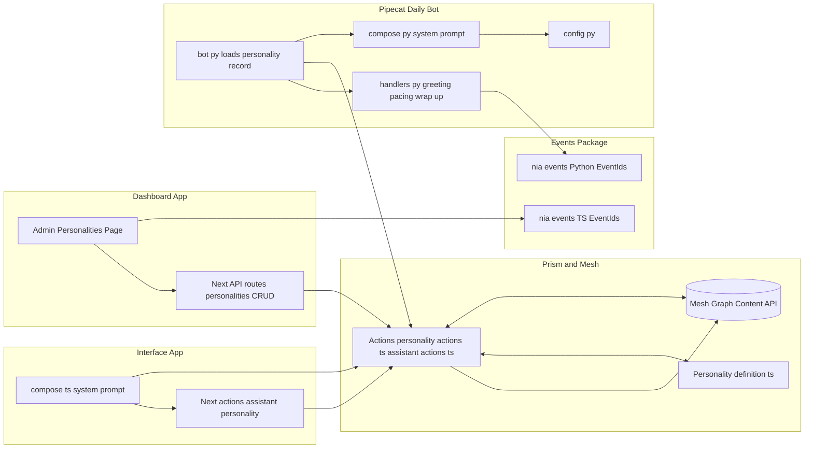
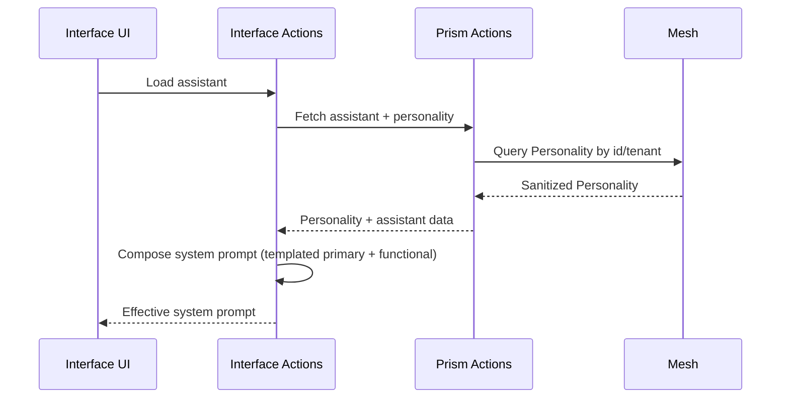
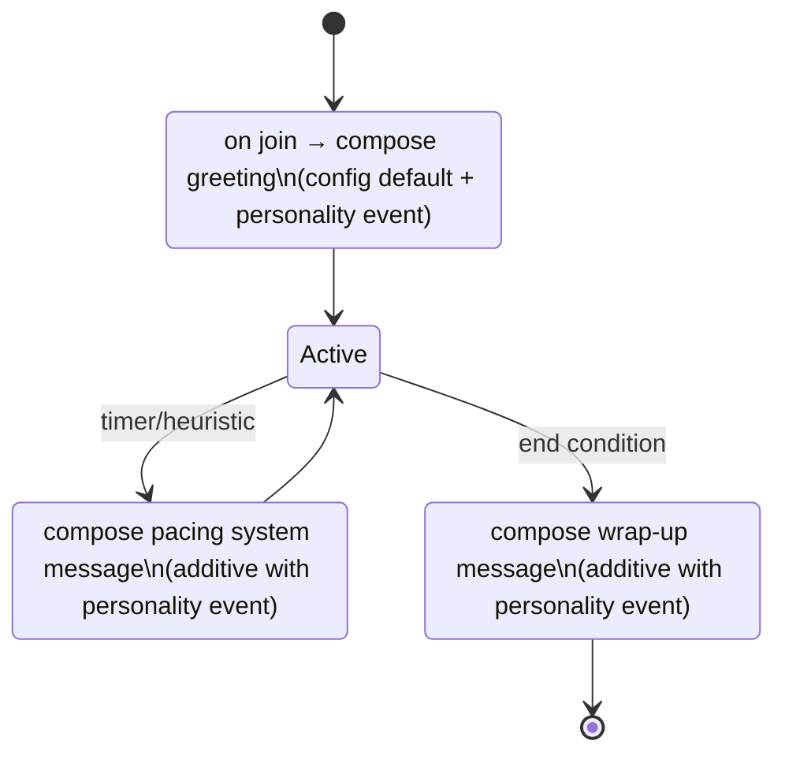

# Personality Management: Current Architecture & Integration

Author: Engineering
Date: 2025-09-11
Target Branch: staging

This document describes the current, production-adjacent state of Personality management across the platform definition (Prism), Dashboard authoring, Interface utilization, and Bot utilization. It supersedes the earlier proposal/plan and reflects the implemented single‑response event prompts, UI, sanitization, and runtime wiring.

---

## At a glance

- Platform data type Personality is defined in Prism and registered with Mesh.
- Event prompts use a single response per event: `{ event, response: { text } }`.
- Dashboard provides an admin Personalities page with CRUD and event prompt editors.
- Interface composes assistant system prompts from Personality primaryPrompt + functional prompt; templating supported.
- Bot consumes Personality event prompts for greeting, pacing, and wrap‑up; config defaults are preserved (additive behavior).
- Events catalog is provided via `@nia/events` (TS) and `nia-events` (Python) to keep event keys consistent.

---

## Overall architecture (Mesh integration)



---

## Platform definition (Prism)

- Location:
  - `packages/prism/src/core/platform-definitions/Personality.definition.ts`
  - `packages/prism/src/core/actions/personality.actions.ts` (sanitization + CRUD helpers)
  - `packages/prism/src/core/actions/assistant-actions.ts` (ensures sanitized personality content on assistant fetch)

- Effective content shape (current):

```ts
type Personality = {
  name: string
  description?: string
  primaryPrompt?: string
  variables?: ("username" | "roomName" | string)[]
}
```

- Backward compatibility: server-side sanitization quietly converts legacy `responses: {text}[]` into `response: {text}` on read/write paths (get, list, create, update, clone).

---

## Dashboard authoring

- Location:
  - Admin page and editor: `apps/dashboard/src/app/dashboard/admin/personalities/page.tsx` and `.../personalities_client.tsx`
  - API routes: `apps/dashboard/src/app/api/personalities/` (list, create) and `.../[id]/route.ts` (get/update/delete)
  - Tests: `apps/dashboard/__tests__/admin-personalities-page.test.tsx`

- Current capabilities:
  - List tenant-scoped personalities, usage count (assistants referencing them), and basic metadata.
  - Edit primary prompt and per‑event system prompts using the single‑response shape.
  - Variable helpers in the editor (e.g., a clickable `{{username}}` badge inserts at caret) to guide templating.
  - Add/remove events from a generated catalog (via `@nia/events` when available) to prevent drift.

- UX notes:
  - Batch edits save on blur; destructive actions confirm.
  - Selected row is visually highlighted for clarity.

---

## Interface utilization

- Location:
  - Composition util: `apps/interface/src/lib/personality/compose.ts`
  - Assistant load: `apps/interface/src/actions/getAssistant.ts`

- Behavior:
  - Compose effective system prompt as `templated(primaryPrompt) + "\n\n" + assistant functional system prompt`.
  - Interpolation supports `{{username}}` and `{{roomName}}` with safe defaults (empty string if missing); default pipe `{{var|default}}` is supported where used.
  - Reads the updated single‑response event prompt shape; currently Interface focuses on primary prompt composition.



---

## Bot utilization (Daily runtime)

- Location:
  - Handlers: `apps/pipecat-daily-bot/bot/handlers.py`
  - Config defaults: `apps/pipecat-daily-bot/bot/config.py`
  - Wiring: `apps/pipecat-daily-bot/bot/bot.py` (passes `personality_record` to handler registration)
  - Tests: `apps/pipecat-daily-bot/bot/tests/test_prompt_interpolation.py`

- Behavior:
  - Event prompts used additively for:
    - Greeting (bot.conversation.greeting / session start)
    - Pacing tick (periodic system nudge)
    - Wrap‑up (conversation end)
  - Config default messages are preserved; personality response is appended to maintain legacy behavior.
  - Safe interpolation: `{{username}}`, `{{roomName}}`, with `{{var|default}}` support.



---

## Event catalog and consistency

- TypeScript: `@nia/events` exports event ids used by Dashboard to populate the event selector.
- Python: `nia-events` provides matching ids for bot runtime.
- Avoids string drift between layers; event prompts in personalities reference these ids.

---

## Data and templating model

```json
{
  "name": "Cheerful",
  "primaryPrompt": "You are cheerful and concise.",
  "variables": ["username", "roomName"]
}
```

Interpolation contract:

- `{{var}}` or `{{var|Default}}` where supported.
- Unknown/missing values resolve to empty string unless a default is provided.
- No logic beyond simple replacements; HTML/markdown pass‑through.

---

## Current source references

- Platform
  - `packages/prism/src/core/platform-definitions/Personality.definition.ts`
  - `packages/prism/src/core/actions/personality.actions.ts`
  - `packages/prism/src/core/actions/assistant-actions.ts`

- Dashboard
  - `apps/dashboard/src/app/dashboard/admin/personalities/page.tsx`
  - `apps/dashboard/src/app/dashboard/admin/personalities/personalities_client.tsx`
  - `apps/dashboard/src/app/api/personalities/*`

- Interface
  - `apps/interface/src/lib/personality/compose.ts`
  - `apps/interface/src/actions/getAssistant.ts`

- Bot
  - `apps/pipecat-daily-bot/bot/handlers.py`
  - `apps/pipecat-daily-bot/bot/config.py`
  - `apps/pipecat-daily-bot/bot/bot.py`
  - `apps/pipecat-daily-bot/bot/tests/test_prompt_interpolation.py`

- Events
  - TypeScript: `packages/events` (exported as `@nia/events`)
  - Python: `packages/events/python` (installed as `nia-events`)

---

## Observability & PII

- No raw PII logged when composing prompts; inputs are sanitized.
- Bot logging remains structured; messages are not logged verbatim at info level.
- Follow redaction guidance in events descriptors where applicable.

---

## Next steps (deferred)

- Broaden Interface usage of event prompts where appropriate.
- Add additional editor affordances (e.g., `{{roomName}}` helper badge) as needed.
- Expand tests for pacing and wrap‑up interpolation.
- Consider weighted/multi‑response prompts (with migration plan) if needed later.


## 15) Rollout Plan

Phase 1 (this PR series): [INPROGRESS]

- DONE: Personality definition + registration; merged index; seed defaults; Assistant schema field (`personalityId`); Dashboard update route whitelist.
- DONE: Dashboard Assistant "Personality" tab with chooser; persists selection.
- DONE: Interface composition util; Prism helper to fetch by id/key.
- PENDING: Wire Interface load path to fetch selected personality and compose prompt.
- PENDING: CRUD/editor for Personality, save-time validation toasts.
- PENDING: Python bot client + retrieval; replace hardwired personalities.
- PENDING: `packages/events` (descriptors + codegen) and adoption in UI/Bot.
- PENDING: Tests across layers (unit/integration/pytest/e2e where applicable).

Phase 2:

- Replace any remaining hardwired codepaths; add random/weighted response selection; add additional variables as needed.

Rollback:

- Feature-flag the Dashboard panel; keep old hardwired path behind a fallback until migration verified; reverting PR returns system to prior behavior.
- Keep a fallback mapping layer in Bot for legacy event names during transition; removal after successful adoption.

---

## 16) File Deltas (anticipated)

- packages/prism/src/platform-definitions/Personality.definition.ts (new)
- packages/prism/src/platform-definitions/index.ts (new + refs)
- scripts/register-platform-definitions.ts (update)
- scripts/seed-personalities.ts (new)
- apps/dashboard/src/features/Personality/**/* (new UI + tests)
- apps/interface/src/lib/personality/compose.ts (new) + integration hook (init)
- apps/pipecat-daily-bot/bot/nia_prism_client/personality.py (new) + tests
- packages/prism/__tests__/personality.test.ts (new)
- packages/events/descriptors/*.json (new)
- packages/events/codegen/* (new)
- packages/events/src/index.ts (new) exporting generated TS API
- apps/dashboard uses `@events` for event ids (updates in Personality UI)
- apps/pipecat-daily-bot/bot uses generated Python events module (updates)

---

## 17) Open Questions

1. Should `assistantId` overrides be supported in v1, or defer to v2?
2. Any required localization/i18n for prompts now?
3. Do we need RBAC granularity beyond Dashboard admins for editing personalities?
4. Preferred Python modeling library for events: Pydantic vs dataclasses (lean)?
5. Where to host generated Python module: checked-in under bot repo path vs wheel artifact?

---

## 18) PR & Merge Hygiene (when implementing)

- Moves first for platform definitions; then edits/register
- Add tests alongside new modules
- Populate PR template with diff stats, risk, testing evidence, and requirements coverage

---

## 19) Requirements Coverage Matrix

| Requirement | Plan Status |
| --- | --- |
| New Personality type | Defined (sections 5, 16) |
| Primary prompt | Included (5) |
| Event-based prompts | Included (5, 9) |
| Variables (username, roomName, topic) | Included (6.2) |
| Assistant composition | Included (6.3) |
| Refactor platform types to isolated files | Included (7) |
| Dashboard panel | Included (7) |
| Refactor hardwired Bot personalities | Included (8, 15 phase 1/2) |
| Refactor assistant personalities | Included (8) |
| Bot retrieval + Python client | Included (6.5, 7) |
| Tests | Included (11) |
| Events package + codegen (TS/Python) | Included (6.6, 7, 15, 16) |
| Dashboard uses generated event ids | Included (6.6, 9, 16) |
| Assistant pane tab + chooser + toasts | Included (7, 11) |

Additional updates in this branch:

- Tenant duplicate-name guard implemented in `TenantActions.createTenant` and surfaced as HTTP 409 from `POST /api/tenants`.

---

Appendix: Minimal TypeScript interfaces

```ts
export type Personality = {
  key: string;
  name: string;
  description?: string;
  primaryPrompt: string;
  variables?: ("username"|"roomName"|"topic")[];
  version?: number;
};
```
