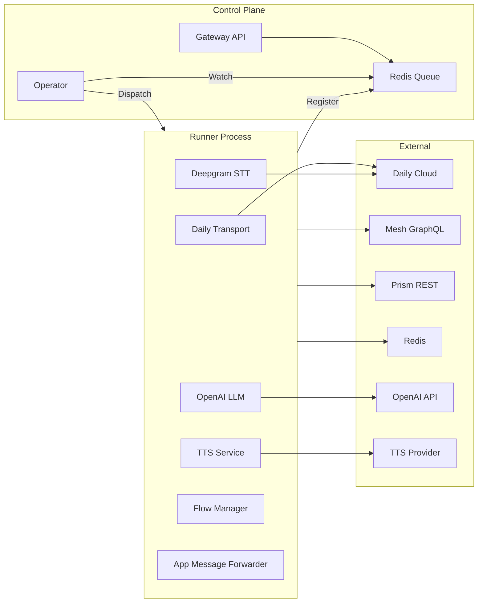
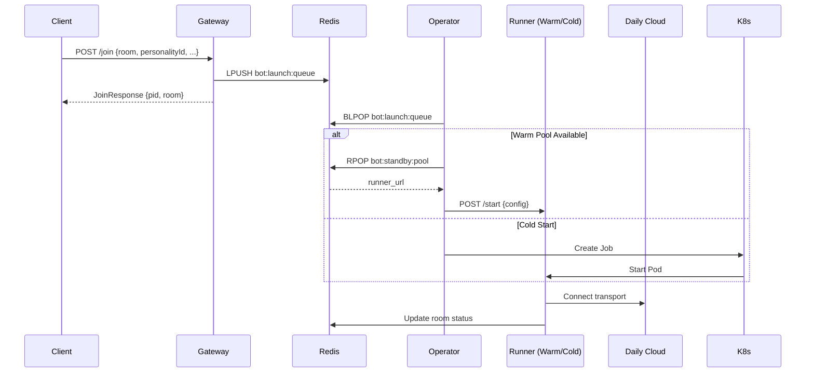

# Pipecat Daily Bot Architecture

> Source context: `apps/pipecat-daily-bot` (Python FastAPI control plane + Pipecat runtime) and supporting docs under `docs/`.

## System Overview

Pipecat Daily Bot is a Python-based voice assistant that joins Daily.co rooms, manages conversation flow via the Pipecat audio pipeline, and collaborates with the broader Nia platform. The service can run in three primary modes:

- **Gateway Mode** — `bot/bot_gateway.py` exposes REST APIs for joining rooms, pushing requests to a Redis queue for the Operator to handle.
- **Operator Mode** — `bot/bot_operator.py` watches the Redis queue and dispatches jobs to warm runners or spawns new Kubernetes Jobs.
- **Runner Mode** — `bot/runner_main.py` runs the Pipecat session, registering itself to the warm pool if configured.

Shared libraries (`bot/actions/*`, `bot/mesh_client.py`, `bot/toolbox.py`, `bot/flows/*`, etc.) encapsulate Mesh access, tool registration, flow state, and event routing.

## Core Components

| Layer | Responsibility | Key Modules |
| --- | --- | --- |
| Control plane | Authenticated REST API for provisioning and queuing join requests | `bot/bot_gateway.py`, `bot/auth.py` |
| Orchestration | Queue consumption, warm pool dispatch, Kubernetes Job spawning | `bot/bot_operator.py` |
| Session runtime | Pipecat pipeline orchestration, flow manager, identity reconciliation, toolbox tool registration | `bot/runner_main.py`, `bot/bot.py`, `bot/flows/*` |
| Integrations | Mesh GraphQL/REST helpers, Redis migrations, Daily API token generation | `bot/mesh_client.py`, `bot/redis_*`, `bot/create_daily_room_token` |
| Observability | Event bus envelopes, SSE/WebSocket streaming | `bot/eventbus/*`, `bot/utils/logging_utils.py` |

## External Services

- **Daily.co** — primary transport for audio, transcription, and app messages; tokens generated via `create_daily_room_token` when `DAILY_API_KEY` is present.
- **Deepgram** — Daily-managed STT provider feeding text frames into Pipecat.
- **OpenAI GPT-4o mini** — LLM used for conversation planning and tool invocation.
- **Text-to-Speech provider** — ElevenLabs by default, Kokoro/Chorus when `BOT_TTS_PROVIDER=kokoro` and Kokoro env vars are supplied.
- **Mesh / Prism** — GraphQL + REST APIs used for personalities, notes, applets, profiles, and functional prompts via the actions layer.
- **Redis (optional)** — identity, heartbeat, and admin message migrations provide compatibility between file-based and Redis-backed state.

## Startup Lifecycle (Gateway Mode)

FastAPI’s `lifespan` handler in `bot/bot_gateway.py` performs minimal bootstrapping:

1. Load `.env` files via `dotenv`.
2. Connect to Redis for queue management.
3. Configure CORS and authentication.

The **Operator** (`bot/bot_operator.py`) runs independently, watching the Redis queue and managing the lifecycle of bot sessions.

## Session Lifecycle (`POST /join`)

Key behaviors:

- **Decoupled Dispatch**: The Gateway returns immediately after queuing the request; the Operator handles the actual provisioning asynchronously.
- **Warm Pool Priority**: The Operator attempts to fetch a ready runner from `bot:standby:pool` before falling back to spawning a new Kubernetes Job.
- **Distributed State**: Room status and runner availability are tracked in Redis, allowing multiple Gateway/Operator instances to scale.

## Pipecat Pipeline Construction

Within `bot.py`:

1. **Toolbox preparation** — merges preloaded functional prompts with dashboard content for notes, applets, profiles, etc. (`toolbox.prepare_toolbox`).
2. **LLM setup** — `OpenAILLMService` (model `gpt-4o-mini`) with registered function tools; `OpenAILLMContext` tracks conversation messages.
3. **Transport + Audio** — `DailyTransport` provides input/output frames, Silero VAD gating, and transcription updates.
4. **Flow Management** — `build_flow_manager` wires Flow-only conversation beats, admin nodes, pacing, and wrap-up timers.
5. **App Message Forwarder** — bridges Daily app messages to internal event bus and allows inbound control envelopes (`AppMessageForwarder`).

The assembled `Pipeline` is executed by a `PipelineTask`, emitting events for speaking started/stopped, participants join/leave, and conversation beats.

## Process Management & Health

- **Heartbeat monitoring** — Session processes update files in `BOT_HEARTBEAT_DIR`; the control server reaps zombies based on `BOT_HEARTBEAT_STALE_SECS` and `BOT_ZOMBIE_REQUIRED_STALE_HITS`.
- **Admin messaging** — `POST /admin` writes structured payloads into `BOT_ADMIN_MESSAGE_DIR`; bot processes poll and apply immediate or queued instructions in Flow Manager.
- **Identity queue** — Session processes reconcile participant identity via file drops or Redis, mapping Daily participant IDs to `sessionUserId` for profile loading.
- **Graceful shutdown** — `/sessions/{pid}/leave` escalates signals (`SIGINT` → `SIGTERM` → `SIGKILL`), removes room mappings, and publishes `bot.session.end`.

## Runner Mode Overview

`bot/runner_main.py` provides a slimmer façade for environments that prefer `pipecat.runner` semantics:

- `POST /start` provisions (or attaches to) a Daily room, creating a managed session task.
- `GET /sessions` lists active runner sessions; `/sessions/{id}/leave` cancels tasks.
- Optional `/daily/webhook` auto-spawns sessions from Daily webhook events.
- Shares the same underlying `bot(bot_args)` entrypoint and pipeline configuration as server mode.

## Integration Suite Touchpoints

Future automated testing can exercise the bot through the following interfaces:

1. **Control API** — `POST /join`, `POST /admin`, `POST /sessions/{pid}/leave`, and SSE/WS event streams enable programmatic end-to-end orchestration.
2. **Runner API** — `POST /start` plus `/sessions` endpoints support ephemeral test rooms without the legacy control plane.
3. **Daily App Messages** — Use `DailyTransport`’s app message channel via AppMessageForwarder to inject scripted inputs or observe tool events.
4. **Event Bus Streams** — Subscribe to `/events` or `/ws/events` to assert on `daily.*`, `bot.*`, and tool-specific envelopes during replayed audio/text scenarios.
5. **Audio Injection** — Feed prerecorded audio into Daily rooms (or stub Daily transport in tests) to validate STT→LLM→TTS round-trips.

Documenting and automating these entrypoints enables a future integration harness to spawn bots, stream audio clips, drive admin commands, and verify outputs without manual intervention.

## Reference Files

Last reviewed: November 2025
