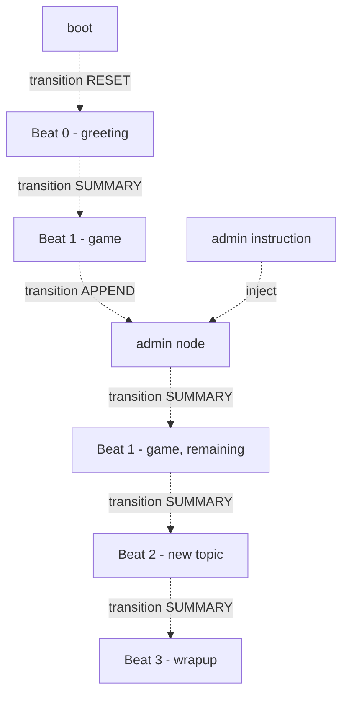

# Pipecat Daily Bot — FlowManager defaults and runtime behavior

This document describes the default Flow-only behavior for the pipecat-daily-bot, including node transitions, context strategies, conversational gates and nudges, and how admin instructions are handled.

## At a glance

- Flow-only execution with FlowManager as the source of truth for state and node switching.
- Context strategies:
  - Global default: RESET_WITH_SUMMARY
  - Beat 0 (first beat after greeting): APPEND (fast-path start)
  - Subsequent beats: typically SUMMARY (RESET_WITH_SUMMARY)
- Role messages are rebuilt from:
  - Personality message (system)
  - Participant context (system, structured snapshot)
  - Participant roster summary (system, sanitized and compact)
  - Lightweight policy nudges (system), e.g., “don’t greet again” after first greeting
- Role message re-apply: only when content actually changes (change-detection), with a small debounce to avoid refresh storms.
- Gating and pacing:
  - Fast first-run gate for very first response after greeting
  - Post-assistant-speak buffer before transitioning into beats
  - User-idle gate before beat transitions to avoid preempting users
- Admin instructions:
  - Immediate admin interrupts current flow and transitions to an admin node
  - Queued admin appends guidance to conversation task messages and is consumed in order
  - After an admin message completes, either continue admin chain if queued, or return control to the regular flow

## Visual flow (default transitions)

Interpretation notes:

- Boot → Beat 0 (greeting) uses a RESET-style transition to start clean.
- Beat 0 → Beat 1 applies SUMMARY to incorporate what just happened.
- During the Beat 1 window, an admin node can be injected. While scheduling the next beat, we may APPEND to avoid unnecessary resets.
- After admin is processed, we SUMMARY back into the remaining portion of the current beat (Beat1Clone), then proceed through additional beats via SUMMARY until wrap-up.

## Nodes and context strategies

- Default strategy on FlowManager: RESET_WITH_SUMMARY
- Beat 0 (first beat after greeting): APPEND
  - Rationale: Avoid heavy summarization right after greeting to minimize first-turn latency.
- Conversation node:
  - Maintains RESET_WITH_SUMMARY when explicitly reset via summary
  - Injects opening prompt into role messages only before the first greeting; after any greeting, the opening prompt is omitted (prevents repeats)
- Wrapup node:
  - Role messages built from personality + current participant context/summary
  - First task message is the wrap-up prompt (taken from personality beats’ final line, or the default)

## Gates and pacing controls

These gates shape when we queue LLM runs or switch nodes, reducing interruptions and improving perceived responsiveness:

- Fast first-run gate (BOT_FIRST_SPEAK_GATE_SECS)
  - A short, lightweight delay before the very first LLM run after greeting.
  - Purpose: Kickstart response quickly without the overhead of long gates.

- Post-assistant-speak buffer (BOT_BEAT_POST_SPEAK_BUFFER_SECS)
  - After the assistant finishes speaking, wait briefly before transitioning into a beat.
  - If the user starts talking during this buffer, we abort the transition.
  - Purpose: Avoid stepping on the user’s response right after assistant output.

- User-idle gate before beat transitions (BOT_BEAT_USER_IDLE_SECS, BOT_BEAT_USER_IDLE_TIMEOUT_SECS)
  - Wait for the user to be idle before entering a new beat.
  - Purpose: Reduce preemption; let the user finish their thought before nudging forward.

- Speak gate (BOT_SPEAK_GATE_DELAY_SECS)
  - Small delay applied prior to queuing an LLM run; in tests this is set very low to be deterministic.

## Role messages and conversation nudges

We rebuild role messages whenever identity or participant state changes. Each node’s `role_messages` is composed of:

1. Personality message (system)
2. Participant context (system)
   - Sanitized and compact snapshot of relevant session/user profile data
3. Participant roster summary (system)
   - Structured array of participants (non-stealth), plus “most recent arrival” metadata
4. Policy nudges (system)
   - After the first greeting, we inject a nudge to avoid re-greeting lines and to proceed naturally

Key behaviors:

- Opening prompt is included only pre-greeting, and removed once any greeting has occurred.
- We only re-apply the active node if `role_messages` content actually changed (reduces churn), and refreshes are debounced.

## Admin instructions

We support two modes of admin instruction delivery; both are sanitized and normalized:

- Immediate mode
  - Bypasses standard gating to truly interrupt
  - Transitions to the `admin_instruction` node with a prominent system task message (e.g., “ADMIN INSTRUCTION [IMMEDIATE…]”)
  - After completion, if additional admin messages exist, we continue processing them; otherwise, we remove the admin node and return control to the regular flow

- Queued mode
  - Appends an admin system task message into the conversation node’s `task_messages`
  - When promoted (e.g., via admin transition), the queued item is consumed, recorded to admin history, and an admin node is created for immediate handling

In both cases, we ensure:

- Admin task messages are clearly labeled and removed from the conversation once consumed
- Admin history records what was processed

Note: Resuming the exact prior beat position is guided by pacing state. If there are remaining items in the current beat’s window, we return to it (as seen by Beat1Clone in the diagram). If not, we proceed to the next appropriate node.

## Timers and environment knobs

- BOT_WRAPUP_AFTER_SECS — default delay before wrap-up pacing activates
- BOT_BEAT_REPEAT_INTERVAL_SECS — base cadence for beat pacing
- BOT_GREETING_GRACE_SECS — window to group arrivals into single/pair/group greetings
- BOT_SPEAK_GATE_DELAY_SECS — minimal gating before queuing an LLM run
- BOT_FIRST_SPEAK_GATE_SECS — lightweight gate for the first utterance after greeting
- BOT_BEAT_POST_SPEAK_BUFFER_SECS — buffer after assistant speech before beat transition
- BOT_BEAT_USER_IDLE_SECS / BOT_BEAT_USER_IDLE_TIMEOUT_SECS — user-idle gating for beat transitions
- BOT_SANITIZE_FLOW_PROFILE_FIELDS — toggles participant profile sanitization

## Operational notes

- First utterance latency is reduced by:
  - Using RESET for Beat 0
  - Employing a fast first-run gate
  - Deferring heavier summarization to later transitions
- Role-message churn is reduced by content change detection and refresh debounce.
- Greeting repetition is dampened by policy nudges and by omitting the opening prompt after the first greeting.

## Testing overview

- Tests cover greeting windows (single/pair/group), admin queue/consume behavior, node summary resets, and role-message construction.
- Flow-only tests allow for asynchronous scheduling; assertions poll briefly for `LLMRunFrame` rather than relying on a single fixed sleep.

## Appendix: glossary

- RESET: Rebuild context with a summary of prior turns (RESET_WITH_SUMMARY)
- SUMMARY: Equivalent to RESET_WITH_SUMMARY in our codebase (uses a summary tap)
- APPEND: Lightweight, append-only context update; fastest transition path
- Admin node: A temporary node that prioritizes admin instructions over the current beat
