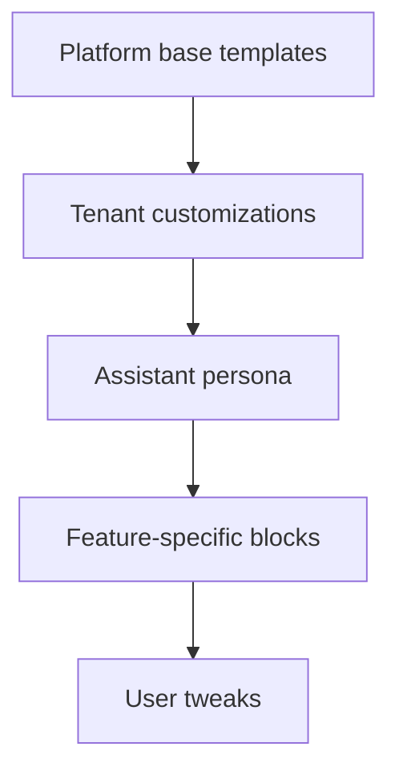

# Prompt Shaping — Planning Document

Status: Draft (planning only; no implementation yet)

Owner: Jeffrey Klug
Date: 2025-08-27

## Purpose

Define how we assemble assistant prompts (what the assistant “thinks and says”) as configuration-as-code: templates, personalities, safety filters, and sanitized summaries. Keep this separate from Conversation Policy (which decides what to do) to preserve clarity and team ownership.

## Scope and placement

- Lives inside Interface for now (exact folder to be chosen in RFC).
- Feeds the assistant/Vapi inputs; does not emit events directly.
- Coordinates with Conversation Policy via hints (e.g., requested tone for a nudge).

## Layering model (overrides)

Same precedence as rules: User → Feature → Assistant → Tenant → Platform. Higher layers can tweak tone, add/remove sections, or swap templates.



## Building blocks

- Templates: system, tool, and response blocks; minimal, readable syntax (templating choice to be decided in RFC)
- Persona packs: tone/style defaults, vocabulary, do/don’t lists
- Safety/redaction: content filters to remove PII or sensitive details from summaries
- Summaries: short, sanitized conversation digests fed back into prompts
- Hints: policy-supplied metadata (e.g., kind: nudge|warn|remove; audience: user vs host)

## Inputs and outputs

- Inputs: conversation state, sanitized summaries, policy hints, user settings (e.g., “playful”)
- Outputs: rendered prompt blocks (system + tools + user messages) and metadata (token budget estimates)

## Authoring/testing

- Authoring: YAML/JSON configs for which blocks to include; template files for content
- Testing: snapshot rendered prompts from fixtures; redaction unit tests; guardrail tests for banned phrases
- Review: content diff with highlights; vocabulary and tone checklists

## Runtime behavior (planning)

- Resolution: assemble effective template stack using layering rules for the session
- Rendering: apply variables and hints; enforce token budgets and truncation strategies
- Observability: token counts, render latency, refusal/deflection rates, variant IDs for A/B tests
- Safety: blocklists/allow-lists; mandatory sections (e.g., privacy constraints)

## Examples (illustrative)

Assistant-level persona (YAML):

```yaml
persona:
  name: Helpful Facilitator
  tone: balanced
  style: concise
  bannedPhrases: ["shut up"]
```

User-level tweak (YAML):

```yaml
overrides:
  tone: playful
```

Nudge response block (template fragment):

```text
Hey {{targetName}}, let's give others a turn and then come back—curious to hear {{quietUser}} next.
```

## Folder conventions (to be decided in RFC)

- apps/interface/src/features/prompt-shaping/
  - templates/
  - personas/
  - docs/
  - fixtures/

## Interactions with Conversation Policy

- Policy emits hints (e.g., nudge vs warn) → Prompt shaping selects matching block and tone.
- Prompt shaping emits no events; it returns strings/blocks consumed by the assistant layer.

## Open decisions for RFC

- Templating engine or minimal token replacer
- Where to perform redaction (pre-render vs post-render)
- Token budgeting and truncation strategies per assistant
- A/B testing hooks and variant selection

## Related

- Interface Event System — Future Directions: `docs/interface-event-system-future-directions.md`

## Config source and authoring (Dashboard)

- Source of truth: per-assistant prompt profiles in Dashboard (Mongo), versioned draft/published.
- Collections (planning names): `prompt_profiles` (base) and optional `prompt_profile_overrides` (feature/tenant/user).
- Versioning: drafts → publish → rollback; staged publish to cohorts as needed.
- Data shape (planning-level):
  - id, assistant_id, version, status
  - persona: tone, style, vocabulary, bannedPhrases
  - templates: include lists and ordering for system/tool/response blocks
  - redaction: filters and truncation/budgeting settings
  - summaries: sanitized summary settings
  - overrides[] with scope + payload
  - validationSummary, updatedBy, updatedAt
- Dashboard UI placement: Assistant → Behavior → Prompts tab
  - Editors: persona form, templates list + editor with live preview
  - Redaction preview: before/after view
  - Token preview: estimated token counts per block
  - Controls: draft/publish/rollback; staged cohorts; permissions by role

## Interface consumption and layout

- Resolution: assemble effective prompt stack based on session context; accept hints from policy (e.g., kind: nudge|warn|remove).
- Outputs: rendered blocks consumed by the assistant/Vapi layer; no event emission.
- Observability: tag with promptVersion; collect render latency and token metrics.
- Proposed feature layout:
  - `apps/interface/src/features/prompt-shaping/`
    - `docs/`, `fixtures/`, `templates/`, `personas/`, `types/`, `client/`
