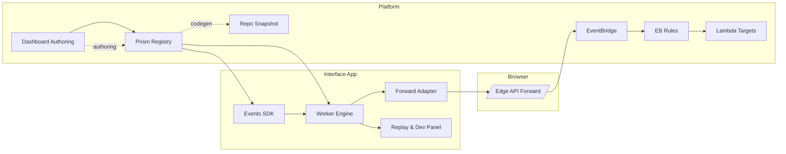

# Interface Event System — Implementation Plan (Historical Canonical)

This document preserves the original implementation plan content for the Interface Event System. Active direction may be captured in `docs/eventing/interface-event-system-rfc.md`.

> Note: This document was moved to `docs/transitions/eventing/interface-event-system-implementation-plan.md` to reflect its planning/in‑progress status. The content below is the canonical historical record.

## Interface Event System — Implementation Plan

Status: Draft
Date: 2025-08-28
Owner: Jeffrey Klug
Related Docs: `interface-event-system-plan.md`, `interface-event-system-rfc.md`, `interface-event-topics-forwarding.md`, `conversation-policy-plan.md`, `prompt-shaping-plan.md`

## 1. Objective

Deliver the Phase 1 event system: worker‑hosted typed bus, topic registry integration, forwarding adapter (forward‑by‑default), sampling & conditional redaction, basic Conversation Policy runtime hooks, and observability. Minimize surface churn (stable SDK) while enabling rapid future expansion (policies, prompt shaping, broader forwarding).

Terminology: "Events SDK" below explicitly refers to the published `@nia/prism/core/events` package (planned location under `prism/src/core/events`) that exposes the stable public API (publish/on/once/replay/schedule/health + generated types). Internal modules (worker engine, forwarding adapter, policy runtime, rule sources) are implementation details behind that package boundary.

## 2. Scope (Phase 1 Build)

In: SDK, worker engine, registry loader + validation (dev only), forwarding adapter, sampling & circuit breaker, ring buffer & replay panel plumbing point, health metrics, minimal policy runtime (just enough to publish actions), feature flag wiring.

Out (defer): Full prompt shaping engine, cross‑tab sync, durable storage, advanced policy editor, server‑side enrichment/analytics pipelines.

## 3. High‑Level Workstreams

| # | Workstream | Goal | Key Outputs |
|---|------------|------|-------------|
| 1 | Registry & Codegen | Typed topics + validation | `generate:events` script, `TopicMap` TS, JSON schema loader |
| 2 | Core SDK | Simple publish/on/schedule API | `@nia/prism/core/events` package entrypoints & hooks |
| 3 | Worker Engine | Off‑main‑thread bus w/ ring buffer & scheduling | `engine.ts`, message protocol, ring buffer impl |
| 4 | Forwarding Adapter | Batch + policy (default/sample/conditional/deny) + redaction + breaker | `forwardingAdapter.ts` |
| 5 | Policy Runtime (MVP) | Load in‑memory rules & emit actions | `policy/runtime.ts` + integration with bus |
| 6 | Observability | health(), counters, basic latency sampling | `metrics/*` modules + debug panel contract |
| 7 | Edge API Contract | Client request shape & integration stub | Reuse existing `/api/events/forward` route (scaffold tests) |
| 8 | Governance & CI | Lints (PII + forwardingPolicy), schema drift checks | ESLint rule / script, CI job |
| 9 | Rollout & Flags | Gradual enable & telemetry gating | Flags in config + gating docs |

## 4. Incremental Milestones & Acceptance

| Milestone | Target (Week) | Acceptance Criteria |
|-----------|---------------|---------------------|
| M1: Registry & Codegen | W1 | `pnpm generate:events` outputs `topics.generated.ts`; dev build validates unknown topic usage triggers warning |
| M2: SDK Core + In‑Thread Fallback | W1.5 | `events.publish/on/once/off` works in unit tests (Jest); no worker yet |
| M3: Worker Engine & Scheduling | W2 | Worker boot, message round‑trip < 5ms p50 locally; scheduling emits interval events; replay returns last N |
| M4: Ring Buffer & Replay API | W2.5 | Replay returns correct order, prunes beyond ring size; health shows buffer sizes |
| M5: Forwarding Adapter (default only) | W3 | Events with `forwardingPolicy=default` batched & POSTed; 202 response parsing; breaker trips after N failures |
| M6: Sampling & Conditional Policies | W3.5 | Sampled topics forward at configured probability (±10% tolerance over 1k events); conditional redaction applied |
| M7: Policy Runtime MVP | W4 | Rule triggers emission of action topic; guards (cooldown, rate) enforced in tests |
| M8: Observability & Metrics | W4 | `health()` returns counters & last flush latency; simple latency percentile instrumentation test |
| M9: Flagged Rollout & Docs | W5 | Flags toggle worker & forwarding at runtime; docs updated; staging smoke passes |

## 5. Risks & Mitigations (Selective)

| Risk | Impact | Mitigation |
|------|--------|-----------|
| Worker startup lag | Early events lost | Queue pre-worker; buffer outbound until ready flag |
| Over-forwarding volume | Cost & noise | Sampling + adaptive backoff metrics threshold |
| Redaction bugs | PII leakage | Unit tests + schema driven removal + CI lint enforcing declared fields exist |
| Policy loop / recursion | Event storm | Guard depth counter & max actions per tick |
| Type drift between registry & code | Runtime errors | Single codegen source; forbid manual topic string literals (eslint rule) |

## 6. Rollout Strategy

1. Ship inert package & codegen (flags off).
2. Enable worker engine for internal cohort (`eventBus.enabled`).
3. Turn on forwarder dry run (collect metrics but don't POST).
4. Activate real forwarding for baseline topics.
5. Enable sampling & conditional topics after redaction verification.
6. Expand to additional topics via registry changes only (no code change).

## 7. Integration Diagram (Mermaid)

The diagram shows how the in‑app Events SDK communicates with the dedicated Worker (hosting the bus, ring buffer, and policy runtime), how events are forwarded (subject to policy, sampling, and redaction) to the Edge API, and how the platform side (EventBridge + rules + serverless targets) and authoring surfaces (Dashboard + Prism registry) feed the local registry/codegen loop.



## 8. Message & Module Boundaries

| Boundary | Purpose | Format |
|----------|---------|--------|
| UI ⇄ Worker | Event control plane | `postMessage({ op, topic, payload, meta })` |
| Worker ⇄ Forwarder | Internal queue ops | In-memory calls (no serialization) |
| Forwarder ⇄ Edge API | Batch events | JSON HTTP POST |
| Registry Loader ⇄ Prism | Fetch snapshot (future) | REST/GraphQL (deferred; Phase 1 uses static JSON) |

## 9. Code Skeleton (Big Brush Strokes)

Illustrative file layout (not yet created) — provides a high‑level glance at planned modules so contributors can navigate and stage work without hunting through the plan.

```text
packages/
  interface-events/
    src/
      index.ts
      sdk/events.ts
      sdk/hooks.ts
      worker/engine.ts
      worker/messageTypes.ts
      worker/forwardingAdapter.ts
      worker/policyBridge.ts
      policy/runtime.ts
      registry/loadRegistry.ts
      registry/types.ts
      registry/validation.ts
      buffering/ringBuffer.ts
      metrics/health.ts
      util/ids.ts
      util/time.ts
      util/circuitBreaker.ts
      __tests__/*.test.ts
scripts/
  generate-events.ts
```

### 9.1 Types & Registry

Description: Core registry type definitions establish a single source of truth for topic metadata (PII classification, forwarding policy, sampling knobs) enabling codegen, validation, lint rules, and runtime behavior to remain consistent.

```ts
// registry/types.ts
export type PiiLevel = 'none' | 'low' | 'high';
export type ForwardingPolicy = 'default' | 'sampled' | 'conditional' | 'deny';

export interface TopicDefinition {
  topic: string;
  version: string;
  description?: string;
  deliveryPolicy: 'sync' | 'queued';
  bufferPolicy: 'none' | 'last' | 'ring';
  ringSize?: number;
  rateLimitPerSec?: number;
  sampleEveryN?: number;
  sampleRate?: number; // probabilistic
  piiLevel: PiiLevel;
  redactionHint?: { remove?: string[]; hash?: string[] };
  forwardingPolicy: ForwardingPolicy;
  payloadSchema: any; // JsonSchema (ref typed later)
  metaSchema?: any;
  tags?: string[];
  deprecated?: boolean;
}

export interface RegistrySnapshot {
  generatedAt: string;
  topics: Record<string, TopicDefinition>; // key = topic
}
```

Description: Registry loader centralizes how the runtime accesses the generated snapshot, enabling a future pivot to dynamic fetching (e.g., Prism) without changing call sites.

```ts
// registry/loadRegistry.ts
import { RegistrySnapshot } from './types';

let snapshot: RegistrySnapshot | null = null;

export function loadRegistry(): RegistrySnapshot {
  if (!snapshot) {
    // In Phase 1, require the generated file.
    snapshot = require('../generated/topics.generated.cjs');
  }
  return snapshot!;
}
```

### 9.2 Event Envelope & SDK

Description: SDK in‑thread fallback bus provides a minimal, synchronous implementation for early usage, testing, and graceful degradation when the Worker cannot initialize.

```ts
// sdk/events.ts
import { loadRegistry } from '../registry/loadRegistry';
import { Health } from '../metrics/health';

export interface EventEnvelope<T = any> {
  id: string;
  ts: string; // ISO
  topic: string;
  payload: T;
  meta?: Record<string, any>;
  source?: 'ui' | 'worker' | 'policy';
}

export type Handler<T = any> = (e: EventEnvelope<T>) => void;

interface Subscription { topic: string; handler: Handler; }

export interface EventBusClient {
  publish<T>(topic: string, payload: T, meta?: Record<string, any>): void;
  on<T>(topic: string, handler: Handler<T>): () => void;
  once<T>(topic: string, handler: Handler<T>): void;
  replay(opts?: { topic?: string; since?: string; limit?: number }): Promise<EventEnvelope[]>;
  schedule(opts: { id: string; at?: string; intervalMs?: number; jitterMs?: number; topic: string; payload?: any }): () => void;
  health(): Promise<Health>;
}

export function createInThreadBus(): EventBusClient {
  // Minimal fallback; real impl delegates to WorkerBusClient
  const subs: Subscription[] = [];
  return {
    publish(topic, payload, meta) {
      const env: EventEnvelope = { id: crypto.randomUUID(), ts: new Date().toISOString(), topic, payload, meta, source: 'ui' };
      subs.filter(s => s.topic === topic).forEach(s => safeInvoke(s.handler, env));
    },
    on(topic, handler) { subs.push({ topic, handler }); return () => remove(subs, handler); },
    once(topic, handler) { const wrap: Handler = (e) => { handler(e); off(); }; const off = this.on(topic, wrap); },
    replay() { return Promise.resolve([]); },
    schedule() { return () => {}; },
    health() { return Promise.resolve({ counters: {}, breaker: { state: 'closed' } } as any); }
  };
}

function safeInvoke(fn: Handler, e: EventEnvelope) { try { fn(e); } catch (err) { /* TODO emit bus.error */ } }
function remove(subs: Subscription[], handler: Handler) { const i = subs.findIndex(s => s.handler === handler); if (i>=0) subs.splice(i,1); }
```

### 9.3 Worker Engine (Message Protocol)

Description: Worker message types define the structured contract between main thread and Worker, ensuring type safety for publish, subscribe, replay, scheduling, and health operations.

```ts
// worker/messageTypes.ts
export type WorkerInMsg =
  | { op: 'publish'; env: any }
  | { op: 'subscribe'; topic: string; id: number }
  | { op: 'unsubscribe'; id: number }
  | { op: 'replay'; reqId: string; filter?: { topic?: string; since?: string; limit?: number } }
  | { op: 'schedule'; task: any }
  | { op: 'health'; reqId: string };

export type WorkerOutMsg =
  | { op: 'event'; env: any; subId: number }
  | { op: 'replayResult'; reqId: string; events: any[] }
  | { op: 'healthResult'; reqId: string; health: any }
  | { op: 'error'; error: string; context?: any };
```

Description: Worker engine hosts the event dispatch loop, ring buffer storage, and control message handling off the main thread to guarantee deterministic low‑latency UI responsiveness.

```ts
// worker/engine.ts
import { WorkerInMsg, WorkerOutMsg } from './messageTypes';
import { RingBuffer } from '../buffering/ringBuffer';

const ring = new RingBuffer(500); // default capacity
const subs = new Map<number, { topic: string }>();
let subSeq = 1;

self.onmessage = (evt: MessageEvent<WorkerInMsg>) => {
  const msg = evt.data;
  switch (msg.op) {
    case 'publish':
      ring.push(msg.env);
      deliver(msg.env);
      break;
    case 'subscribe':
      subs.set(msg.id, { topic: msg.topic });
      break;
    case 'unsubscribe':
      subs.delete(msg.id);
      break;
    case 'replay':
      (self as any).postMessage({ op: 'replayResult', reqId: msg.reqId, events: ring.filter(msg.filter) } satisfies WorkerOutMsg);
      break;
    case 'health':
      (self as any).postMessage({ op: 'healthResult', reqId: msg.reqId, health: { ringSize: ring.size() } } satisfies WorkerOutMsg);
      break;
  }
};

function deliver(env: any) {
  for (const [id, s] of subs) if (s.topic === env.topic) (self as any).postMessage({ op: 'event', env, subId: id } as WorkerOutMsg);
}
```

### 9.4 Buffering

Description: Ring buffer enables bounded in‑memory replay (recent history inspection & dev tooling) with O(1) inserts and efficient reverse chronological filtering.

```ts
// buffering/ringBuffer.ts
export class RingBuffer<T> {
  private buf: T[]; private head = 0; private count = 0;
  constructor(private capacity: number) { this.buf = new Array(capacity); }
  push(v: T) { this.buf[this.head] = v; this.head = (this.head + 1) % this.capacity; if (this.count < this.capacity) this.count++; }
  size() { return this.count; }
  filter(opts?: { topic?: string; since?: string; limit?: number }): T[] {
    const out: T[] = []; const limit = opts?.limit ?? this.count;
    for (let i=0;i<this.count;i++) { const idx = (this.head - 1 - i + this.capacity) % this.capacity; const ev = this.buf[idx]; if (!ev) continue; if (opts?.topic && (ev as any).topic !== opts.topic) continue; out.push(ev); if (out.length>=limit) break; }
    return out.reverse();
  }
}
```

### 9.5 Forwarding Adapter Skeleton

Description: Forwarding adapter batches, samples, redacts, and safely transmits events to the Edge API with a circuit breaker to protect the client during downstream failures.

```ts
// worker/forwardingAdapter.ts
import { loadRegistry } from '../registry/loadRegistry';
import { CircuitBreaker } from '../util/circuitBreaker';

interface Pending { env: any; priority: boolean; }

export class ForwardingAdapter {
  private queue: Pending[] = [];
  private flushTimer: any = null;
  private breaker = new CircuitBreaker({ failuresToOpen: 5, openMs: 30000 });
  constructor(private endpoint = '/api/events/forward') {}

  enqueue(env: any) {
    if (this.breaker.isOpen()) return; // count suppressed
    const reg = loadRegistry();
    const def = reg.topics[env.topic];
    if (!def) return; // unknown
    if (def.forwardingPolicy === 'deny') return;
    if (def.forwardingPolicy === 'sampled' && !this.sample(def)) return;
    if (def.forwardingPolicy === 'conditional' && !this.redact(env, def)) return;
    this.queue.push({ env, priority: this.isPriority(env.topic) });
    if (this.shouldFlush(env.topic)) this.flush(); else this.armTimer();
  }

  private sample(def: any) { const r = def.sampleRate ?? (def.sampleEveryN ? 1/def.sampleEveryN : 1); return Math.random() < r; }
  private redact(env: any, def: any) { /* TODO remove/hash fields per redactionHint */ return true; }
  private isPriority(topic: string) { return topic.endsWith('.final') || topic.includes('escalation'); }
  private shouldFlush(topic: string) { return this.queue.length >= 10 || this.isPriority(topic); }
  private armTimer() { if (this.flushTimer) return; this.flushTimer = setTimeout(()=> this.flush(), 800); }
  private async flush() {
    if (!this.queue.length) return; const batch = this.queue.splice(0, this.queue.length);
    const body = { events: batch.map(p=> p.env), client: { appVersion: 'TODO', sessionId: 'TODO', tabId: 'TODO', nonce: crypto.randomUUID() } };
    try {
      const res = await fetch(this.endpoint, { method: 'POST', headers: { 'content-type':'application/json' }, body: JSON.stringify(body) });
      if (!res.ok) throw new Error('forward failed '+res.status);
      this.breaker.success();
    } catch (e) {
      this.breaker.failure();
    } finally { clearTimeout(this.flushTimer); this.flushTimer = null; }
  }
}
```

### 9.6 Circuit Breaker

Description: Circuit breaker guards against cascading failures and network/resource waste by halting outbound attempts after repeated errors for a cool‑off interval.

```ts
// util/circuitBreaker.ts
interface BreakerOpts { failuresToOpen: number; openMs: number; }
export class CircuitBreaker {
  private fails = 0; private openedAt = 0;
  constructor(private opts: BreakerOpts) {}
  isOpen() { if (this.openedAt && Date.now() - this.openedAt < this.opts.openMs) return true; if (this.openedAt) { this.openedAt = 0; this.fails = 0; } return false; }
  failure() { this.fails++; if (this.fails >= this.opts.failuresToOpen && !this.openedAt) this.openedAt = Date.now(); }
  success() { this.fails = 0; this.openedAt = 0; }
  state() { return this.isOpen() ? 'open' : 'closed'; }
}
```

### 9.7 Policy Runtime (MVP)

Description: Policy runtime MVP evaluates simple rule triggers with cooldown guards and emits derived action events, forming the foundation for richer adaptive behaviors.

```ts
// policy/runtime.ts
import { EventBusClient } from '../sdk/events';

export interface Rule { id: string; when: { topic: string }; guards?: { cooldownMs?: number }; then: { publish?: { topic: string; payload?: any } } }

export class PolicyRuntime {
  private lastFired = new Map<string, number>();
  constructor(private bus: EventBusClient, private rules: Rule[]) {}
  start() {
    for (const r of this.rules) this.bus.on(r.when.topic, e => this.evalRule(r, e));
  }
  private evalRule(r: Rule, e: any) {
    if (r.guards?.cooldownMs) {
      const last = this.lastFired.get(r.id) || 0;
      if (Date.now() - last < r.guards.cooldownMs) return;
    }
    if (r.then.publish) {
      this.bus.publish(r.then.publish.topic, r.then.publish.payload ?? {});
      this.lastFired.set(r.id, Date.now());
    }
  }
}
```

### 9.8 Rule Source Abstraction (Hybrid-Ready)

Description: Introduces a `RuleSource` interface so we ship Phase 1 with only a static, code‑generated rules snapshot while leaving a clean seam for future remote/dynamic rule loading (HTTP poll, push channel, DB, etc.) without refactoring the policy runtime or SDK. Only `StaticCompiledRuleSource` is used now; remote variants are stubbed with TODOs.

```ts
// policy/ruleSource.ts (conceptual skeleton — not yet generated/implemented)
import type { Rule } from './runtime';

export interface LoadedRules {
  version: string;   // semver or monotonically increasing build stamp
  hash: string;      // content hash (e.g. sha256 of canonical JSON)
  rules: Rule[];
  origin: 'compiled' | 'remote';
  loadedAt: number;  // epoch ms
}

export interface RuleSource {
  loadInitial(): Promise<LoadedRules>;               // MUST resolve (fallback to compiled)
  subscribe?(cb: (next: LoadedRules) => void): () => void; // optional dynamic updates
}

// Phase 1 implementation backed by codegen snapshot (RULES_SNAPSHOT to be emitted later)
export class StaticCompiledRuleSource implements RuleSource {
  constructor(private snapshot: LoadedRules) {}
  async loadInitial() { return this.snapshot; }
}

// Deferred: polling remote HTTP endpoint with ETag / version negotiation
export class RemoteHttpRuleSource implements RuleSource { // TODO (Deferred)
  constructor(private url: string, private intervalMs = 30000) {}
  async loadInitial(): Promise<LoadedRules> { throw new Error('Remote rule loading deferred'); }
  subscribe?(cb: (next: LoadedRules) => void) { /* TODO polling loop */ return () => {}; }
}

// Deferred: composite that merges static baseline + remote overlay, picking newer version
export class CompositeRuleSource implements RuleSource { // TODO (Deferred)
  constructor(private base: RuleSource, private overlay?: RuleSource) {}
  async loadInitial(): Promise<LoadedRules> {
    const base = await this.base.loadInitial();
    if (!this.overlay) return base;
    try { const over = await this.overlay.loadInitial(); return this.pickNewer(base, over); } catch { return base; }
  }
  subscribe?(cb: (next: LoadedRules) => void) {
    if (this.overlay?.subscribe) return this.overlay.subscribe(n => cb(n));
    return () => {};
  }
  private pickNewer(a: LoadedRules, b: LoadedRules) { return a.version === b.version ? (a.hash === b.hash ? a : b) : (a.version > b.version ? a : b); }
}
```

### 9.9 Policy Runtime Integration Hook

Description: Demonstrates how the runtime consumes a `RuleSource`. Phase 1 constructs a `StaticCompiledRuleSource` from an (empty or generated) snapshot; later we can wrap it with `CompositeRuleSource` including remote loading without changing the runtime itself.

```ts
// policy/initPolicyRuntime.ts (conceptual)
import { PolicyRuntime } from './runtime';
import { StaticCompiledRuleSource } from './ruleSource';

export async function initPolicy(bus: any) {
  const staticRules = { version: '0.1.0', hash: 'dev', rules: [], origin: 'compiled', loadedAt: Date.now() };
  const source = new StaticCompiledRuleSource(staticRules);
  const loaded = await source.loadInitial();
  const runtime = new PolicyRuntime(bus, loaded.rules);
  runtime.start();
  return runtime;
}
```

### 9.10 Health Metrics

Description: Health metrics shape defines the structured output for dev panels and diagnostics, aggregating counters and subsystem states (ring, breaker, forwarding latency).

```ts
// metrics/health.ts
export interface Health {
  counters: Record<string, number>;
  breaker: { state: string };
  ring?: { size: number; capacity: number };
  lastForwardLatencyMs?: number;
}
```

## 10. Testing Strategy

| Layer | Tests |
|-------|-------|
| Codegen | Snapshot diff of generated topics, lint for missing forwardingPolicy |
| SDK | Publish/on/once/off ordering & exception isolation |
| Worker | Replay ordering, ring capacity wrap, schedule drift (<5%) |
| Forwarder | Batch size limit, sampling probability (stat test), breaker open/close logic |
| Policy | Cooldown enforcement, single fire on first matching event |
| Integration | End-to-end fake fetch capturing forwarded envelope mapping |

## 11. CI / Quality Gates

- Lint: no raw topic strings (except in registry, tests).
- Type: strict TS config for new package.
- Size check: initial package < 10KB gzipped (excluding worker script).
- Coverage: >80% lines in `sdk/` & `worker/` directories.
- Performance smoke: publish 1k synthetic events < 50ms p95 handler latency (local).

## 12. Open Implementation Questions

- Should sampling be centrally reconfigurable (server JSON) in Phase 1? (Default: static registry fields)
- Persist ring buffer across reload via IndexedDB now or later? (Likely later)
- Represent policy rules only as static array for MVP or load from DynamicContent early? (Static first)

## 13. Exit Criteria (for Phase 1 Complete)

- All M1–M9 acceptance criteria met.
- No console errors or unhandled promise rejections in staging sessions under synthetic load.
- Forwarded events visible in EventBridge with correct `detail-type` and redaction policy.
- health() output integrated in dev panel.

---
Feedback & adjustments welcome before generating the initial package scaffolding.

## 14. Task Breakdown & Estimates (Option A – Full Local + Forwarding)

T‑Shirt Scale: XS < 0.5d, S ≈ 1d, M ≈ 3–5d, L ≈ 5–7d, XL ≈ 7–15d, XXL > 15d.

### 14.1 Workstream to Task Mapping

| Workstream (#) | Workstream Name | Representative Task Groups |
|----------------|-----------------|----------------------------|
| 1 | Registry & Codegen | Schema authoring, generator script, lint rules |
| 2 | Core SDK | Bus client API, hooks, type guards |
| 3 | Worker Engine | Message protocol, scheduling, ring integration |
| 4 | Forwarding Adapter | Batching, sampling, redaction, circuit breaker |
| 5 | Policy Runtime | Rule evaluation, guards, action emission |
| 6 | Observability | Metrics counters, health endpoint, debug panel glue |
| 7 | Edge API Contract | Route validation tests, schema for POST body |
| 8 | Governance & CI | ESLint rules, schema drift check, sampling test harness |
| 9 | Rollout & Flags | Config flags, gradual enable scripts, docs |

### 14.2 Detailed Task List

| ID | Size | Title | Summary / Deliverable | Dependencies |
|----|------|-------|-----------------------|--------------|
| REG-01 | S | Initial topic registry JSON seed | Author seed topics + PII levels + forwardingPolicy fields | — |
| REG-02 | S | JsonSchema authoring & validation util | Base schema file + validation function (dev warning on invalid) | REG-01 |
| REG-03 | S | Codegen script `generate-events` | Emit `topics.generated.ts` + redaction map | REG-02 |
| REG-04 | XS | Precommit hook for codegen drift | Fails if generated file outdated | REG-03 |
| REG-05 | S | Unknown topic detection lint | ESLint rule to forbid raw strings not in generated map | REG-03 |
| SDK-01 | S | Event envelope & type definitions | `EventEnvelope`, handler types, exports | REG-03 |
| SDK-02 | S | In-thread fallback bus | Minimal publish/on/once/off implementation | SDK-01 |
| SDK-03 | M | WorkerBus client wrapper | Sub mgmt, promise multiplex for replay/health | WKR-01, SDK-01 |
| SDK-04 | XS | React hook `useEvent` / `usePublish` | Convenience hooks with cleanup | SDK-02 |
| SDK-05 | S | Schedule API (UI facade) | `schedule({ id, intervalMs, jitterMs... })` delegating to worker | WKR-02 |
| WKR-01 | M | Worker message protocol | Define `WorkerIn/Out` types + base dispatch skeleton | REG-03 |
| WKR-02 | M | Scheduling subsystem | Interval & one-shot timers w/ jitter & cancellation | WKR-01 |
| WKR-03 | M | Ring buffer implementation | Generic ring + topic/time filtering; capacity config | WKR-01 |
| WKR-04 | S | Replay handler in worker | Implements `replay` op using ring buffer | WKR-03 |
| WKR-05 | S | Health responder | Aggregates ring stats, breaker state stub | WKR-03 |
| FWD-01 | S | Forwarding adapter skeleton | Queue, basic flush loop, POST shape | REG-03 |
| FWD-02 | M | Sampling logic | Support `sampleRate` & `sampleEveryN` + unit stats | FWD-01, REG-03 |
| FWD-03 | M | Redaction engine | Apply `redactionHint.remove/hash` + counters | REG-03 |
| FWD-4 | S | Circuit breaker | Failure threshold, open/half-open transitions | FWD-01 |
| FWD-05 | S | Priority / immediate flush topics | Flush on `.final` / escalation semantics | FWD-01 |
| FWD-06 | S | Dry-run mode toggle | Flag to count suppressed outbound w/o POST | FWD-01 |
| POL-01 | S | Policy rule model & loader | Static array ingestion & shape validation | REG-03 |
| POL-02 | M | Policy runtime core | Subscribe to rule triggers, cooldown guard | POL-01, SDK-03 |
| POL-03 | S | Action emission & guard stats | Counters + max actions per tick | POL-02 |
| OBS-01 | S | Metrics counters infra | Increment helpers (publish counts, dropped, redacted) | SDK-02 |
| OBS-02 | S | Health aggregation | Combine adapter, ring, breaker into object | FWD-04, WKR-05 |
| OBS-03 | XS | Dev panel bridge stub | `window.__eventsHealth()` binding | OBS-02 |
| EDGE-01 | S | Edge API contract definition | TS types + zod/schema validation | REG-03 |
| EDGE-02 | S | Integration tests (mock fetch) | Validate payload structure, response handling | EDGE-01, FWD-01 |
| GOV-01 | S | ESLint rule: no raw topic strings | AST matcher referencing generated map | REG-03 |
| GOV-02 | XS | Script: registry schema drift check | Compare snapshot hash in CI | REG-03 |
| GOV-03 | S | Sampling statistical test harness | Monte Carlo test for ± tolerance | FWD-02 |
| GOV-04 | XS | Redaction coverage report | Count fields removed vs expected | FWD-03 |
| ROLL-01 | XS | Feature flags scaffolding | Config keys: workerEnabled, forwardingDryRun | SDK-02 |
| ROLL-02 | S | Gradual rollout script/docs | Checklist + config gating instructions | ROLL-01 |
| QA-01 | S | Unit tests: core SDK | Publish/on/once/off ordering & error isolation | SDK-02 |
| QA-02 | S | Unit tests: worker protocol | Publish, subscribe, replay, schedule | WKR-02, WKR-03 |
| QA-03 | S | Unit tests: forwarding adapter | Batch threshold, priority flush | FWD-01 |
| QA-04 | S | Unit tests: sampling stats | Probability tolerance test | FWD-02 |
| QA-05 | S | Unit tests: redaction | Golden fixtures per topic | FWD-03 |
| QA-06 | S | Unit tests: circuit breaker | Open/close transitions & suppression | FWD-04 |
| QA-07 | S | Unit tests: policy runtime | Cooldown & action emission constraints | POL-02 |
| QA-08 | XS | Unit tests: health aggregation | Compose ring/breaker counts | OBS-02 |
| PERF-01 | S | Micro benchmark publish p95 | 1k publishes measure latency | SDK-02 |
| PERF-02 | S | Forwarding batch latency measure | Record flush latency & size distribution | FWD-01 |
| DOC-01 | S | Developer README package | Usage examples, flags, health API | REG-03, SDK-02 |
| DOC-02 | XS | Architecture diagram update | Reflect final worker + adapter shape | All core impl done |
| REL-01 | XS | Package entrypoint bundling | Ensure tree-shake + size check script | SDK-02 |
