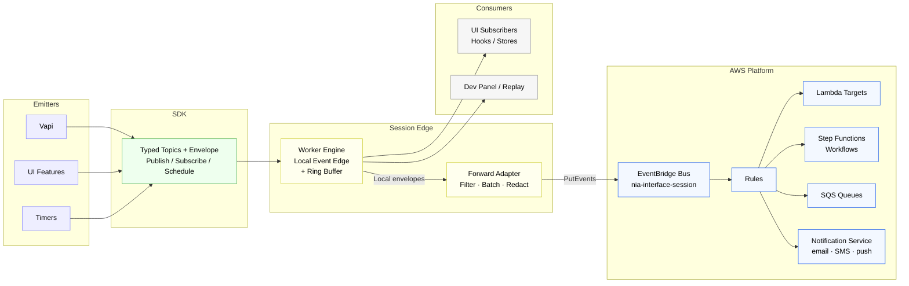
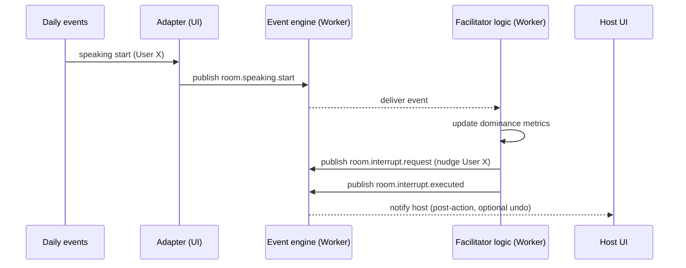
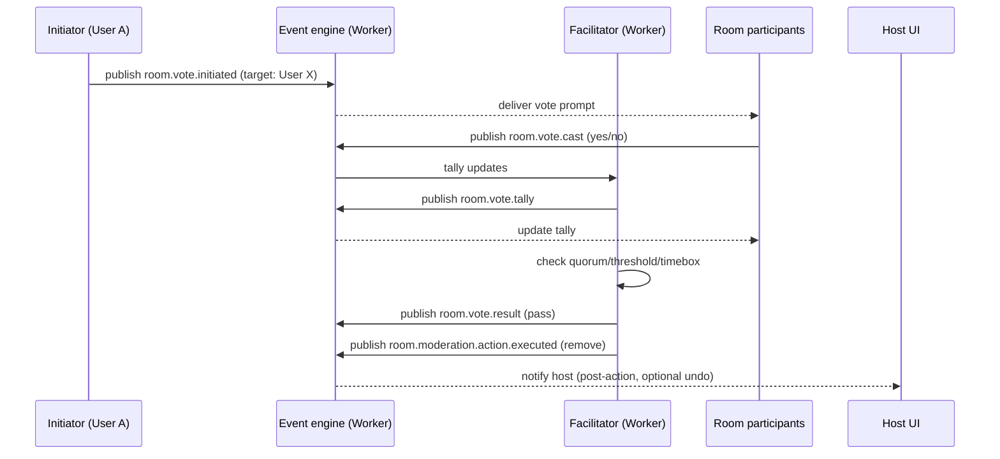

# Interface Event System — Planning Document (Historical Canonical)

This document preserves the original planning content for the Interface Event System. Active direction may be captured in `docs/eventing/interface-event-system-rfc.md`.

> Note: This document was moved to `docs/transitions/eventing/interface-event-system-plan.md` to reflect its planning/in‑progress status. The content below is the canonical historical record.

## Interface Event System — Planning Document

Status: Draft (planning only; no implementation decisions yet)

Owner: Jeffrey Klug
Date: 2025-08-27

## Goals and scope

We need a decoupled event system for the Interface app that:

- Runs in an independent process within the Interface application (not on the main UI thread).
- Enables publish/subscribe across features for timer-driven and conversation-driven (Vapi) events.
- Is typed, composable, and testable; supports replay/debugging and basic persistence of recent events.
- Uses broadly adopted or rising technologies to manage state and event flow; easy to maintain by feature teams.

Out of scope: final solution selection and implementation details. This document surveys options, captures constraints, and outlines candidate architectures for later decision.

## Two horizons: in-session vs platform-wide eventing

We have two distinct problems and timelines:

- Near-term (in-session): Coordinate events within a user session to handle assistant prompts, Vapi conversation events, and user interruptions without blocking the UI. Priorities: low friction, fast migration, off-main-thread where feasible, strong typing, and good developer ergonomics.
- Long-term (platform-wide): A standalone eventing/notification service that can emit texts/emails and other notifications outside any active session. Priorities: durability, delivery guarantees, fan-out, operations/observability, and multi-tenant scoping.

Dovetail principle: Design a common event envelope and topic registry now, plus optional client→server sinks, so the in-session bus can forward selected events to the future platform service without changing feature code.

## Decision rationale (short)

- RxJS-centered bus (Subjects/Observables): rejected for weight and mental overhead for most feature work; we prefer a tiny, explicit pub/sub API with hooks.
- In-thread bus first, worker later: merged into one step to avoid rework; worker-hosted bus is our baseline with a simple in-thread fallback if ever needed.
- SharedWorker: not reliable on Safari/iOS; choose Dedicated Worker baseline; consider BroadcastChannel later for cross-tab mirroring.
- Outbound egress: we WILL add a narrowly scoped AWS EventBridge forwarding path (selected low-rate summary / escalation topics) instead of a full notifications platform first; defer direct email/SMS/push services until needed.
- Side-effect stack: no RxJS requirement; UI can use Redux Toolkit with preferred middleware (saga/thunk) or plain hooks; keep the bus independent of Redux.

## Visual overview

High-level: in-session edge (worker) feeding AWS EventBridge for platform fan‑out.



## Local worker event edge (session singleton) with EventBridge alignment

Intent: run an off‑main‑thread Dedicated Worker providing the in‑session event edge (low‑latency pub/sub, scheduling, replay) while explicitly aligning every envelope and topic with our AWS EventBridge model. The local layer optimizes UI responsiveness and privacy; EventBridge is the authoritative cross‑session / platform distribution plane for allowed topics.

Core ideas (planning-only):

- Singleton per session: one Dedicated Worker hosts the local event edge; UI and bridges communicate via `postMessage`.
- Minimal contract: `on(topic, handler) → unsubscribe`, `emit(topic, payload, meta?)`, optional `once`, plus per‑topic config (delivery=sync|queued, buffer=none|last|ring(N)).
- React integration: `BusProvider` / `useBus()` keep feature code simple and transport‑agnostic.
- Bridges: Vapi adapter and timer scheduling route through the worker; replay/dev panel is just another subscriber.
- EventBridge alignment: envelope fields (`id, ts, topic, payload, meta`) match what we forward; no local‑only shape divergence.
- Forward path clarity: local bus = latency + isolation; EventBridge = durability, fan‑out, cross‑session analytics. All forwarding-eligible topics must declare `eventBridgeEgressAllowed` in the registry.
- Fallback: in‑thread implementation only for extreme compatibility issues; not a strategic mode.

Sketch (illustrative):

```tsx
// UI thread
const BusContext = React.createContext(null);

export function BusProvider({ children }) {
  const bus = React.useMemo(() => createBusClient(/* workerProxy */), []);
  return <BusContext.Provider value={bus}>{children}</BusContext.Provider>;
}

export function useBus() {
  return React.useContext(BusContext);
}
```

Operational notes:

- Error isolation: guard each handler (try/catch) to prevent one subscriber from breaking others.
- Backpressure: per-topic buffering policy (drop/sample/ring) and simple rate limits; default to safe “latest only” for chatty signals.
- Replay/debug: ring buffer in worker (IndexedDB optional) for last N events; dev panel tails it.
- Cross-tab (later): BroadcastChannel mirror behind the same client API.
- Typing: typed topics + envelope at the SDK layer to avoid shape drift.

### Bus interface contract (short)

Envelope (all events):

- `{ id: string; ts: ISODate; topic: string; payload: unknown; meta?: Record<string, any>; source?: 'ui'|'worker'|'bridge' }`

Core API:

- `on(topic, handler, opts?) → () => void` — subscribe; returns unsubscribe.
- `once(topic, handler, opts?)` — auto-unsubscribes after first event.
- `off(topic, handler?)` — remove one or all handlers for a topic.
- `emit(topic, payload, meta?)` — publish an event; non-blocking; handlers are isolated (try/catch).

Scheduling and replay:

- `schedule({ id, at?: ISODate, intervalMs?: number, jitterMs?: number, topic, payload? }) → cancel()`
- `replay({ topic?, since?, limit? }) → EventEnvelope[]` — last N events from the ring buffer (if enabled).
- `health() → { counters, rates, queueDepthByTopic }`

Per-topic options (via registry or subscribe opts):

- delivery: `sync | queued` (default queued in worker to avoid reentrancy surprises).
- buffer: `none | last | ring(N)`; drop policy for overrun: `drop | sample(k)`; defaults to safe latest-only for chatty topics.

Error handling:

- Handlers run in isolation; exceptions are caught and reported to a reserved `bus.error` topic with context.
- `emit` never throws due to consumer code; internal failures surface on `bus.error` and in `health()`.
- Payloads must be structured-cloneable; avoid functions/DOM nodes; keep payloads small.

## Context from current architecture

- Domains: Daily/pipecat room facilitation, moderation, hands-up queue, topic pacing.
- Sources: high-rate audio/speaking signals, Vapi conversation events, timers.
- Constraints: keep UI smooth; avoid centralizing PII; local-only replay.
- See “Milestone example: DailyRoom multi-user facilitation” below for detailed flows and acceptance.


## Integration points and responsibilities

Sources → Event Engine:

- Vapi bridge: A small adapter subscribes to `vapi.on('message'|'tool'|'speech-start'|'speech-end'|'call-start'|'call-end'|'volume-level')` and publishes typed events into the engine.
- Timer bridge: Engine owns `setInterval`/`setTimeout` schedules; exposes `schedule({id, cronLike? intervalMs, jitter?, payload})` admin API.
- UI bridge: Replace `window.dispatchEvent(new CustomEvent(...))` sites with `events.publish(topic, payload)` via the SDK; maintain a temporary dual-dispatch shim during migration.

Sinks ← Event Engine:

- UI subscriptions: Features call `events.subscribe(topic, handler)` to react; the SDK converts worker messages to typed callbacks.
- Debug/replay: Provide a developer panel to tail last N events; export to JSON for issue reports.
- Audit/log: Local-only in Phase 1; no server/Mesh backstop due to PII. Use sampled local logs and dev panel export.

State and persistence:

- Ephemeral stream state inside the engine (implementation-agnostic; simple queues/aggregators).
- Short-term persistence of last N events in IndexedDB (via `idb`) for reload resilience and debugging.
- Derived UI state (e.g., “is playing”, “current mode”) lives in feature stores (e.g., Zustand) subscribed to event topics.

### Related behavior specs

- Conversation Policy (Rules): see `docs/conversation-policy-plan.md` for the config-as-code rules layering, authoring in Dashboard, and runtime resolution.
- Prompt Shaping: see `docs/prompt-shaping-plan.md` for personas, templates, summaries, and how prompts are assembled with layering.

## Dovetail to platform-wide eventing (future)

- Shared envelope and topics: Keep the same `{ id, ts, topic, type, payload, meta }` contract across client and future server.
- Client sinks: Minimal in Phase 1 (optional local-only). Phase 2+ adds a constrained AWS EventBridge forwarding path for selected low-rate, low-PII summary / escalation topics.
- Server responsibilities (future service): Durable queueing, retries, notification channel fan‑out (email/SMS/push), rate limiting per tenant/user, and observability (traces, metrics, audit trails).
- Migration path: As downstream platform services arrive, switch forwarding from “disabled” to “enabled” per topic via feature flags without touching feature emitters/consumers.

### AWS EventBridge integration (scoped baseline)

Purpose: forward a broad, forward‑by‑default set of session lifecycle, facilitation, moderation, and summary topics (with targeted denials and sampling) to EventBridge so platform services can react decoupled from the client.

Flow:

- Worker bus → Egress adapter (filters + redaction + rate checks) → Optional batch (size/time window) → Signed fetch to edge API (`/api/events/forward`) → Server puts events on EventBridge bus (`nia-interface-session`) → Rule targets (Lambda, Step Functions, analytics, notification service).

Envelope mapping:

- Client envelope `{ id, ts, topic, payload, meta }` becomes EventBridge detail `{ id, topic, payload, meta, clientTs }`; `detail-type = topic`; `source = 'nia.interface'`.

Constraints & controls:

- Forward‑by‑default: all topics except those explicitly marked `forwardingPolicy=deny`, high‑PII topics lacking redaction metadata, or debug/ephemeral streams.
- PII strategy: redact high‑PII fields before forwarding; topic schema marks fields via `redactionHint`.
- Rate limiting: max X forwarded events per session and Y per user/day; enforced client & server side.
- Failure handling: non‑blocking; adapter uses exponential backoff with jitter; circuit breaker trips after N consecutive failures and cools down.
- Observability: adapter exposes counters (forwarded/dropped/retried), breaker state, last latency via `health()`; server logs structured detail and emits CloudWatch metrics.
- Schema discipline: each topic declares a `forwardingPolicy` (`default|sampled|conditional|deny`). Legacy `eventBridgeEgressAllowed` maps to `forwardingPolicy=default` during migration. Server enforces policy & schema version.

Non‑goals (initial scope): direct email/SMS/push templating, per‑recipient preference/preferences engine, long-term archive/replay API (handled by later platform services).

#### Edge API contract: `/api/events/forward`

Purpose: Minimal authenticated ingress for the browser egress adapter to hand selected envelopes to the server for EventBridge fan‑out. Optimized for small bursts (<= 10 events) and low latency; never blocks the UI path.

Method: `POST`

Path: `/api/events/forward` (Next.js route in `apps/interface` or shared edge runtime). Versioned via semantic media type and `x-event-forward-version` header (current: `1`).

Authentication:

- Primary: user session (same-origin `cookie` / bearer) + server re-checks session / tenant context.
- Secondary (optional future): short‑lived HMAC signature header (`x-forward-sig`) over body for detached flows.

Request Body (JSON):

```json
{
  "events": [
    {
      "id": "uuid",
      "ts": "2025-08-27T18:05:23.123Z",
      "topic": "session.summary.final",
      "payload": {"summary": "...redacted text..."},
      "meta": {"sessionId": "sess_123", "assistantId": "asst_9"},
      "schemaVersion": "1.0.0"
    }
  ],
  "client": {
    "appVersion": "interface@2.3.1",
    "sessionId": "sess_123",
    "tabId": "tab_abcd",
    "nonce": "n-5fa2c"
  }
}
```

Field notes:

- `events[]` size limit: 10 (hard reject >10 with 413).
- Adapter consults registry: if `forwardingPolicy=deny` drop early; if `conditional` apply redaction (drop on failure); if `sampled` apply probability/1-in-N; annotate meta.
- `payload` must already be redacted per `redactionHint` rules; server does not perform deep PII scrubbing (defense in depth later).
- `nonce` combined with `sessionId` supports idempotency (cached for short TTL to drop accidental replays).

Response Codes:

- `202 Accepted` — body includes per-event status; server asynchronously puts to EventBridge.
- `400 Bad Request` — validation failure (schema, disallowed topic, size, malformed JSON).
- `401/403` — auth/session issues.
- `413 Payload Too Large` — event batch exceeds size/limit.
- `429 Too Many Requests` — server-side rate limit (per user / per topic) exceeded.
- `500` — unexpected error (logged; client may retry with backoff unless repeatedly failing).

`202` Response Body Example:

```json
{
  "accepted": [
    {"id": "uuid", "topic": "session.summary.final"}
  ],
  "rejected": [],
  "metrics": {"remainingUserDailyQuota": 4}
}
```

Validation (server):

- JSON Schema (light) over request; per-event: required fields, `topic` pattern, ISO timestamp freshness (clock skew <= 2m), payload size cap (e.g., 4 KB per event after redaction).
- Policy + registry version check (optional fast cache).
- Rate/quota check: (session, user, topic) composite keys.

EventBridge Put:

- Bus name: `nia-interface-session` (suffix env: `-dev`, `-stg`, `-prod`).
- Detail JSON = forward event detail object; `detail-type` = topic; `source` = `nia.interface`; `time` = original `ts`.
- Failures surfaced in logs + metrics; per-event errors accumulate and reported via async CloudWatch alarm (not returned to client after initial 202).

Security & Hardening:

- Reject topics whose schemas mark `piiLevel=high` unless accompanied by a non-empty `redactionHint` and verified payload passes heuristic length/entropy checks.
- Strict CORS same-origin; no cross-site invocation allowed.
- Idempotency cache (in-memory or Redis) keyed by `{sessionId, id}` for 2 minutes.
- Structured logging with correlation id = request UUID (generated server-side) referencing each forwarded event id.

Observability:

- Metrics: `events_forwarded_total{topic}`, `events_rejected_total{reason}`, latency histogram, quota rejections.
- Health probe extends `events.health()` (client) with last forward latency + breaker state sample (from adapter) — aggregated locally; server exposes Prometheus/CloudWatch metrics.

Client Adapter Behavior Summary:

- Accumulate events until (a) batch size threshold, (b) flush timer (e.g., 1s), or (c) high-priority topic arrives (immediate flush).
- Exponential backoff with full jitter starting at 1s up to 30s; trip breaker after N consecutive failures (default 5) — while open, drop & count.
- Drop strategy: if queue grows > 50 pending events (unexpected under broad policy + sampling), oldest non-priority events are pruned.

#### EventBridge rules nexus

Purpose: Centralize platform branching, filtering, and fan‑out logic in EventBridge Rules so the client and forwarding adapter stay ignorant of downstream workflows. Adding or removing platform reactions becomes an IaC change (rule create/update/delete) instead of a client redeploy.

Core responsibilities:

- Filtering: Match specific topics (`detail-type = topic`) and, when needed, JSON field predicates inside `detail` (e.g. `meta.tenantTier == "enterprise"`).
- Routing / fan‑out: Drive independent targets (Lambda, Step Functions, SQS, Notifications service) in parallel without coupling.
- Segregation: High‑cost / sensitive flows (compliance enrichment) isolated from cheap analytics rules.
- Evolution: Independent deploy cadence; can stage new behaviors side‑by‑side (duplicate rule with narrower pattern) for shadow traffic.
- Guardrails: Rapid mitigation (disable rule) if a topic misfires or volume anomaly occurs.

Data contract at the nexus:

- `detail-type` = topic string (e.g. `session.summary.final`)
- `source` = `nia.interface`
- `detail` = `{ id, topic, payload, meta, clientTs }` (forwarded envelope)
- Optional future transformer: rule input transformer could drop or rename fields for specific targets (not phase 1).

Example rule patterns:

- Exact topic: match `"detail-type": ["session.summary.final"]` → Lambda `iface-summary-expand`
- Wildcard family: prefix `moderation.` → SQS `iface-moderation-queue`
- Conditional: topic `moderation.escalation.notice` AND `detail.meta.severity in ["high","critical"]` → Step Functions Express workflow
- Quarantine: `payload.flags.containsModerationIssue == true` → separate DLQ/analysis Lambda

Downstream mapping examples:

- Lambda: enrich summary, persist to DynamoDB, optionally emit follow‑on EventBridge event (`detail-type: session.summary.persisted`).
- Step Functions: chained tasks (sentiment → key phrase extraction → compliance check → notify) for longer workflows.
- SQS (buffer): analytics / batch processing; KEDA in EKS scales consumers based on queue depth.
- Notifications service: subset of escalation topics, after redaction checks.

Observability:

- CloudWatch metrics per rule (Invocations, FailedInvocations, Throttles) feed dashboards & alarms.
- Latency measurement: compare `clientTs` vs ingestion timestamp (custom metric) for end‑to‑end timing.
- Optional DLQ on critical targets for failure sampling / reprocessing.

Governance & naming:

- IaC managed (CDK/Terraform) — no console‑only drift; PR review of rule diffs.
- Naming: `iface-{env}-{sanitized-topic}-{purpose}` (e.g. `iface-stg-session-summary-final-compliance`).
- Orphan detection: nightly job compares active rules against Topic Registry; flags rules referencing deprecated topics.
- Decommission process: mark topic deprecated → disable rules → remove after retention window (audit captured in Git history & registry change log).

Security & least privilege:

- Bus policy: restrict `events:PutEvents` to forwarding edge role only.
- Lambda targets: minimal IAM (e.g. only `dynamodb:PutItem` on specific table ARN).
- Sensitive payload topics enforce redaction (payload fields hashed or removed) before forwarding; rule layer never reintroduces PII.

Fail‑safe strategies:

- Volume anomaly: anomaly alarm auto disables specific high‑volume rule (optional Lambda responder) while leaving others intact.
- Hot fix path: emergency rule override can drop payload (`detail = { id, topic, truncated: true }`) without client change.

Why it sits at the nexus: decouples client evolution from platform feature growth, enables granular cost / blast radius control, and provides a uniform audit surface for all downstream actions.

## API sketch (illustrative only)

- `events.publish<Topic>(topic: Topic, payload: TopicPayload[Topic], meta?)`
- `events.subscribe<Topic>(topic: Topic, handler: (event: EventEnvelope<Topic>) => void): Unsubscribe`
- `events.schedule(timer: { id: string, intervalMs?: number, at?: string, jitterMs?: number, topic: string, payload?: any }): Cancel`
- `events.replay(query?: { topic?: string; since?: ISODate; limit?: number })`
- `events.health()` → counters and basic metrics

Typed topics (examples, to be finalized):

- `conversation.message.{partial|final}`
- `conversation.tool-call`
- `timer.tick.{name}`
- `youtube.control.{play|pause|next}`
- `desktop.mode.switch`
- `browser.automation.{request|success|failed}` (align with existing `BrowserAutomation` events)

## Topic registry (DynamicContent + JsonSchema)

Intent: define all event topics and their shapes as DynamicContent, with JsonSchema for payload/meta validation. This enables:

- Strong typing via codegen from JsonSchema to TypeScript (dev-time) and validation in dev/staging builds.
- Clear PII classification and delivery/buffering rules per topic.
- Discoverability, search, and versioning in Dashboard.

Registry entry (planning fields):

- id, topic (string; dot.notation; pattern-validated)
- version (semver), description
- deliveryPolicy: `sync | queued` (default queued)
- bufferPolicy: `none | last | ring`, ringSize? (number)
- rateLimitPerSec? (number), sampleEveryN? (number)
- piiLevel: `none | low | high`, redactionHint? (string)
- eventBridgeEgressAllowed: boolean (eligible for EventBridge forwarding)
- payloadSchema: JsonSchema object
- metaSchema?: JsonSchema object
- tags[] (feature, domain), deprecated?: boolean, aliases?: string[]

Example payload schemas (abridged):

```json
{
  "$id": "event.room.speaking.start.payload",
  "type": "object",
  "additionalProperties": false,
  "properties": {
    "userId": { "type": "string" },
    "roomId": { "type": "string" },
    "confidence": { "type": "number", "minimum": 0, "maximum": 1 }
  },
  "required": ["userId", "roomId"]
}
```

```json
{
  "$id": "event.timer.tick.ui.payload",
  "type": "object",
  "additionalProperties": false,
  "properties": {
    "name": { "type": "string" },
    "seq": { "type": "integer", "minimum": 0 }
  },
  "required": ["name", "seq"]
}
```

DynamicContent definition (illustrative; documentation only):

```ts
import { IDynamicContent } from "@nia/prism/core/blocks/dynamicContent.block";

export const EventTopicDefinition: IDynamicContent = {
  name: "EventTopic",
  description: "Interface event topics, schemas, and delivery policies",
  access: { tenantRole: "admin", allowAnonymous: false },
  dataModel: {
    block: "EventTopic",
    indexer: ["topic", "version", "piiLevel", "tags"],
    parent: { type: "field", field: "assistantId" },
    jsonSchema: {
      additionalProperties: false,
      properties: {
        _id: { type: "string", format: "uuid" },
        assistantId: { type: "string" },
        topic: { type: "string", pattern: "^[a-z]+(\u002E[a-z0-9_-]+)+$" },
        version: { type: "string" },
        description: { type: "string" },
        deliveryPolicy: { type: "string", enum: ["sync", "queued"] },
        bufferPolicy: { type: "string", enum: ["none", "last", "ring"] },
        ringSize: { type: "integer", minimum: 1 },
        rateLimitPerSec: { type: "number", minimum: 0 },
        sampleEveryN: { type: "integer", minimum: 1 },
        piiLevel: { type: "string", enum: ["none", "low", "high"] },
  redactionHint: { type: "string" },
  eventBridgeEgressAllowed: { type: "boolean" },
        payloadSchema: { type: "object" },
        metaSchema: { type: "object" },
        tags: { type: "array", items: { type: "string" } },
        deprecated: { type: "boolean" },
        aliases: { type: "array", items: { type: "string" } }
      },
      required: ["assistantId", "topic", "version", "deliveryPolicy", "bufferPolicy", "piiLevel", "payloadSchema"]
    }
  },
  uiConfig: {
    listView: { displayFields: ["topic", "version", "piiLevel"] },
  detailView: { displayFields: ["topic", "version", "description", "deliveryPolicy", "bufferPolicy", "rateLimitPerSec", "piiLevel", "eventBridgeEgressAllowed", "tags"] }
  }
};
```

Notes

- Keep payload/meta schemas compact and cloneable.
- Use this registry to generate TypeScript types and validate envelopes in dev.
- Scope by assistantId when needed; platform-level topics can omit assistant scoping.
- See `interface-event-topics-forwarding.md` for external forwarding policy taxonomy.

## Observability and quality

- Counters: events published/second, per-topic rates, handler latency percentiles.
- Logs: sample event envelopes for debugging (PII-aware; redact as needed).
- Tracing: Consider OpenTelemetry JS for spans around event handling, especially for Vapi→UI reactions.
- Testing: unit tests for the SDK (publish/subscribe), worker integration tests for timers and replay, contract tests for Vapi bridge.

## Risks and mitigations

- Worker support gaps (SharedWorker on Safari iOS): Provide Dedicated Worker fallback and BroadcastChannel mirroring.
- Timer throttling in background: Workers can still be throttled; avoid tight loops; allow “best-effort” semantics; future server-side schedulers for critical jobs if needed.
- Message storms from Vapi: Add rate limits/backpressure (buffer with windowing/drop strategy) per topic.
- Type drift: Centralize topic/shape registry in a shared `@nia/prism/core/events` package and validate at runtime in dev.

## Migration plan (phased)

- Phase 0: Define typed topics and the SDK surface. Introduce a dual-dispatch shim that forwards `window.dispatchEvent` into the SDK while keeping current listeners intact.
- Phase 1: Ship the Dedicated Worker event engine (lightweight bus + optional IndexedDB ring buffer) behind the SDK; migrate initial call sites; add telemetry.
- Phase 2: Introduce XState actors for conversation/interrupt domains (where complexity warrants), keeping the bus/API unchanged; expand test coverage.
- Phase 3: Optional cross-tab enhancements (BroadcastChannel mirroring) and client→server sinks for platform notifications.

## Open questions

- Do we require cross-tab deduplication for conversation events (e.g., when two tabs are open)?
- What’s the expected retention for replay (count vs duration)? Any PII considerations for persistence?
- Should some events be tenant-scoped beyond session? If yes, define meta and server sinks accordingly.
- How should errors in handlers be reported to users vs silently logged?
- Which domains merit XState actors early (conversation, interruptions, long-running timers), and which stay as plain streams?
- UI side effects: choose team-preferred middleware/patterns; keep the bus independent of Redux/state libraries.

## Next steps (for decision makers)

- Validate requirements (independent-process, cross-tab tolerance, and PII rules for payloads/replay).
- Approve the merged Phase 1 direction (Dedicated Worker engine as baseline).
- Draft an RFC with precise API signatures, topic registry, feature flags, and a minimal vertical slice (YouTube control + desktop mode + one Vapi stream) behind a flag.

Acceptance criteria

- Phase 1 (merged): No user-visible regressions; initial features migrated (YouTube control, desktop mode switch, one Vapi event stream); basic counters visible; UI responsiveness holds under Vapi bursts; timers reliable; replay shows last N events; no payload serialization errors; <1% dropped frames increase under typical load.

Rollout plan

- Start with Phase 1 (worker engine) in dev/staging behind flags; instrument and collect metrics.
- Promote to canary; compare latency/jank vs control; widen rollout after bake.

Future directions (summary)

- Optional XState actors for complex domains (conversation/interrupt orchestration) inside the worker.
- Cross-tab mirroring via BroadcastChannel and deduplication.
- EventBridge routing expansion (additional topics/rules) and/or evolution to broader notifications fan‑out (email/SMS/push) with user preferences service.
- Deeper observability: OpenTelemetry spans for end-to-end Vapi→UI flows, richer dev trace/replay.

See `docs/interface-event-system-future-directions.md` for details.

## Milestone example: DailyRoom multi-user facilitation

Scenario

- Multi-user video chat room (Daily/pipecat). Several participants join a room; the host’s assistant joins as an AI facilitator.
- Goal: Keep conversation balanced, fun, and civil (a “dinner party with randos”).

Key topics (illustrative)

- `room.user.joined` / `room.user.left`
- `room.speaking.start` / `room.speaking.stop` (per user)
- `room.volume.level` (sampled, per user)
- `room.dominance.score` (rolling talk-time ratios)
- `room.interrupt.request` (assistant intends to interrupt)
- `room.interrupt.executed`
- `room.moderation.flagged` (toxicity/profanity/NSFW hint)
- `room.handsup.raised` / `room.handsup.lowered`
- `room.topic.shift.suggested` (assistant proposes moving on)
- `room.summary.partial` / `room.summary.final`

Event sources and adapters

- Daily/pipecat events → adapter publishes `room.user.*`, `room.speaking.*`, and `room.volume.level` at a bounded rate.
- Facilitator logic (running in the worker engine) consumes these topics, computes `room.dominance.score`, and emits `interrupt` or `topic.shift` suggestions.

Policies for “fun and civil”

- Turn-taking: hard cap on consecutive talk time; soft nudges before hard interrupt.
- Queueing: hands-up queue; prioritize quiet participants after long dominance by another.
- Moderation: detect spikes in volume or toxicity; suggest a pause or redirect.
- Pace: timebox topics; after N minutes, emit `room.topic.shift.suggested` with a fun prompt.
- Autonomous actions: assistant executes hard actions (mute/kick) per policy without host pre-approval; whisper-only for soft nudges; host is notified post-action with a short undo window.

Why the event bus fits

- High-rate inputs (volume levels, speaking state) are filtered and aggregated off the UI thread.
- Backpressure policies (windowing/throttle) protect the app during spikes.
- Replay helps debug contentious moments without centralizing PII.

Sequence: dominant speaker nudge



Acceptance for this milestone

- Room with 4–8 participants; smooth UI while processing speaking/volume streams.
- Dominance computed with low latency; soft nudge within 1–2 seconds of threshold crossing.
- No UI jank under bursty events; worker CPU stays within budget.

### Self-regulation: vote to remove a participant

Context

- Assistant may miss inappropriate video or nuanced behavior. Participants can initiate a vote to remove a disruptive user (“off the island”).

Additional topics (illustrative)

- `room.vote.initiated` (by: userId, target: userId, reason?)
- `room.vote.cast` (by: userId, choice: yes|no)
- `room.vote.tally` (target: userId, yes, no, remaining)
- `room.vote.result` (target: userId, outcome: pass|fail)
- `room.moderation.action.requested` (action: mute|remove, target: userId)
- `room.moderation.action.executed` (action, target)

Policies

- Quorum and threshold: e.g., at least 5 voters online, simple majority with minimum yes votes.
- Timeboxed: voting window (e.g., 60–120s) with reminders; one active vote per target at a time.
- Abuse prevention: cooldown per initiator; rate-limited initiations; host/assistant veto power.
- Transparency: anonymized tallies during vote; final result visible to room.
- Graceful action: if passed, prefer mute first; remove executed autonomously per policy with post-action host notification and short undo window.

Sequence: initiate and execute a vote


