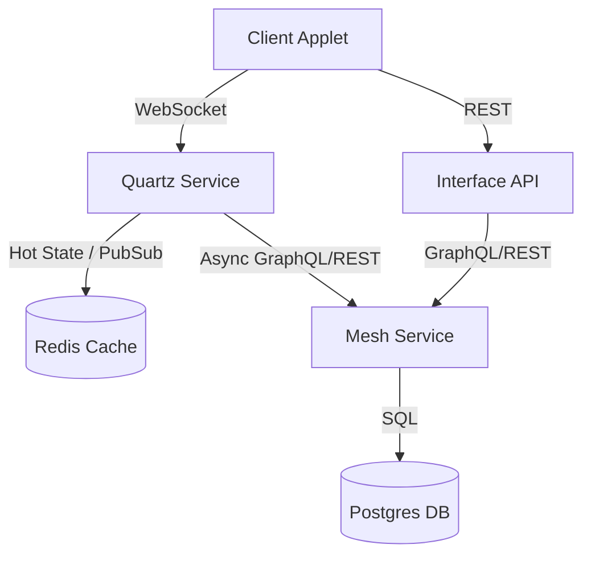

# Quartz Service Implementation Plan

## Overview
**Quartz** is a new dedicated service for managing real-time, multi-user applet state, specifically targeting turn-based games (Boardgame.io). It provides persistent game state storage via Postgres and real-time synchronization via WebSockets, independent of Daily.co calls.

## Architecture



- **Quartz Service**: A Node.js service running `boardgame.io/server`.
- **Redis**: Used for hot state (low latency) and Pub/Sub (horizontal scaling).
- **Mesh Service**: The central data access layer. Quartz delegates long-term persistence to Mesh.
- **Authentication**: Validates a short-lived JWT generated by the Interface API using `QUARTZ_SHARED_SECRET`.

## 1. Database Schema (Prism Definition)

We will create a new Prism Block definition `QuartzMatch` for the **Mesh** layer. Quartz will not define this schema directly but will consume it via Mesh APIs.

**File:** `packages/features/src/definitions/QuartzMatchDefinition.ts` (Proposed)

```typescript
import { IDynamicContent } from "@nia/prism/core/blocks/dynamicContent.block";

export const QuartzMatchDefinition: IDynamicContent = {
    access: {
        tenantRole: 'member',
        allowAnonymous: false
    },
    dataModel: {
        block: 'QuartzMatch',
        indexer: ['matchID', 'gameName'],
        jsonSchema: {
            properties: {
                matchID: { type: 'string' },
                gameName: { type: 'string' },
                players: { type: 'object' }, // Player metadata
                setupData: { type: 'object' },
                gameover: { type: 'object' },
                nextMatchID: { type: 'string' },
                unlisted: { type: 'boolean' },
                state: { type: 'object' }, // The core G state
                initialState: { type: 'object' },
                log: { type: 'array' }, // Action log
                createdAt: { type: 'number' },
                updatedAt: { type: 'number' }
            },
            required: ['matchID', 'gameName', 'state']
        }
    },
    name: 'QuartzMatch'
};
```

## 2. Service Implementation

**Location:** `apps/quartz` (New directory in monorepo)

### Dependencies
- `boardgame.io`
- `koa` (Boardgame.io server uses Koa internally)
- `@nia/prism` (For `PrismGraphQLClient`)
- `ioredis` (for Redis adapter)

### Components

1.  **Server Entrypoint (`index.ts`)**:
    - Initialize `Server` from `boardgame.io/server`.
    - Configure `origins` (CORS).
    - Attach `RedisMeshHybridStore`.

2.  **Storage Adapter (`store.ts`)**:
    - Implement `StorageAPI` interface from `boardgame.io`.
    - **Mesh Integration**: Use `PrismGraphQLClient` from `@nia/prism` to communicate with Mesh.
    - **Methods**:
        - `createMatch`: Calls `prism.createContent('QuartzMatch', ...)`
        - `fetchMatch`: Calls `prism.findContent('QuartzMatch', ...)`
        - `updateMatch`: Calls `prism.updateContent(...)`
    - **Optimization**: Since Mesh calls are HTTP, we rely heavily on the Redis layer for active gameplay and only flush to Mesh asynchronously.

3.  **Authentication Middleware**:
    - Intercept WebSocket handshake.
    - Extract `token` from handshake auth payload.
    - **Validation**: Verify JWT signature using `QUARTZ_SHARED_SECRET`.
    - Map `userId` from token to Player ID.

### Game Logic
- Since applets define their own games, Quartz should run a **Generic Game** logic that is permissive.
- Alternatively, if we want server-side validation, we need a way to load game definitions dynamically or have a standard "Universal Game" that just syncs state (like a shared reducer).
- **Phase 1**: Use a "Universal Turn-Based" game definition that allows clients to dictate moves (Client-authoritative logic running on Server for sync).

## 3. API & Integration

### Client-Side
Applets will use `boardgame.io/client`.

```javascript
import { Client } from 'boardgame.io/client';
import { SocketIO } from 'boardgame.io/multiplayer';

const client = Client({
  game: MyGame,
  multiplayer: SocketIO({ server: 'https://quartz.nia.ai' }),
});
```

### AppletApi Prompt Update
Update the `appletApi` functional prompt (stored in DB) to include instructions on how to connect to Quartz.

#### 1. Applet Context Injection (Prerequisite)
We must update `HtmlContentViewer.tsx` to expose the `window.nia` namespace to applets, providing easy access to context.

```javascript
// In HtmlContentViewer.tsx (appletConfigScript)
window.nia = {
  appletId: appletConfig.appletId,
  tenantId: appletConfig.tenantId,
  userId: appletConfig.userId
};
```

#### 2. New API Endpoint
We will extend the existing `apps/interface/src/app/api/applet-api/route.ts` to support a new operation: `quartz-config`.

**Request:** `GET /api/applet-api?operation=quartz-config&tenantId=...`
**Response:**
```json
{
  "url": "https://quartz.stg.nia.ai",
  "transport": "socket.io",
  "server": "boardgame.io",
  "token": "eyJhbGciOiJIUzI1NiIsInR5cCI6IkpXVCJ9..."
}
```

**Implementation Details:**
- The endpoint generates a short-lived JWT (e.g., 1 hour) signed with `QUARTZ_SHARED_SECRET`.
- Payload includes `userId`, `tenantId`, and `exp`.
- This ensures the applet can connect securely without exposing the shared secret.

#### 2. Proposed Prompt Addition
This teaches the LLM how to build multi-user games using Quartz.

```markdown
### Multi-User Real-Time State (Quartz)

If the user requests a multi-user game or real-time shared state (e.g., "play chess with a friend", "shared counter"), use the **Quartz** service.

**Step 1: Get Configuration**
Fetch the Quartz server URL from the Applet API.

```javascript
async function getQuartzConfig() {
  const response = await fetch('/api/applet-api?operation=quartz-config&tenantId=' + window.nia.tenantId);
  if (!response.ok) throw new Error('Failed to get Quartz config');
  return await response.json();
}
```

**Step 2: Define Game**
Define your game logic using `boardgame.io` standard format.

```javascript
const MyGame = {
  name: 'my-unique-game-name', // MUST be unique per applet instance if possible, or use a standard name
  setup: () => ({ count: 0 }),
  moves: {
    increment: ({ G }) => { G.count++; },
    add: ({ G }, amount) => { G.count += amount; }
  }
};
```

**Step 3: Initialize Client**
Connect to Quartz using the `SocketIO` transport.

```javascript
import { Client } from 'boardgame.io/client';
import { SocketIO } from 'boardgame.io/multiplayer';

async function initGame() {
  const config = await getQuartzConfig();
  
  const client = Client({
    game: MyGame,
    // Use the Quartz URL for the multiplayer server
    multiplayer: SocketIO({ 
      server: config.url,
      auth: { token: config.token } // Pass the secure token
    }),
    debug: false
  });

  client.start();
  return client;
}
```

**Step 4: Connect UI**
Subscribe to state changes.

```javascript
client.subscribe(state => {
  if (!state) return;
  console.log('Current count:', state.G.count);
  // Update your UI here
});

// Make a move
client.moves.increment();
```

**Important Notes:**
- **Match ID:** You must manage the `matchID`.
    - For a **Global Shared State** (everyone sees the same board), use the Applet ID (`window.nia.appletId`).
    - For **Private Matches** (e.g., multiple 2-player games), append a unique suffix: `window.nia.appletId + '_' + uniqueMatchId`. You can generate this `uniqueMatchId` (e.g., a UUID) and share it between players via the `sendAppMessage` API or by storing it in a shared list.
- **Player ID:** `boardgame.io` requires a `playerID`. In the Nia context, you should map the current user to a player ID (e.g., '0', '1') or use the `credentials` option to pass the session token if using authenticated player views.

// ...existing code...
- **Action**: Create a migration script or admin task to update the `FunctionalPrompt` record for `appletApi`.

## 4. Game Lifecycle & MatchID Coordination

Since Quartz is a generic state container, the *Applet* is responsible for defining the scope of the "Match".

### A. Global Shared State (e.g., "Community Garden")
- **Goal**: All users of the applet see and interact with the exact same state.
- **MatchID Strategy**: Use the `appletId` directly.
- **Workflow**:
    1.  Applet initializes.
    2.  Connects to Quartz using `matchID = window.nia.appletId`.
    3.  If the match does not exist, Quartz (via Boardgame.io) auto-creates it.
    4.  All users subscribe to this single ID.

### B. Private/Lobby-Based Matches (e.g., "Chess")
- **Goal**: Users create distinct matches and invite specific opponents.
- **MatchID Strategy**: `appletId + ':' + UUID`.
- **Workflow (Host)**:
    1.  User clicks "Create Game".
    2.  Applet generates a UUID (e.g., `crypto.randomUUID()`).
    3.  Applet constructs `matchID = window.nia.appletId + ':' + uuid`.
    4.  Applet connects to Quartz.
    5.  Applet displays a "Share Link" or uses `window.nia.sendAppMessage` to send the `uuid` to a friend.
- **Workflow (Guest)**:
    1.  User receives the link/message.
    2.  Applet parses the `uuid` from the URL hash or message payload.
    3.  Applet constructs the same `matchID`.
    4.  Applet connects to Quartz and joins the existing game.

### C. Match Discovery
- Currently, Quartz does not provide a "Lobby" API to list all public matches for an applet.
// ...existing code...
- **Workaround**: Applets can use a secondary "Global Shared State" match (see A) to store a list of active "Private Match IDs" if a public lobby is required.

## 5. Sidebar: Shared Applet Storage & Permissions

**Context**: When an applet is "Shared-to-All" (Public), it is executed by users with 'read-only' (viewer) access.
**Problem**: The current `applet-api` enforces strict tenant membership checks.
- **Per-User Storage**: If the applet stores data in the *runner's* space (userId is the parent of the data), it works fine (assuming the runner has permission to create `AppletStorage`). This creates a "Forked" state model.
- **Global Storage**: If the applet attempts to store data in the *owner* userId space (to share state globally), it may fail if the runner is not given 'member' (or greater) sharing access to the applet.

**Research Required**:
1.  **Default Behavior**: Should the default `saveState` operation imply "My Save" (Per-User) or "The Game State" (Global)?
2.  **Global Write Access**: If Global Storage is required (e.g., High Scores, Community Garden), how do we authorize it?
    - *Option A*: Use Quartz for all global data (recommended for real-time).
    - *Option B*: Update `applet-api` to allow "Guest Writes" to specific AppletStorage blocks if the Applet is configured to allow it.

**Decision**: For the initial Quartz rollout, we assume **Global State = Quartz** and **Persistent State = Per-User (AppletStorage)**. If an applet needs global persistent state (without real-time needs), it should likely still use Quartz or a future "Public Data" extension to `applet-api`.

## 6. Deployment (EKS)

### Dockerfile
Standard Node.js image.
// ...existing code...
// ...existing code...

### Kubernetes Resources
- **Deployment**:
  - Image: `nia-quartz:latest`
  - Replicas: 2 (min)
  - Resources:
    - Requests: CPU 250m, Mem 256Mi
    - Limits: CPU 500m, Mem 512Mi
  - Env Vars: 
    - `MESH_SHARED_SECRET`: For authenticating requests to Mesh.
    - `REDIS_SHARED_SECRET`: For authenticating with Redis (if applicable) or `REDIS_URL`.
    - `QUARTZ_SHARED_SECRET`: For verifying client JWTs.
    - `ALLOWED_ORIGINS`: CORS configuration.
    - `MESH_ENDPOINT`: URL to the Mesh service (for use by PrismGraphQLClient)

- **Service**:
  - Port 8000 (Boardgame.io default).

- **Ingress**:
  - Host: `quartz.stg.nia.ai` (and prod).
  - **Critical**: Enable Sticky Sessions.
    ```yaml
    nginx.ingress.kubernetes.io/affinity: "cookie"
    nginx.ingress.kubernetes.io/session-cookie-name: "quartz-route"
// ...existing code...
// ...existing code...
    nginx.ingress.kubernetes.io/session-cookie-hash: "sha1"
    ```

## 7. Transition Steps

1.  **Scaffold Service**: Create `apps/quartz`.
// ...existing code...
// ...existing code...
2.  **Implement Storage**: Write the `RedisMeshHybridStore` adapter.
3.  **Implement Auth**: Write the session validation using `AUTH_SECRET` or Mesh validation.
4.  **Update Interface**:
    - Add `window.nia` injection to `HtmlContentViewer.tsx`.
    - Add `quartz-config` endpoint to `applet-api/route.ts`.
5.  **Deploy to Staging**: Deploy to EKS and verify connectivity.
6.  **Update Applet Prompt**: Modify `appletApi` to make Quartz available to generated applets.
// ...existing code...
// ...existing code...
7.  **Test**: Create a "Chess" applet using the new system.

## 8. Performance & Scaling Strategy (Redis)

To support high-frequency updates and horizontal scaling, we will leverage Redis in two ways:
// ...existing code...
// ...existing code...

### A. Transport Layer (Pub/Sub)
We will use the `socket.io-redis` adapter. This allows multiple Quartz pods to communicate.
- **Why:** If User A connects to Pod 1 and User B connects to Pod 2, they can still play the same game.
- **Implementation:** Pass the Redis instance to the `SocketIO` config in the Server entrypoint.

### B. Tiered Storage (Hot/Cold)
We will implement a **Write-Behind Storage Adapter** (`RedisMeshHybridStore`) to optimize for latency while ensuring durability.

1.  **Hot State (Redis)**:
    - Active matches are stored in Redis.
    - All `fetch` and `update` operations hit Redis first.
    - TTL (Time To Live): e.g., 24 hours after last move.

2.  **Cold Storage (Mesh)**:
    - **Async Flush**: State is flushed to Mesh (via GraphQL) asynchronously (e.g., every 10 seconds or on specific "Phase End" events) to prevent API thrashing.
    - **Archival**: When a match expires from Redis, it remains in Mesh/Postgres.
// ...existing code...
// ...existing code...
    - **Hydration**: If a request asks for a Match ID not in Redis, the adapter loads it from Mesh into Redis.

## 9. Future Considerations (The "Lattice")
- **Concept**: Server-side move validation and authoritative game logic.
// ...existing code...
- **Implementation**: Allow applets to register their game logic (WASM? Sandboxed JS?) with Quartz.
- **Why "Lattice"?**: It provides the rigid structure and rules that the "crystals" (game states) must adhere to.
- For now, we rely on client-side logic with server-side state persistence.
