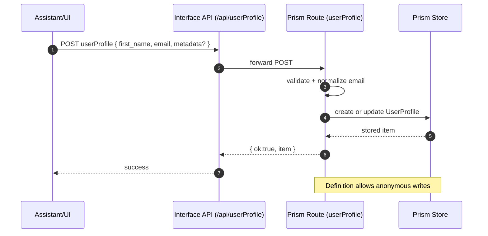

# UserProfile — Focus Doc

Date: 2025-09-19
Owner: Interface + Prism + Dashboard
Status: Implemented

Summary

- Collect and persist lightweight attendee profile details captured during assistant conversations or via simple forms.
- Backed by Prism content type UserProfile with anonymous write enabled to reduce friction for first‑time users.
- Available to assistants via a guarded command (userProfileCommand) behind the shared feature flag key 'userProfile'.
- Anonymous users may POST userProfile; later, records are associated with a real account on upgrade using userId backfill logic.

Scope and behavior

- Data model: Prism UserProfileDefinition
  - access.allowAnonymous: true
  - block: 'UserProfile'
  - indexer: ['first_name','email','userId']
  - required: first_name, email
  - uiConfig: card/detail/list defaults for admin tooling
- API surfaces
  - Interface feature route binds GET/POST/PUT to Prism userProfile route
    - apps/interface/src/features/UserProfile/routes/route.ts → re‑exports from @nia/prism/core/routes/userProfile/route
    - Accepts anonymous POST; validates first_name and email; normalizes email (lowercase + simple mitigation) and persists via Prism
  - Dashboard: admin API route apps/dashboard/src/app/api/userProfile/route.ts and admin page apps/dashboard/src/app/dashboard/admin/userProfile/page.tsx for listing/updating records
  - Tenant roles backfill: apps/dashboard/src/app/api/tenants/[tenantId]/roles/route.ts updates UserProfile.userId when assigning roles to a user
- Assistant integration
  - apps/interface/src/actions/getAssistant.ts registers a userProfileCommand when isFeatureEnabled('userProfile') is true
  - apps/interface/src/components/browser-window.tsx handles userProfileCommand with guardFeatureAsync('userProfile'), checks session, dedupes in‑flight save, then POSTs to /api/userProfile
- Feature gating
  - FeatureKeys include 'userProfile'
  - Env flags NEXT_PUBLIC_FEATURE_USERPROFILE / FEATURE_USERPROFILE supported
  - If Assistant.supportedFeatures exists, gating requires inclusion ∧ env flag; otherwise env flags alone apply
- Anonymous behavior
  - Interface tests assert anonymous/unauthorized POST to userProfile is accepted
  - Definition access.allowAnonymous enables create without auth; email and first_name still required
- Retrieval/use at runtime
  - Assistant server component loads the latest UserProfile by session.user.id (when authenticated) to hydrate UI metadata if present

Contract (inputs/outputs)

- POST /api/userProfile: body { first_name: string; email: string; metadata?: object; userId?: string }
  - 200 → { ok: true, id, item }
  - 400 → { ok: false, error }
- GET /api/userProfile?email=... or by userId: returns matching records (latest first)
- PUT /api/userProfile/:id: updates allowed fields; requires validation

Architecture overview

- Prism actions: ensureUserProfileDefinition(operation) creates the definition on demand; save path normalizes email and persists; backfill associates by userId
- Prism route: finds existing by email or userId; creates or updates accordingly with defensive normalization and minimal logging
- Interface feature route: thin adapter to Prism route; inherits validation and allowAnonymous semantics
- Dashboard admin: CRUD UI for operators; roles API path triggers backfill for a given userId

Security & PII

- Required PII fields (first_name, email) are validated but not logged in plaintext; logs redact values
- Anonymous writes are allowed; association to a real account occurs on upgrade via userId backfill
- No external dependencies introduced

Mermaid diagram

Tests (present in repo)

- Interface: apps/interface/src/features/UserProfile/__tests__/userProfile-route.test.ts verifies anonymous POST acceptance and validation
- Dashboard: apps/dashboard/__tests__/userProfile-update.test.ts checks update/backfill flows
- Prism: packages/prism/src/core/actions/userProfile-actions.ts and route tests exercise ensure/create/update logic

Edge cases

- Invalid email: mitigated when possible; otherwise rejected with clear error
- Duplicate email: route updates existing record rather than creating duplicates
- Missing required fields: 400 with message; no record created
- Large metadata: may be truncated or rejected based on store limits (keep small)

Operational notes

- Definition is auto‑provisioned on first use via ensureUserProfileDefinition
- Email normalized to lowercase; simple format mitigation applied
- Feature can be toggled off via env or Assistant.supportedFeatures to hide command and block UI invocation
