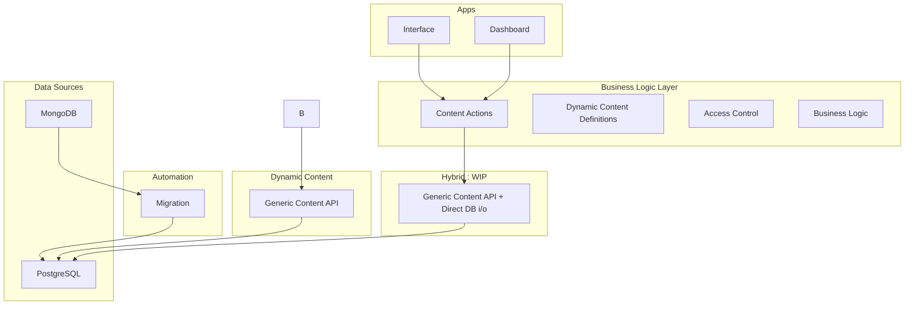
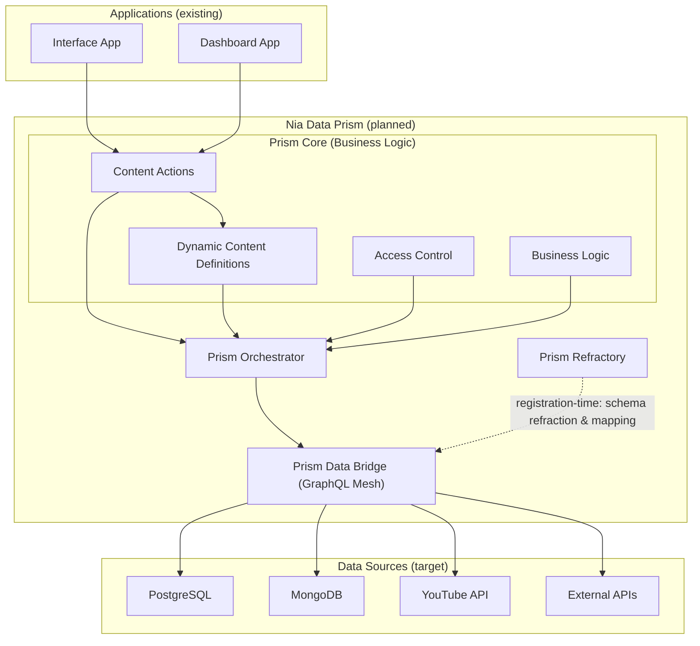

<!-- Banner: The Prism City -->
<p align="center">
  
  <br/>
  <em style="color: #888; font-size: 1.1em;">The Nia Data Prism (Universal Data Engine)</em>
</p>

# Nia Data Prism

A universal data abstraction layer that combines GraphQL Mesh's powerful data source integration with sophisticated business logic for multi-tenant, dynamic content management.

---

## 🚀 What is Nia Data Prism?

**Nia Data Prism** is a hybrid architecture that layers GraphQL Mesh's unified data access capabilities on top of a mature business logic system. It provides:

- **Unified Data Access**: Query all your data through a single GraphQL endpoint
- **Multi-tenant Content Management**: Sophisticated tenant isolation and dynamic schema management
- **Production-Ready Adapters**: Leverages Mesh's mature plugins for Postgres, MongoDB, OpenAPI, and more
- **Business Logic Preservation**: Maintains existing access control, dynamic content definitions, and complex workflows

---

## 🏗️ Architecture Overview

#### Current State: Genericized, unfinished



#### Future State
Nia Data Prism uses a **layered approach** that preserves existing business logic while adding unified data access:



---

## 🔄 Migration Strategy

### **Phase 1: Hybrid Integration (Current)**
- Keep existing content actions and dynamic content system
- Replace direct database calls with Mesh queries
- Maintain all business logic, access control, and multi-tenancy

### **Phase 2: Enhanced Data Access**
- Expose Mesh GraphQL endpoints for direct client access where appropriate
- Add Mesh sources for external APIs (YouTube, etc.)
- Preserve content actions for internal data with complex business rules

### **Phase 3: Unified Platform**
- Full GraphQL Mesh integration with custom business logic resolvers
- Maintain tenant isolation and access control at the Mesh layer
- Enable advanced features like real-time subscriptions and complex queries

---

## ⚡ Quick Start

1. **Install dependencies**
   ```bash
   npm install @graphql-mesh/runtime @graphql-mesh/cli @graphql-mesh/openapi @graphql-mesh/graphql @graphql-mesh/postgraphile graphql
   ```

2. **Configure your sources** in `.meshrc.yml`:
   ```yaml
   sources:
     - name: postgres-content
       handler:
         postgraphile:
           connectionString: ${POSTGRES_URL}
           schema: public
     - name: youtube-api
       handler:
         openapi:
           source: ./openapi/youtube-openapi.yaml
           operationHeaders:
             Authorization: Bearer ${YOUTUBE_API_KEY}
             baseUrl: https://www.googleapis.com/youtube/v3
   serve:
     port: 4000
     playground: true
   ```

3. **Use in your content actions**
   ```typescript
   import { Prism } from '@nia/prism/prism';
   
   export class PrismContentActions {
     constructor(private prism: Prism) {}
   
     async findContent(options: any, contentType: string): Promise<any[]> {
       // 1. Get dynamic content definition (business logic)
       const definition = await getDynamicContentDefinition(contentType, tenantId);
       
       // 2. Use Mesh for data access (unified data layer)
       const result = await this.prism.query(`
         query GetContent($where: JSON) {
           ${definition.dataModel.block}Collection(filter: $where) {
             items {
               id
               content
               parent_id
             }
           }
         }
       `, { where: options.where });
       
       return result.data[`${definition.dataModel.block}Collection`].items;
     }
   }
   ```

---

## 🎯 Benefits of This Approach

### **Preserves Existing Value**
- ✅ Multi-tenant data isolation
- ✅ Dynamic schema management
- ✅ Sophisticated access control
- ✅ Complex business workflows (assistant cloning, etc.)

### **Adds New Capabilities**
- ✅ Unified data access via GraphQL
- ✅ Type-safe queries and mutations
- ✅ Easy integration of external APIs
- ✅ Advanced query capabilities (filtering, pagination, etc.)

### **Enables Future Growth**
- ✅ Real-time subscriptions
- ✅ Complex data transformations
- ✅ Federation with other GraphQL services
- ✅ Advanced caching and optimization

---

## 🧩 Core Components

<p align="center">
  
  <br/>
  <em style="color: #888; font-size: 1em;">The Nexus: All Data Streams Converge</em>
</p>

### **Business Logic Layer**
- **Content Actions**: CRUD operations with business rules
- **Dynamic Content Definitions**: Runtime schema management
- **Access Control**: Role-based permissions and tenant isolation
- **Multi-tenancy**: Sophisticated tenant-aware data access

### **Data Access Layer (GraphQL Mesh)**
- **Sources**: Postgres, MongoDB, YouTube, external APIs
- **Transforms**: Schema stitching and data transformations
- **Unified API**: Single GraphQL endpoint for all data

---

## 🎯 Success Metrics

- **Business Logic Preservation**: 100% of existing functionality maintained
- **Unified Data Access**: All sources accessible via GraphQL
- **Type Safety**: Automatic schema validation and codegen
- **Performance**: Production-grade query optimization
- **Extensibility**: Easy addition of new data sources and business logic 

# Prism Data Bridge: Credential Management

## Overview

Prism includes a comprehensive, secure credential management system that supports all your use cases:

1. **Testing**: Validate various data source types with real and mocked credentials
2. **Migration Scripts**: Secure credential injection for database migrations  
3. **App Startup**: Connect to local or external data sources during initialization
4. **Runtime Registration**: Dynamically register new data sources with secure credential handling

## Quick Start

```typescript
import { CredentialResolver, TestCredentialHelper } from '@nia/prism/data-bridge/credentials';

// Create resolver with environment fallback
const resolver = new CredentialResolver({
  allowEnvironmentFallback: true,
  logSecretAccess: true
});

// Get test credentials
const config = TestCredentialHelper.createLocalPostgresConfig();
const resolved = await resolver.resolveCredentials(config);
```

## Environment Setup

The Prism credential system uses the root repository's `.env.local` file for configuration. Copy the example environment file and configure your local database:

```bash
cp config/env.minimal.example .env.local
```

The minimal env template includes PostgreSQL configuration for local testing (and avoids AWS requirements by default).

## Usage Examples

### Testing (Environment Variables)
```typescript
const config = TestCredentialHelper.createLocalPostgresConfig();
const missing = TestCredentialHelper.validateTestEnvironment();
```

### Migration Scripts
```typescript
const credentials = await MigrationCredentialHelper.getMigrationCredentials();
const isValid = MigrationCredentialHelper.validateMigrationEnvironment();
```

### Runtime Registration
```typescript
const config = {
  type: 'postgres' as const,
  host: 'db.example.com',
  passwordSecretRef: 'PROD_POSTGRES_PASSWORD' // Secure reference
};
const registered = await RuntimeCredentialHelper.registerDataSource(config, resolver);
```

## Secret Providers

- **Environment**: Local development and testing
- **AWS Secrets Manager**: Production environments
- **GCP Secret Manager**: Google Cloud environments  
- **HashiCorp Vault**: Enterprise environments

## Security Best Practices

- ✅ Use secret references: `passwordSecretRef: 'PROD_POSTGRES_PASSWORD'`
- ❌ Never store plaintext: `password: 'supersecret123'`
- ✅ Log secret access, never log values
- ✅ Validate at runtime

## Testing

```bash
# Quick test using root .env.local
npx ts-node packages/prism/src/scripts/test-credentials.ts

# Comprehensive test suite
npx ts-node packages/prism/src/testing/credential-test.ts

# Run migration script
npx ts-node packages/prism/src/scripts/migration-with-credentials.ts --dry-run
```

## Documentation

For complete documentation, see: [Credential Management Guide](./docs/credential-management.md)

---

## Next Steps
- Implement secret provider SDKs (AWS, GCP, Vault)
- Add support for more data source types
- Add CI/CD integration for credential validation 