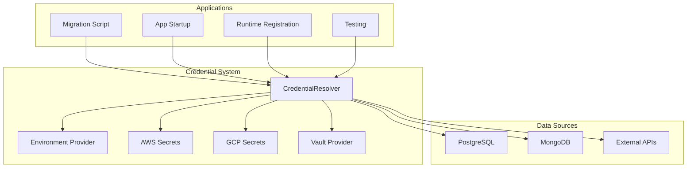

# Prism Data Bridge: Credential Management System

> **Note (June 2024):** Provider-based routing in content actions is the next major milestone. The current implementation is still Notion/Postgres-specific, but the codebase is ready for dynamic provider selection.

## Overview

The Prism Data Bridge includes a comprehensive, secure credential management system that supports all your use cases:

1. **Testing**: Validate various data source types with real and mocked credentials
2. **Migration Scripts**: Secure credential injection for database migrations
3. **App Startup**: Connect to local or external data sources during initialization
4. **Runtime Registration**: Dynamically register new data sources with secure credential handling

## Architecture



## Quick Start

### 1. Environment Setup

The Prism credential system uses the root repository's `.env.local` file for configuration. Copy the example environment file and configure your local database:

```bash
cp config/env.minimal.example .env.local
```

Edit `.env.local` and ensure you have the PostgreSQL configuration (it's already included in the minimal template):

```env
# PostgreSQL Test Database
POSTGRES_DB=testdb
POSTGRES_HOST=localhost
POSTGRES_PASSWORD=password
POSTGRES_PORT=5432
POSTGRES_USER=postgres

# Optional: Add these for additional data sources
POSTGRES_SCHEMA=public
POSTGRES_SSL=false
```

### 2. Basic Usage

```typescript
import { CredentialResolver, TestCredentialHelper } from '@nia/prism/data-bridge/credentials';

// Create resolver with environment fallback
const resolver = new CredentialResolver({
  allowEnvironmentFallback: true,
  logSecretAccess: true
});

// Get test credentials
const config = TestCredentialHelper.createLocalPostgresConfig();
const resolved = await resolver.resolveCredentials(config);

console.log('Resolved config:', {
  type: resolved.type,
  host: resolved.host,
  database: resolved.database,
  username: resolved.username,
  password: resolved.password ? '[HIDDEN]' : undefined
});
```

### 3. Run Tests

```bash
# Test the credential system
npx ts-node packages/prism/src/testing/credential-test.ts

# Run migration script
npx ts-node packages/prism/src/scripts/migration-with-credentials.ts --dry-run
```

## Use Cases

### 1. Testing (Environment Variables)

For local development and testing, use environment variables:

```typescript
import { TestCredentialHelper } from '@nia/prism/data-bridge/credentials';

// Create test configuration
const config = TestCredentialHelper.createLocalPostgresConfig();

// Validate environment
const missing = TestCredentialHelper.validateTestEnvironment();
if (missing.length > 0) {
  console.warn('Missing environment variables:', missing);
}
```

**Environment Variables:**
- `POSTGRES_HOST`: Database host (default: localhost)
- `POSTGRES_PORT`: Database port (default: 5432)
- `POSTGRES_DB`: Database name (default: testdb)
- `POSTGRES_USER`: Database user (default: postgres)
- `POSTGRES_PASSWORD`: Database password (required)
- `POSTGRES_SCHEMA`: Database schema (default: public)
- `POSTGRES_SSL`: Use SSL connection (default: false)

### 2. Migration Scripts

For database migrations with secure credential handling:

```typescript
import { MigrationCredentialHelper } from '@nia/prism/data-bridge/credentials';

// Get migration credentials
const credentials = await MigrationCredentialHelper.getMigrationCredentials();

// Validate migration environment
const isValid = MigrationCredentialHelper.validateMigrationEnvironment();
if (!isValid) {
  throw new Error('Migration environment not properly configured');
}
```

**Usage:**
```bash
# Run migration with dry-run
npx ts-node packages/prism/src/scripts/migration-with-credentials.ts --dry-run

# Run actual migration
npx ts-node packages/prism/src/scripts/migration-with-credentials.ts

# Validate only
npx ts-node packages/prism/src/scripts/migration-with-credentials.ts --validate
```

### 3. App Startup

For connecting to data sources during application startup:

```typescript
import { PrismDataBridge } from '@nia/prism/data-bridge';

const bridge = new PrismDataBridge();

// Start with resolved credentials
const credentials = await bridge.getMigrationCredentials();
await bridge.startWithCredentials(credentials);
```

### 4. Runtime Registration

For dynamically registering new data sources:

```typescript
import { RuntimeCredentialHelper } from '@nia/prism/data-bridge/credentials';

// Register new data source (with secret references)
const config = {
  type: 'postgres' as const,
  host: 'db.example.com',
  port: 5432,
  database: 'production_db',
  username: 'prod_user',
  passwordSecretRef: 'PROD_POSTGRES_PASSWORD' // Secure reference
};

const registered = await RuntimeCredentialHelper.registerDataSource(config, resolver);
```

**Security Validation:**
- ✅ Accepts: `passwordSecretRef: 'PROD_POSTGRES_PASSWORD'`
- ❌ Rejects: `password: 'plaintext_password'`

## Secret Providers

### Environment Provider (Default)

Uses environment variables for local development and testing:

```typescript
import { EnvironmentSecretProvider } from '@nia/prism/data-bridge/credentials';

const provider = new EnvironmentSecretProvider();
const password = await provider.resolve('POSTGRES_PASSWORD');
```

### AWS Secrets Manager

For production environments using AWS:

```typescript
import { AwsSecretsProvider } from '@nia/prism/data-bridge/credentials';

const provider = new AwsSecretsProvider('us-east-1');
const password = await provider.resolve('aws:arn:aws:secretsmanager:us-east-1:1234567890:secret:nia/prod/postgres');
```

**Configuration:**
- `AWS_REGION`: AWS region (default: us-east-1)
- `AWS_ACCESS_KEY_ID`: AWS access key
- `AWS_SECRET_ACCESS_KEY`: AWS secret key

### GCP Secret Manager

For Google Cloud environments:

```typescript
import { GcpSecretsProvider } from '@nia/prism/data-bridge/credentials';

const provider = new GcpSecretsProvider('my-project');
const password = await provider.resolve('gcp:nia-prod-postgres-password');
```

**Configuration:**
- `GOOGLE_CLOUD_PROJECT`: GCP project ID
- Service account credentials (via environment or file)

### HashiCorp Vault

For enterprise environments using Vault:

```typescript
import { VaultSecretsProvider } from '@nia/prism/data-bridge/credentials';

const provider = new VaultSecretsProvider('http://vault.example.com:8200', 'vault-token');
const password = await provider.resolve('vault:secret/data/nia/prod/postgres');
```

**Configuration:**
- `VAULT_URL`: Vault server URL (default: http://localhost:8200)
- `VAULT_TOKEN`: Vault authentication token

## Configuration Examples

### PostgreSQL Configuration

```typescript
// Local development
const localConfig = {
  type: 'postgres' as const,
  host: 'localhost',
  port: 5432,
  database: 'nia_test',
  username: 'nia_user',
  passwordSecretRef: 'POSTGRES_PASSWORD',
  schema: 'public'
};

// Production with AWS Secrets
const prodConfig = {
  type: 'postgres' as const,
  host: 'db.example.com',
  port: 5432,
  database: 'nia_prod',
  username: 'prod_user',
  passwordSecretRef: 'aws:arn:aws:secretsmanager:us-east-1:1234567890:secret:nia/prod/postgres',
  ssl: true
};
```

### MongoDB Configuration

```typescript
const mongoConfig = {
  type: 'mongodb' as const,
  connectionString: 'mongodb://localhost:27017/nia_test',
  database: 'nia_test'
};
```

### API Configuration

```typescript
const apiConfig = {
  type: 'openapi' as const,
  baseUrl: 'https://api.example.com',
  apiKeySecretRef: 'API_KEY'
};
```

## Security Best Practices

### 1. Never Store Secrets in Code

❌ **Wrong:**
```typescript
const config = {
  password: 'supersecret123' // Never do this!
};
```

✅ **Correct:**
```typescript
const config = {
  passwordSecretRef: 'POSTGRES_PASSWORD' // Use secret references
};
```

### 2. Use Secret References in Database

When storing data source configurations in the database:

```json
{
  "type": "postgres",
  "host": "db.example.com",
  "port": 5432,
  "database": "nia_prod",
  "username": "prod_user",
  "passwordSecretRef": "aws:arn:aws:secretsmanager:us-east-1:1234567890:secret:nia/prod/postgres"
}
```

### 3. Validate at Runtime

```typescript
// Always validate that secrets are referenced, not stored
if (config.password && !config.passwordSecretRef) {
  throw new Error('Passwords must be stored as secret references, not plaintext');
}
```

### 4. Log Secret Access (Not Values)

```typescript
// ✅ Good: Log secret access
console.log(`🔐 Resolving secret: ${secretRef}`);

// ❌ Bad: Never log secret values
console.log(`Password: ${password}`);
```

## Testing

### Run Credential Tests

```bash
# Quick test using root .env.local
npx ts-node packages/prism/src/scripts/test-credentials.ts

# Comprehensive test suite
npx ts-node packages/prism/src/testing/credential-test.ts
```

### Test Migration Script

```bash
# Validate environment
npx ts-node packages/prism/src/scripts/migration-with-credentials.ts --validate

# Dry run migration
npx ts-node packages/prism/src/scripts/migration-with-credentials.ts --dry-run

# Run actual migration
npx ts-node packages/prism/src/scripts/migration-with-credentials.ts
```

### Test Different Data Sources

```bash
# Test PostgreSQL
POSTGRES_PASSWORD=test123 npx ts-node packages/prism/src/testing/credential-test.ts

# Test with AWS Secrets (if configured)
AWS_REGION=us-east-1 npx ts-node packages/prism/src/testing/credential-test.ts
```

## Integration with Prism Data Bridge

The credential system integrates seamlessly with the Prism Data Bridge:

```typescript
import { PrismDataBridge } from '@nia/prism/data-bridge';

const bridge = new PrismDataBridge();

// Add custom secret providers
bridge.addSecretProvider(new AwsSecretsProvider());

// Start with resolved credentials
const credentials = await bridge.getMigrationCredentials();
await bridge.startWithCredentials(credentials);

// Register new data sources at runtime
const newDataSource = await bridge.registerDataSource({
  type: 'postgres',
  host: 'new-db.example.com',
  passwordSecretRef: 'NEW_DB_PASSWORD'
});
```

## Troubleshooting

### Common Issues

1. **Missing Environment Variables**
   ```
   ❌ Missing required environment variables: POSTGRES_PASSWORD
   ```
   **Solution:** Set the required environment variables in `.env.local`

2. **Secret Resolution Failed**
   ```
   ❌ Secret not found for ref: PROD_POSTGRES_PASSWORD
   ```
   **Solution:** Ensure the secret exists in your environment or secret provider

3. **Invalid Secret Reference Format**
   ```
   ❌ Invalid AWS secret reference format: aws:invalid-arn
   ```
   **Solution:** Use correct secret reference format for your provider

### Debug Mode

Enable debug logging to see secret resolution details:

```bash
DEBUG=prism:* npx ts-node packages/prism/src/testing/credential-test.ts
```

### Environment Validation

Check your environment configuration:

```typescript
import { TestCredentialHelper } from '@nia/prism/data-bridge/credentials';

const missing = TestCredentialHelper.validateTestEnvironment();
console.log('Missing variables:', missing);
```

## Next Steps

1. **Implement Secret Provider SDKs**: Add actual AWS, GCP, and Vault SDK integrations
2. **Add More Data Sources**: Support for MySQL, Redis, Elasticsearch, etc.
3. **Advanced Features**: Secret rotation, audit logging, encryption at rest
5. **CI/CD Integration**: Add credential validation to deployment pipelines

The credential management system provides a secure, flexible foundation for all your data source connectivity needs while maintaining best practices for secret handling. 