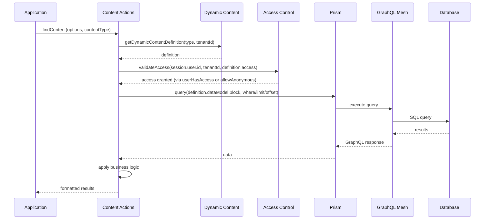

# Technical Flow (2025): Prism + GraphQL Mesh + Access Control

This document describes the current end-to-end flow for content access in Nia Prism, aligned with the platform Architecture and recent access-control changes.

Key points updated:

- Access checks no longer rely on `session.user.tenantRole`. We now perform authoritative checks via `TenantActions.userHasAccess` using stored role assignments.
- If a definition’s `access` has neither `allowAnonymous` nor `tenantRole`, routes default to allowing access (explicit deny requires configuration).
- GraphQL Mesh runs as a standalone server (apps/mesh); Prism connects to it for data access.

See also: ARCHITECTURE.md, apps/mesh/README.md, packages/prism/README.md

---

## 🔄 Request Flow (Current)



---

## 🏗️ Architecture Layers (Current)

### **Layer 1: Applications (existing)**

```typescript
// Interface, Dashboard apps
const content = await findContent({ where: { parent_id: tenantId } }, 'Activity');
```

### **Layer 2: Business Logic (existing)**

```typescript
export async function findContent(options: any, contentType: string) {
  // 1. Get dynamic content definition
  const definition = await getDynamicContentDefinition(contentType, tenantId);
  
  // 2. Validate access
  const hasAccess = await validateAccess(session, tenantId, contentType);
  if (!hasAccess) throw new Error('Forbidden');
  
  // 3. Use Mesh for data access (planned)
  const result = await prism.query(`
    query GetContent($where: JSON) {
      ${definition.dataModel.block}Collection(filter: $where) {
        items {
          id
          content
          parent_id
        }
      }
    }
  `, { where: options.where });
  
  // 4. Apply business logic
  return applyBusinessLogic(result.data.items);
}
```

### **Layer 3: Prism Orchestration**

```typescript
export class Prism {
  async query(query: string, variables?: any) {
    if (!this.mesh) throw new Error('Prism Mesh not started');
    return this.mesh.execute(query, variables);
  }
}
```

### **Layer 4: GraphQL Mesh (standalone server)**

```yaml
# .meshrc.yml
sources:
  - name: postgres-content
    handler:
      postgraphile:
        connectionString: ${POSTGRES_URL}
        schema: public
```

---

## 🎯 Key Integration Points (2025)

### **1. Dynamic Content Definitions (preserved)**

```typescript
// Preserves existing business logic
const definition = await getDynamicContentDefinition(contentType, tenantId);
if (!definition) throw new Error('Content definition not found');

// Access control (authoritative)
const access = definition.access || {};
if (access.allowAnonymous) {
  // pass
} else if (access.tenantRole) {
  const ok = await TenantActions.userHasAccess(session.user.id, tenantId, access.tenantRole);
  if (!ok) throw new Error('Forbidden: insufficient role');
} else {
  // default allow when no access keys are present
}
```

### **2. Mesh Query Generation**

```typescript
// Dynamic GraphQL query based on content definition
const graphqlQuery = `
  query GetContent($where: JSON) {
    ${definition.dataModel.block}Collection(filter: $where) {
      items {
        id
        content
        parent_id
        ${definition.uiConfig?.listView?.displayFields?.join('\n') || ''}
      }
    }
  }
`;
```

### **3. Business Logic Preservation (existing)**

```typescript
// All existing business logic maintained
export async function cloneAssistant(assistantId: string, cloneParams: any) {
  // 1. Get original assistant
  const originalAssistant = await getAssistantById(assistantId);
  
  // 2. Create new assistant
  const newAssistant = await createAssistant({
    ...cloneParams,
    tenantId: originalAssistant.tenantId
  });
  
  // 3. Clone associated content (preserves complex workflows)
  const contentBlocks = ['Activity', 'Agenda', 'EventMap', /* ... */];
  for (const contentType of contentBlocks) {
    const content = await findContent({ parent_id: assistantId }, contentType);
    for (const item of content) {
      await createContent({ ...item, assistant_id: newAssistant._id }, contentType);
    }
  }
}
```

---

## 🔧 Implementation Examples (Current)

### **Enhanced Content Actions**

```typescript
export class PrismContentActions {
  constructor(private prism: Prism) {}

  async findContent(options: any, contentType: string): Promise<any[]> {
    // 1. Business logic: Get definition and validate access
    const definition = await getDynamicContentDefinition(contentType, tenantId);
    await this.validateAccess(session.user.id, tenantId, definition.access);
    
    // 2. Data access: Use Mesh
    const result = await this.prism.query(`
      query GetContent($where: JSON, $limit: Int, $offset: Int) {
        ${definition.dataModel.block}Collection(
          filter: $where
          first: $limit
          offset: $offset
        ) {
          items {
            id
            content
            parent_id
            createdAt
            updatedAt
          }
          totalCount
        }
      }
    `, {
      where: this.convertToMeshFilter(options.where),
      limit: options.limit || 100,
      offset: options.offset || 0
    });
    
    // 3. Business logic: Apply transformations
    return this.applyBusinessLogic(result.data.items, definition);
  }

  async createContent(data: any, contentType: string): Promise<any> {
    // 1. Business logic: Validate against schema
    const definition = await getDynamicContentDefinition(contentType, tenantId);
    const validated = definition.schema.parse(data);
    
    // 2. Data access: Use Mesh
    const result = await this.prism.query(`
      mutation CreateContent($input: JSON!) {
        create${definition.dataModel.block}(input: $input) {
          id
          content
          parent_id
        }
      }
    `, { input: validated });
    
    return result.data[`create${definition.dataModel.block}`];
  }

  private convertToMeshFilter(sequelizeWhere: any): any {
    // Convert Sequelize operators to GraphQL filters
    if (!sequelizeWhere) return {};
    
    const meshFilter: any = {};
    for (const [key, value] of Object.entries(sequelizeWhere)) {
      if (value && typeof value === 'object' && '$op' in value) {
        meshFilter[key] = this.convertSequelizeOperator(value);
      } else {
        meshFilter[key] = { eq: value };
      }
    }
    return meshFilter;
  }
}
```

### **Access Control Integration**

```typescript
export class PrismAccessControl {
  async validateAccess(userId: string, tenantId: string, access: any): Promise<boolean> {
    // Allow anonymous if configured
    if (access?.allowAnonymous) return true;
    // Role requirement
    if (access?.tenantRole) {
      return TenantActions.userHasAccess(userId, tenantId, access.tenantRole);
    }
    // Default allow when no access keys are present
    return true;
  }
}
```

---

## Canonical Provider Extensibility Pattern (2025)

- **Fragments and resolvers** are now the standard for extensibility, following GraphQL best practices.
- Each provider or data source exposes its schema via GraphQL fragments, and implements resolvers for queries and mutations.
- On startup, the system registers fragments and resolvers for each configured provider, enabling dynamic query and mutation generation.
- Content actions and DataBridge remain provider-agnostic, using GraphQL fragments and resolvers for all CRUD operations.
- This pattern is now the recommended way to add new providers or data sources to Prism, ensuring compatibility and extensibility with GraphQL Mesh and federation.

## 🎯 Benefits Realized

### **Preserved Business Logic**

- ✅ Multi-tenant data isolation
- ✅ Dynamic schema validation
- ✅ Sophisticated access control
- ✅ Complex workflows (assistant cloning, etc.)

### **Enhanced Data Access**

- ✅ Unified GraphQL interface
- ✅ Type-safe queries
- ✅ Advanced filtering and pagination
- ✅ Easy integration of external APIs

### **Future-Ready Architecture**

- ✅ Real-time subscriptions
- ✅ Complex data transformations
- ✅ Federation capabilities
- ✅ Performance optimization

This technical flow preserves existing business logic and multi-tenant controls while leveraging GraphQL Mesh for unified data access.

## Current Implementation Status (Aug 2025)

- Mesh runs as a standalone server (`apps/mesh`); Prism connects to it for queries/mutations.
- Access control for content routes uses `TenantActions.userHasAccess` (no reliance on `session.user.tenantRole`).
- Platform-level blocks/definitions are resolved via Prism APIs and kept provider-agnostic.

### **Architecture Snapshot**

- Fragments and resolvers are registered for each provider/data source at startup.
- DataBridge and business logic use GraphQL queries and mutations, relying on the unified schema and resolvers.
- Business logic never hardcodes provider details; all routing is handled by GraphQL Mesh and the resolver map.
- Platform-level blocks are handled as static definitions, available via GraphQL schema.

### **Refactor Status**

- Design is production-ready and aligned across apps with consistent access checks.

---

## Dev & Testing Notes

- Auth: `getSessionSafely` centralizes session retrieval; tests can set `NODE_ENV=test` and use `x-test-user-id` headers. A `FORCE_SUPERADMIN_SESSION=true` override exists for profiling/developer tooling and should not be used in production.
